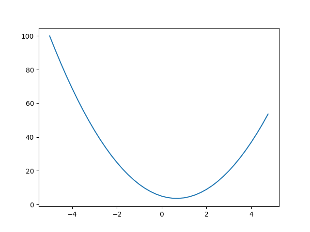
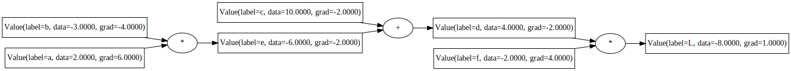
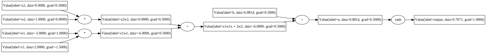
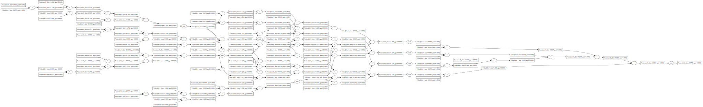

## AI/ML Fundamentals in Python
The idea of the code is for learning and exploration and as a reference for
later to refresh my knowledge later.

### Virtual environment
First, create a virtual environment:
```console
$ python3 -m venv fund
```

To activate it, run the following command:
```console
$ source fund/bin/activate
```

Then install the requirements:
```console
(fund) $ pip install -r requirements.txt
```

### Neural Networks: Zero to Hero
This is a series of videos by
[Andrej Karpathy](https://www.youtube.com/playlist?list=PLAqhIrjkxbuWI23v9cThsA9GvCAUhRvKZ)
which I am following along with and implementing in Python.

### Part1: Building micrograd
This example comes from a Andrej Karpathy's youtube video on
[micrograd](https://www.youtube.com/watch?v=VMj-3S1tku0&t=577s) modified with
comments and a few changes. This automatic gradient functionality is something
that I believe is used in most machine learning libraries, like tensorflow and
pytorch. Going through this example is a good way to understand how it works.

The function that is used in this example is `3x² - 4x + 5` and is defined as:
```python
def f(x):
    return 3*x**2 - 4*x + 5
```
The graph for this function looks like this:



The example starts with first defining a Value class which it then uses to
explore using in isolation, creating the following computation graph: 



It looks at manually computing the gradients and performing the backpropagation
"by hand".

It then moves on to using the Value class as neural/node with weights and biases
, but still just using the Value class:



Next, the backpropagation is investigated both manually and adding the backward
function.

Then there is a PyTorch example that uses the same functions and properties
which makes it easier to understand how PyTorch works.

After that we have an implementation of a Multi-Layer Perceptron (MLP) using
the Value class defined previously:




### Bigrams
This example comes from a Andrej Karpathy's youtube video on
[bigrams](https://www.youtube.com/watch?v=PaCmpygFfXo) modified with comments
and a few changes. This is a good start to learning about language models.
