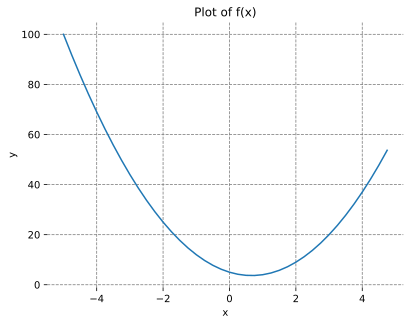
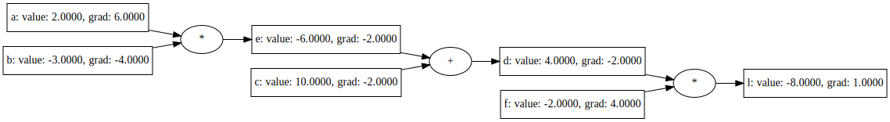
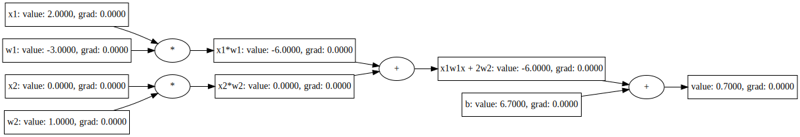
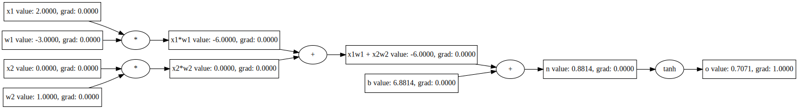
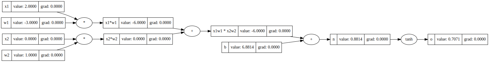

## Neural Networks:  Zero to Hero
This project is a Rust implementation of the youtube series
[Neural Networks:  Zero to Hero] by Andrej Karpathy. The goal is to implement
the code in the series in Rust.

In the series Mr. Karpathy uses some notebook exploration coding which is very
helpful for learning. I'll try to provide the same thing in the code itself, or 
as debugging sessions where applicable.

## Install
This part is not optimal, but to see plots we depend on Python matplolib and
numpy to be available. This is only for plotting, we will be only be using Rust
libraries for everything else, but visualizing the data is an important part
of the learning process so I wanted to provide something and hope to be
replace it with a pure Rust solution in the future.

Create a virtual python environment and install the requirements:
```
$ python3 -m penv zeroh
$ source zeroh/bin/activate
(zeroh) $ pip install -r requirements.txt
```
We also need to install the lapack and openblas development libraries:
```console
$ sudo dnf install lapack-devel openblas-devel
```

### Part1: Building micrograd
Youtube link: [The spelled-out intro to neural networks and backpropagation: building micrograd]

This is the first part of the series and the code can be found in
[part1.rs](./src/bin/part1.rs) and can be run with the following command:
```console
(zeroh) $ cargo run --bin part1
```
The first plot from `intro` section looks like this:



This can also be opened locally using the following command or using a web
browser:
```console
(zeroh) $ xdg-open plots/part1.svg
```

The first diagram/graph from the `intro` section looks like this:



The second diagram is of of the single neuron network:







[Neural Networks:  Zero to Hero]: https://www.youtube.com/playlist?list=PLAqhIrjkxbuWI23v9cThsA9GvCAUhRvKZ
[The spelled-out intro to neural networks and backpropagation: building micrograd]: https://www.youtube.com/watch?v=VMj-3S1tku0&list=PLAqhIrjkxbuWI23v9cThsA9GvCAUhRvKZ&index=2
