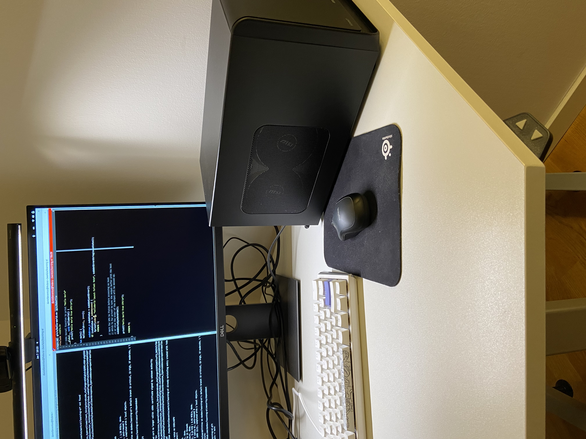

### Externa GPU (eGPU)
This document contains notes about setting up and configuring an external GPU
to be used with my laptop which is a Lenovo Thinkpad P1 Gen 3.

My main motivation for getting an external GPU is to be able to run CUDA
programs, and indirectly for having a GPU to improve performance of AI tasks
like training/inference of large language models.

### Hardware
The external GPU enclosure I am using is a Sonnet Technologies, Inc. eGPU
Breakaway Box 750ex, and the GPU is MSI GEFORCE RTX 4070 VENTUS 3X E 12G OC.




### OS/Tools
My laptop is running Fedora 39:
```console
x86_64
Fedora release 39 (Thirty Nine)
NAME="Fedora Linux"
VERSION="39 (Workstation Edition)"
ID=fedora
VERSION_ID=39
VERSION_CODENAME=""
PLATFORM_ID="platform:f39"
```

```console
$ uname -r
6.6.6-200.fc39.x86_64
```

```console
$ gcc --version
gcc (GCC) 13.2.1 20231205 (Red Hat 13.2.1-6)
Copyright (C) 2023 Free Software Foundation, Inc.
This is free software; see the source for copying conditions.  There is NO
warranty; not even for MERCHANTABILITY or FITNESS FOR A PARTICULAR PURPOSE.
```

My system uses `boltd` which is a thunderbolt daemon that is used to managing
Thunderbolt 3 connections. This will be used when we connect the eGPU to the
laptop using a thunderbolt cable. Thunderbolt 3 is a high-speed I/O interface
that can handle data, video, and power over a single cable and is commonly used
for eGPUs, high-speed storage devices, and docking stations.

we can use `boltctl` to list the connected devices:
```console
$ boltctl list
 ● Sonnet Technologies, Inc. eGPU Breakaway Box 750ex
   ├─ type:          peripheral
   ├─ name:          eGPU Breakaway Box 750ex
   ├─ vendor:        Sonnet Technologies, Inc.
   ├─ uuid:          000b89c5-f4f8-0800-ffff-ffffffffffff
   ├─ generation:    Thunderbolt 3
   ├─ status:        authorized
   │  ├─ domain:     c4010000-0082-8c1e-03f2-989224843903
   │  ├─ rx speed:   40 Gb/s = 2 lanes * 20 Gb/s
   │  ├─ tx speed:   40 Gb/s = 2 lanes * 20 Gb/s
   │  └─ authflags:  none
   ├─ authorized:    Mon 08 Jan 2024 06:57:55 AM UTC
   ├─ connected:     Mon 08 Jan 2024 06:57:54 AM UTC
   └─ stored:        Sat 06 Jan 2024 10:22:24 AM UTC
      ├─ policy:     auto
      └─ key:        no
```

### Installation
The installation process was pretty straight forward. The enclosure came as a
single slot but there were two power cables and I was not sure at first which
one to use but they looked pretty simliar so I just picked one and it worked.
I had to push down the cables inside the enclosure to be able to fit the card
in. 

### Installing and configurating CUDA

```console
$ lspci |grep -E "VGA|3D"
00:02.0 VGA compatible controller: Intel Corporation CometLake-H GT2 [UHD Graphics] (rev 05)
09:00.0 VGA compatible controller: NVIDIA Corporation AD104 [GeForce RTX 4070] (rev a1)
```

Check that secure boot is disabled:
```console
$ mokutil --sb-state
SecureBoot disabled
```

Download [driver] from NVIDIA website.
Change the permissions of the downloaded file to be executable:
```console
$ ls ~/Downloads/NVIDIA-Linux-x86_64-535.146.02.run 
/home/danielbevenius/Downloads/NVIDIA-Linux-x86_64-535.146.02.run
$ chmod +x ~/Downloads/NVIDIA-Linux-x86_64-535.146.02.run
```

Swith user to root and update the system:
```console
$ sudo -i
$ dnf update
```
If there were kernel updates then reboot the system:
```console
$ reboot
```

Install required packages:
```console
$ dnf install kernel-devel kernel-headers gcc make dkms acpid libglvnd-glx libglvnd-opengl libglvnd-devel pkgconfig
```

Disable the nouveau driver which is the open source driver for NVIDIA cards:
```console
$ echo "blacklist nouveau" >> /etc/modprobe.d/blacklist.conf
```
Add the following to `/etc/default/grub`:
```
GRUB_CMDLINE_LINUX="rhgb quiet rd.driver.blacklist=nouveau nvidia-drm.modeset=1"
```

Update grub:
```console
grub2-mkconfig -o /boot/grub2/grub.cfg
```

Remove the nouveau driver:
```console
dnf remove xorg-x11-drv-nouveau
```

Backup old initramfs nouveau image:
```console
$ mv /boot/initramfs-$(uname -r).img /boot/initramfs-$(uname -r)-nouveau.img
```
Create a new initramfs image:
```console
$ dracut /boot/initramfs-$(uname -r).img $(uname -r)
```

Set the system to boot to `multi-user` state where network services are started
but not GUI. So switch back to graphical we set 'graphical.target`:
```console
$ systemctl set-default multi-user.target
```
We can check the current default using:
```console
$ systemctl get-default
```
Now, reboot and login and then switch to root (note that this will be a command
line login and not the "usaual graphical login"):
```console
$ reboot
$ sudo -i
```
Run the NVIDIA installer:
```console
$ /home/danielbevenius/Downloads/NVIDIA-Linux-x86_64-535.146.02.run
```
I opted to install the 32 bit compatibility libraries as well, and DKMS, but
selected not to update the X configuration file as I'm only interested in
using the driver for AI/ML task and not to drive my monitor.

After that set the system to boot to graphical:
```console
$ systemctl set-default graphical.target
$ reboot
```
Followed https://www.if-not-true-then-false.com/2015/fedora-nvidia-guide.

After all that we should be able to see the GPU using nvidia-smi
(NVIDIA streaming multiprocessor interface/info?):
```console
$ nvidia-smi
Mon Jan  8 09:48:07 2024       
+---------------------------------------------------------------------------------------+
| NVIDIA-SMI 535.146.02             Driver Version: 535.146.02   CUDA Version: 12.2     |
|-----------------------------------------+----------------------+----------------------+
| GPU  Name                 Persistence-M | Bus-Id        Disp.A | Volatile Uncorr. ECC |
| Fan  Temp   Perf          Pwr:Usage/Cap |         Memory-Usage | GPU-Util  Compute M. |
|                                         |                      |               MIG M. |
|=========================================+======================+======================|
|   0  NVIDIA GeForce RTX 4070        Off | 00000000:09:00.0 Off |                  N/A |
|  0%   30C    P8               5W / 200W |    285MiB / 12282MiB |      0%      Default |
|                                         |                      |                  N/A |
+-----------------------------------------+----------------------+----------------------+
                                                                                         
+---------------------------------------------------------------------------------------+
| Processes:                                                                            |
|  GPU   GI   CI        PID   Type   Process name                            GPU Memory |
|        ID   ID                                                             Usage      |
|=======================================================================================|
|    0   N/A  N/A      4081    C+G   ...seed-version=20240107-180120.236000      274MiB |
+---------------------------------------------------------------------------------------+
```
We can see the Driver version is 535.146.02 and the CUDA version is 12.2.

So we should install the CUDA toolkit version 12.2:
```console
$ sudo dnf -y install cuda-toolkit-12-2
```
Update the PATH and LD_LIBRARY_PATH environment variables:
```console
$ export PATH=/usr/local/cuda-12.2/bin:$PATH
$ export LD_LIBRARY_PATH=/usr/local/cuda-12.2/lib64:$LD_LIBRARY_PATH
```
There is a [cuda-env.sh](./cuda-env.sh) script that can be used to set these.

Check the CUDA compiler (NVIDIA compiler nvcc) version:
```
$ nvcc --version
nvcc: NVIDIA (R) Cuda compiler driver
Copyright (c) 2005-2023 NVIDIA Corporation
Built on Tue_Aug_15_22:02:13_PDT_2023
Cuda compilation tools, release 12.2, V12.2.140
Build cuda_12.2.r12.2/compiler.33191640_0
```

I ran into an issue with the version of GCC on Fedora 39 which is 13.2.1 and is
not compatible with CUDA 12.2.
```console
$ make hello-world
nvcc -allow-unsupported-compiler -o hello-world src/hello-world.cu
/usr/include/stdlib.h(141): error: identifier "_Float32" is undefined
  extern _Float32 strtof32 (const char *__restrict __nptr,
         ^

/usr/include/stdlib.h(147): error: identifier "_Float64" is undefined
  extern _Float64 strtof64 (const char *__restrict __nptr,
         ^
```
We can install and older version of GCC using spack:
```console
$ git clone -c feature.manyFiles=true https://github.com/spack/spack.git
$ source spack/share/spack/setup-env.sh
$ spack info gcc
Safe versions:  
    master    [git] git://gcc.gnu.org/git/gcc.git on branch master
    13.2.0    https://ftpmirror.gnu.org/gcc/gcc-13.2.0/gcc-13.2.0.tar.xz
    13.1.0    https://ftpmirror.gnu.org/gcc/gcc-13.1.0/gcc-13.1.0.tar.xz
    12.3.0    https://ftpmirror.gnu.org/gcc/gcc-12.3.0/gcc-12.3.0.tar.xz
    12.2.0    https://ftpmirror.gnu.org/gcc/gcc-12.2.0/gcc-12.2.0.tar.xz
    12.1.0    https://ftpmirror.gnu.org/gcc/gcc-12.1.0/gcc-12.1.0.tar.xz
...
```
And loading gcc 12.1.0:
```console
$ spack install gcc@12.1.0
$ spack load gcc@12.1.0
$ gcc --version
```
With this we can compile the hello-world program:
```console
$ cd gpu/cuda
$ make hello-world
$ ./hello-world
$ ./hello-world 
Hello World from GPU!
Hello World from CPU!
```
And we can see the the GPU code is also run!

#### Restore
The following are the steps that created in case I needed to restore the
systemctl after the changes above:
```console
$ mv /boot/initramfs-6.6.9-200.fc39.x86_64-nouveau.img /boot/initramfs-6.6.9-200.fc39.x86_64.img 
```
Remove `GRUB_CMDLINE_LINUX` from from /etc/default/grub
```console
dnf install xorg-x11-drv-nouveau
rm /etc/modprobe.d/blacklist.conf
```

### NVIDIA Compiler Driver
When we pass a `.cu` file to the `nvcc` compiler will separate the source code
CUDA code, which is the code marked with `__global__`, `__device__`, and
`__host__`. The standard C++ code will be passed to the host compiler.

The CUDA driver uses and intermediate language called PTX (Parallel Thread
Execution)

Different object files are generated for the host and device code which are
then linked together by nvcc into a single executable. This involves also
linking the CUDA runtime library. Can we see this using `ldd`:
```console
$ nm hello-world | grep cuda
0000000000483c10 r libcudart_static_fffac0a7aec5c7251ef9ec61c4e31af88b5d1e45
0000000000403e70 t _Z16cudaLaunchKernelIcE9cudaErrorPKT_4dim3S4_PPvmP11CUstream_st
...
```
This shows that the executable is statically linked to the CUDA runtime library.

The device object code is embedded into the host object code. We can see this
using `objdump`:
```console
$ objdump -hw hello-world 

hello-world:     file format elf64-x86-64

Sections:
Idx Name                  Size      VMA               LMA               File off  Algn  Flags
  0 .interp               0000001c  0000000000400350  0000000000400350  00000350  2**0  CONTENTS, ALLOC, LOAD, READONLY, DATA
  1 .note.gnu.property    00000020  0000000000400370  0000000000400370  00000370  2**3  CONTENTS, ALLOC, LOAD, READONLY, DATA
  2 .note.gnu.build-id    00000024  0000000000400390  0000000000400390  00000390  2**2  CONTENTS, ALLOC, LOAD, READONLY, DATA
  3 .note.ABI-tag         00000020  00000000004003b4  00000000004003b4  000003b4  2**2  CONTENTS, ALLOC, LOAD, READONLY, DATA
  4 .gnu.hash             00000024  00000000004003d8  00000000004003d8  000003d8  2**3  CONTENTS, ALLOC, LOAD, READONLY, DATA
  5 .dynsym               00000ea0  0000000000400400  0000000000400400  00000400  2**3  CONTENTS, ALLOC, LOAD, READONLY, DATA
  6 .dynstr               00000752  00000000004012a0  00000000004012a0  000012a0  2**0  CONTENTS, ALLOC, LOAD, READONLY, DATA
  7 .gnu.version          00000138  00000000004019f2  00000000004019f2  000019f2  2**1  CONTENTS, ALLOC, LOAD, READONLY, DATA
  8 .gnu.version_r        000000a0  0000000000401b30  0000000000401b30  00001b30  2**3  CONTENTS, ALLOC, LOAD, READONLY, DATA
  9 .rela.dyn             00000060  0000000000401bd0  0000000000401bd0  00001bd0  2**3  CONTENTS, ALLOC, LOAD, READONLY, DATA
 10 .rela.plt             00000e40  0000000000401c30  0000000000401c30  00001c30  2**3  CONTENTS, ALLOC, LOAD, READONLY, DATA
 11 .init                 0000001b  0000000000403000  0000000000403000  00003000  2**2  CONTENTS, ALLOC, LOAD, READONLY, CODE
 12 .plt                  00000990  0000000000403020  0000000000403020  00003020  2**4  CONTENTS, ALLOC, LOAD, READONLY, CODE
 13 .text                 00078fe2  00000000004039b0  00000000004039b0  000039b0  2**4  CONTENTS, ALLOC, LOAD, READONLY, CODE
 14 .fini                 0000000d  000000000047c994  000000000047c994  0007c994  2**2  CONTENTS, ALLOC, LOAD, READONLY, CODE
 15 .rodata               0000f760  000000000047d000  000000000047d000  0007d000  2**5  CONTENTS, ALLOC, LOAD, READONLY, DATA
 16 .nv_fatbin            00000f40  000000000048c760  000000000048c760  0008c760  2**3  CONTENTS, ALLOC, LOAD, READONLY, DATA
 17 .nvFatBinSegment      00000030  000000000048d6a0  000000000048d6a0  0008d6a0  2**3  CONTENTS, ALLOC, LOAD, READONLY, DATA
 18 __nv_module_id        0000000f  000000000048d6d0  000000000048d6d0  0008d6d0  2**3  CONTENTS, ALLOC, LOAD, READONLY, DATA
 19 .eh_frame_hdr         0000337c  000000000048d6e0  000000000048d6e0  0008d6e0  2**2  CONTENTS, ALLOC, LOAD, READONLY, DATA
 20 .eh_frame             00010958  0000000000490a60  0000000000490a60  00090a60  2**3  CONTENTS, ALLOC, LOAD, READONLY, DATA
 21 .tbss                 00001000  00000000004a2000  00000000004a2000  000a2000  2**12  ALLOC, THREAD_LOCAL
 22 .init_array           00000020  00000000004a2000  00000000004a2000  000a2000  2**3  CONTENTS, ALLOC, LOAD, DATA
 23 .fini_array           00000010  00000000004a2020  00000000004a2020  000a2020  2**3  CONTENTS, ALLOC, LOAD, DATA
 24 .data.rel.ro          00004480  00000000004a2040  00000000004a2040  000a2040  2**5  CONTENTS, ALLOC, LOAD, DATA
 25 .dynamic              00000210  00000000004a64c0  00000000004a64c0  000a64c0  2**3  CONTENTS, ALLOC, LOAD, DATA
 26 .got                  00000018  00000000004a66d0  00000000004a66d0  000a66d0  2**3  CONTENTS, ALLOC, LOAD, DATA
 27 .got.plt              000004d8  00000000004a6fe8  00000000004a6fe8  000a6fe8  2**3  CONTENTS, ALLOC, LOAD, DATA
 28 .data                 00000058  00000000004a74c0  00000000004a74c0  000a74c0  2**5  CONTENTS, ALLOC, LOAD, DATA
 29 .bss                  00001bf8  00000000004a7520  00000000004a7520  000a7518  2**5  ALLOC
 30 .comment              00000088  0000000000000000  0000000000000000  000a7518  2**0  CONTENTS, READONLY
 31 .annobin.notes        0000018c  0000000000000000  0000000000000000  000a75a0  2**0  CONTENTS, READONLY
 32 .gnu.build.attributes 00000168  00000000004ab118  00000000004ab118  000a772c  2**2  CONTENTS, READONLY, OCTETS
```
When we have kernel launch code in the host code the CUDA runtime libaray will
extract the device code from the binary (I think) and sends this along with
the execution configuration to the GPU.
Keep in mind that that kernel execution is asynchronous and the host code will
continue to execute after the kernel launch.

The fat binary is a package that includes compiled device code in multiple
formats for different GPU architectures. It may contain both PTX (Parallel
Thread Execution) intermediate representation and cubin (CUDA binary) files.
When the CUDA runtime loads the executable, it selects the appropriate binary
from the fat binary for the target GPU architecture. If no direct binary is
available, the PTX code can be JIT (Just-In-Time) compiled by the CUDA driver
for the specific GPU in the system.


### CUDA libraries

The CUDA Runtime API is contained in libcudart.so is the CUDA runtime library.
It contains the functions that are used by the CUDA device code to interact with
the CUDA runtime. It also contains the functions that are used by the host code
to interact with the CUDA runtime. This is a higher level API than the CUDA
Driver API and handle things like devices initialization, context management, 
and memory allocation.

The CUDA Driver API is contained in libcuda.so. This is a lower level API than
the CUDA Runtime API and is used to interact directly with the CUDA driver. It
provides more control.

### GPU Driver
The driver acts as a bridge between the OS and the GPU hardware. It allows the
software to communicate with the GPU hardware without having to know specifics
of the hardware.
The CUDA driver is responsible loading the compiled CUDA binary, or JIT
compiling PTX code) and executing it on the GPU cores.

### Exploration code
Some exploration code can be found in [gpu/cuda](../gpu/cuda).

### Parallel Thread Execution (PTX)
This is an intermediate language (IR) that is used by the CUDA compiler to
compile CUDA code. It is a low-level assembly-like language that is used to represent
the GPU instructions.
Its is an abstraction layer over the GPU hardware allows CUDA programs to be
written independently specific details of different GPU architectures.
This can be compiled just-in-time by the CUDA driver for the specific GPU in
the system (optimizing it for that specific GPU).

We can inspect this using the `--ptx` flag to `nvcc`:
```console
$ cd gpu/cuda
$ make hello-world-ptx
```

### Compute capability
This is a number specified by NVIDIA that represents a feature set supported by
a GPU. It is used to identify the GPU architecture and the features supported
by the GPU. I can be important for developers to know the compute capability
of the GPU they are targeting to make sure that the GPU supports the features
they need.
The format is:
```
sm_xx

sm = streaming multiprocessor
xx = version number, first digit is the major version and the second digit is
     the minor version. S0 61 is 6.1.

Tesla Architecture:         1.0, 1.1, 1.2, 1.3
Fermi Architecture:         2.0, 2.1
Kepler Architecture:        3.0, 3.2, 3.5, 3.7
Maxwell Architecture:       5.0, 5.2, 5.3
Pascal Architecture:        6.0, 6.1, 6.2
Volta Architecture:         7.0, 7.2
Turing Architecture:        7.5
Ampere Architecture:        8.0, 8.6
Ada Lovelace Architecture:  9.0
Hopper Architecture:        10.0
```
```
Note that the version is specified as `sm_60` which is for version 6.0.

We can see this used in .ptx files generated by `nvcc`:
```
.version 8.3
.target sm_52
```
What version does the RTX 4070 use?  

[driver]: https://www.nvidia.com/content/DriverDownloads/confirmation.php?url=/XFree86/Linux-x86_64/535.146.02/NVIDIA-Linux-x86_64-535.146.02.run&lang=us&type=geforcem

### gcc 13.2.1 note
I ran into an issue with gcc 13.2.1 and CUDA 12.2. The issue was that compiling
would generate the following error:
```console
$ make hello-world
nvcc -allow-unsupported-compiler -o hello-world src/hello-world.cu
/usr/include/stdlib.h(141): error: identifier "_Float32" is undefined
  extern _Float32 strtof32 (const char *__restrict __nptr,
         ^

/usr/include/stdlib.h(147): error: identifier "_Float64" is undefined
  extern _Float64 strtof64 (const char *__restrict __nptr,
         ^
```
Using gcc 12.1.0 fixed this issue.
