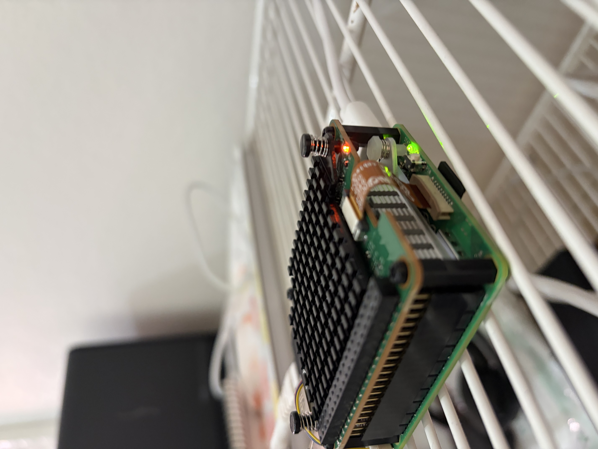

###  Hailo
This is a NPU (Neural Processing Unit) that can be used with the Raspberry Pi 5.
It is designed for AI applications and can accelerate machine learning tasks.

I have a Pi 5 with a Pi AI HAT+2 (Hailo-10H AI Accelerator chip).

Pre-assemble:


* Raspberry Pi 5 - 8 GB	                        1   2.119,00 SEK
* 128GB Micro SD – Class A2 – Raspberry Pi OS	1	  589,00 SEK
* Raspberry Pi AI HAT+ 2 (40 TOPS)              1   1.711.20 SEK
* Power Adapter 27W USB-C PD Raspberry Pi 5     1     143.20 SEK
* Activ Cooler för Raspberry Pi 5               1      71.20 SEK
Total: 4490 SEK

Assembled:


(HAT = Hardware Attached on Top, a standard for add-on boards for Raspberry Pi)

Exploration code can be found in [npu/hailo](../../npu/hailo).

### Architecture
This chip is different from a GPU which is a more general computation device. It
is designed specifically for AI computations. The chip itself consists of
computation unit with memory locations close by to them. A language model is
first compiled into a hailo execution format (hef) which the used to configure a
device. The flow is that of a dataflow architecture where the chip maps the
model layers of a neural network physically onto an internal fabric of
interconnected compute blocks, compution units, and localized SRAM memory. There
is no instruction fetch or global memory which we might be used to in a CPU or a
GPU.

### Hailo Execution Format (HEF)
A HEF can contain one or more neural networks:
```console
$ hailortcli parse-hef hefs/qwen2.5.hef
HEF Compatible for: HAILO15H, HAILO10H

Network group name: base_model__prefill, Multi Context - Number of contexts: 124
    Network name: base_model__prefill/qwen2_prefill96
        VStream infos:
            Input  qwen2_prefill96/input_layer3 UINT8, NHWC(1x96x1536)
            Input  qwen2_prefill96/input_layer1 UINT16, FCR(1x96x1536)
            Input  qwen2_prefill96/input_layer2 UINT8, FCR(1x96x24576)
            Input  qwen2_prefill96/input_layer6 UINT8, FCR(1x96x256)
            Input  qwen2_prefill96/input_layer5 UINT8, FCR(1x96x256)
            Input  qwen2_prefill96/input_layer4 UINT8, FCR(1x96x1536)
            Output qwen2_prefill96/qwen2_block29_conv1 UINT8, NHWC(1x1x37984)
            Output qwen2_prefill96/qwen2_block29_conv2 UINT8, NHWC(1x1x37984)
            Output qwen2_prefill96/qwen2_block29_conv3 UINT8, NHWC(1x1x37984)
            Output qwen2_prefill96/qwen2_block29_conv4 UINT8, NHWC(1x1x37984)

Network group name: base_model__tbt, Multi Context - Number of contexts: 95
    Network name: base_model__tbt/qwen2_tbt
        VStream infos:
            Input  qwen2_tbt/input_layer3 UINT8, NHWC(1x1x1536)
            Input  qwen2_tbt/input_layer2 UINT8, NHWC(1x1x24576)
            Input  qwen2_tbt/input_layer5 UINT8, NHWC(1x1x256)
            Input  qwen2_tbt/input_layer1 UINT16, NHWC(1x1x1536)
            Input  qwen2_tbt/input_layer4 UINT8, NHWC(1x1x1536)
            Input  qwen2_tbt/input_layer6 UINT8, NHWC(1x1x256)
            Output qwen2_tbt/qwen2_block29_conv1 UINT8, NHWC(1x1x37984)
            Output qwen2_tbt/qwen2_block29_conv2 UINT8, NHWC(1x1x37984)
            Output qwen2_tbt/qwen2_block29_conv3 UINT8, NHWC(1x1x37984)
            Output qwen2_tbt/qwen2_block29_conv4 UINT8, NHWC(1x1x37984)
```
We first have a compability range which specifies which chips this HEF can run
on. Then we have the neural network groups, which in this case there are two.
There is one for the prefill, the prompt processing stage, and one for the token
generation (token by token) stage.

If a model is small enough the entire network maps onto the silicon completely and
we are good to go. Data streams into the chip, flows through the static hardware
routing, and streams out. This is referred to as a single-context.
The qwen model above is too large to fit on the chip, so it is split into multiple
contexts. My understanding of this is that the first layer will be will be
configured by the driver to configure the routing registers, and load the
weights/biases for the first layer. Input data will stream accross the PCIe bus
and be processes through the first layers configuration, and the intermediate
results are held in a internal temp buffer. Then the first context is
switched/swapped with the second context. And this continues.

Notice the number `96` in the network name:
```console
    Network name: base_model__prefill/qwen2_prefill96
```
This is the sequence length, the number of tokens that are processed in a single
execution. This is also different from what we might be used to in llama.cpp where
the sequence length is dynamic. But since the Hailo compiler has to physically
map the model's layers and internal attention matrices directly onto silico
nmemory cells, the input sizes must be completely static.

Also notice that we have not just one input either, but 6 different inputs.
```console
            Input  qwen2_prefill96/input_layer3 UINT8,  NHWC(1x96x1536)
            Input  qwen2_prefill96/input_layer1 UINT16, FCR (1x96x1536)
            Input  qwen2_prefill96/input_layer2 UINT8,  FCR (1x96x24576)
            Input  qwen2_prefill96/input_layer6 UINT8,  FCR (1x96x256)
            Input  qwen2_prefill96/input_layer5 UINT8,  FCR (1x96x256)
            Input  qwen2_prefill96/input_layer4 UINT8,  FCR (1x96x1536)

FCR = ?
```
Update this section with correct descriptions of the inputs. My initial
understanding of the purpose of these was way off.

_wip_
