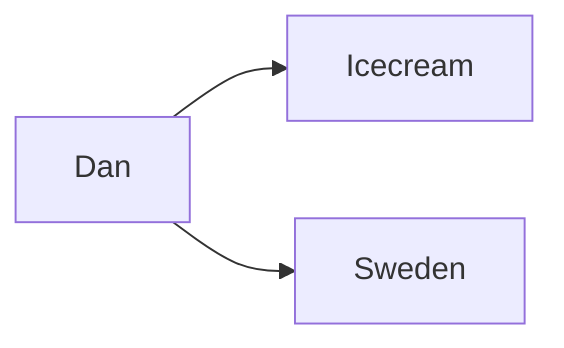

## Knowledge Graph Prompting (KGP)
This is a technique for prompting where a knowledge graph constructed to
represent the relationships between content accross documents.

When we use RAG (Retrieval Augmented Generation) we take the query and create
a vector embedding for it and usually perform a cosine similarity search against
a vector store/database. One issue is that we might not be able to find the
correct context depending on the query. KGP might be able to help with this.

### What is a knowledge graph?
It is made up of triplets of information in the form of source, destination and
relationship. For example, "Dan" "likes" "icecream". This is a very simple
example but it can be used to represent complex relationships between content
accross documents.
# Create an ascii art diagram of the KGP process

```
   Source         Relationship      Destination

  +--------+                       +----------+
  | Dan    |---------------------->| icecream |
  +--------+        likes          +----------+
       \
        \ lives in
         \
       +----------+
       | Sweden   |
       +----------+
```




So if we imagine using vector embeddings for the nodes and edges we would then
have a vector like [0.1 0.2 0.3] for "Dan" and [0.4 0.5 0.6] for "likes", which
we could add together to get [0.5 0.7 0.9] which should then be the vector
for "icecream".

