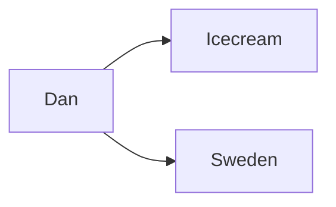

## Knowledge Graph Prompting (KGP)
This is a technique for prompting where a knowledge graph constructed to
represent the relationships between content accross documents.

When we use RAG (Retrieval Augmented Generation) we take the query and create
a vector embedding for it and usually perform a cosine similarity search against
a vector store/database. One issue is that we might not be able to find the
correct context depending on the query. KGP might be able to help with this.

### What is a knowledge graph?
It is made up of triplets of information in the form of source, destination and
relationship. For example, "Dan" "likes" "icecream". This is a very simple
example but it can be used to represent complex relationships between content
accross documents.

```
   Source         Relationship      Destination

  +--------+                       +----------+
  | Dan    |---------------------->| icecream |
  +--------+        likes          +----------+
       \
        \ lives in
         \
       +----------+
       | Sweden   |
       +----------+
```




So if we imagine using vector embeddings for the nodes and edges we would then
have a vector like [0.1 0.2 0.3] for "Dan" and [0.4 0.5 0.6] for "likes", which
we could add together to get [0.5 0.7 0.9] which should then be the vector
for "icecream".

### Graph RAG (Retrieval Augmented Generation)
We have discussed [RAG](rag.md) before, but this is a variation of it where we
use a knowledge graph to represent the relationships between content accross
documents.

The main issue as I understand it with the traditional RAG, and I'm here
assuming that it would be the kind the we have talked about before, where we
have a vector database where information is stored. And when we want to perform
an interaction with an LLM we take the query and create a vector embedding for
it and usually perform a cosine similarity search against the vector store. One
issue is that we might not be able to find the correct context depending on the
query. The vector database might not be able to understand the correct intent
of the query this way.

This extra information is then passed as context to the LLM which will know
have access to this information which it was not trained on.

So recall that when we have documents in a vector database we have to split
them up into smaller pieces and then create embeddings for them. When we do a
simliarity search (distance search) we might not get back the most accurate
pieces. What a graph knowledge base enables is to have relationships between
the entities.
