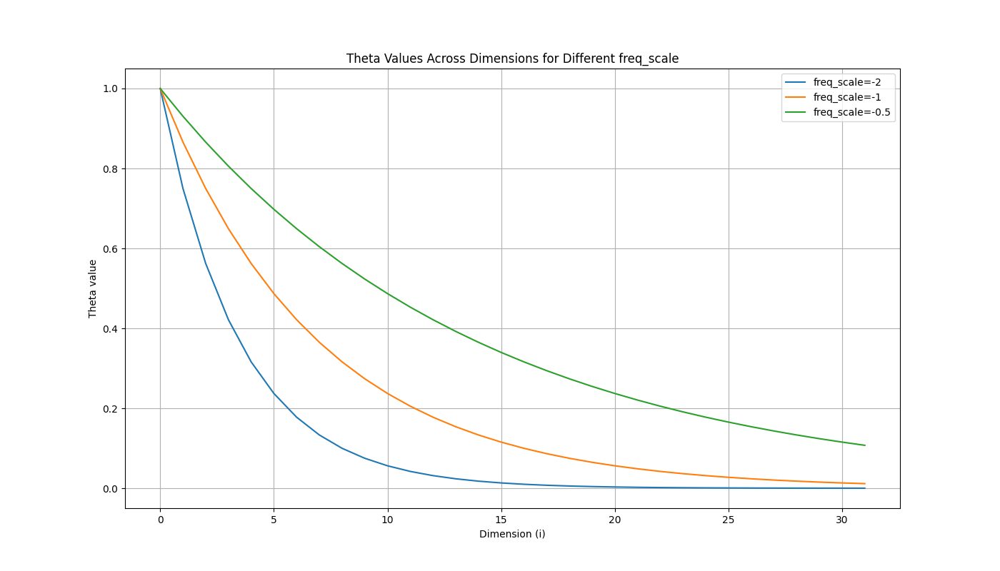

## Llama
LLaMA (Large Language Model Meta AI) is a large language model from Meta. So
this is a model which means that it contains a binary file with the weights and
biases of the model. These models come in different sizes and are trained on
 different datasets. The larger the model the more data it has been trained on
and the more accurate it is.

### Llama 2
Is really a family of pre-trained models in various scales (the number of
weights). From 7B to 70B.

It is based on the transformer architecture which some improvements like:
* RMSNorm pre-normalization (apperently used by GPT-3)
* SwiGLU activation function (apperently from Google's PaML)
* multi-query attention instead of multi-head attention
* Rotary Positional Embeddings (RoPE) instead of standard positional embeddings
  (apperently inspired by GPT-Neo), see [rope.md](./rope.md)
* AdamW optimizer 

TODO: I'm not familiar with any of the above so this so look into these
separately.

I've seen the achitecture of a transformer where there is an encoder and a
decoder. But my understanding of Llama is that there is only an encoder.
```
                     +-----------+
                     | Softmax   |
                     +-----------+
                          ↑
                     +-----------+
                     | Linear    |
                     +-----------+
                          ↑
                     +-----------+
                     | RMS Norm  |
                     +-----------+
                          ↑
                          |
                          |
  +-----------------------|--------------------------------------------+
  |      +--------------->+                                            |
  |      |                ↑                                            |
  |      |       +--------------------+                                |
  |      |       | Feed Forward SwiGLU|                                |
  |      |       +--------------------+                                |
  |      |                ↑                                            |
  |      |       +--------------------+                                |
  |      |       | RMS Norm           |                                |
  |      |       +--------------------+                                |
  |      |                ↑                                            |
  |      |                |                                            |
  |      +----------------|                                            |
  |    +----------------->+                                            |
  |    |                  ↑                                            |
  |    |   +-----------------------------------------------+           | N times
  |    |   | Self Attention (Grouped Multi Query Attention)|           |
  |    |   | with KV Cache                                 |           |
  |    |   +-----------------------------------------------+           |
  |    |     ↑ ROPE            ↑ ROPE                     ↑            |
  |    |    Q|                K|                         V|            |
  |    |     |                 |                          |            |
  |    |     -----------------------------------------------           |
  |    |                       |                                       |
  |    |             +--------------------+                            |
  |    |             | RMS Norm           |                            |
  |    |             +--------------------+                            |
  |    |                       |                                       |
  |    +-----------------------|                                       |
  |                            |                                       |
  +----------------------------|---------------------------------------+
                               |
                     +--------------------+
                     | Embeddings         |
                     +--------------------+
```

### llama.cpp
[llama.cpp](https://github.com/ggerganov/llama.cpp) is a library written in c
and contains useful programs/examples that can be used to run inference on a
Llama model, as well as quantize a model.
So it can be used to run inference on a model, or to quantize a model and there
are examples in the examples directory for how to do this.

#### Sources
This is just for getting an orientation of the headers and source cpp files
that are used. 

It can be run locally:
```console
$ cd ai/llama.cpp
$ make -j8 
```
Next we need to download a model to use and store it in the models directory.
I tried the following model:
```
https://huggingface.co/TheBloke/Llama-2-13B-chat-GGUF/resolve/main/llama-2-13b-chat.Q4_0.gguf
```

This the Llama 2 model trained on 13B tokens of chat data. It is a GGUF format
which is suitable for CPU usage. More details about GGUF can be found in
[gptq.md](gptq.md).

Example of running:
```console
$ cd ~/ai/llama.cpp
$ ./main -m models/llama-2-13b-chat.Q4_0.gguf --prompt "What is LoRA?</s>"
```
`main` can be found in examples/main/main.cpp and the output of the log
statements can be found in main-timestamp.log.

We can build the main executable with debug symbols enabled:
```console
$ env GGML_DEBUG=1 LLAMA_DEBUG=1 DEBUG=1 make -B main
```
After that we are able to run the main executable using a debugger:
```console
$ gdb --args ./main -m models/llama-2-13b-chat.Q4_0.gguf --prompt "What is LoRA?</s>"
Reading symbols from ./main...
(gdb) 
```
Now we can break in main and then run the program:
```console
(gdb) break main
Breakpoint 1 at 0x40a4c9: file examples/main/main.cpp, line 105.
(gdb) run
```
The first line of code we encounter is:
```c
  gpt_params params;
```
We can inspect the type of this variable:
```console
(gdb) ptype gpt_params
type = struct gpt_params {
    uint32_t seed; // Random seed value
    int32_t n_threads; 
    int32_t n_predict;
    int32_t n_ctx;
    int32_t n_batch;
    int32_t n_keep;
    int32_t n_draft;
    int32_t n_chunks;
    int32_t n_gpu_layers;
    int32_t main_gpu;
    float tensor_split[1];
```
I don't intend to step through the code but merely have the ability to inspect/
debug it at a later time.

Sampling parameters.

```console
(gdb) p *ctx
$6 = {mem_size = 16, mem_buffer = 0x65c360, mem_buffer_owned = true, no_alloc = false, no_alloc_save = false,
  n_objects = 0, objects_begin = 0x0, objects_end = 0x0, scratch = {offs = 0, size = 0, data = 0x0},
  scratch_save = {offs = 0, size = 0, data = 0x0}}
(gdb) ptype *ctx
type = struct ggml_context {
    size_t mem_size;
    void *mem_buffer;
    _Bool mem_buffer_owned;
    _Bool no_alloc;
    _Bool no_alloc_save;
    int n_objects;
    ggml_object *objects_begin;
    ggml_object *objects_end;
    ggml_scratch scratch;
    ggml_scratch scratch_save;
}
```
So this struct contains pointers to memory buffers which is where all tensor
will be allocated.


#### Presence Penalty
The presence penalty is a hyperparameter that is used control the absence or
presence of new tokens in the generated text.
A value of 0 has no effect on token generation. A negative value will encourage
the model to generate new tokens. A positive value will encourage the model to
not generate new tokens.


#### Repeat Penalty
The repeat penalty is a hyperparameter that is used to control the repetition
of tokens in the generated text. Setting this to 1 will not have any effect on
token generation. A value of 0 will encourage the model to repeat tokens. A
value greater than 1 will encourage the model to not repeat tokens.

I ran into this issue with the llam-chains-chat-demo where the llm would just
repeat the new-line token over and over until the context size was reached.
Adding a repeat penalty of 1.1 fixed this issue and is something to be aware of.

#### Frequency Penalty
The frequency penalty is a hyperparameter that is used to control the frequency
of tokens in the generated text. Setting this to 1 will not have any effect on
token generation. A value of 0 will encourage the model to generate tokens that
are more frequent. A value greater than 1 will encourage the model to generate
tokens that are less frequent.


#### llm-chain-llama
llm-chain have what they refer to as drivers, at the time of this writing there
are two drivers: OpenAI and Llama. Llama uses a binding to llama.cpp, and is
is created using bindget. The crate llm-chain-llama-sys contains the binding
and llm-chain-llama contains Rust API.

#### llama_batch
This struct holdes `input` data for `llama_decode` and is defined as:
```c++
    typedef struct llama_batch {
        int32_t n_tokens;

        llama_token  * token;
        float        * embd;
        llama_pos    * pos;
        llama_seq_id * seq_id;
        int8_t       * logits;
    } llama_batch;
```
The `n_tokens` is a counter of the number of tokens that this batch contains.

A `llama_batch` is simlilar to the contept of context we talked about
[llm.md](../../notes/llm.md#context_size). Below we are adding the input query
tokens to this batch/context. So it will initially just contain the tokens for
our query. But after running the inference, we will append the next token to the
batch and run the inference again and then run the inference again to predict
the next token, now with more context (the previous token).

The `embd` is the embedding of the tokens (I think). So this was not obvious to
me at first, but recall that the tokens just integer representations of
works/subwords, like a mapping. But they don't contains any semantic
information. Recall that this is data which is setup as input for llama_decode
and I think this is used when embeddings are already available perhaps.
TODO: verify this.
The `pos` is the position of the tokens in the sequence.

### Key-Value Cache
This section tries to explain the key-value cache used in the llama 2
architecture. This is the caching of the key and value matrices that are used
in the attention architecture.

First lets take a look at inference without the key-value cache. Now in the
following example we are starting with input tokens with a dimension of 2.
So for each token that we have, we have a vector of size 2. And we will assume
that the first token is the start of sentence token and that the model is going
to predict the next token. What it predicts does not matter to make the point
here so just ignore the actual values.
```
Attention(Q, K V) = softmax(QK^T / sqrt(d_k)) V

input token [1 2] (Start of Sentence)

Time=1

[  Q       K^T      QK^T  ] *  V  
 [1 2]   . [1]    = [5]     * [1 2] = [5 10]
           [2]    

  (dot product)   (scalar multiplication because [5] is a single number)
```
So we can see that we have performed the dot product of the query and the key
and then multiplied that by the value matrix. Lets pretend that the output of
this is then the probability of the next token, and that token was selected from
the models vocabulary (we are ignoring softmax etc here).

So for the next token we then append the predicted token to the input tokens
and run the inference again:
```
Time=2

[  Q       K^T      QK^T  ]  *   V  
 [1 2 ]  . [1  5] = [5  25 ] * [1  2] = [5*1 + 25*5     5*2 +  25*10] = [130  260]
 [5 10]    [2 10]   [25 125]   [5 10]   [25*1 + 125*5  25*2 + 125*10]   [650 1300]
  (dot product)     (matrix multiplication)
```
Once again we will take the last token and append it to the input tokens and
run the inference again:
```
Time=3

[  Q                 K^T      QK^T  ]  *   V  
 [1     2 ]   . [1  5  650] = [5    25    3250   ] =
 [5     10]     [2 10 1300]   [25   125   16250  ]
 [650 1300]                   [3250 16250 2210000]
```
Notice that we have calculated the dot product for the first and second token
again, in the Key and Value matrices:
```
[  Q                 K^T      QK^T  ]  *   V  
 [1     2 ]   . [1  5  ---] = [5    25    ----   ] =
 [5     10]     [2 10 ----]   [25   125   -----  ]
 [650 1300]                   [---- ----- -------]
```

The transformer architecture needs to have all the previous tokens in the
sequence to predict the next token but we don't have to recalculate the dot
product every time. We can cache the key and value matrices and then just
use a single input token, the last token predicted and not append that token to
the input:
```
Time=2
[  Q       K^T      QK^T  ]  *   V  
 [5 10 ]  . [1  5] = [25  125] * [1 5 ] = [650 1300]
            [2 10]               [2 10]
```
By adding the output token to the `Key` and the `Value` matrices we perform
fewer operations. This is the key-value cache.
So for every token processed it needs to be added to the Key and Value cache
matrices to be use in the next predition.

Let's take a look at how this is implemented in llama.cpp. I'll be using
simple-prompt to demonstrate this.
```console
$ gdb --args ./simple-prompt
(gdb) br simple-prompt.cpp:34
(gdb) r
(gdb) f
#1  0x0000000000408fab in main (argc=1, argv=0x7fffffffd198) at src/simple-prompt.cpp:34
34	    llama_context * ctx = llama_new_context_with_model(model, ctx_params);
(gdb) s
gdb) l
8736	        return nullptr;
8737	    }
8738	
8739	    llama_context * ctx = new llama_context(*model);
(gdb) p ctx.kv_self
$5 = {has_shift = false, head = 0, size = 0, used = 0, n = 0, cells = std::vector of length 0, capacity 0, k = 0x0, 
  v = 0x0, ctx = 0x0, buf = {data = 0x0, size = 0, fallback = false}}
```
At this stage the kv_self is uninitialized. We can inspect this struct using:
```console
gdb) ptype ctx.kv_self
type = struct llama_kv_cache {
    bool has_shift;
    bool do_defrag;
    bool do_copy;
    bool recurrent;
    uint32_t head;
    uint32_t size;
    uint32_t used;
    uint32_t n;
    ggml_type type_k;
    ggml_type type_v;
    std::vector<llama_kv_cell> cells;
    std::vector<ggml_tensor*> k_l;
    std::vector<ggml_tensor*> v_l;
    std::vector<ggml_context*> ctxs;
    std::vector<ggml_backend_buffer*> bufs;
  public:
    size_t total_size(void) const;
    ~llama_kv_cache(void);
}
```
We can see we have two vectors of  pointers to ggml_tensor. These are the key
and value matrices for each layer.

A little further down we have:
```console
(gdb) s
8789 if (!llama_kv_cache_init(ctx->model.hparams, ctx->kv_self, memory_type, cparams.n_ctx, model->n_gpu_layers)) {
Notice that we are passing in `ctx->kv_self`, and the cparams.n_ctx which is
the context length set to 1024 in this case.
```console
(gdb) s
1518	static bool llama_kv_cache_init(
(gdb) l
1519	        const struct llama_hparams & hparams,
1520	             struct llama_kv_cache & cache,
1521	                         ggml_type   wtype,
1522	                          uint32_t   n_ctx,
1523	                               int   n_gpu_layers) {
1524	    const uint32_t n_embd  = hparams.n_embd_gqa();
1525	    const uint32_t n_layer = hparams.n_layer;
1526	
1527	    const int64_t n_mem      = n_layer*n_ctx;
1528	    const int64_t n_elements = n_embd*n_mem;
```
The first line had be asking what `gqa` is and I think this stands for
grouped query attention. 
```console
(gdb) s
1532	    cache.head = 0;
(gdb) s
1533	    cache.size = n_ctx;
(gdb) s
1534	    cache.used = 0;
(gdb) s
1536	    cache.cells.clear();
(gdb) p cache
$20 = (llama_kv_cache &) @0xc624c8: {has_shift = false, head = 0, size = 1024, used = 0, n = 0, 
  cells = std::vector of length 0, capacity 0, k = 0x0, v = 0x0, ctx = 0x0, buf = {data = 0x0, size = 0, 
    fallback = false}}

1536	    cache.cells.clear();
(gdb) n
1537	    cache.cells.resize(n_ctx);
(gdb) n
(gdb) p cache
$21 = (llama_kv_cache &) @0xc624c8: {has_shift = false, head = 0, size = 1024, used = 0, n = 0, 
  cells = std::vector of length 1024, capacity 1024 = {{pos = -1, delta = 0, seq_id = std::set with 0 elements}, {
      pos = -1, delta = 0, seq_id = std::set with 0 elements}, {pos = -1, delta = 0, 
      seq_id = std::set with 0 elements}, {pos = -1, delta = 0, seq_id = std::set with 0 elements}, {pos = -1, 
      ...
1544	    params.mem_buffer = cache.buf.data;
(gdb) s
1545	    params.no_alloc   = false;
(gdb) s
1547	    cache.ctx = ggml_init(params);
```
So we can see here that we are going to initialize context for ggml. I did not
notice that `ggml_context *ctx` was a member of `llama_kv_cache`.
Next we are going to create a one dimensional tensor of GGML_TYPE_F16 (half
precision float) with 209715200 elements.
```console
1554	    cache.k = ggml_new_tensor_1d(cache.ctx, wtype, n_elements);
(gdb) p n_elements
$31 = 209715200
(gdb) p wtype
$32 = GGML_TYPE_F16
```
Hmm, the size of the tensor don't make sense to me yet. The 1d tensor is like
a list of number and it's size is 209715200. And the type of these slots is
F16 so that would be 2 bytes per slot, so 16 bytes per slot.
```console
llama_new_context_with_model: kv self size  =  800.00 MiB
```

```console
gdb) s
8804	            ctx->logits.reserve(hparams.n_vocab);
(gdb) p hparams.n_vocab
$40 = 32000
```
That is pretty much it for the intialization of the llama_context. This will
return us to simple_prompt.cpp:
```console
4	    llama_context * ctx = llama_new_context_with_model(model, ctx_params);
35	    if (ctx == NULL) {
36	        fprintf(stderr , "%s: error: failed to create the llama_context\n" , __func__);
37	        return 1;
38	    }
```
Now, lets look what happens when decode is called and how this interacts with
the key-value cache.
```console
(gdb) br simple-prompt.cpp:115
Breakpoint 2 at 0x40949e: file src/simple-prompt.cpp, line 115.
(gdb) c
Continuing.
batch.n_tokens: 6
batch.tokens: [1, 1724, 338, 4309, 4717, 29973, ]
prompt: What is LoRA?
Breakpoint 2, main (argc=1, argv=0x7fffffffd198) at src/simple-prompt.cpp:115
115	    if (llama_decode(ctx, batch) != 0) {
```
And the batch looks like this:
```console
(gdb) p batch
$54 = {n_tokens = 6, token = 0xc63980, embd = 0x0, pos = 0x8a86f0, n_seq_id = 0x8ab7b0, seq_id = 0x8abfc0, 
  logits = 0x8a9790 "", all_pos_0 = 0, all_pos_1 = 0, all_seq_id = 0}
(gdb) s
5678	    const auto n_batch = cparams.n_batch;
(gdb) s
(gdb) p n_batch
$56 = 512
```
So, n_batch is the maximum number of tokens that can be in a single batch, and
n_tokens is the number of tokens in the current batch.
```console
(gdb) n
5682	    int n_threads = n_tokens == 1 ? cparams.n_threads : cparams.n_threads_batch;
```
I found this a little interesting and because I've always called decode with
a number of tokens, never a single token. But thinking back the example with
the key-value cache and how it would pass in a single token as the input but
the key and value matrices would contain all the previous tokens.
```console
(gdb) n
5695	    auto & kv_self = lctx.kv_self;

5734	    // if we have enough unused cells before the current head ->
5735	    //   better to start searching from the beginning of the cache, hoping to fill it
5736	    if (kv_self.head > kv_self.used + 2*n_tokens) {
5737	        kv_self.head = 0;
5738	    }
5739	
5740	    if (!llama_kv_cache_find_slot(kv_self, batch)) {
```
```console
1584	// find an empty slot of size "n_tokens" in the cache
1585	// updates the cache head
1586	// Note: On success, it's important that cache.head points
1587	// to the first cell of the slot.
1588	static bool llama_kv_cache_find_slot(
1589	           struct llama_kv_cache & cache,
1590	        const struct llama_batch & batch) {
1591	    const uint32_t n_ctx    = cache.size;
1592	    const uint32_t n_tokens = batch.n_tokens;
1593	
1594	    if (n_tokens > n_ctx) {
1595	        LLAMA_LOG_ERROR("%s: n_tokens=%d > n_ctx=%d\n", __func__, n_tokens, n_ctx);
1596	        return false;
1597	    }
```
In this case we have the max context size in token of 1024 and the number of
tokens in the batch is 6:
```console
(gdb) p n_ctx
$69 = 1024
(gdb) p n_tokens
$70 = 6
```
The number of tokens in the batch cannot exceed the max context size.
```console
(gdb) l
1599	    uint32_t n_tested = 0;
1600	
1601	    while (true) {
1602	        if (cache.head + n_tokens > n_ctx) {
1603	            n_tested += n_ctx - cache.head;
1604	            cache.head = 0;
1605	            continue;
1606	        }
```
So we are going to loop and the first thing we to is check if the head plus the
number of tokens in the batch exceed the max number of tokens allowed.  If this
is the case then n_tested is incremented with the max context size minus the
cache head.
Lets pretent that we have a head that is 1020 and the number of tokens is 6 and
n_ctx is 1024. Then 1020+6=1026 and 1026 > 1024. And n_tested will become
1024-1020=4. And the head will be set to 0. And then the loop will continue but
this time head will be zero. And the if statement will compare 6 > 1024 which
is false and skip the body of the if statement.
```console
1608	        bool found = true;
1609	        for (uint32_t i = 0; i < n_tokens; i++) {
1610	            if (cache.cells[cache.head + i].pos >= 0) {
1611	                found = false;
1612	                cache.head += i + 1;
(gdb) l
1613	                n_tested   += i + 1;
1614	                break;
1615	            }
1616	        }
```
So we are going to loop over all the 6 tokens in the batch.
```console
(gdb) p i
$83 = 0
(gdb) p cache.head
$84 = 0

(gdb) p cache.cells[cache.head + i].pos
$85 = -1
```
cache.cells is a vector of size 1024, the max number of tokens allowed. And
each entry in this  vector is currently not set, its position is -1. So in our
case this will false and the if block will not be executed. So this is making
sure that from the current head there are n_tokens number of slots available.
That will lead us to the following code:
```console
1628	    for (uint32_t i = 0; i < n_tokens; i++) {
1629	        cache.cells[cache.head + i].pos = batch.pos[i];
1630	
1631	        for (int32_t j = 0; j < batch.n_seq_id[i]; j++) {
1632	            cache.cells[cache.head + i].seq_id.insert(batch.seq_id[i][j]);
1633	        }
1634	    }
1635	
1636	    cache.used += n_tokens;
1637	
1638	    return true;
```
And it makes sence that we again will loop over the 6 tokens in the batch and
now add them to the cells. 
```console
gdb) p cache.cells
$106 = std::vector of length 1024, capacity 1024 = {
{pos = 0, delta = 0, seq_id = std::set with 1 element = {[0] = 0}},
{pos = 1, delta = 0, seq_id = std::set with 1 element = {[0] = 0}},
{pos = 2, delta = 0, seq_id = std::set with 1 element = {[0] = 0}},
{pos = 3, delta = 0, seq_id = std::set with 1 element = {[0] = 0}},
{pos = 4, delta = 0, seq_id = std::set with 1 element = {[0] = 0}},
{pos = 5, delta = 0, seq_id = std::set with 1 element = {[0] = 0}},
```
That is it for finding a slot in the key-value cache.
```console
(gdb) s
5747	    kv_self.n = std::min(
                (int32_t) cparams.n_ctx,
                std::max(32, GGML_PAD(llama_kv_cache_cell_max(kv_self), 32))
            );
```
A cell is considered in use if its position is greater than or equal to zero and
it's sequence id is not empty. So that should return 6 in our case:
```console
(gdb) p llama_kv_cache_cell_max(kv_self)
$108 = 6
(gdb) p cparams.n_ctx
$109 = 1024
(gdb) p kv_self.n
$110 = 32
```
What is kv_self.n?  

```console
(gdb) f
#0  llama_decode_internal (lctx=..., batch=...) at llama.cpp:5751
5751	    ggml_allocr_reset(lctx.alloc);
(gdb) n
5753	    ggml_cgraph * gf = llama_build_graph(lctx, batch);
```
So we are building a compute graph for this batch.
```console
(gdb) n
5757	    struct ggml_tensor * res        = gf->nodes[gf->n_nodes - 1];
```
The result tensor is the last node in the graph.
The embedding tensor is the second to last node in the graph:
```console
(gdb) n
5758	    struct ggml_tensor * embeddings = gf->nodes[gf->n_nodes - 2];
```
```console
(gdb) n
5816	    ggml_graph_compute_helper(lctx.work_buffer, gf, n_threads);
```
This will now run the compute graph which involves starting threads:
```console
gdb) n
[New Thread 0x7ffe072eb6c0 (LWP 2085673)]
[New Thread 0x7ffe06aea6c0 (LWP 2085674)]
[New Thread 0x7ffe062e96c0 (LWP 2085675)]
[Thread 0x7ffe062e96c0 (LWP 2085675) exited]
[Thread 0x7ffe06aea6c0 (LWP 2085674) exited]
[Thread 0x7ffe072eb6c0 (LWP 2085673) exited]
5825	        if (kv_self.has_shift) {
```
Next, we have:
```console
5823	    // update the kv ring buffer
5824	    {
5825	        if (kv_self.has_shift) {
5826	            kv_self.has_shift = false;
5827	            for (uint32_t i = 0; i < kv_self.size; ++i) {
5828	                kv_self.cells[i].delta = 0;
5829	            }
```
The `llama_kv_cache` is a ringbuffer and when the buffer is full and we need to
add data the oldest data is overwritten which I believe is called shifting.
This false in our case.
```console
5832	        kv_self.head += n_tokens;
(gdb) s
5835	        if (kv_self.head >= kv_self.size) {
(gdb) p kv_self.head
$118 = 6
(gdb) p kv_self.size
$119 = 1024
```
So that was the initial prompt which has now been decode and then we will use
the logits to predict the next token. This will be a single token which we will
then pass into llama_decode:
```console
(gdb) 
206	        if (llama_decode(ctx, batch)) {
(gdb) p batch
$125 = {n_tokens = 1, token = 0xc63980, embd = 0x0, pos = 0x8a86f0, n_seq_id = 0x8ab7b0, seq_id = 0x8abfc0, 
  logits = 0x8a9790 "\001", all_pos_0 = 0, all_pos_1 = 0, all_seq_id = 0}
(gdb) p batch.pos[0]
$126 = 6
```
Notice that this time around the kv_self is:
```console
(gdb) p lctx.kv_self
$128 = {has_shift = false, head = 6, size = 1024, used = 6, n = 32,
...
```
I'm trying to understand where the kv_self is used. I can see that it is updated
as we saw above. Where is the Q and the K^T calculation done?
For this we have to take a look at how the compute graph is built. This is done
in build_llama.
_wip_

### llama_batch
This struct holdes `input` data for `llama_decode` and is defined as:
```c++
    typedef struct llama_batch {
        int32_t n_tokens;

        llama_token  * token;
        float        * embd;
        llama_pos    * pos;
        llama_seq_id * seq_id;
        int8_t       * logits;
    } llama_batch;
```
The `n_tokens` is a counter of the number of tokens that this batch contains.

A `llama_batch` is simlilar to the contept of context we talked about
[llm.md](../../notes/llm.md#context_size). Below we are adding the input query
tokens to this batch/context. So it will initially just contain the tokens for
our query. But after running the inference, we will append the next token to the
batch and run the inference again and then run the inference again to predict
the next token, now with more context (the previous token).

The `embd` is the embedding of the tokens (I think). So this was not obvious to
me at first, but recall that the tokens are just integer representations of
works/subwords, like a mapping of the token to an index in the vocabulary. But
they don't contains any semantic information. Notice that embed is a pointer
to float and not an integer like the token field.
TODO: clarify the embd field.

The `pos` is the position of the tokens in the sequence.

This struct holds `input` data for llama_decode. For example, if we pass in
a prompt of "What is LoRA" that would first be tokenized and then the tokens
will be added to the batch. An example of this can be found in
[simple-prompt.cpp](../fundamentals/llama.cpp/src/simple-prompt.cpp).

An instance of a batch contains a count of the number of tokens (or embeddings)
that this batch holds. In the above case `n_tokens` would be 7.
```c++
    llama_batch batch = llama_batch_init(512, /*embd*/ 0, /*n_seq_max*/ 1);
    for (int i = 0; i < n_tokens; i++) {
        // the token of this batch entry.
        batch.token[i] = input_tokens[i];
        // the position in the sequence of this batch entry.
        batch.pos[i] = i,
        // the number of sequence id's of this batch entry.
        batch.n_seq_id[i] = 1;
        batch.seq_id[i][0] = 0;  // the sequence id
        // Determins if the logits for this token should be generated or not.
        batch.logits[i] = false;
        // Increment the number of tokens in the batch.
        batch.n_tokens++;
    }
```
We can take a look at the third token in this batch using:
```console
$ gdb --args ./simple-prompt
(gdb) br llama.cpp:5514
(gdb) r
(gdb) p batch
$10 = {n_tokens = 7, token = 0xc4fb20, embd = 0x0, pos = 0x894ab0, n_seq_id = 0x897d10, seq_id = 0x898520, 
  logits = 0x895b50 "", all_pos_0 = 0, all_pos_1 = 0, all_seq_id = 0}

(gdb) p batch.token[3]
$6 = 4309

(gdb) p batch.pos[3]
$7 = 3
```

Now, I think I understand that position is the position of this token in the
input sequence.

But I'm not sure what `n_seq_id` is. There is one for each token in the batch
so it has a size of 7 (n_tokens). 
```console
(gdb) p batch.n_seq_id[3]
$13 = 1

(gdb) p *batch.seq_id[3]
$9 = 0
```
Lets see if we can figure this out by looking at `llama_decode` and how it
uses these sequence values. If we set these pointers to null and rerun we
will be able to see how llama_decode uses these values:
```c++
    batch.n_seq_id = nullptr;
    batch.seq_id = nullptr;
```
We have the following if statement in llama_decode:
```c++
    std::vector<int32_t> n_seq_id;
    std::vector<llama_seq_id *> seq_id_arr;
    std::vector<std::vector<llama_seq_id>> seq_id;

    if (batch.seq_id == nullptr) {
        n_seq_id.resize(n_tokens);
        seq_id.resize(n_tokens);
        seq_id_arr.resize(n_tokens);
        for (uint32_t i = 0; i < n_tokens; i++) {
            n_seq_id[i] = 1;
            seq_id[i].resize(1);

            seq_id[i][0] = batch.all_seq_id;
            seq_id_arr[i] = seq_id[i].data();
        }

        batch.n_seq_id = n_seq_id.data();
        batch.seq_id = seq_id_arr.data();
    }
```
First notice that 3 vectors are initialized and these will be populated if
the batch.seq_id is null. Each entry in the `n_seq_id` vector will be set to 1,
and the `seq_id` will be resized to that size (1) as well. Next, the actual
value of the sequence id is set to `batch.all_seq_id` which is 0.
Finally `batch.n_seq_id` and `batch.seq_id` are set to point to this data.
Hmm, so the batch position tells use the position of the token in this batch.

```
batch tokenized from "What is LoRA", n_tokens = 7

batch.token[0] = 0      batch.pos[0] = 0  n_seq_id[0] = 1 seq_id[0][0] = 0
batch.token[1] = 1      batch.pos[1] = 1  n_seq_id[1] = 1 seq_id[1][0] = 0
batch.token[2] = 338    batch.pos[2] = 2  n_seq_id[2] = 1 seq_id[2][0] = 0
batch.token[3] = 4309   batch.pos[3] = 3  n_seq_id[3] = 1 seq_id[3][0] = 0
batch.token[4] = 4717   batch.pos[4] = 3  n_seq_id[4] = 1 seq_id[4][0] = 0
batch.token[5] = 29973  batch.pos[5] = 5  n_seq_id[5] = 1 seq_id[5][0] = 0
batch.token[6] = 13     batch.pos[6] = 6  n_seq_id[6] = 1 seq_id[6][0] = 0
                                                          (size=1)       ↑
                                                                    sequence number
```
It is possible to set the values of the sequences to something else. For
example, if we set the sequence id of the first token to 1, and the sequence id
of the second token to 2, then we will have two sequences in this batch.
```c++
    batch.n_seq_id[0] = 1;
    batch.seq_id[0][0] = 1;
    batch.n_seq_id[1] = 1;
    batch.seq_id[1][0] = 2;
```
I'm still not sure how this is useful.

### tensor-split
There is model_param value which is a pointer to floats and the size of this
array is the value of LLAMA_MAX_DEVICES. This value is defined in llama.h:
```c++

#ifdef GGML_USE_CUBLAS                                                             
#include "ggml-cuda.h"                                                          
#define LLAMA_MAX_DEVICES GGML_CUDA_MAX_DEVICES                                    
#else                                                                              
#define LLAMA_MAX_DEVICES 1                                                        
#endif // GGML_USE_CUBLAS     
...

struct llama_model_params {                                                 
    int32_t n_gpu_layers; // number of layers to store in VRAM                 
    int32_t main_gpu;     // the GPU that is used for scratch and small tensors
    const float * tensor_split; // how to split layers across multiple GPUs (size: LLAMA_MAX_DEVICES)
    ...
}
```
So in the case where cuBLAS (CUDA Basic Linear Algebra Subroutine) is used the
size of this array will be the maximum number of devices that can be used.
The values in this array will be of type float and and would be how the layers
of the neural network should be split accorss the devices. This allows for
specifying that more layers should be stored on one device than another. For
example [0.7, 0.3] would mean that 70% of the layers should be stored on the
first device and 30% on the second device.


The llama_batch struct looks like this:
```c++
   // Input data for llama_decode
    // A llama_batch object can contain input about one or many sequences
    // The provided arrays (i.e. token, embd, pos, etc.) must have size of n_tokens
    //
    // - token  : the token ids of the input (used when embd is NULL)
    // - embd   : token embeddings (i.e. float vector of size n_embd) (used when token is NULL)
    // - pos    : the positions of the respective token in the sequence
    // - seq_id : the sequence to which the respective token belongs
    // - logits : if zero, the logits for the respective token will not be output
    //
    typedef struct llama_batch {
        int32_t n_tokens;
        llama_token  *  token;
        float        *  embd;
        llama_pos    *  pos;
        int32_t      *  n_seq_id;
        llama_seq_id ** seq_id;
        int8_t       *  logits;

        // NOTE: helpers for smooth API transition - can be deprecated in the future
        //       for future-proof code, use the above fields instead and ignore everything below
        //
        // pos[i] = all_pos_0 + i*all_pos_1
        //
        llama_pos    all_pos_0;  // used if pos == NULL
        llama_pos    all_pos_1;  // used if pos == NULL
        llama_seq_id all_seq_id; // used if seq_id == NULL
    } llama_batch;
```
`n_tokens` is the number of tokens in this batch.
`token` is a int pointer to tokens.
`embd` is a float pointer to embeddings.
`pos` is a pointer to the position of the tokens in the sequence. So each token
in the batch will have a value in this array which is of size `n_tokens`.
`n_seq_id` is the number of sequence ids. I still don't understand what the
sequence ids are used for. Perhaps that are used for parallel processing?
`seq_id` is the sequence id for each token in the batch. So each token will
have a sequence id.

`all_pos_0` is only used if pos is NULL.
`all_pos_1` is only used if pos is NULL.
So if the pos array/pointer is null then the decode function will check for
this condition and populate a std::vector(llama_pos> with the size of n_tokens.
It will then iterate through the range of 0..n_tokens and set the pos values:
```
all_pos_0 = 0
all_pos_1 = 1

   pos[i] = all_pos_0 + i * all_pos_1

   pos[0] = 0 + 0 * 1 = 0
   pos[1] = 0 + 1 * 1 = 1
   pos[2] = 0 + 2 * 1 = 2
```
And we can specify that the position starts with a value other than 0:
```
all_pos_0 = 4
all_pos_1 = 1

   pos[0] = 4 + 0 * 1 = 4
   pos[1] = 4 + 1 * 1 = 5
   pos[2] = 4 + 2 * 1 = 6
```
So this is a just way of specifying the position of the tokens in the sequence
and something we could have done manually ourselves.
Also not that this is deprecated in llama.cpp.
```
        // NOTE: helpers for smooth API transition - can be deprecated in the future
        //       for future-proof code, use the above fields instead and ignore everything below
        //
        // pos[i] = all_pos_0 + i*all_pos_1
        //
        llama_pos    all_pos_0;  // used if pos == NULL
        llama_pos    all_pos_1;  // used if pos == NULL
        llama_seq_id all_seq_id; // used if seq_id == NULL
```

`all_seq_id` is only used if seq_id is NULL.
```c++
    std::vector<int32_t>                   n_seq_id;
    std::vector<llama_seq_id *>            seq_id_arr;
    std::vector<std::vector<llama_seq_id>> seq_id;

    if (batch.seq_id == nullptr) {
        n_seq_id.resize(n_tokens);
        seq_id.resize(n_tokens);
        seq_id_arr.resize(n_tokens);
        for (uint32_t i = 0; i < n_tokens; i++) {
            n_seq_id[i] = 1;
            seq_id[i].resize(1);
            seq_id[i][0] = batch.all_seq_id;
            seq_id_arr[i] = seq_id[i].data();
        }

        batch.n_seq_id = n_seq_id.data();
        batch.seq_id = seq_id_arr.data();
    }
```
So we will first create `n_seq_id`, `seq_id`, and `seq_id_arr` vectors of size
3 in this case. And 'batch.all_seq_id' is 0.
```
seq_id[  [0],
         [0], 
         [0],
      ]
```

Lets start with `n_seq_id` which is an array and each token in a batch will have
an entry in this array. The value in this position specifies the number of
sequences that the token is part of (still not sure exactly what this means of
how it is used but hopefully that will clear up).
Lets say that we have a batch of 3 tokens and the second token is part of two
sequences:
```
n_seq_id[1] = 2;
```
The corresponding entry in the `seq_id` vector will point to a vector of size
2 in that case.
```
seq_id[  [0],
         [1, 2], 
         [0],
      ]
```
One usage of the n_seq_id is in `llama_kv_cache_find_slot`:
```c++
    for (uint32_t i = 0; i < n_tokens; i++) {
        cache.cells[cache.head + i].pos = batch.pos[i];

        for (int32_t j = 0; j < batch.n_seq_id[i]; j++) {
            cache.cells[cache.head + i].seq_id.insert(batch.seq_id[i][j]);
        }
    }

    cache.used += n_tokens;
```
So for each token in the batch an entry at `cache.head + ` will be updated with
the current tokens position. And notice that it will loop through the number
of sequences that the current token has, which is the value of `n_seq_id` which
is a member of th llama_kv_cell struct:
```c++
struct llama_kv_cell {
    llama_pos pos   = -1;
    llama_pos delta = 0;

    std::set<llama_seq_id> seq_id;
};
```

Hmm, I think what I've been missing might be that a batch can contain one or
more tokens, and each token has a position related with it.
For example, we could have an initial prompt that we pass as input put to
`llama_decode` which we know takes a batch:
```
   batch_0:
           n_tokens: 3
           token: [102, 23, 2993]
           pos: [0, 1, 2]
           n_seq_id: [1, 1, 1]
           seq_id: [[0], [0], [0]]
```
And then we call one of the sampling functions, like `llama_sample_greedy`, to
get a new token id. We will then send this token id and have the llm infer
the next token. This time we only send a single token as input:
```
   batch_1:
           n_tokens: 1
           token: [1186]
           pos: [3]
           n_seq_id: [1]
           seq_id: [[0]]
```
But notice that we have updated the position of the token in the sequence to be
3 and the sequence id is still 0. So we are still in the same sequence but
we have moved to the next token in the sequence. And we can continue to do this
until we have a new sequence. For example, we could have a new sequence that
starts with the token 0:
```
   batch_2:
           n_tokens: 1
           token: [0]
           pos: [0]
           n_seq_id: [1]
           seq_id: [[1]]
``` 
Now, how about the case where we have multiple sequence ids in a batch. For
example:
```
sequence_0: Dan loves ice cream
            batch.n_tokens: 4
            batch.pos: [0, 1, 2, 3]
            batch.n_seq_id: [1, 1, 1, 1]
            batch.seq_id: [[0], [0], [0], [0]]
```

An entry in the kv cache contains a position and also an vector of sequence
ids like we also saw above:
```c++
struct llama_kv_cell {
    llama_pos pos   = -1;
    llama_pos delta = 0;

    std::set<llama_seq_id> seq_id;
};
When a batch is processes and added into the kv cache, all the tokens in the
batch will be iterated over and the next available slot will be found, head+i,
will set that kv cache entry's pos to the current tokens position. The same
iteration will also add the sequence ids of the current token to the same kv
cache entry.
We can add a second sequence to a batch by using the following:
```c++
llama_batch batch = llama_batch_init(512, 0, 2);
for (int i = 0; i < n_tokens; i++) {
  batch.token[i] = input_tokens[i];
  batch.pos[i] = i;
  batch.n_seq_id[i] = 2;
  batch.seq_id[i][0] = 0;
  batch.seq_id[i][1] = 1;
  batch.logits[i] = false;
  batch.n_tokens++;
}
```
Now, I can see the usefulness of having sequence ids for example if I start
with one query and then ask a completely different question I want to have it
evaluated separate from the first, but I might also want to come back to the
first.

TODO: Figure out the usage of multiple sequence ids in a batch.

### Tensors
```console
llm_load_print_meta: vocab type       = SPM
llm_load_print_meta: n_vocab          = 32000
llm_load_print_meta: n_merges         = 0
llm_load_print_meta: n_ctx_train      = 4096
llama_model_loader: loaded meta data with 19 key-value pairs and 291 tensors
from ./models/llama-2-7b-chat.Q4_0.gguf (version GGUF V2)

llama_model_loader: - tensor    0:  token_embd.weight q4_0 [4096, 32000, 1, 1]
```
This is the embeddings for the model. Recall that the model has a context size
of 4096 and a vocab size of 32000. So for each token in the vocabulary there
is en embedding with a dimension of 4096.

### Inspecting a token
Sometimes you might have a token id and want to know what it represents. This
can be done opening a program in a debugger. For example:
```console
$ gdb -args ./simple-prompt
Reading symbols from ./simple-prompt...
(gdb) br simple-prompt.cpp:21
Breakpoint 1 at 0x408ea2: file src/simple-prompt.cpp, line 21.
(gdb) r
```
After the model has loaded we can then inspect the token embeddings, in this
case I wanted to know what the token id 29871 represents
```console
(gdb) p model.vocab.id_to_token[29871]
$6 = {text = "▁", score = -1e+09, type = LLAMA_TOKEN_TYPE_NORMAL}
```

### Prompting llama2
This page https://gpus.llm-utils.org/llama-2-prompt-template/, and also
https://huggingface.co/blog/llama2#how-to-prompt-llama-2, specifies that
a prompt look as follows:
```
<s>[INST] <<SYS>>
{your_system_message}
<</SYS>>

{user_message_1} [/INST]
```
This is how the model was trained and so this is what it expects.
This might sound obvious but I ran into this issue when trying to create a
prompt that would use retrieval augmented generation (RAG). I was trying to add
some additional examples of interactions for the model as a system message but
I originally specified them something like this:
````
    let sys_prompt = r#"
[INST] <<SYS>>

{{ system_prompt }}

Only respond with the YAML and nothing else.

Here are some previous interactions between the Assistant and a User:

User: What is RHSA-1820:1234?
Assistant:
```yaml
command: VectorStoreTool
input:
  query: "RHSA-1820:1234"
  limit: 4
```

User: Can you show me the details about advisory RHSA-1721:4231?
Assistant:
```yaml
command: VectorStoreTool
input:
  query: "RHSA-1721:4231"
  limit: 4
```

User: Is is RHSA-1721:4231 about an OpenSSL exploit?
Assistant:
```yaml
command: VectorStoreTool
input:
  query: "RHSA-1721:4231"
  limit: 4
```

Your output should only be YAML and include query, and limit fields. Do not output any other text or other information.

<</SYS>>

{{ user_message }} [/INST]"#;
````
Sometimes the llm would get this right but most of the times it would not and
not create a valid YAML. After a while I relized my mistake and changed the user
messages in the examples to include the `[INST]` and `[/INST]` tags:
````
    let sys_prompt = r#"
[INST] <<SYS>>

{{ system_prompt }}

Only respond with the YAML and nothing else.

Here are some previous interactions between the Assistant and a User:

[INST] User: What is RHSA-1820:1234? [/INST]
Assistant:
```yaml
command: VectorStoreTool
input:
  query: "RHSA-1820:1234"
  limit: 4
```

[INST] User: Can you show me the details about advisory RHSA-1721:4231? [/INST]
Assistant:
```yaml
command: VectorStoreTool
input:
  query: "RHSA-1721:4231"
  limit: 4
```

[INST] User: Is is RHSA-1721:4231 about an OpenSSL exploit? [/INST]
Assistant:
```yaml
command: VectorStoreTool
input:
  query: "RHSA-1721:4231"
  limit: 4
```

Your output should only be YAML and include query, and limit fields. Do not output any other text or other information.

<</SYS>>

{{ user_message }} [/INST]"#;
````
With those changes the llm was able to generate valid YAML for the examples.

### Quantized models
The llama model can be quantized to reduce the size of the model.
The name of these models will have the size of the quantization in them and also
additional letters. For example:
```
llama-2-7b-chat.Q2_K.gguf         # 2-bit quantization using Q2_K method
llama-2-7b-chat.Q3_K_L.gguf       # 3-bit quantization using Q3_K_L method
llama-2-7b-chat.Q3_K_M.gguf       # 3-bit quantization using Q3_K_M method
llama-2-7b-chat.Q3_K_S.gguf       # 3-bit quantization using Q3_K_S method

llama-2-7b-chat.Q4_0.gguf
llama-2-7b-chat.Q4_K_M.gguf

L = large
M = medium
S = small
```

### LLM_TN (LLM Tensor Names)
Lets take a look at the following line of code:
```c++
const auto tn = LLM_TN(LLM_ARCH_LLAMA);

switch (model.arch) {
    case LLM_ARCH_LLAMA:
    case LLM_ARCH_REFACT:
        model.tok_embd = ml.create_tensor(ctx_input, tn(LLM_TENSOR_TOKEN_EMBD, "weight"), {n_embd, n_vocab});
```
Notice that we are calling an operator on `tn`, and specifying a llm_tensor
as the first argument:
```c++
enum llm_tensor {
    LLM_TENSOR_TOKEN_EMBD,
    ...
}
```
And the second argument is a string.

And LLM_TN is defined as:
```c++
  struct LLM_TN {                                                                      
      LLM_TN(llm_arch arch) : arch(arch) {}                                       
                                                                                  
      llm_arch arch;                                                              
                                                                                  
      std::string operator()(llm_tensor tensor, const std::string & suffix) const {
          return LLM_TENSOR_NAMES[arch].at(tensor) + "." + suffix;                
      }                                                                           
      ...
  };
```
In this case that would be like calling:
```c++
LLM_TENSOR_NAMES[LLM_ARCH_LLAMA].at(LLM_TENSOR_TOKEN_EMBD) + "." + "weight";
```
LLM_TENOR_NAMES is defined as:
```c++
static std::map<llm_arch, std::map<llm_tensor, std::string>> LLM_TENSOR_NAMES = {
    {
        LLM_ARCH_LLAMA,
        {
            { LLM_TENSOR_TOKEN_EMBD,      "token_embd" },
            { LLM_TENSOR_OUTPUT_NORM,     "output_norm" },
            { LLM_TENSOR_OUTPUT,          "output" },
            { LLM_TENSOR_ROPE_FREQS,      "rope_freqs" },
            { LLM_TENSOR_ATTN_NORM,       "blk.%d.attn_norm" },
            { LLM_TENSOR_ATTN_Q,          "blk.%d.attn_q" },
            { LLM_TENSOR_ATTN_K,          "blk.%d.attn_k" },
            { LLM_TENSOR_ATTN_V,          "blk.%d.attn_v" },
            { LLM_TENSOR_ATTN_OUT,        "blk.%d.attn_output" },
            { LLM_TENSOR_ATTN_ROT_EMBD,   "blk.%d.attn_rot_embd" },
            { LLM_TENSOR_FFN_GATE_INP,    "blk.%d.ffn_gate_inp" },
            { LLM_TENSOR_FFN_NORM,        "blk.%d.ffn_norm" },
            { LLM_TENSOR_FFN_GATE,        "blk.%d.ffn_gate" },
            { LLM_TENSOR_FFN_DOWN,        "blk.%d.ffn_down" },
            { LLM_TENSOR_FFN_UP,          "blk.%d.ffn_up" },
            { LLM_TENSOR_FFN_GATE_EXP,    "blk.%d.ffn_gate.%d" },
            { LLM_TENSOR_FFN_DOWN_EXP,    "blk.%d.ffn_down.%d" },
            { LLM_TENSOR_FFN_UP_EXP,      "blk.%d.ffn_up.%d" },
        },
    },
    ...
};
```
So that would return `token_embd.weight`.
"output_norm.weight"
"output.weight"


### build_llama
This function is used to build the computation graph for the llama model and
is a function that is a member of the `llm_build_context`:
```c++
struct llm_build_context {
    const llama_model    & model;
          llama_context  & lctx;
    const llama_hparams  & hparams;
    const llama_cparams  & cparams;
    const llama_batch    & batch;
    const llama_kv_cache & kv_self;
    ...
    const llm_build_cb & cb;
    ...
    struct ggml_cgraph * build_llama() {
        ...
    }
    ...
}
```
Lets take a closer look at `build_llama`:
```c++
    struct ggml_cgraph * build_llama() {
        struct ggml_cgraph * gf = ggml_new_graph_custom(ctx0, LLAMA_MAX_NODES, false);

        const int64_t n_embd_head = hparams.n_embd_head_v;
        GGML_ASSERT(n_embd_head == hparams.n_embd_head_k);
        GGML_ASSERT(n_embd_head == hparams.n_rot);

        struct ggml_tensor * cur;
        struct ggml_tensor * inpL;

        inpL = llm_build_inp_embd(ctx0, lctx, hparams, batch, model.tok_embd, cb);
```
`inpL` I think is the input layer. And notice that this is created by calling
`llm_build_inp_embd`. So this is a function that is used by multiple models to
build this input layer. Note that a callback function is also passed in and this
is a member of the `llm_build_context` and the callback is passed into the
constructor. To see where this callback function is defined we have to back up
to `llama_build_graph` where we have:
```c++
    llm_build_cb cb = [&](struct ggml_tensor * cur, const char * name, int il) {
        // The following is setting the tensor name and if this is not the
        // first layer then use the layer index in the name.
        if (il >= 0) {
            ggml_format_name(cur, "%s-%d", name, il);
        } else {
            ggml_set_name(cur, name);
        }

        if (!lctx.cparams.offload_kqv) {
            if (strcmp(name, "kqv_merged_cont") == 0) {
                // all nodes between the KV store and the attention output are run on the CPU
                ggml_backend_sched_set_tensor_backend(lctx.sched, cur, lctx.backend_cpu);
            }
        }

        const bool full_offload = lctx.model.n_gpu_layers > (int)lctx.model.hparams.n_layer;
        if (batch.n_tokens < 32 || full_offload) {
            if (il != -1 && strcmp(name, "norm") == 0) {
                for (auto * backend : lctx.backends) {
                    if (ggml_backend_buft_supports_backend(lctx.model.buft_layer[il].buft, backend)) {
                        ggml_backend_sched_set_tensor_backend(lctx.sched, cur, backend);
                        break;
                    }
                }
            }
        }
    };

    struct llm_build_context llm(lctx, batch, cb, worst_case);
    llm.init();

    switch (model.arch) {
        case LLM_ARCH_LLAMA:
            {
                result = llm.build_llama();
            } break;
        case LLM_ARCH_BAICHUAN:
```
So we can see that an `llm_build_context` is created using the `llm_build_cb`
and and this is what is passed into `llm_build_inp_embd`:
```c++
        inpL = llm_build_inp_embd(ctx0, lctx, hparams, batch, model.tok_embd, cb);
```
To see what batch is we have to back up the stack to
`llama_new_context_with_model`:
```c++
            int n_tokens = (int)std::min(cparams.n_ctx, cparams.n_ubatch);
            int n_past = cparams.n_ctx - n_tokens;
            llama_token token = llama_token_bos(&ctx->model); // not actually used by llama_build_graph, but required to choose between token and embedding inputs graph
            ggml_cgraph * gf = llama_build_graph(*ctx, llama_batch_get_one(&token, n_tokens, n_past, 0), true);
```
Lets inspect some of the variables:
```console
gdb) p n_tokens
$11 = 512
(gdb) p n_past
$12 = 0
(gdb) p token
$13 = 1
(gdb) p ctx->model->vocab.special_bos_id 
$14 = 1

(gdb) p llama_batch_get_one(&token, n_tokens, n_past, 0)
$15 = {n_tokens = 512, token = 0x7fffffff655c, embd = 0x0, pos = 0x0, n_seq_id = 0x0, seq_id = 0x0, 
  logits = 0x0, all_pos_0 = 0, all_pos_1 = 1, all_seq_id = 0}
```
`n_past` is the position in the sequence.

```c++
    if (batch.token) {
        lctx.inp_tokens = ggml_new_tensor_1d(ctx, GGML_TYPE_I32, batch.n_tokens);
        cb(lctx.inp_tokens, "inp_tokens", -1);
        ggml_set_input(lctx.inp_tokens);

        inpL = ggml_get_rows(ctx, tok_embd, lctx.inp_tokens);
```
Note that the 1d tensor created is a list of i32 and the size in this case is
512. If we think about the input to the model, it is a sequence of tokens which
are the indexes into the vocabulary. So this tensor is a list of tokens.
And the callback will set the name of the tensor to `inp_tokens`. 

Now, the call to `ggml_get_rows` was something I've not come accross before and
I needed to looking it. I've created a standalone example of how this function
can be used which is in [get-rows.c](../fundamentals/ggml/src/get_rows.c).
So what this is doing is that it extracting rows from `tok_embd` and the rows
to extract are specified by the `lctx.inp_tokens` tensor, which are like
indices. 
```console
(gdb) p ggml_n_dims(tok_embd)
$38 = 2
(gdb) p tok_embd->ne[0]
$39 = 4096
(gdb) p tok_embd->ne[1]
$40 = 32000
```
And I find visualizing it like this helps me understand it better:
```
ne[1]
 |    3
 ↓    2
      0  
      0
      0
           4096

          ne[0] ->
```
And then we have the tensor with the indices:
```console
(gdb) p ggml_n_dims(lctx.inp_tokens)
$43 = 1
(gdb) p lctx.inp_tokens.ne[0]
$44 = 512
```
But keep in mind that this is just building up the computation graph so that
there are no actual values in the tensors yet, at least not the `inp_tokens`.

So this makes sense now I think, we have the input tokens which is a list of
indices into the vocabulary. The vocabulary in llama has 32000 tokens and each
token has an embedding dimention of 4096. What the get rows is doing is that
is it extracting the embeddings for each token in the input.

After this we have:
```c++
        inpL = llm_build_inp_embd(ctx0, lctx, hparams, batch, model.tok_embd, cb);

        // inp_pos - contains the positions
        struct ggml_tensor * inp_pos = build_inp_pos();
```
```c++
    struct ggml_tensor * build_inp_pos() {
        lctx.inp_pos = ggml_new_tensor_1d(ctx0, GGML_TYPE_I32, n_tokens);
        cb(lctx.inp_pos, "inp_pos", -1);
        ggml_set_input(lctx.inp_pos);
        return lctx.inp_pos;
    }
```
And `inp_pos` is a tensor of i32 with the size of `n_tokens` which is 512 and
these are the positional encoding values.

Next we have the `KQ_mask`:
```c++
        // KQ_mask (mask for 1 head, it will be broadcasted to all heads)
        struct ggml_tensor * KQ_mask = build_inp_KQ_mask();
```
So this is about the Key and Query masking, which is there to prevent the model
from considering tokens in the future which can happen during training.

```
    struct ggml_tensor * build_inp_KQ_mask(bool causal = true) {
        if (causal) {
            lctx.inp_KQ_mask = ggml_new_tensor_2d(ctx0, GGML_TYPE_F32, n_kv, n_tokens);
        } else {
            lctx.inp_KQ_mask = ggml_new_tensor_2d(ctx0, GGML_TYPE_F32, n_tokens, n_tokens);
        }
        cb(lctx.inp_KQ_mask, "KQ_mask", -1);
        ggml_set_input(lctx.inp_KQ_mask);
        return lctx.inp_KQ_mask;
    }
```
The term "causal" in this context refers to the model's ability to generate or
process data in a sequence where the generation of each piece of data depends
only on the previously generated or processed data. It's about establishing a
cause-and-effect relationship in the sequence of data, where each token (in the
case of language models) is predicted based on the tokens that precede it.
With that in mind, and notice that causal has a default value of true, this will
create a new 2d tensor of type f32 with the size of `n_kv` and `n_tokens`. The
```console
(gdb) p n_kv
$49 = 512

(gdb) p n_tokens
$50 = 512
```
So this will be a 512x512 tensor. The name of this tensor will then be set to
"KQ_mask". Notice that `ggml_set_input` is called on this tensor as well.
```c
void ggml_set_input(struct ggml_tensor * tensor) {
    tensor->flags |= GGML_TENSOR_FLAG_INPUT;
}

    enum ggml_tensor_flag {
        GGML_TENSOR_FLAG_INPUT  = 1,
        GGML_TENSOR_FLAG_OUTPUT = 2,
        GGML_TENSOR_FLAG_PARAM  = 4,
    };
```
After that we will be back in the `build_llama` function and we are doing to
loop over all the `n_layers`:
```c++
        for (int il = 0; il < n_layer; ++il) {
            struct ggml_tensor * inpSA = inpL;
```
```console
(gdb) p n_layer

$53 = 32
```
And recall that `inpL` is the input embeddings tensor (512(rows/tokens)x4096
(columns/features). So there is a context size of 512 and each has an embedding
size of 4096.
And the first thing that happens is that a new pointer to `inpL` is saved in
`inpSA` which I think might stand for "input to self-attention". This is later
used to build the feed forward layer/residual layer after the self attention.

So the example has a default context of 512 for the context size which can be
seen in common.h:
```c++
struct gpt_params {
    ...
    int32_t n_ctx                 = 512;   // context size
    ...
```
And the embedding size, sometimes called the hidden size of 4096.

Next we have:
```
            cur = llm_build_norm(ctx0, inpL, hparams,
                    model.layers[il].attn_norm, NULL,
                    LLM_NORM_RMS, cb, il);
            cb(cur, "attn_norm", il);
```

```c++
static struct ggml_tensor * llm_build_norm(
        struct ggml_context * ctx,
         struct ggml_tensor * cur,        // X (input)
        const llama_hparams & hparams,
         struct ggml_tensor * mw,         // weights
         struct ggml_tensor * mb,         // biases
              llm_norm_type   type,
         const llm_build_cb & cb,
                        int   il) {
    switch (type) {
        case LLM_NORM:     cur = ggml_norm    (ctx, cur, hparams.f_norm_eps);     break;
        case LLM_NORM_RMS: cur = ggml_rms_norm(ctx, cur, hparams.f_norm_rms_eps); break;
    }
```
In this case type is `LLM_NORM_RMS` which is a Root Mean Squared normalization.

Just to remind ourselves what RMS normalization is, lets take a look at an
example:
```
     token matrix                          normalized matrix        

         f₁  f₂  f₃                         f₁  f₂  f₃
        +-----------+    +-----+           +-----------+
token 1 |v₁ |v₂ |v₃ |    |μ₁|σ₁|           |z₁ |z₂ |z₃ |
token 2 |   |   |   |    |  |  |           |   |   |   |
token 3 |   |   |   |    |  |  |           |   |   |   |
token 4 |   |   |   |    |  |  |           |   |   |   |
token 5 |   |   |   |    |  |  |           |   |   |   |
        +-----------+    +-----+           +-----------+
```
So we want to normalize the values by scaling them by the root mean squared,
which compared to standard normalization, where we would scale the values by the
mean and standard deviation (providing a mean of 0 and and std of 1).
TODO: link to notes about standard normalization.

The middle matrix is just intended to clarify that each row is normalized
independently. The mean and standard deviation is calculated as
follows (for the first token only) as shown below:
```
token 1:
v₁ = 4
v₂ = 6
v₃ = 8

μ = 4+6+8/3 = 6
σ = 1.63
    v₁ = (4-6)² = 4
    v₂ = (6-6)² = 0
    v₃ = (8-6)² = 4	
    variance = 4+0+4/3 = 8/3
    √(8/3) = 1.63
  = 1.63
```
Now for each of the value (v₁, v₂, v₃) we will pass them to RMSNorm:
```
               xᵢ
RMSNorm(xᵢ) = ----
              RMS

RMS = √1/3 (4² + 6² + 8²)
    = √1/3 (16 + 36 + 64)
    = √1/3 116
    = √38.68
    = 6.22

z₁ = 4/6.22 = 0.64
z₂ = 6/6.22 = 0.96
z₃ = 8/6.22 = 1.29
```
So we apply the normalization per token/row and we calculated the mean and the
standard deviation for each token/row (set of features), this is only done once
per row. And we are simply dividing by this value which is the scaling part.

With that in mind lets take a look at:
```c++
        case LLM_NORM_RMS: cur = ggml_rms_norm(ctx, cur, hparams.f_norm_rms_eps); break;
```
The input to this function is the `cur` tensor which is currently (in the first
iteration) the input embeddings tensor:
```console
(gdb) p *cur
$64 = {type = GGML_TYPE_F32, backend = GGML_BACKEND_TYPE_CPU, buffer = 0x0, ne = {4096, 512, 1, 1}, 
  nb = {4, 16384, 8388608, 8388608}, op = GGML_OP_GET_ROWS, op_params = {0 <repeats 16 times>}, 
  flags = 0, grad = 0x0, src = {0xb48d50, 0x7ffef1c40180, 0x0, 0x0, 0x0, 0x0, 0x0, 0x0, 0x0, 0x0}, 
  perf_runs = 0, perf_cycles = 0, perf_time_us = 0, view_src = 0x0, view_offs = 0, data = 0x0, 
  name = "inp_embd", '\000' <repeats 55 times>, extra = 0x0, 
  padding = "\000\000\000\000\000\000\000"}
```

```c++
struct ggml_tensor * ggml_rms_norm(
        struct ggml_context * ctx,
        struct ggml_tensor  * a,
        float  eps) {
    return ggml_rms_norm_impl(ctx, a, eps, false);
}

static struct ggml_tensor * ggml_rms_norm_impl(
        struct ggml_context * ctx,
        struct ggml_tensor  * a,
        float eps,
        bool inplace) {
    bool is_node = false;

    if (!inplace && (a->grad)) {
        is_node = true;
    }

    struct ggml_tensor * result = inplace ? ggml_view_tensor(ctx, a) : ggml_dup_tensor(ctx, a);

    ggml_set_op_params(result, &eps, sizeof(eps));

    result->op   = GGML_OP_RMS_NORM;
    result->grad = is_node ? ggml_dup_tensor(ctx, result) : NULL;
    result->src[0] = a;

    return result;
}
```
`inplace` is false which can see is passed in from `ggml_rms_norm` so this will
call `ggml_dup_tensor`. The result tensor will look like this after
`ggml_dup_tensor`:
```console
(gdb) p *result
$66 = {type = GGML_TYPE_F32, backend = GGML_BACKEND_TYPE_CPU, buffer = 0x0, ne = {4096, 512, 1, 1}, 
  nb = {4, 16384, 8388608, 8388608}, op = GGML_OP_NONE, op_params = {0 <repeats 16 times>}, 
  flags = 0, grad = 0x0, src = {0x0, 0x0, 0x0, 0x0, 0x0, 0x0, 0x0, 0x0, 0x0, 0x0}, perf_runs = 0, 
  perf_cycles = 0, perf_time_us = 0, view_src = 0x0, view_offs = 0, data = 0x0, 
  name = '\000' <repeats 63 times>, extra = 0x0, padding = "\000\000\000\000\000\000\000"}
```
Next we are going to set a parameter of the operation for operation of this
tensor (`GGML_OP_RMS_NORM`):
```c++
    ggml_set_op_params(result, &eps, sizeof(eps));
```
```console
(gdb) p eps
$67 = 9.99999997e-07
(gdb) p sizeof(eps)
$68 = 4
```
And apart from an assert and a check (not shown) the above values are set on the
tensor:
```c
static void ggml_set_op_params(struct ggml_tensor * tensor, const void * params, size_t params_size) {
    memcpy(tensor->op_params, params, params_size);
}
```
`op_params` is defined as:
```c
    int32_t op_params[GGML_MAX_OP_PARAMS / sizeof(int32_t)];
```
Then we set the type of operation, set the source of this tensor to the input
tensor:
```c++
    result->op   = GGML_OP_RMS_NORM;
    result->grad = is_node ? ggml_dup_tensor(ctx, result) : NULL;
    result->src[0] = a;
```
So when a computation graph is computed this tensor will be the output of the
RMSNorm and the source of this tensor is the input tensor. And this operation
will take epsilon as a parameter. The resulting tensor will be the normalized
input tensor.

So that will returns us to `llm_build_norm`:
```c++
    if (mw || mb) {
        cb(cur, "norm", il);
    }
```
In this case mb, which I think is the bias is null:
```console
(gdb) p mb
$77 = (ggml_tensor *) 0x0
```
And the mw, which I think is the weights is:
```console
$79 = {type = GGML_TYPE_F32, backend = GGML_BACKEND_TYPE_CPU, buffer = 0x799d80, ne = {4096, 1, 1, 
    1}, nb = {4, 16384, 16384, 16384}, op = GGML_OP_NONE, op_params = {0 <repeats 16 times>}, 
  flags = 0, grad = 0x0, src = {0x0, 0x0, 0x0, 0x0, 0x0, 0x0, 0x0, 0x0, 0x0, 0x0}, perf_runs = 0, 
  perf_cycles = 0, perf_time_us = 0, view_src = 0x0, view_offs = 0, data = 0x7fff0a704ec0, 
  name = "blk.0.attn_norm.weight", '\000' <repeats 41 times>, extra = 0x0, 
  padding = "\000\000\000\000\000\000\000"}
```
So cur's name will be set to `norm-0` in this case..

Now, as part of the normalization the values are actually also scaled by a
learned parameter which is called gamma/weight and a beta/bias)
```
γ = 1.5, β = 0.5

z₁ = (4/6.22) γ + β = 1.46490128
z₂ = (6/6.22) γ + Β = 1.94735192
z₃ = (8/6.22) γ + Β = 2.42980256
```
And these valeue would be in a tensor of size 4096x1, one for each
feature. And this is what `mw` and `mb` are for:
```
    if (mw) {
        cur = ggml_mul(ctx, cur, mw);
        if (mb) {
            cb(cur, "norm_w", il);
        }
    }

    if (mb) {
        cur = ggml_add(ctx, cur, mb);
    }

    return cur;
```
So if the wieghts are not null then we multiply the tensor by the weights. The
next line I find confusing as it is setting the name of the output tensor to
`norm_w-0` only if the bias is not null and other wise it has non name:
```console
(gdb) p *cur

$88 = {type = GGML_TYPE_F32, backend = GGML_BACKEND_TYPE_CPU, buffer = 0x0, ne = {4096, 512, 1, 1}, 
  nb = {4, 16384, 8388608, 8388608}, op = GGML_OP_MUL, op_params = {0 <repeats 16 times>}, 
  flags = 0, grad = 0x0, src = {0x7ffef1c407c0, 0xb49200, 0x0, 0x0, 0x0, 0x0, 0x0, 0x0, 0x0, 0x0}, 
  perf_runs = 0, perf_cycles = 0, perf_time_us = 0, view_src = 0x0, view_offs = 0, data = 0x0, 
  name = '\000' <repeats 63 times>, extra = 0x0, padding = "\000\000\000\000\000\000\000"}
```
So why would we name this as `norm_w` only if there is no bias tensor?  
Perhaps this is done to indicated that there will be a bias added later, but why
not perform the setting of the name in the later if block? Ah, but the weights
matrix might be null in which case the current block might not have been executed
but the bias block would (assuming the bias is not null). So that does make
sense now.

In this case since mb is null there will be now addition performed when there
computation is executed so no operation for the addition is added either.
After that we are done in llm_build_norm and back in
llm_build_context::build_llama:
```console
            // norm
            cur = llm_build_norm(ctx0, inpL, hparams,
                    model.layers[il].attn_norm, NULL,
                    LLM_NORM_RMS, cb, il);
            cb(cur, "attn_norm", il);
```
And here we can see that the returned tensor is getting the name `attn_norm-0`.

Next, we have the self attention block for the current layer:
```c++
            // self-attention
            {
                // compute Q and K and RoPE them
                struct ggml_tensor * Qcur = ggml_mul_mat(ctx0, model.layers[il].wq, cur);
                cb(Qcur, "Qcur", il);
                if (model.layers[il].bq) {
                    Qcur = ggml_add(ctx0, Qcur, model.layers[il].bq);
                    cb(Qcur, "Qcur", il);
                }
```
Lets take a look at `model.layers[il].wq` first:
```console
(gdb) p *model.layers[il].wq
$90 = {type = GGML_TYPE_Q4_0, backend = GGML_BACKEND_TYPE_CPU, buffer = 0x799d80, ne = {4096, 4096, 
    1, 1}, nb = {18, 2304, 9437184, 9437184}, op = GGML_OP_NONE, op_params = {
    0 <repeats 16 times>}, flags = 0, grad = 0x0, src = {0x0, 0x0, 0x0, 0x0, 0x0, 0x0, 0x0, 0x0, 
    0x0, 0x0}, perf_runs = 0, perf_cycles = 0, perf_time_us = 0, view_src = 0x0, view_offs = 0, 
  data = 0x7fff1019cec0, name = "blk.0.attn_q.weight", '\000' <repeats 44 times>, extra = 0x0, 
  padding = "\000\000\000\000\000\000\000"}
```
And we are in the first attention block of 32:
```console
(gdb) p model.layers.size()
$93 = 32
```
And the first operation is a multrix multipliction of the input and the query
matrix. `cur` in this case is the output from the normalization layer that we
went through earlier. The output tensor will be named `Qcur-0`:
```console
(gdb) p *Qcur

$107 = {type = GGML_TYPE_F32, backend = GGML_BACKEND_TYPE_CPU, buffer = 0x0, ne = {4096, 512, 1, 
    1}, nb = {4, 16384, 8388608, 8388608}, op = GGML_OP_MUL_MAT, op_params = {
    0 <repeats 16 times>}, flags = 0, grad = 0x0, src = {0xb49390, 0x7ffef1c40950, 0x0, 0x0, 0x0, 
    0x0, 0x0, 0x0, 0x0, 0x0}, perf_runs = 0, perf_cycles = 0, perf_time_us = 0, view_src = 0x0, 
  view_offs = 0, data = 0x0, name = "Qcur-0", '\000' <repeats 57 times>, extra = 0x0, 
  padding = "\000\000\000\000\000\000\000"}
```
Next we are going to do the same for the key matrix and also add a bias if it
is not null:
```c++
                struct ggml_tensor * Kcur = ggml_mul_mat(ctx0, model.layers[il].wk, cur);
                cb(Kcur, "Kcur", il);
                if (model.layers[il].bk) {
                    Kcur = ggml_add(ctx0, Kcur, model.layers[il].bk);
                    cb(Kcur, "Kcur", il);
                }
```
Then the same is done for the value matrix:
```c++
                struct ggml_tensor * Vcur = ggml_mul_mat(ctx0, model.layers[il].wv, cur);
                cb(Vcur, "Vcur", il);
                if (model.layers[il].bv) {
                    Vcur = ggml_add(ctx0, Vcur, model.layers[il].bv);
                    cb(Vcur, "Vcur", il);
                }
```
After that we have the following which is related to
[rotary position embeddings](rope.md). And recall that RoPE is added in each
block of the attention layer and not like the original implementation where it
was added to the input embeddings and was absolute.
```c++
                Qcur = ggml_rope_custom(
                    ctx0, ggml_reshape_3d(ctx0, Qcur, n_embd_head, n_head, n_tokens), inp_pos,
                    n_rot, rope_type, 0, n_orig_ctx, freq_base, freq_scale,
                    ext_factor, attn_factor, beta_fast, beta_slow
                );
                cb(Qcur, "Qcur", il);
```
Lets start by taking a look at `ggml_reshape_3d`. So this is going to take the
`Qcur` tensor:
```console
(gdb) p *Qcur
$110 = {type = GGML_TYPE_F32, backend = GGML_BACKEND_TYPE_CPU, buffer = 0x0, ne = {4096, 512, 1, 
    1}, nb = {4, 16384, 8388608, 8388608}, op = GGML_OP_MUL_MAT, op_params = {
    0 <repeats 16 times>}, flags = 0, grad = 0x0, src = {0xb49390, 0x7ffef1c40950, 0x0, 0x0, 0x0, 
    0x0, 0x0, 0x0, 0x0, 0x0}, perf_runs = 0, perf_cycles = 0, perf_time_us = 0, view_src = 0x0, 
  view_offs = 0, data = 0x0, name = "Qcur-0", '\000' <repeats 57 times>, extra = 0x0, 
  padding = "\000\000\000\000\000\000\000"}

(gdb) p ggml_n_dims(Qcur)
$111 = 2

(gdb) p n_embd_head
$112 = 128

(gdb) p n_head
$113 = 32

(gdb) p n_tokens
$114 = 512
```
So reshape will take the 2d tensor and reshape it to a 3d tensor with the
following dimensions, x=128, y=32, z=512:
```
    ggml_reshape_3d(ctx0, Qcur, 128, 32, 512)
```
And that reshaped tensor will be passed as the second argument to
`ggml_custom_rope`:
```c
struct ggml_tensor * ggml_rope_custom(
        struct ggml_context * ctx,
        struct ggml_tensor  * a,
        struct ggml_tensor  * b,
        int                   n_dims,
        int                   mode,
        int                   n_ctx,
        int                   n_orig_ctx,
        float                 freq_base,
        float                 freq_scale,
        float                 ext_factor,
        float                 attn_factor,
        float                 beta_fast,
        float                 beta_slow) {
    return ggml_rope_impl(
        ctx, a, b, n_dims, mode, n_ctx, n_orig_ctx, freq_base, freq_scale,
        ext_factor, attn_factor, beta_fast, beta_slow, 0.0f, false, false
    );
}
```
`b` is a tensor of i32 with the size of 512 and these will hold the calculated
angles to rotate each item in the token embedding sequence by:
```console
(gdb) p *b
$117 = {type = GGML_TYPE_I32, backend = GGML_BACKEND_TYPE_CPU, buffer = 0x0, ne = {512, 1, 1, 1}, 
  nb = {4, 2048, 2048, 2048}, op = GGML_OP_NONE, op_params = {0 <repeats 16 times>}, flags = 1, 
  grad = 0x0, src = {0x0, 0x0, 0x0, 0x0, 0x0, 0x0, 0x0, 0x0, 0x0, 0x0}, perf_runs = 0, 
  perf_cycles = 0, perf_time_us = 0, view_src = 0x0, view_offs = 0, data = 0x0, 
  name = "inp_pos", '\000' <repeats 56 times>, extra = 0x0, 
  padding = "\000\000\000\000\000\000\000"}
```
The rest of the values can be seen below:
```
(gdb) s
ggml_rope_custom (ctx=0x747a28 <g_state+200>, a=0x7ffef1c40f90, b=0x7ffef1c404a0, n_dims=128, 
    mode=0, n_ctx=0, n_orig_ctx=4096, freq_base=10000, freq_scale=1, ext_factor=0, attn_factor=1, 
    beta_fast=32, beta_slow=1) at ggml.c:5518
```
`mode` is documented as:
```c
    // rotary position embedding
    // if mode & 1 == 1, skip n_past elements (DEPRECATED)
    // if mode & 2 == 1, GPT-NeoX style
    // if mode & 4 == 1, ChatGLM style
    //
    // b is an int32 vector with size a->ne[2], it contains the positions
    GGML_API struct ggml_tensor * ggml_rope(
            struct ggml_context * ctx,
            struct ggml_tensor  * a,
            struct ggml_tensor  * b,
            int                   n_dims,
            int                   mode,
            int                   n_ctx);
```
`ggml_rope_custom` delegates to `ggml_rope_impl`:
```console
5504	struct ggml_tensor * ggml_rope_custom(
5505	        struct ggml_context * ctx,
5506	        struct ggml_tensor  * a,
5507	        struct ggml_tensor  * b,
5508	        int                   n_dims,
5509	        int                   mode,
5510	        int                   n_ctx,
5511	        int                   n_orig_ctx,
5512	        float                 freq_base,
5513	        float                 freq_scale,
5514	        float                 ext_factor,
5515	        float                 attn_factor,
5516	        float                 beta_fast,
5517	        float                 beta_slow) {
5518	    return ggml_rope_impl(
5519	        ctx, a, b, n_dims, mode, n_ctx, n_orig_ctx, freq_base, freq_scale,
5520	        ext_factor, attn_factor, beta_fast, beta_slow, 0.0f, false, false
5521	    );
5522	}
```

```
static struct ggml_tensor * ggml_rope_impl(
        struct ggml_context * ctx,
        struct ggml_tensor  * a,
        struct ggml_tensor  * b,
        int                   n_dims,
        int                   mode,
        int                   n_ctx,
        int                   n_orig_ctx,
        float                 freq_base,
        float                 freq_scale,
        float                 ext_factor,
        float                 attn_factor,
        float                 beta_fast,
        float                 beta_slow,
        float                 xpos_base,
        bool                  xpos_down,
        bool                  inplace) {

    bool is_node = false;

    if (a->grad) {
        is_node = true;
    }

    struct ggml_tensor * result = inplace ? ggml_view_tensor(ctx, a) : ggml_dup_tensor(ctx, a);

    int32_t params[13] = { /*n_past*/ 0, n_dims, mode, n_ctx, n_orig_ctx };
    memcpy(params +  5, &freq_base,    sizeof(float));
    memcpy(params +  6, &freq_scale,   sizeof(float));
    memcpy(params +  7, &ext_factor,   sizeof(float));
    memcpy(params +  8, &attn_factor,  sizeof(float));
    memcpy(params +  9, &beta_fast,    sizeof(float));
    memcpy(params + 10, &beta_slow,    sizeof(float));
    memcpy(params + 11, &xpos_base,    sizeof(float));
    memcpy(params + 12, &xpos_down,    sizeof(bool));
    ggml_set_op_params(result, params, sizeof(params));

    result->op   = GGML_OP_ROPE;
    result->grad = is_node ? ggml_dup_tensor(ctx, result) : NULL;
    result->src[0] = a;
    result->src[1] = b;

    return result;
}
```
This starting to look familiar, this is duplicating the tensor that was 
reshaped previously and then setting the operation parameters and the operation
type. Alright there are quite a few parameters here, lets take a look at them.

[rope.md](./rope.md) contains a detailed explanation of the RoPE operation and
the angles are calculated as follows:
```
                ^-2(i-1)/d
Θ = { θᵢ = 10000          ,  i ∈ {1, 2, ..., d/2 }
```
Now, I think that 10000 is the `base_freq` parameter in llama.cpp

`freq_base` is the base of the exponential function, determining the starting 
point of the positional frequencies.



A more negative freq_scale (e.g., -2) results in a steeper decay. This means the
theta values decrease more rapidly as you move across the dimensions. This
setting emphasizes positional encoding more strongly in the lower dimensions.

A less negative freq_scale (e.g., -0.5) shows a slower decay rate. The theta
values decrease more gradually, indicating a more uniform distribution of
positional information across dimensions.

```console
-2: ['1.00000', '0.74989', '0.56234', '0.42170', '0.31623', '0.23714', '0.17783', '0.13335', '0.10000', '0.07499', '0.05623', '0.04217', '0.03162', '0.02371', '0.01778', '0.01334', '0.01000', '0.00750', '0.00562', '0.00422', '0.00316', '0.00237', '0.00178', '0.00133', '0.00100', '0.00075', '0.00056', '0.00042', '0.00032', '0.00024', '0.00018', '0.00013']

-1: ['1.00000', '0.86596', '0.74989', '0.64938', '0.56234', '0.48697', '0.42170', '0.36517', '0.31623', '0.27384', '0.23714', '0.20535', '0.17783', '0.15399', '0.13335', '0.11548', '0.10000', '0.08660', '0.07499', '0.06494', '0.05623', '0.04870', '0.04217', '0.03652', '0.03162', '0.02738', '0.02371', '0.02054', '0.01778', '0.01540', '0.01334', '0.01155']

-0.5: ['1.00000', '0.93057', '0.86596', '0.80584', '0.74989', '0.69783', '0.64938', '0.60430', '0.56234', '0.52330', '0.48697', '0.45316', '0.42170', '0.39242', '0.36517', '0.33982', '0.31623', '0.29427', '0.27384', '0.25483', '0.23714', '0.22067', '0.20535', '0.19110', '0.17783', '0.16548', '0.15399', '0.14330', '0.13335', '0.12409', '0.11548', '0.10746']
```

So that was 1 of the parameters, what are the rest for?

TODO: complete the following list once I've sorted out where from where these
parameters come from (RoPE, YARN, XPos, etc.)
```
freq_base    This is from RoPE and is the base frequence which is 10000 in the paper
freq_scale   From YARN and is the scaling factor for the angles
ext_factor   From YARN and is the extrapolation factor
attn_factor  From XPos?
beta_fast
beta_slow
xpos_base
&xpos_down
```


I think that `freq_scale` is actually for YARN scaling and not like I wrote
above that is was a parameter of the angle calculation.

#### `beta_fast` and `beta_slow` (blending)
Imagine a model trained up to a context length of 512 tokens, and you wish to
extend its capabilities to handle up to 1024 tokens. A blending range might be
set from 400 to 600 tokens. In this range:

Positions closer to 400 would use predominantly interpolated embeddings, as
they're closer to the trained range. As positions move towards 600, there's an
increasing reliance on extrapolated embeddings.
Beyond 600 tokens, the model uses purely extrapolated embeddings for positional
information.
The parameters beta_fast and beta_slow control the blending of interpolated and
extrapolated embeddings.

The `attn_factor` is used to adjust the overall strength or influence of the
positional embeddings on the self-attention mechanism within the transformer
model. Essentially, it acts as a scaling factor that can amplify or diminish the
effect that positional information has on how the model weighs and integrates
different parts of the input sequence.
A higher attn_factor means that the positional embeddings will have a more
pronounced impact on the attention scores, potentially making the model more
sensitive to the sequence order and the relative distances between tokens.
When extending the context length beyond what the model was originally trained
for, adjusting the attn_factor can help the model better accommodate and make
use of the extended positional embeddings, ensuring that the attention mechanism
remains effective over longer sequences.

That leaves `xpos_base` and `xpos_down`.

I'm currently in:
```console
(gdb) bt

#0  ggml_rope_impl (ctx=0x747a28 <g_state+200>, a=0x7ffef1c40f90, b=0x7ffef1c404a0, n_dims=128, 
    mode=0, n_ctx=0, n_orig_ctx=4096, freq_base=10000, freq_scale=1, ext_factor=0, attn_factor=1, 
    beta_fast=32, beta_slow=1, xpos_base=0, xpos_down=false, inplace=false) at ggml.c:5461
#1  0x0000000000417bd6 in ggml_rope_custom (ctx=0x747a28 <g_state+200>, a=0x7ffef1c40f90, 
    b=0x7ffef1c404a0, n_dims=128, mode=0, n_ctx=0, n_orig_ctx=4096, freq_base=10000, freq_scale=1, 
    ext_factor=0, attn_factor=1, beta_fast=32, beta_slow=1) at ggml.c:5518
#2  0x00000000004b3274 in llm_build_context::build_llama (this=0x7fffffff63e0) at llama.cpp:5875
#3  0x0000000000485e7f in llama_build_graph (lctx=..., batch=..., worst_case=true) at llama.cpp:8641
#4  0x0000000000495385 in llama_new_context_with_model (model=0x797fd0, params=...)
    at llama.cpp:13290
#5  0x000000000052f81f in llama_init_from_gpt_params (params=...) at common/common.cpp:1877
#6  0x00000000005c0ad9 in main (argc=5, argv=0x7fffffffb318) at examples/main/main.cpp:199

(gdb) br

Breakpoint 4 at 0x417930: file ggml.c, line 5461.

(gdb) save breakpoints brs.txt

Saved to file 'brs.txt'.
```
To restart where I left of:
```console
$ gdb --args ./main -m models/llama-2-7b-chat.Q4_0.gguf -p "What is your name?"
(gdb) source brs.txt
```

So we where in build_llama in llama.cpp:
```c++
                Qcur = ggml_rope_custom(
                    ctx0, ggml_reshape_3d(ctx0, Qcur, n_embd_head, n_head, n_tokens), inp_pos,
                    n_rot, rope_type, 0, n_orig_ctx, freq_base, freq_scale,
                    ext_factor, attn_factor, beta_fast, beta_slow
                );
                cb(Qcur, "Qcur", il);
```
So the tensor `a` is the reshaped tensor `Qcur` and `b` is the tensor `inp_pos`
So Qcur is a 512x4096 matrix but notice that it will be reshaped before being
passed into `ggml_rope_custom`.
```console
(gdb) p *Qcur
$4 = {type = GGML_TYPE_F32, backend = GGML_BACKEND_TYPE_CPU, buffer = 0x0, ne = {4096, 512, 1, 1}, 
  nb = {4, 16384, 8388608, 8388608}, op = GGML_OP_MUL_MAT, op_params = {0 <repeats 16 times>}, 
  flags = 0, grad = 0x0, src = {0xb49390, 0x7ffef1c40950, 0x0, 0x0, 0x0, 0x0, 0x0, 0x0, 0x0, 0x0}, 
  perf_runs = 0, perf_cycles = 0, perf_time_us = 0, view_src = 0x0, view_offs = 0, data = 0x0, 
  name = "Qcur-0", '\000' <repeats 57 times>, extra = 0x0, padding = "\000\000\000\000\000\000\000"}
```
And a will then look like:
```console
(gdb) p *a
$6 = {type = GGML_TYPE_F32, backend = GGML_BACKEND_TYPE_CPU, buffer = 0x0, ne = {128, 32, 512, 1}, 
  nb = {4, 512, 16384, 8388608}, op = GGML_OP_RESHAPE, op_params = {0 <repeats 16 times>}, flags = 0, 
  grad = 0x0, src = {0x7ffef1c40ae0, 0x0, 0x0, 0x0, 0x0, 0x0, 0x0, 0x0, 0x0, 0x0}, perf_runs = 0, 
  perf_cycles = 0, perf_time_us = 0, view_src = 0x7ffef1c40ae0, view_offs = 0, data = 0x0, 
  name = "Qcur-0 (reshaped)", '\000' <repeats 46 times>, extra = 0x0, 
  padding = "\000\000\000\000\000\000\000"}
```
Now I think this is done because multihead attention is used and there are 32
heads.

The rest of this function will do the same as what we have seen before the
operation is set to `GGML_OP_ROPE` and the source tensors are set to `a` and `b`
and finally the result is passed back.

Back in `build_llama` the name of the tensor will be set:
```c++
                cb(Qcur, "Qcur", il);
```
The the same things is done for the Key matrix which is pretty much what we
expected:
```
                Kcur = ggml_rope_custom(
                    ctx0, ggml_reshape_3d(ctx0, Kcur, n_embd_head, n_head_kv, n_tokens), inp_pos,
                    n_rot, rope_type, 0, n_orig_ctx, freq_base, freq_scale,
                    ext_factor, attn_factor, beta_fast, beta_slow
                );
                cb(Kcur, "Kcur", il);
```

After this we have the Key-Value cache, and it might be useful to re-read the
[key-value cache notes](#key-value-cache) for a refresher before this section:
```
                cur = llm_build_kv(ctx0, model, hparams, kv_self, gf,
                        model.layers[il].wo, model.layers[il].bo,
                        Kcur, Vcur, Qcur, KQ_mask, nullptr, n_ctx, n_tokens, kv_head, n_kv, 1.0f/sqrtf(float(n_embd_head)), cb, il);
```

Lets take a look at `llm_build_kv`:
```c++
static struct ggml_tensor * llm_build_kv(
        struct ggml_context * ctx,
          const llama_model & model,
        const llama_hparams & hparams,
       const llama_kv_cache & kv,
         struct ggml_cgraph * graph,
         struct ggml_tensor * wo,
         struct ggml_tensor * wo_b,
         struct ggml_tensor * k_cur,
         struct ggml_tensor * v_cur,
         struct ggml_tensor * q_cur,
         struct ggml_tensor * kq_mask,
         struct ggml_tensor * kq_pos,
                    int64_t   n_ctx,
                    int32_t   n_tokens,
                    int32_t   kv_head,
                    int32_t   n_kv,
                    float     kq_scale,
         const llm_build_cb & cb,
                    int       il) {
```
Notice that the `wo` is taken from the model:
```console
(gdb) p *model.layers[il].wo
$12 = {type = GGML_TYPE_Q4_0, backend = GGML_BACKEND_TYPE_CPU, buffer = 0x799d80, ne = {4096, 4096, 1, 
    1}, nb = {18, 2304, 9437184, 9437184}, op = GGML_OP_NONE, op_params = {0 <repeats 16 times>}, 
  flags = 0, grad = 0x0, src = {0x0, 0x0, 0x0, 0x0, 0x0, 0x0, 0x0, 0x0, 0x0, 0x0}, perf_runs = 0, 
  perf_cycles = 0, perf_time_us = 0, view_src = 0x0, view_offs = 0, data = 0x7fff0f89cec0, 
  name = "blk.0.attn_output.weight", '\000' <repeats 39 times>, extra = 0x0, 
  padding = "\000\000\000\000\000\000\000"}
```
Notice that the name of this tensor is `blk.0.attn_output.weight` and there will
be 32 of these. In this case `bo` the bias tensor is NULL.

And `k_cur`, `q_cur` are the tensors that we saw above.
```console
(gdb) p *q_cur
$18 = {type = GGML_TYPE_F32, backend = GGML_BACKEND_TYPE_CPU, buffer = 0x0, ne = {128, 32, 512, 1}, 
  nb = {4, 512, 16384, 8388608}, op = GGML_OP_ROPE, op_params = {0, 128, 0, 0, 4096, 1176256512, 
    1065353216, 0, 1065353216, 1107296256, 1065353216, 0, 0, 0, 0, 0}, flags = 0, grad = 0x0, src = {
    0x7ffef1c40f90, 0x7ffef1c404a0, 0x0, 0x0, 0x0, 0x0, 0x0, 0x0, 0x0, 0x0}, perf_runs = 0, 
  perf_cycles = 0, perf_time_us = 0, view_src = 0x0, view_offs = 0, data = 0x0, 
  name = "Qcur-0", '\000' <repeats 57 times>, extra = 0x0, padding = "\000\000\000\000\000\000\000"}

(gdb) p *k_cur
$19 = {type = GGML_TYPE_F32, backend = GGML_BACKEND_TYPE_CPU, buffer = 0x0, ne = {128, 32, 512, 1}, 
  nb = {4, 512, 16384, 8388608}, op = GGML_OP_ROPE, op_params = {0, 128, 0, 0, 4096, 1176256512, 
    1065353216, 0, 1065353216, 1107296256, 1065353216, 0, 0, 0, 0, 0}, flags = 0, grad = 0x0, src = {
    0x7ffef1c412b0, 0x7ffef1c404a0, 0x0, 0x0, 0x0, 0x0, 0x0, 0x0, 0x0, 0x0}, perf_runs = 0, 
  perf_cycles = 0, perf_time_us = 0, view_src = 0x0, view_offs = 0, data = 0x0, 
  name = "Kcur-0", '\000' <repeats 57 times>, extra = 0x0, padding = "\000\000\000\000\000\000\000"}
```
Looking at the dimensions for these tensors we can see they are 128x32x512 and
these are the dimension is in a ggml tensor, so we first have the x-axis, then
the y-axis, and then the z-axis.
```
          ↑               .
         ↑|             .
        ↑||           .
        |||        512
  32    |||       .
(heads) |||     .
        |||   .
        ||------------------------->
        |------------------------>
        ------------------------->
                 128
              (features)
```
So we have 32 heads, and the embedding dimension is 128, recall that we split
the features which are originally 4096 into 32 heads containing 128 features
each. And context length is 512, the number of tokens embeddings.

And `v_cur` looks like this:
```console
(gdb) p *v_cur
$21 = {type = GGML_TYPE_F32, backend = GGML_BACKEND_TYPE_CPU, buffer = 0x0, ne = {4096, 512, 1, 1}, 
  nb = {4, 16384, 8388608, 8388608}, op = GGML_OP_MUL_MAT, op_params = {0 <repeats 16 times>}, 
  flags = 0, grad = 0x0, src = {0xb496b0, 0x7ffef1c40950, 0x0, 0x0, 0x0, 0x0, 0x0, 0x0, 0x0, 0x0}, 
  perf_runs = 0, perf_cycles = 0, perf_time_us = 0, view_src = 0x0, view_offs = 0, data = 0x0, 
  name = "Vcur-0", '\000' <repeats 57 times>, extra = 0x0, padding = "\000\000\000\000\000\000\000"}
```
And we can see that this is is a 512x4096 matrix (x-axis 4096, y-axis 512) and
these are the tokens in the sequence and tokens embeddings for them.

And the `kv_mask` looks like this:
```console
(gdb) p *kq_mask
$23 = {type = GGML_TYPE_F32, backend = GGML_BACKEND_TYPE_CPU, buffer = 0x0, ne = {512, 512, 1, 1}, 
  nb = {4, 2048, 1048576, 1048576}, op = GGML_OP_NONE, op_params = {0 <repeats 16 times>}, flags = 1, 
  grad = 0x0, src = {0x0, 0x0, 0x0, 0x0, 0x0, 0x0, 0x0, 0x0, 0x0, 0x0}, perf_runs = 0, 
  perf_cycles = 0, perf_time_us = 0, view_src = 0x0, view_offs = 0, data = 0x0, 
  name = "KQ_mask", '\000' <repeats 56 times>, extra = 0x0, padding = "\000\000\000\000\000\000\000"}
```
Recall that the embedding dimension in this case is 512 and this makes the
attention score matrix a 512x512 matrix. And this matrix allows for masking out
of tokens that the tokens that come later in the sequence. I've written about
this before and should add a link here. TODO: add link.
`kq_pos` is NULL in this case.
```console
(gdb) p n_ctx
$25 = 512
(gdb) p n_tokens
$26 = 512
(gdb) p kv_head 
$27 = 0
(gdb) p n_kv
$28 = 512
(gdb) p kq_scale
$29 = 0.0883883461
```
So the first thing that happens in `llm_build_kv` is:
```c++
    ggml_build_forward_expand(graph, q_cur);
```

```console
(gdb) p hparams.n_embd_k_gqa()
$33 = 4096
```
```c++
    uint32_t n_embd_k_gqa() const { // dimension of key embeddings across all k-v heads
        return n_embd_head_k * n_head_kv;
    }
```

```console
(gdb) p hparams.n_embd_v_gqa()
$34 = 4096
```
```c++
    struct ggml_tensor * v_cur_t = ggml_transpose(ctx, ggml_reshape_2d(ctx, v_cur, n_embd_v_gqa, n_tokens));
```
So we have the value matrix which is a 512x4096 matrix. 
```console
(gdb) p v_cur.ne
$41 = {4096, 512, 1, 1}
(gdb) p ggml_n_dims(v_cur)
$39 = 2
```
And we are going to reshape this to 4096x512 matrix?  
Lets call this and see what we get back:
```console
(gdb) p *ggml_reshape_2d(ctx, v_cur, n_embd_v_gqa, n_tokens)
$44 = {type = GGML_TYPE_F32, backend = GGML_BACKEND_TYPE_CPU, buffer = 0x0, ne = {4096, 512, 
    1, 1}, nb = {4, 16384, 8388608, 8388608}, op = GGML_OP_RESHAPE, op_params = {
    0 <repeats 16 times>}, flags = 0, grad = 0x0, src = {0x7ffef1c40e00, 0x0, 0x0, 0x0, 0x0, 
    0x0, 0x0, 0x0, 0x0, 0x0}, perf_runs = 0, perf_cycles = 0, perf_time_us = 0, 
  view_src = 0x7ffef1c40e00, view_offs = 0, data = 0x0, 
  name = "Vcur-0 (reshaped)", '\000' <repeats 46 times>, extra = 0x0, 
  padding = "\000\000\000\000\000\000\000"}
```
And comparing this to the original `v_cur` tensor:
```console
(gdb) p *v_cur
$46 = {type = GGML_TYPE_F32, backend = GGML_BACKEND_TYPE_CPU, buffer = 0x0, ne = {4096, 512, 
    1, 1}, nb = {4, 16384, 8388608, 8388608}, op = GGML_OP_MUL_MAT, op_params = {
    0 <repeats 16 times>}, flags = 0, grad = 0x0, src = {0xb496b0, 0x7ffef1c40950, 0x0, 0x0, 
    0x0, 0x0, 0x0, 0x0, 0x0, 0x0}, perf_runs = 0, perf_cycles = 0, perf_time_us = 0, 
  view_src = 0x0, view_offs = 0, data = 0x0, name = "Vcur-0", '\000' <repeats 57 times>, 
  extra = 0x0, padding = "\000\000\000\000\000\000\000"}
```
Not the `op` is set to `GGML_OP_RESHAPE` and the name is `Vcur-0 (reshaped)` but
other than that I can't really see any difference. Actually there is also a
difference with the `src` and `src_view` fields.

There is also a note on the line later down in the code asking if this reshaping
is really necessary.
```c++
    //struct ggml_tensor * v_cur_t = ggml_transpose(ctx, v_cur); // TODO: reshape above is likely not needed
```
I've opened a pull request to suggest changing this which was later accepted.

We can take a look at this transposed tensor:
```console
(gdb) p *ggml_transpose(ctx, ggml_reshape_2d(ctx, v_cur, n_embd_v_gqa, n_tokens))
$48 = {type = GGML_TYPE_F32, backend = GGML_BACKEND_TYPE_CPU, buffer = 0x0, ne = {512, 4096, 1, 1}, nb = {16384, 4, 
    8388608, 8388608}, op = GGML_OP_TRANSPOSE, op_params = {0 <repeats 16 times>}, flags = 0, grad = 0x0, src = {
    0x7ffef1c41c10, 0x0, 0x0, 0x0, 0x0, 0x0, 0x0, 0x0, 0x0, 0x0}, perf_runs = 0, perf_cycles = 0, perf_time_us = 0, 
  view_src = 0x7ffef1c40e00, view_offs = 0, data = 0x0, 
  name = "Vcur-0 (reshaped) (transposed)", '\000' <repeats 33 times>, extra = 0x0, 
  padding = "\000\000\000\000\000\000\000"}
```
And this is named `v_cur_t` so this is just the value matrix transposed, not
the value cache. The name of this tensor will be `v_cur_t`.
```
4096 (features)
 | 
 |
 |
 |
 |
 ↓
  --------->
     512 (sequence tokens)
```

Next we have the key cache view:
```
    struct ggml_tensor * k_cache_view = ggml_view_1d(ctx, kv.k_l[il], n_tokens*n_embd_k_gqa,
            (ggml_row_size(kv.k_l[il]->type, n_embd_k_gqa))*kv_head);
    cb(k_cache_view, "k_cache_view", il);
```

```console
(gdb) p *kv.k_l[il]
$17 = {type = GGML_TYPE_F16, backend = GGML_BACKEND_TYPE_CPU,
       buffer = 0x7c43f0, ne = {2097152, 1, 1, 1}, nb = {2, 
    4194304, 4194304, 4194304}, op = GGML_OP_NONE, op_params = {0 <repeats 16 times>}, flags = 0, grad = 0x0, 
  src = {0x0, 0x0, 0x0, 0x0, 0x0, 0x0, 0x0, 0x0, 0x0, 0x0}, perf_runs = 0, perf_cycles = 0, perf_time_us = 0, 
  view_src = 0x0, view_offs = 0, data = 0x7ffef6000020, name = "cache_k_l0", '\000' <repeats 53 times>, 
  extra = 0x0, padding = "\000\000\000\000\000\000\000"}
```
Note that the `ne` is 2097152 which is 512x4096. The above is creating a
view of the `kv.k_l` with 2097152 elements, and the offset used is:
```console
(gdb) p ggml_row_size(kv.k_l[il]->type, n_embd_k_gqa)
$22 = 8192
(gdb) p kv_head
$23 = 0
```
So in this case the offset will be zero. Why is this a 1d tensor?  
This might be done for performance/memory optimization reasons and I hope to
understand this better when looking at more code.

So that was the tensor view for the key cache.
```console
(gdb) p *k_cache_view 
$41 = {type = GGML_TYPE_F16, backend = GGML_BACKEND_TYPE_CPU, buffer = 0x0, ne = {2097152, 1, 1, 1}, nb = {2, 
    4194304, 4194304, 4194304}, op = GGML_OP_VIEW, op_params = {0 <repeats 16 times>}, flags = 0, grad = 0x0, 
  src = {0x7c44d0, 0x0, 0x0, 0x0, 0x0, 0x0, 0x0, 0x0, 0x0, 0x0}, perf_runs = 0, perf_cycles = 0, perf_time_us = 0, 
  view_src = 0x7c44d0, view_offs = 0, data = 0x7ffef6000020, 
  name = "k_cache_view-0\000w)", '\000' <repeats 46 times>, extra = 0x0, padding = "\000\000\000\000\000\000\000"}
```

Next we have the Value cache.
```c++
    struct ggml_tensor * v_cache_view = ggml_view_2d(ctx, kv.v_l[il], n_tokens, n_embd_v_gqa,
            (  n_ctx)*ggml_element_size(kv.v_l[il]),
            (kv_head)*ggml_element_size(kv.v_l[il]));
```

```console
(gdb) p *v_cache_view
$39 = {type = GGML_TYPE_F16, backend = GGML_BACKEND_TYPE_CPU, buffer = 0x0, ne = {512, 4096, 1, 1}, nb = {2, 1024, 
    4194304, 4194304}, op = GGML_OP_VIEW, op_params = {0 <repeats 16 times>}, flags = 0, grad = 0x0, src = {
    0x7c4660, 0x0, 0x0, 0x0, 0x0, 0x0, 0x0, 0x0, 0x0, 0x0}, perf_runs = 0, perf_cycles = 0, perf_time_us = 0, 
  view_src = 0x7c4660, view_offs = 0, data = 0x7ffef6400020, name = "cache_v_l0 (view)", '\000' <repeats 46 times>, 
  extra = 0x0, padding = "\000\000\000\000\000\000\000"}
```

Just keep in mind that this is building up a computation graph and the
operations required for key-value caching. So we have tensors for the key and
value values which will be used later.

Following that we have (back in `llm_build_kv`) we have:
```c++
    struct ggml_tensor * cur;

    cur  = llm_build_kqv(ctx, model, hparams, kv, graph, wo, wo_b,
            q_cur, kq_mask, kq_pos, n_ctx, n_tokens, n_kv, kq_scale, cb, il);
    cb(cur, "kqv_out", il);

    return cur;
```
This is the actual QKV computation, which recall looks like this:
```
Attention(Q, K V) = softmax(QK^T / sqrt(d_k)) V
```

```c++
static struct ggml_tensor * llm_build_kqv(
        struct ggml_context * ctx,
          const llama_model & model,
        const llama_hparams & hparams,
       const llama_kv_cache & kv,
         struct ggml_cgraph * graph,
         struct ggml_tensor * wo,
         struct ggml_tensor * wo_b,
         struct ggml_tensor * q_cur,
         struct ggml_tensor * kq_mask,
         struct ggml_tensor * kq_pos,
                    int64_t   n_ctx,
                    int32_t   n_tokens,
                    int32_t   n_kv,
                    float     kq_scale,
         const llm_build_cb & cb,
                    int       il) {

    const int64_t n_head        = hparams.n_head;
    const int64_t n_head_kv     = hparams.n_head_kv;
    const int64_t n_embd_head_k = hparams.n_embd_head_k;
    const int64_t n_embd_k_gqa  = hparams.n_embd_k_gqa();
    const int64_t n_embd_head_v = hparams.n_embd_head_v;

    struct ggml_tensor * q = ggml_permute(ctx, q_cur, 0, 2, 1, 3);
    cb(q, "q", il);
```
So let start with `ggml_permute` and what this is doing is that it is taking
the tensor `q_cur` dimensions which looks like this:
```console
(gdb) p *q_cur
$48 = {type = GGML_TYPE_F32, backend = GGML_BACKEND_TYPE_CPU, buffer = 0x0,
       ne = {128, 32, 512, 1}, nb = {4, 512, 16384, 8388608}, op = GGML_OP_ROPE,
       op_params = {0, 128, 0, 0, 4096, 1176256512, 1065353216, 0, 1065353216, 
    1107296256, 1065353216, 0, 0, 0, 0, 0}, flags = 0, grad = 0x0, src = {0x7ffef5c40f90, 0x7ffef5c404a0, 0x0, 0x0, 
    0x0, 0x0, 0x0, 0x0, 0x0, 0x0}, perf_runs = 0, perf_cycles = 0, perf_time_us = 0, view_src = 0x0, view_offs = 0, 
  data = 0x0, name = "Qcur-0", '\000' <repeats 57 times>, extra = 0x0, padding = "\000\000\000\000\000\000\000"}

(gdb) p q_cur.ne
$46 = {128, 32, 512, 1}
        ↑    ↑   ↑   ↑
index:  0    1   2   3
```
And permute that into:
```
$46 = {128, 32, 512, 1}
       0     1   2   3
       |     |   |   |
       |    +|---+   |
       |    |+---+   |
       |    |    |   |
       ↓    ↓    ↓   ↓
      {128, 512, 32, 1}
        ↑    ↑   ↑   ↑
index:  0    1   2   3
```
The permuation `q` will look like this after the operation:
```console
(gdb) p *q
$49 = {type = GGML_TYPE_F32, backend = GGML_BACKEND_TYPE_CPU, buffer = 0x0,
       ne = {128, 512, 32, 1}, nb = {4, 16384, 512, 8388608},
       op = GGML_OP_PERMUTE, op_params = {0, 2, 1, 3, 0 <repeats 12 times>}, flags = 0, grad = 0x0, 
       src = {0x7ffef5c41120, 0x0, 0x0, 0x0, 0x0, 0x0, 0x0, 0x0, 0x0, 0x0}, perf_runs = 0, perf_cycles = 0, 
       perf_time_us = 0, view_src = 0x7ffef5c41120, view_offs = 0, data = 0x0, 
       name = "Qcur-0 (permuted)", '\000' <repeats 46 times>, extra = 0x0, padding = "\000\000\000\000\000\000\000"}
```
There is a standalone [permute example](../fundamentals/ggml/src/permute.c) to
get a better understanding of how this works.
So that is the `Q` tensor.

Next, we have the `K` tensor:
```c++
    struct ggml_tensor * k =
        ggml_view_3d(ctx, kv.k_l[il],
                n_embd_head_k, n_kv, n_head_kv,
                ggml_row_size(kv.k_l[il]->type, n_embd_k_gqa),
                ggml_row_size(kv.k_l[il]->type, n_embd_head_k),
                0);
    cb(k, "k", il);
```
And then we have the multiplication of Q and K matrices:
```
    struct ggml_tensor * kq = ggml_mul_mat(ctx, k, q);
    cb(kq, "kq", il);
```
After this there are a couple of `if` statements that depend on the model arch
which I will skip for now as I'm using the `llama-2-7b-chat.Q4_0.gguf` model.
TODO: look into `LLM_ARCH_PHI2` and `LLM_ARCH_GROK` in this regard.

After the that there is a check if [Alibi](./alibi.md) is used:
```c++
#if defined(GGML_USE_KOMPUTE)
#pragma message("TODO: ALiBi support in ggml_soft_max_ext is not implemented for Kompute")
#pragma message("      Falling back to ggml_alibi(). Will become an error in Mar 2024")
#pragma message("ref:  https://github.com/ggerganov/llama.cpp/pull/5488")
    if (hparams.f_max_alibi_bias > 0.0f) {
        kq = ggml_scale(ctx, kq, kq_scale);
        cb(kq, "kq_scaled", il);

        kq = ggml_alibi(ctx, kq, /*n_past*/ 0, n_head, hparams.f_max_alibi_bias);
        cb(kq, "kq_scaled_alibi", il);

        kq = ggml_add(ctx, kq, kq_mask);
        cb(kq, "kq_masked", il);

        kq = ggml_soft_max(ctx, kq);
        cb(kq, "kq_soft_max", il);
    } else
#endif
    {
        kq = ggml_soft_max_ext(ctx, kq, kq_mask, kq_pos, kq_scale, hparams.f_max_alibi_bias);
        cb(kq, "kq_soft_max_ext", il);
    }
```
This will build the softmax operation:
```
Attention(Q, K V) = softmax(QK^T / sqrt(d_k)) V
```

And the declaration of `ggml_soft_max_ext` looks like this:
```c++
struct ggml_tensor * ggml_soft_max_ext(
        struct ggml_context * ctx,
        struct ggml_tensor  * a,
        struct ggml_tensor  * mask,
        struct ggml_tensor  * pos,
        float                 scale,
        float                 max_bias) {
    return ggml_soft_max_impl(ctx, a, mask, pos, scale, max_bias, false);
}
```

Lets take a look at the arguments to this function:
```console
(gdb) p *kq
$20 = {type = GGML_TYPE_F32, backend = GGML_BACKEND_TYPE_CPU, buffer = 0x0,
       ne = {512, 512, 32, 1}, nb = {4, 2048, 1048576, 33554432},
       op = GGML_OP_MUL_MAT, op_params = {0 <repeats 16 times>}, flags = 0, grad = 0x0, src = {
       0x7ffef5c41f30, 0x7ffef5c41da0, 0x0, 0x0, 0x0, 0x0, 0x0, 0x0, 0x0, 0x0}, perf_runs = 0, perf_cycles = 0, 
       perf_time_us = 0, view_src = 0x0, view_offs = 0, data = 0x0, name = "kq-0", '\000' <repeats 59 times>, 
       extra = 0x0, padding = "\000\000\000\000\000\000\000"}
```
This is the attention score matrix, the result of QK^T. This is the input
to the softmax function.

Then we have a mask tensor which must be part of the extenion of the softmax
which I've not seen before:
```console
(gdb) p *kq_mask
$21 = {type = GGML_TYPE_F32, backend = GGML_BACKEND_TYPE_CPU, buffer = 0x0,
      ne = {512, 512, 1, 1}, nb = {4, 2048, 1048576, 1048576},
      op = GGML_OP_NONE, op_params = {0 <repeats 16 times>}, flags = 1, grad = 0x0, src = {0x0, 
      0x0, 0x0, 0x0, 0x0, 0x0, 0x0, 0x0, 0x0, 0x0}, perf_runs = 0, perf_cycles = 0, perf_time_us = 0,
      view_src = 0x0, view_offs = 0, data = 0x0, name = "KQ_mask", '\000' <repeats 56 times>, extra = 0x0, 
      padding = "\000\000\000\000\000\000\000"}
```
This may be used to ignore padding.

Next is the positional encoding tensor if absolute positional encoding is used,
but if RoPE is used the this will be NULL(0x0):
```console
(gdb) p *kq_pos
Cannot access memory at address 0x0
```
Next is the `kq_scale` which I think is the `1/sqrt(d_k)` above:
```
(gdb) p kq_scale
$22 = 0.0883883461
```
And finally the `max_bias` which is set to zero and looks like it is related
to [Alibi](./alibi.md) bias.
```
(gdb) p hparams.f_max_alibi_bias 
$23 = 0
```

Next a 3d view of `kv.v_l[il]` will be created:
```console
(gdb) p *kv.v_l[il]
$33 = {type = GGML_TYPE_F16, backend = GGML_BACKEND_TYPE_CPU, buffer = 0x7c7970,
       ne = {2097152, 1, 1, 1}, nb = {2, 4194304, 4194304, 4194304},
       op = GGML_OP_NONE, op_params = {0 <repeats 16 times>}, flags = 0, grad = 0x0, 
       src = {0x0, 0x0, 0x0, 0x0, 0x0, 0x0, 0x0, 0x0, 0x0, 0x0}, perf_runs = 0,
       perf_cycles = 0, perf_time_us = 0, view_src = 0x0, view_offs = 0,
       data = 0x7ffef6400020, name = "cache_v_l0", '\000' <repeats 53 times>, 
       extra = 0x0, padding = "\000\000\000\000\000\000\000"}
```
So this is field in `llama_kv_cache` which is a 1d tensor with 2097152 elements.
```c++
    // split cached v into n_head heads
    struct ggml_tensor * v =
        ggml_view_3d(ctx, kv.v_l[il],
                n_kv, n_embd_head_v, n_head_kv,
                ggml_element_size(kv.v_l[il])*n_ctx,
                ggml_element_size(kv.v_l[il])*n_ctx*n_embd_head_v,
                0);
    cb(v, "v", il);
```

```console
(gdb) p *v
$30 = {type = GGML_TYPE_F16, backend = GGML_BACKEND_TYPE_CPU, buffer = 0x0,
       ne = {512, 128, 32, 1}, nb = {2, 1024, 131072, 4194304},
       op = GGML_OP_VIEW, op_params = {0 <repeats 16 times>}, flags = 0, grad = 0x0, src = {
       0x7c7be0, 0x0, 0x0, 0x0, 0x0, 0x0, 0x0, 0x0, 0x0, 0x0}, perf_runs = 0, perf_cycles = 0, perf_time_us = 0, 
       view_src = 0x7c7be0, view_offs = 0, data = 0x7ffef6400020,
       name = "cache_v_l0 (view)", '\000' <repeats 46 times>, 
       extra = 0x0, padding = "\000\000\000\000\000\000\000"}
```
Then we have the multiplication of V with the result of the softmax (the
attention score):
```
    struct ggml_tensor * kqv = ggml_mul_mat(ctx, v, kq);
    cb(kqv, "kqv", il);
```
After this kqv will have the following shape:
```console
(gdb) p *kqv
$43 = {type = GGML_TYPE_F32, backend = GGML_BACKEND_TYPE_CPU, buffer = 0x0,
       ne = {128, 512, 32, 1}, nb = {4, 512, 262144, 8388608},
       op = GGML_OP_MUL_MAT, op_params = {0 <repeats 16 times>}, flags = 0, grad = 0x0,
       src = { 0x7ffef5c423e0, 0x7ffef5c42250, 0x0, 0x0, 0x0, 0x0, 0x0, 0x0, 0x0, 0x0},
       perf_runs = 0, perf_cycles = 0, perf_time_us = 0, view_src = 0x0,
       view_offs = 0, data = 0x0, name = '\000' <repeats 63 times>, extra = 0x0,
       padding = "\000\000\000\000\000\000\000"}
```

```
    struct ggml_tensor * kqv_merged = ggml_permute(ctx, kqv, 0, 2, 1, 3);
    cb(kqv_merged, "kqv_merged", il);
```

```console
(gdb) p *kqv_merged
$46 = {type = GGML_TYPE_F32, backend = GGML_BACKEND_TYPE_CPU, buffer = 0x0,
       ne = {128, 32, 512, 1}, nb = {4, 262144, 512, 8388608}, op = GGML_OP_PERMUTE,
       op_params = {0, 2, 1, 3, 0 <repeats 12 times>}, flags = 0, grad = 0x0,
       src = {0x7ffef5c42570, 0x0, 0x0, 0x0, 0x0, 0x0, 0x0, 0x0, 0x0, 0x0}, perf_runs = 0, perf_cycles = 0, 
       perf_time_us = 0, view_src = 0x7ffef5c42570, view_offs = 0, data = 0x0, 
       name = "kqv-0 (permuted)", '\000' <repeats 47 times>, extra = 0x0, padding = "\000\000\000\000\000\000\000"}
```

The following is making the `kqv_merged` tensor contiguous:
```c++
    struct ggml_tensor * cur = ggml_cont_2d(ctx, kqv_merged, n_embd_head_k*n_head, n_tokens);
    cb(cur, "kqv_merged_cont", il);
```

```console
(gdb) p n_embd_head_k
$50 = 128
(gdb) p n_head
$51 = 32
(gdb) p n_tokens 
$52 = 512
```
So the above will take the `kqv_merged` tensor which has the shape of 128x32x512
turn it into a 4096x512 matrix:
```console
(gdb) p *cur
$53 = {type = GGML_TYPE_F32, backend = GGML_BACKEND_TYPE_CPU, buffer = 0x0,
       ne = {4096, 512, 1, 1}, nb = {4, 16384, 8388608, 8388608},
       op = GGML_OP_CONT, op_params = {0 <repeats 16 times>}, flags = 0, grad = 0x0,
       src = { 0x7ffef5c42700, 0x0, 0x0, 0x0, 0x0, 0x0, 0x0, 0x0, 0x0, 0x0},
       perf_runs = 0, perf_cycles = 0, perf_time_us = 0,
       view_src = 0x0, view_offs = 0, data = 0x0,
       name = "kqv_merged-0 (cont)", '\000' <repeats 44 times>, extra = 0x0, 
       padding = "\000\000\000\000\000\000\000"}
```
This is then multiplied by the weights:
```
    cur = ggml_mul_mat(ctx, wo, cur);
```
And if the bias weights are not null then they are added:
```
    if (wo_b) {
        cb(cur, "kqv_wo", il);
    }

    if (wo_b) {
        cur = ggml_add(ctx, cur, wo_b);
    }
```
Notice that the name of the `kvq_wo` is only set if there is a bias tensor. 
And `cur` is then returned and we will be back in `llm_build_kv`.
```c++
    cur  = llm_build_kqv(ctx, model, hparams, kv, graph, wo, wo_b,
            q_cur, kq_mask, kq_pos, n_ctx, n_tokens, n_kv, kq_scale, cb, il);
    cb(cur, "kqv_out", il);
```
This is setting the naem and then returning `cur`, and this will land us back
in `build_llama`.
And the ends the self-attention block.

The following is the addition of the input, the skip connection which goes
around self-attention.
```console
            struct ggml_tensor * ffn_inp = ggml_add(ctx0, cur, inpSA);
            cb(ffn_inp, "ffn_inp", il);
```

And after this we have the RMSNorm (refer to the diagram at the top of this
document to get an overview of the components/operations of the llama arch.
```console
            if (model.layers[il].ffn_gate_inp == nullptr) {
                cur = llm_build_norm(ctx0, ffn_inp, hparams,
                        model.layers[il].ffn_norm, NULL,
                        LLM_NORM_RMS, cb, il);
                cb(cur, "ffn_norm", il);

                cur = llm_build_ffn(ctx0, cur,
                        model.layers[il].ffn_up,   NULL,
                        model.layers[il].ffn_gate, NULL,
                        model.layers[il].ffn_down, NULL,
                        NULL,
                        LLM_FFN_SILU, LLM_FFN_PAR, cb, il);
                cb(cur, "ffn_out", il);
            } else {
                // MoE branch
```
In this case ffn_gate_inp is null so we will enter that block.
And `llm_build_norm` is the same as we went through above, recall that there
is an RMSNorm as the first layer in the transformer block.
After that we have `llm_build_ffn` which we have not come accross before. I've
written about [FeedForward](./transformers.md#feedforward-layer) layers before
but essentially they consist of an operation that expands (up) the dimensions of
the input, then applies a non-linear (the gate) activation function, and then
reduces (down) the dimensions back to the original size.
```console
(gdb) p *model.layers[il].ffn_up
$66 = {type = GGML_TYPE_Q4_0, backend = GGML_BACKEND_TYPE_CPU, buffer = 0x7b9310, ne = {4096, 11008, 1, 1}, nb = {
    18, 2304, 25362432, 25362432}, op = GGML_OP_NONE, op_params = {0 <repeats 16 times>}, flags = 0, grad = 0x0, 
  src = {0x0, 0x0, 0x0, 0x0, 0x0, 0x0, 0x0, 0x0, 0x0, 0x0}, perf_runs = 0, perf_cycles = 0, perf_time_us = 0, 
  view_src = 0x0, view_offs = 0, data = 0x7fff0d768ec0, name = "blk.0.ffn_up.weight", '\000' <repeats 44 times>, 
  extra = 0x0, padding = "\000\000\000\000\000\000\000"}
(gdb) p *model.layers[il].ffn_down
$67 = {type = GGML_TYPE_Q4_0, backend = GGML_BACKEND_TYPE_CPU, buffer = 0x7b9310, ne = {11008, 4096, 1, 1}, nb = {
    18, 6192, 25362432, 25362432}, op = GGML_OP_NONE, op_params = {0 <repeats 16 times>}, flags = 0, grad = 0x0, 
  src = {0x0, 0x0, 0x0, 0x0, 0x0, 0x0, 0x0, 0x0, 0x0, 0x0}, perf_runs = 0, perf_cycles = 0, perf_time_us = 0, 
  view_src = 0x0, view_offs = 0, data = 0x7fff0a708ec0, name = "blk.0.ffn_down.weight", '\000' <repeats 42 times>, 
  extra = 0x0, padding = "\000\000\000\000\000\000\000"}
(gdb) p *model.layers[il].ffn_gate
$68 = {type = GGML_TYPE_Q4_0, backend = GGML_BACKEND_TYPE_CPU, buffer = 0x7b9310, ne = {4096, 11008, 1, 1}, nb = {
    18, 2304, 25362432, 25362432}, op = GGML_OP_NONE, op_params = {0 <repeats 16 times>}, flags = 0, grad = 0x0, 
  src = {0x0, 0x0, 0x0, 0x0, 0x0, 0x0, 0x0, 0x0, 0x0, 0x0}, perf_runs = 0, perf_cycles = 0, perf_time_us = 0, 
  view_src = 0x0, view_offs = 0, data = 0x7fff0bf38ec0, name = "blk.0.ffn_gate.weight", '\000' <repeats 42 times>, 
  extra = 0x0, padding = "\000\000\000\000\000\000\000"}
```
There are a few different types of gate operations in llama.cpp:
```
enum llm_ffn_op_type {
    LLM_FFN_SILU,
    LLM_FFN_GELU,
    LLM_FFN_RELU,
    LLM_FFN_RELU_SQR,
};
```
After that (skipping the MoE branch for now as it is not used in this example)
we have another skip connection addition:
```
            cur = ggml_add(ctx0, cur, ffn_inp);
            cb(cur, "ffn_out", il);

            ggml_tensor * layer_dir = lctx.cvec.tensor_for(il);
            if (layer_dir != nullptr) {
                cur = ggml_add(ctx0, cur, layer_dir);
            }
            cb(cur, "l_out", il);

            // input for next layer
            inpL = cur;
```
And that was the first layer, and the same will be done for `n_layer` (32) in
the model.
```console
(gdb) until 6330

(gdb) p *cur
$75 = {type = GGML_TYPE_F32, backend = GGML_BACKEND_TYPE_CPU, buffer = 0x0,
       ne = {4096, 512, 1, 1}, nb = {4, 16384, 8388608, 8388608},
       op = GGML_OP_ADD, op_params = {0 <repeats 16 times>}, flags = 0, grad = 0x0,
       src = { 0x7ffef5ca4950, 0x7ffef5ca3e60, 0x0, 0x0, 0x0, 0x0, 0x0, 0x0, 0x0, 0x0},
       perf_runs = 0, perf_cycles = 0, perf_time_us = 0, view_src = 0x0, view_offs = 0,
       data = 0x0, name = "l_out-31\0001", '\000' <repeats 53 times>,
       extra = 0x0, padding = "\000\000\000\000\000\000\000"}
```
After this we should have an RSMNorm layer, an linear layer and then a softmax.

So first we have the the RMSNorm layer:
```
        cur = inpL;

        cur = llm_build_norm(ctx0, cur, hparams,
                model.output_norm, NULL,
                LLM_NORM_RMS, cb, -1);
        cb(cur, "result_norm", -1);
```

The we have the linear layer:
```

        // lm_head
        cur = ggml_mul_mat(ctx0, model.output, cur);
        cb(cur, "result_output", -1);

        ggml_build_forward_expand(gf, cur);

        return gf;
```
But we are missing the softmax?  
The return will take us back into `llm_build_context`:
```c++
    switch (model.arch) {
        case LLM_ARCH_LLAMA:
            {
                result = llm.build_llama();
            } break;
        ...
    }

    llm.free();

    return result;
}
```
Notice that this was just building the graph for the llama model. For other
models there are similar functions that will be called.

And this return will take us back into `llama_new_context_with_model`:
```c++
            ggml_cgraph * gf = llama_build_graph(*ctx, llama_batch_get_one(&token, n_tokens, n_past, 0), true);
```
Lets take a look at the compute graph:
```console
(gdb) p *gf
$83 = {size = 8192, n_nodes = 1030, n_leafs = 359, nodes = 0x7ffef5c00080,
       grads = 0x0, leafs = 0x7ffef5c10080,
       visited_hash_table = {size = 16411, keys = 0x7ffef5c20080},
       order = GGML_CGRAPH_EVAL_ORDER_LEFT_TO_RIGHT, 
       perf_runs = 0, perf_cycles = 0, perf_time_us = 0}

(gdb) p ggml_graph_dump_dot(graph, 0x0, "llama.dot")
ggml_graph_dump_dot: dot -Tpng llama.dot -o llama.dot.png && open llama.dot.png

(gdb) shell dot -Tpng llama.dot -o llama.dot.png && open llama.dot.png
```


I'm going to skip the ggml backend code and address this in a separate section
after going though backends in isolation. 
```
            // initialize scheduler with the worst-case graph
            if (!ggml_backend_sched_reserve(ctx->sched, gf)) {
                LLAMA_LOG_ERROR("%s: failed to allocate compute buffers\n", __func__);
                llama_free(ctx);
                return nullptr;
            }

            ...
    return ctx;
```
And that is the last line of `llama_new_context_with_model` and we will return
control to `llama_init_from_gpt_params`.


### ggml_backend
The following function is called from main.cpp and I was wondering a little
about it:
```c++
void llama_backend_init(void) {
    ggml_time_init();

    // needed to initialize f16 tables
    {
        struct ggml_init_params params = { 0, NULL, false };
        struct ggml_context * ctx = ggml_init(params);
        ggml_free(ctx);
    }

#ifdef GGML_USE_MPI
    ggml_mpi_backend_init();
#endif
}
```
At first I though that it looked odd that the was creating a ggml_context to
just free it again. But this is done as ggml has some static global variables
(so only accessible from ggml.c) that get initialized:
```console
(gdb) info variables ggml
All variables matching regular expression "ggml":

File ggml-backend.c:
406:	static struct ggml_backend_reg ggml_backend_registry[16];
407:	static size_t ggml_backend_registry_count;

File ggml.c:
318:	float ggml_table_f32_f16[65536];
315:	static ggml_fp16_t ggml_table_exp_f16[65536];
306:	static ggml_fp16_t ggml_table_gelu_f16[65536];
309:	static ggml_fp16_t ggml_table_gelu_quick_f16[65536];
312:	static ggml_fp16_t ggml_table_silu_f16[65536];
```
We can see the declaration of `ggml_table_gelu_f16` for example:
```c++
static ggml_fp16_t ggml_table_gelu_f16[1 << 16];
```


### llm_build_context
This section is doing to take a detailed look at how a computation graph is
build in llama.cpp. I'll be using the `main` example to step through the code.

```console
$ gdb --args ./main -m models/llama-2-7b-chat.Q4_0.gguf -p "What is your name?"
Reading symbols from ./main...
(gdb) br llama.cpp:5810
Breakpoint 1 at 0x4b365f: file llama.cpp, line 5810.
(gdb) r
```

```console
(gdb) f
#4  0x00000000005c08ef in main (argc=5, argv=0x7fffffffc958) at examples/main/main.cpp:199
199	    std::tie(model, ctx) = llama_init_from_gpt_params(params);
```

```c++
std::tuple<struct llama_model *, struct llama_context *> llama_init_from_gpt_params(gpt_params & params) {
    auto mparams = llama_model_params_from_gpt_params(params);

    llama_model * model  = llama_load_model_from_file(params.model.c_str(), mparams);
    if (model == NULL) {
        fprintf(stderr, "%s: error: failed to load model '%s'\n", __func__, params.model.c_str());
        return std::make_tuple(nullptr, nullptr);
    }

    auto cparams = llama_context_params_from_gpt_params(params);

    llama_context * lctx = llama_new_context_with_model(model, cparams);
```
So we load the model from the file system and then setup all the parameters,
like the model parameters and the computation parameters. We pass the model
and the cparams to the `llama_new_context_with_model` function which will now
take a closer look at.

```c++

struct llama_context * llama_new_context_with_model(
                 struct llama_model * model,
        struct llama_context_params   params) {
    ...

    llama_context * ctx = new llama_context(*model);
    // Following this we have a number of fields of the context that are set
    // to the values of the parameters that were passed in.

    ...
    if (!hparams.vocab_only) {
        // initialize backends
```
Backend are initialized here and there are different backends for CUDA, Kompute,
SYCL, Metal, and Vulkan. So the llama_context has members for backends:
```c++
    std::vector<ggml_backend_t> backends;

#ifdef GGML_USE_METAL
    ggml_backend_t backend_metal = nullptr;
#endif

    ggml_backend_t backend_cpu = nullptr;
```
So we have a vector of backends which will initially be empty, optionally if
METAL is used then there is also a backend_metal, and there is also a
backend_cpu.
Notice that they type of the backends is `ggml_backend_t` which is a pointer to
In ggml-alloc.h we have:
```c++
typedef struct ggml_backend * ggml_backend_t;
```
llama.h includes ggml-backend.h.
```c++
    struct ggml_backend {
        ggml_guid_t guid;

        struct ggml_backend_i iface;
        ggml_backend_context_t context;
    };
```
ggml_backend_context_t is a void pointer which I think it to be able to support
different types of backends. The `iface` is a struct of function pointers which
are used to interact with the backend. The `guid` is a unique identifier for the
backend. So lets look a how these backends are initialized.
```c++
#elif defined(GGML_USE_CUBLAS)
        if (model->n_gpu_layers > 0) {
            // with split_mode LLAMA_SPLIT_MODE_NONE or LLAMA_SPLIT_MODE_ROW, only the main GPU backend is used
            if (model->split_mode == LLAMA_SPLIT_MODE_NONE || model->split_mode == LLAMA_SPLIT_MODE_ROW) {
                ggml_backend_t backend = ggml_backend_cuda_init(model->main_gpu);
                if (backend == nullptr) {
                    LLAMA_LOG_ERROR("%s: failed to initialize CUDA%d backend\n", __func__, model->main_gpu);
                    llama_free(ctx);
                    return nullptr;
                }
                ctx->backends.push_back(backend);
            } else {
                // LLAMA_SPLIT_MODE_LAYER requires a backend for each GPU
                for (int device = 0; device < ggml_backend_cuda_get_device_count(); ++device) {
                    ggml_backend_t backend = ggml_backend_cuda_init(device);
                    if (backend == nullptr) {
                        LLAMA_LOG_ERROR("%s: failed to initialize CUDA%d backend\n", __func__, device);
                        llama_free(ctx);
                        return nullptr;
                    }
                    ctx->backends.push_back(backend);
                }
            }
        }
#elif defined(GGML_USE_VULKAN)
  ...
#endif
        ctx->backend_cpu = ggml_backend_cpu_init();
        if (ctx->backend_cpu == nullptr) {
            LLAMA_LOG_ERROR("%s: failed to initialize CPU backend\n", __func__);
            llama_free(ctx);
            return nullptr;
        }
        ctx->backends.push_back(ctx->backend_cpu);
```

```c++
        if (!llama_kv_cache_init(ctx->kv_self, ctx->model, type_k, type_v, kv_size, cparams.offload_kqv)) {
            LLAMA_LOG_ERROR("%s: llama_kv_cache_init() failed for self-attention cache\n", __func__);
            llama_free(ctx);
            return nullptr;
        }
```

### `llama_model`/`llm_load_tensors`
This section takes a closer look at the `llama_model` struct and the
`llm_load_tensors` function.

Just printing the model gives a little too much information at once so lets
start by looking at the type:
```console
$ gdb --args ./main -m models/llama-2-7b-chat.Q4_0.gguf -p "What is your name?"
(gdb) br llm_load_tensors
Breakpoint 2 at 0x452b77: file llama.cpp, line 4341.
(gdb) r

(gdb) ptype struct llama_model
type = struct llama_model {
    e_model type;
    llm_arch arch;
    llama_ftype ftype;
    std::string name;
    llama_hparams hparams;
    llama_vocab vocab;
    ggml_tensor *tok_embd;
    ggml_tensor *type_embd;
    ggml_tensor *pos_embd;
    ggml_tensor *tok_norm;
    ggml_tensor *tok_norm_b;
    ggml_tensor *output_norm;
    ggml_tensor *output_norm_b;
    ggml_tensor *output;
    ggml_tensor *output_b;
    std::vector<llama_layer> layers;
    llama_split_mode split_mode;
    int main_gpu;
    int n_gpu_layers;
    std::unordered_map<std::string, std::string> gguf_kv;
    llama_model::layer_buft buft_input;
    llama_model::layer_buft buft_output;
    std::vector<llama_model::layer_buft> buft_layer;
    std::vector<ggml_context*> ctxs;
    std::vector<ggml_backend_buffer*> bufs;
    llama_mmaps mappings;
    llama_mlocks mlock_bufs;
    llama_mlocks mlock_mmaps;
    std::vector<std::pair<std::__cxx11::basic_string<char, std::char_traits<char>, std::allocator<char> >, ggml_tensor*>> tensors_by_name;
    int64_t t_load_us;
    int64_t t_start_us;
  public:
    ~llama_model(void);
}
```

```console
(gdb) p model->type
$6 = MODEL_7B

(gdb) p model->arch
$7 = LLM_ARCH_LLAMA

(gdb) p model->name
$8 = "LLaMA v2"

(gdb) p model.ftype
$9 = LLAMA_FTYPE_MOSTLY_Q4_0

(gdb) p model->vocab.id_to_token.size()
$13 = 32000
```
Now, let look closer at the tensors that the model has:
```console
(gdb) p model->tok_embd
```
Notice that a model has a vector of `llama_layers`. Before looking it this I
had to detour and look more closely att [ggml_backends](./ggml.md#backend).

The following will choose a backend based on the backends that llama.cpp was
compiled with, and if none then the `ggml_backend_cpu_buffer_type` will be
returned: 
```
    // there is very little benefit to offloading the input layer, so always keep it on the CPU
    model.buft_input = llama_default_buffer_type_cpu(true);
```
Notice that the above will call the conversion constructor will be used:
```c++
    // layer -> buffer type mapping
    struct layer_buft {
        layer_buft(ggml_backend_buffer_type_t matrix) : buft_matrix(matrix), buft(matrix) {}

        // matrices only - used by split buffers and backends that support only matrix multiplication
        ggml_backend_buffer_type_t buft_matrix;
        // everything else
        ggml_backend_buffer_type_t buft;
    }
```
Next the vector of models `buft_layer` vector will be resized from 0 to the size
of the number of layers in the model:
```c++
    std::vector<llama_model::layer_buft> buft_layer;
```
And the resizing is done like this:
```c++
    model.buft_layer.resize(n_layer);
```
So each of the 32 layers will have a `layer_buft`:
```console
(gdb) p model.buft_layer
$13 = std::vector of length 32, capacity 32 = {{buft_matrix = 0x0, buft = 0x0}, {buft_matrix = 0x0, buft = 0x0}, {
    buft_matrix = 0x0, buft = 0x0}, {buft_matrix = 0x0, buft = 0x0}, {buft_matrix = 0x0, buft = 0x0}, {
    buft_matrix = 0x0, buft = 0x0}, {buft_matrix = 0x0, buft = 0x0}, {buft_matrix = 0x0, buft = 0x0}, {
    buft_matrix = 0x0, buft = 0x0}, {buft_matrix = 0x0, buft = 0x0}, {buft_matrix = 0x0, buft = 0x0}, {
    buft_matrix = 0x0, buft = 0x0}, {buft_matrix = 0x0, buft = 0x0}, {buft_matrix = 0x0, buft = 0x0}, {
    buft_matrix = 0x0, buft = 0x0}, {buft_matrix = 0x0, buft = 0x0}, {buft_matrix = 0x0, buft = 0x0}, {
    buft_matrix = 0x0, buft = 0x0}, {buft_matrix = 0x0, buft = 0x0}, {buft_matrix = 0x0, buft = 0x0}, {
    buft_matrix = 0x0, buft = 0x0}, {buft_matrix = 0x0, buft = 0x0}, {buft_matrix = 0x0, buft = 0x0}, {
    buft_matrix = 0x0, buft = 0x0}, {buft_matrix = 0x0, buft = 0x0}, {buft_matrix = 0x0, buft = 0x0}, {
    buft_matrix = 0x0, buft = 0x0}, {buft_matrix = 0x0, buft = 0x0}, {buft_matrix = 0x0, buft = 0x0}, {
    buft_matrix = 0x0, buft = 0x0}, {buft_matrix = 0x0, buft = 0x0}, {buft_matrix = 0x0, buft = 0x0}}
```
Next, each layer is assigned a buffer type:
```c++
    // assign cpu layers
    for (int64_t i = 0; i < i_gpu_start; ++i) {
        model.buft_layer[i] = llama_default_buffer_type_cpu(true);
    }
```

```c++
    // count used buffer types
    std::map<ggml_backend_buffer_type_t, int> buft_layer_count;
    buft_layer_count[model.buft_input.buft]++;
    buft_layer_count[model.buft_input.buft_matrix]++;
    buft_layer_count[model.buft_output.buft]++;
    buft_layer_count[model.buft_output.buft_matrix]++;
    for (int64_t i = 0; i < n_layer; ++i) {
        buft_layer_count[model.buft_layer[i].buft]++;
        buft_layer_count[model.buft_layer[i].buft_matrix]++;
    }
```
This above is counting the number of `ggml_backend_buffer_type_t`s, and after
the first four have been added we have:
```console
(gdb) p buft_layer_count 
$38 = std::map with 1 element = {[0x68cec0 <ggml_backend_cpu_buffer_type>] = 4}
```
And after the ones in the for loop:
```console
(gdb) p buft_layer_count 
$40 = std::map with 1 element = {[0x68cec0 <ggml_backend_cpu_buffer_type>] = 68}
```
There is also a map of contexts for each element in the `buft_layer_count` map:
```c++
    // create one context per buffer type
    size_t ctx_size = ggml_tensor_overhead()*(ml.n_tensors + 1); // +1 for models where tok_embd is duplicated as output

    // for moe merged tensors
    ctx_size += ggml_tensor_overhead()*hparams.n_expert*n_layer;

    std::map<ggml_backend_buffer_type_t, ggml_context *> ctx_map;
    for (auto & it : buft_layer_count) {
        struct ggml_init_params params = {
            /*.mem_size   =*/ ctx_size,
            /*.mem_buffer =*/ NULL,
            /*.no_alloc   =*/ true,
        };
        ggml_context * ctx = ggml_init(params);
        if (!ctx) {
            throw std::runtime_error(format("failed to create context"));
        }
        ctx_map[it.first] = ctx;
        model.ctxs.push_back(ctx);
    }
```
```console
(gdb) n
llm_load_tensors: ggml ctx size =    0.11 MiB
```

Next, the tensors are going to be created for weights.
Lets start by looking at the first part of this section:
```c++
    // create tensors for the weights
    {
        const int64_t n_embd       = hparams.n_embd;
        const int64_t n_embd_k_gqa = hparams.n_embd_k_gqa();
        const int64_t n_embd_v_gqa = hparams.n_embd_v_gqa();
        const int64_t n_embd_gqa   = n_embd_v_gqa;
        const int64_t n_vocab      = hparams.n_vocab;
        const int64_t n_vocab_type = hparams.n_vocab_type;
        const int64_t n_ff         = hparams.n_ff;
        const int64_t n_expert     = hparams.n_expert;

        if (n_expert > 0 && hparams.n_expert_used == 0) {
            throw std::runtime_error("model has expert layers but no expert layers are used");
        }

        GGML_ASSERT(n_embd_gqa == n_embd_k_gqa);

        ggml_context * ctx_input        = ctx_map.at(model.buft_input.buft);
        ggml_context * ctx_output       = ctx_map.at(model.buft_output.buft);
        ggml_context * ctx_output_split = ctx_map.at(model.buft_output.buft_matrix);
        auto ctx_for_layer              = [&](int i) { return ctx_map.at(model.buft_layer[i].buft); };
        auto ctx_for_layer_split        = [&](int i) { return ctx_map.at(model.buft_layer[i].buft_matrix); };

        model.layers.resize(n_layer);

        const auto tn = LLM_TN(model.arch);
        switch (model.arch) {
            case LLM_ARCH_LLAMA:
            case LLM_ARCH_REFACT:
            case LLM_ARCH_MINICPM:
                {
                    model.tok_embd = ml.create_tensor(ctx_input, tn(LLM_TENSOR_TOKEN_EMBD, "weight"), {n_embd, n_vocab});
```
```console
(gdb) p n_embd
$74 = 4096
(gdb) p n_embd_k_gqa 
$75 = 4096
(gdb) p n_embd_v_gqa 
$76 = 4096
(gdb) p n_embd_gqa 
$77 = 4096
(gdb) p n_vocab
$78 = 32000
(gdb) p n_vocab_type 
$79 = 0
(gdb) p n_ff
$80 = 11008
(gdb) p n_expert
$82 = 0
```
The we have the `ggml_context`s for the input, output, and output split followed
by the model.layers being resized to 32:
```console
(gdb) ptype model.layers
type = std::vector<llama_layer>
(gdb) p model.layers
$88 = std::vector of length 0, capacity 0
(gdb) p n_layer
$89 = 32
```
There is a section about [LLM_TN](#llm_tn-(llm-tensor-names)) earlier in this
document.)
```console
(gdb) p model.arch
$93 = LLM_ARCH_LLAMA
(gdb) p tn
$94 = {arch = LLM_ARCH_LLAMA}
```
```c++
model.tok_embd = ml.create_tensor(ctx_input, tn(LLM_TENSOR_TOKEN_EMBD, "weight"), {n_embd, n_vocab});
```
This function is a member of `llama_model_loader` and has a default value for
the `required` parameter which is `true` and note that it takes an
`std::vector<int64_t>` which has an initializer list constructor and this is
used create the vector from the values of `n_embd` and `n_vocab`. And this is
named `ne` which I think is number of elements.
```c++
    struct ggml_tensor * create_tensor(struct ggml_context * ctx,
                                       const std::string & name,
                                       const std::vector<int64_t> & ne,
                                       bool required = true) {
        const struct ggml_tensor * cur = check_tensor_dims(name, ne, required);

        if (cur == NULL) {
            return NULL;
        }

        return create_tensor_for(ctx, cur);
    }
```
`check_tensor_dims` is a function in llama.cpp. 
```c++
    const struct ggml_tensor * check_tensor_dims(const std::string & name,
        const std::vector<int64_t> & ne,
        bool required) const {
        const struct ggml_tensor * cur = get_tensor_meta(name.c_str());
        ...
}
```
```console
(gdb) p name
$97 = "token_embd.weight"
(gdb) p ne
$98 = std::vector of length 2, capacity 2 = {4096, 32000}
```
`llama_model_loader` has a field named `weights` which is of type:
```console
(gdb) ptype llama_model_loader
type = struct llama_model_loader {
    int n_kv;
    int n_tensors;
    int n_created;
    int64_t n_elements;
    size_t n_bytes;
    bool use_mmap;
    llama_files files;
    llama_ftype ftype;
    llama_fver fver;
    llama_mmaps mappings;

    std::vector<llama_model_loader::llama_tensor_weight> weights;
    ...

(gdb) ptype llama_model_loader::llama_tensor_weight
type = struct llama_model_loader::llama_tensor_weight {
    uint16_t idx;
    size_t offs;
    ggml_tensor *tensor;
  public:
    llama_tensor_weight(uint16_t, const char *, const gguf_context *, ggml_tensor *);
}
```
When a `llama_tensor_weight` is created we can see that it gets passed char*
which is the name of the tensor. This is used to search for an index in the
gguf context. This happens when the model is loaded which I've not looked at
yet.
We can inspect one of the weights using:
```console
(gdb) p weights[0]
$113 = {idx = 0, offs = 741056, tensor = 0x8f21a0}
(gdb) p *weights[0].tensor
$112 = {type = GGML_TYPE_Q4_0, backend = GGML_BACKEND_TYPE_CPU,
        buffer = 0x0, ne = {4096, 32000, 1, 1},
        nb = {18, 2304, 73728000, 73728000},
        op = GGML_OP_NONE, op_params = {0 <repeats 16 times>},
        flags = 0, grad = 0x0, src = { 0x0, 0x0, 0x0, 0x0, 0x0, 0x0, 0x0, 0x0, 0x0, 0x0},
        perf_runs = 0, perf_cycles = 0, perf_time_us = 0,
        view_src = 0x0, view_offs = 0,
        data = 0x0,
        name = "token_embd.weight", '\000' <repeats 46 times>, extra = 0x0,
        padding = "\000\000\000\000\000\000\000"}
```
```console
(gdb) f
#0  llama_model_loader::check_tensor_dims (this=0x7fffffff8d60, name="token_embd.weight", 
    ne=std::vector of length 2, capacity 2 = {...}, required=true) at llama.cpp:3226
3226	        const struct ggml_tensor * cur = get_tensor_meta(name.c_str());

(gdb) tbreak get_tensor_meta
Note: breakpoint 4 also set at pc 0x4af908.
```
Setting a temporary breakpoint (will be deleted after it is hit) like this
useful when you don't want to step into the `name.c_str()` function.
```c++
    struct ggml_tensor * get_tensor_meta(const char * name) const {
        const auto * weight = get_weight(name);
        if (!weight) {
            return nullptr;
        }
        return weight->tensor;
    }

    const llama_tensor_weight * get_weight(const char * name) const {
        for (const auto & weight : weights) {
            if (strcmp(name, weight.tensor->name) == 0) {
                return &weight;
            }
        }
        return nullptr;
    }
```
And recall that we are currently in `llama_model_loader`
Next in `check_tensor_dims` we have:
```c++
            bool is_ok = true;
            for (size_t i = 0; i < GGML_MAX_DIMS; ++i) {
                if ((i < ne.size() && ne[i] != cur->ne[i]) || (i >= ne.size() && cur->ne[i] != 1)) {
                    is_ok = false;
                    break;
                }
            }
```
Recall that `GGML_MAX_DIMS` is 4 an the `ne` vector has a size of 2. So the
number of dimensions in ne cannot be greater than 4. And the number of elements
in the ith dimension of the vector must match the number of elements in the ith
dimension of the tensor. This is true in the current case so the second part of
the if statement is not executed. But lets say that i is greater than ne.size()
then the number of elements in the tensor dimension must be not be 1.
After this we will return to `create_tensor`.
```c++
        return create_tensor_for(ctx, cur);
    }

    struct ggml_tensor * create_tensor_for(struct ggml_context * ctx, const struct ggml_tensor * cur) {
        struct ggml_tensor * tensor = ggml_dup_tensor(ctx, cur);
        ggml_set_name(tensor, ggml_get_name(cur));

        n_created++;

        return tensor;
    }
```
This above function is using `ggml_dup_tensor` to create a new tensor with the
same type and dimensions as the `cur` tensor has. The name is not duplicated
and it is set to the name of the `cur` tensor:
```console
(gdb) p *tensor
$131 = {type = GGML_TYPE_Q4_0, backend = GGML_BACKEND_TYPE_CPU, buffer = 0x0, ne = {4096, 32000, 1, 1}, nb = {18, 
    2304, 73728000, 73728000}, op = GGML_OP_NONE, op_params = {0 <repeats 16 times>}, flags = 0, grad = 0x0, src = {
    0x0, 0x0, 0x0, 0x0, 0x0, 0x0, 0x0, 0x0, 0x0, 0x0}, perf_runs = 0, perf_cycles = 0, perf_time_us = 0, 
  view_src = 0x0, view_offs = 0, data = 0x0, name = "token_embd.weight", '\000' <repeats 46 times>, extra = 0x0, 
  padding = "\000\000\000\000\000\000\000"}
```
This tensor is returned and is set to the `model.tok_embd` tensor. We can
visualize this as matrix with 32000 rows, one row for each token in the
vocabulary, and 4096 columns which are the features for each token:
```
   0                     4096
   | ..................... 
   | .....................
   | .....................
   | .....................
   | .....................
   | .....................
   | .....................
   ↓
 32000
```
Next we are doing to to something similar to the above but the following will
create a 1d tensor with 4096 elements:
```c++
  // output
  {
      model.output_norm = ml.create_tensor(ctx_output, tn(LLM_TENSOR_OUTPUT_NORM, "weight"), {n_embd});
      ...
```

_wip_

### Model loading
```console
$ gdb --args ./main -m models/llama-2-7b-chat.Q4_0.gguf -p "What is your name?"
(gdb) br llama_load_model_from_file
Breakpoint 1 at 0x4bda64
(gdb) r
```
```c++
struct llama_model * llama_load_model_from_file(
        const char * path_model,
        struct llama_model_params   params) {
    llama_model * model = new llama_model;
```
```console
(gdb) p mparams
$1 = {n_gpu_layers = 0, split_mode = LLAMA_SPLIT_MODE_LAYER, main_gpu = 0, tensor_split = 0x7fffffffacbc, 
  progress_callback = 0x0, progress_callback_user_data = 0x0, kv_overrides = 0x0, vocab_only = false, 
  use_mmap = true, use_mlock = false}
```
```c++
    struct llama_model_params {
        int32_t n_gpu_layers; // number of layers to store in VRAM
        enum llama_split_mode split_mode; // how to split the model across multiple GPUs

        // main_gpu interpretation depends on split_mode:
        // LLAMA_SPLIT_NONE: the GPU that is used for the entire model
        // LLAMA_SPLIT_ROW: the GPU that is used for small tensors and intermediate results
        // LLAMA_SPLIT_LAYER: ignored
        int32_t main_gpu;

        // proportion of the model (layers or rows) to offload to each GPU, size: llama_max_devices()
        const float * tensor_split;

        // Called with a progress value between 0.0 and 1.0. Pass NULL to disable.
        // If the provided progress_callback returns true, model loading continues.
        // If it returns false, model loading is immediately aborted.
        llama_progress_callback progress_callback;

        // context pointer passed to the progress callback
        void * progress_callback_user_data;

        // override key-value pairs of the model meta data
        const struct llama_model_kv_override * kv_overrides;

        // Keep the booleans together to avoid misalignment during copy-by-value.
        bool vocab_only; // only load the vocabulary, no weights
        bool use_mmap;   // use mmap if possible
        bool use_mlock;  // force system to keep model in RAM
    };
```
`use_mlock` will use `mlock` to keep an virtual address space section/range in
RAM and prevent it from being swapped to disk.

```c++
    enum llama_split_mode {
        LLAMA_SPLIT_MODE_NONE    = 0, // single GPU
        LLAMA_SPLIT_MODE_LAYER   = 1, // split layers and KV across GPUs
        LLAMA_SPLIT_MODE_ROW     = 2, // split rows across GPUs
    };
```
A new `llama_model` is created which is initially "empty" and just contains
default values. These will be populated from information from the model .gguf
file: 
```console
(gdb) p path_model
$8 = 0x7921d0 "models/llama-2-7b-chat.Q4_0.gguf"
```
In our case there progress.callback param is null so this will first be set up
but I'm going to skip this for now and jump to the following line:
```console
(gdb) until 14225
llama_load_model_from_file (path_model=0x7921d0 "models/llama-2-7b-chat.Q4_0.gguf", params=...) at llama.cpp:14225
14225	    int status = llama_model_load(path_model, *model, params);
```
```c++
// Returns 0 on success, -1 on error, and -2 on cancellation via llama_progress_callback
static int llama_model_load(const std::string & fname, llama_model & model, llama_model_params & params) {
    try {
        llama_model_loader ml(fname, params.use_mmap, params.kv_overrides);

        model.hparams.vocab_only = params.vocab_only;
```
So a llama_model_loader is created using it's constructor:
```c++
    llama_model_loader(const std::string & fname,
        bool use_mmap,
        const struct llama_model_kv_override * param_overrides_p) {
        ...
```
This is fairly long contructor and I'm not going to got through it line by line
but will step through it and create temporary breakpoint that I think are of
interest:
```console
(gdb) tbreak gguf_init_from_file 
Temporary breakpoint 2 at 0x4517d5: file ggml.c, line 20574.
```
The file is read into a FILE pointer and a `gguf_context` is malloced:
```c++
    struct gguf_context * ctx = GGML_ALIGNED_MALLOC(sizeof(struct gguf_context));
```

For a good reference of the gguf file format see:
https://github.com/ggerganov/ggml/blob/master/docs/gguf.md

```console
(gdb) p sizeof(struct gguf_context)
$14 = 72

(gdb) p *ctx
$13 = {header = {magic = "r\030y", version = 0, n_tensors = 0, n_kv = 0}, kv = 0x0, infos = 0x13, 
  alignment = 7938376, offset = 15, size = 7362932551652699234, data = 0x6e776f645f6e66}

(gdb) ptype *ctx
type = struct gguf_context {
    struct gguf_header header;
    struct gguf_kv *kv;
    struct gguf_tensor_info *infos;
    size_t alignment;
    size_t offset;
    size_t size;
    void *data;
}
```
Next the header is read.
```console
(gdb) ptype ctx->header
type = struct gguf_header {
    char magic[4];
    uint32_t version;
    uint64_t n_tensors;
    uint64_t n_kv;
}
```
Next `version`, `n_tensors`, and `n_kv` are read from the file using
`gguf_fread_el`.
```console
(gdb) p ctx.header
$17 = {magic = "GGUF", version = 2, n_tensors = 291, n_kv = 19}
```
`n_kv` is the number of key-value pairs in the file and has nothing to do with
the kv-cache.

After all the key-value pairs have been read which are the metadata of the
model I think, then the tensor will be read from the file.
```c++
        ctx->infos = GGML_MALLOC(ctx->header.n_tensors * sizeof(struct gguf_tensor_info));

        for (uint64_t i = 0; i < ctx->header.n_tensors; ++i) {
            struct gguf_tensor_info * info = &ctx->infos[i];
```

```console
(gdb) ptype *ctx->infos
type = struct gguf_tensor_info {
    struct gguf_str name;
    uint32_t n_dims;
    uint64_t ne[4];
    enum ggml_type type;
    uint64_t offset;
    const void *data;
    size_t size;
}
```
```console
(gdb) p ctx->infos[0]
$29 = {name = {n = 17, data = 0x90acc0 "token_embd.weight"}, n_dims = 2, ne = {4096, 32000, 1, 1}, 
  type = GGML_TYPE_Q4_0, offset = 0, data = 0x0, size = 0}

(gdb) p ctx->infos[1]
$30 = {name = {n = 22, data = 0x90ace0 "blk.0.attn_norm.weight"}, n_dims = 1, ne = {4096, 1, 1, 1}, 
  type = GGML_TYPE_F32, offset = 73728000, data = 0x0, size = 0}

(gdb) p ctx->infos[2]
$31 = {name = {n = 21, data = 0x90ad00 "blk.0.ffn_down.weight"}, n_dims = 2, ne = {11008, 4096, 1, 1}, 
  type = GGML_TYPE_Q4_0, offset = 73744384, data = 0x0, size = 0}

(gdb) p ctx->infos[3]
$32 = {name = {n = 21, data = 0x90ad20 "blk.0.ffn_gate.weight"}, n_dims = 2, ne = {4096, 11008, 1, 1}, 
  type = GGML_TYPE_Q4_0, offset = 99106816, data = 0x0, size = 0}

(gdb) p ctx->infos[4]
$33 = {name = {n = 19, data = 0x90ad40 "blk.0.ffn_up.weight"}, n_dims = 2, ne = {4096, 11008, 1, 1}, 
  type = GGML_TYPE_Q4_0, offset = 124469248, data = 0x0, size = 0}

(gdb) p ctx->infos[5]
$34 = {name = {n = 21, data = 0x90ad60 "blk.0.ffn_norm.weight"}, n_dims = 1, ne = {4096, 1, 1, 1}, 
  type = GGML_TYPE_F32, offset = 149831680, data = 0x0, size = 0}

(gdb) p ctx->infos[6]
$35 = {name = {n = 19, data = 0x90ad80 "blk.0.attn_k.weight"}, n_dims = 2, ne = {4096, 4096, 1, 1}, 
  type = GGML_TYPE_Q4_0, offset = 149848064, data = 0x0, size = 0}

(gdb) p ctx->infos[7]
$36 = {name = {n = 24, data = 0x90ada0 "blk.0.attn_output.weight"}, n_dims = 2, ne = {4096, 4096, 1, 1}, 
  type = GGML_TYPE_Q4_0, offset = 159285248, data = 0x0, size = 0}
```
Now, the `offset` is an offset into the file where the data for this tensor can
be found. So at this point the data has not been read and this happend later
but my also be skipped.

Hmm, the data is not set because `params.no_alloc` is true:
```console
(gdb) p params.no_alloc
$44 = true
```
So when is the data read, I mean the weights need to have the values loaded
don't they?
This was set earlier in `llama_model_loader` constructor:
```
        struct gguf_init_params params = {
            /*.no_alloc = */ true,
            /*.ctx      = */ &ctx,
        };
```
So when we return from this function and the `gguf_context` is set to meta:
```c++
        meta = gguf_init_from_file(fname.c_str(), params);
```
```c++
    std::vector<llama_tensor_weight> weights;
    ...

        for (ggml_tensor * cur = ggml_get_first_tensor(ctx); cur; cur = ggml_get_next_tensor(ctx, cur)) {
            weights.emplace_back(0, cur->name, meta, cur);
        }
```
Recall the `emplace_back` will create a new `llama_tensor_weight` and add it to
the `weights` vector. The constructor for `llama_tensor_weight` looks like this:
```c++
    struct llama_tensor_weight {
        uint16_t  idx; // source file index
        size_t   offs; // tensor data offset in the original file

        ggml_tensor * tensor;

        llama_tensor_weight(uint16_t idx,
                            const char * name,
                            const struct gguf_context * gguf_ctx,
                            ggml_tensor * tensor) : idx(idx), tensor(tensor) {
            const int tensor_idx = gguf_find_tensor(gguf_ctx, name);
            offs = gguf_get_data_offset(gguf_ctx) + gguf_get_tensor_offset(gguf_ctx, tensor_idx);
        }
    };
```

If `vocab_only` is set then the tensors will not be loaded and
`llama_model_load` will return early:
```c++
        if (params.vocab_only) {
            LLAMA_LOG_INFO("%s: vocab only - skipping tensors\n", __func__);
            return 0;
        }
```
```c++
        if (!llm_load_tensors(
            ml, model, params.n_gpu_layers, params.split_mode,  params.main_gpu, params.tensor_split, params.use_mlock,
            params.progress_callback, params.progress_callback_user_data
        )) {
            return -2;
        }
```

### GGML_CALL macro
This macro uses a calling convention of `__ms_abi__` which is the Microsoft ABI
if the `GGML_MULTIPLATFORM` macro is defined:
```c++
#ifdef GGML_MULTIPLATFORM
#    if defined(_WIN32)
#        define GGML_CALL
#    else
#        define GGML_CALL __attribute__((__ms_abi__))
#    endif
#else
#    define GGML_CALL
#endif
```
This initially looked very odd to me as I thought that `__ms_abi__` would only
be used on Windows. But this is done do ensure interoperatibilty beteen
different platforms so we want then to have a common calling convention between
NVCC (NVIDIA CUDA Compiler), ROCm (for AMD GPUs), XCode (for macOS), and the
common GCC and Clang compilers on various platforms.

By defining -DGGML_MULTIPLATFORM during the build, the system enforces that
back-references and function pointers conform to the Microsoft ABI (__ms_abi__).
This conformance is crucial for ensuring compatibility and predictable behavior
when the system interfaces with GPU modules compiled with tools that support the
MS ABI, such as NVCC (NVIDIA CUDA Compiler), ROCm (for AMD GPUs), XCode
(for macOS), and the common GCC and Clang compilers on various platforms.

### Python lint
```console
$ source flake_venv/bin/activate
$ flake8 --ignore E203,E211,E221,E225,E231,E241,E251,E261,E266,E501,E701,E704,W503 --exclude examples/*,examples/*/**,*/**/__init__.py .
```

### editorconfig-checker
Is a tool used to check if files adhere to the rules specified in an
.editorconfig file.

It can be run in llama.cpp using the following command:
```console
$ source editorvm/bin/activate
(editorvm) $ editorconfig-checker  -verbose
```
