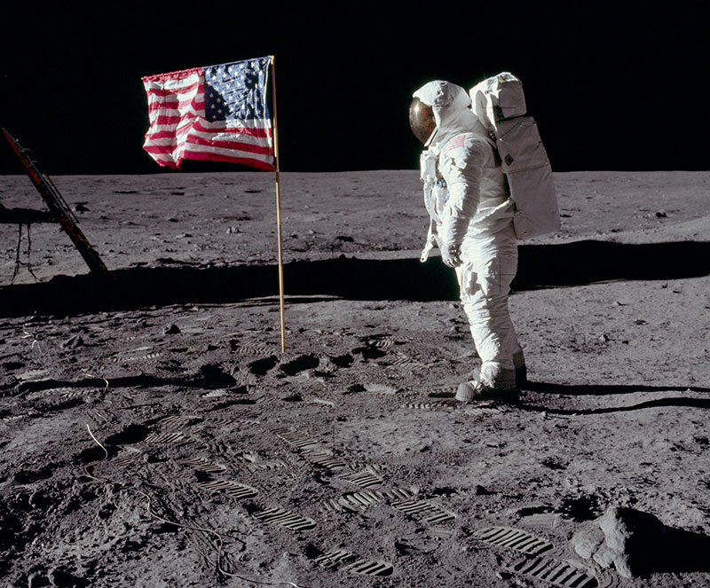

## Large Language and Vision Assistent
LLaVA is an open-source chatbot/assistent trained by fine-tuning LLaMA/Vicuna on
GPT-generated multimodal instruction-following data. So it is able to take in
an image and a prompt and it will answer them (this is the instruction part).

An interesting part of the learning process is that each image needs some text
to go with it, but how do we get that text?  
What was done in the training of LLaVA was that the text was generated by
a GPT (ChatGPT?). So this is a text only GPT remember so that it cannot handle
the image itself. 

There are annotated data sets like [Coco](https://cocodataset.org/) where humans
have provided the annotations for the image. So the image is described in text
format, which consists of bounding boxes (like where things are in the image
with coordinates) and such to describe what is in the image. So we have an
image, and the caption, and the description of the image with the bounding boxes
and with this the LLM can understand the image.

The most recent version of LLaVA is
[LLaVA v1.6/LLaVA-Next](https://llava-vl.github.io/blog/2024-01-30-llava-next/).
And the paper for 1.5 can be found [here](https://arxiv.org/abs/2310.03744).

Llava has a LLM, a Visual Transformer (CLIP with ViT-L/14 (ViT Large and using
14x14 patches), and adds a trainable projection layer (Multi-layer projector in
LLaVA-1.5). The project is used to project/transform the patch embeddings into
the token embedding space.

So a [ViT](vit.md) will produce a patch embedding for the image, and the LLM
will produce token embeddings:
```
   +-------------+      +----------------+
   | Text input  |----->| Vicuna         |---> token embeddings
   +-------------+      +----------------+

   +-------------+      +----------------+
   | Image input |----->| ViT-L/14       |--->  patch embeddings
   +-------------+      +----------------+
```
But these are embeddings from different embedding spaces, so we need to project
them into the same space. This is done by a trainable projection layer (W) on
top of
```
   patch embeddings [0                 512]
       (Z)

Zᵥ = the patch embeddings

    Hᵥ = W * Zᵥ

Hᵥ = patch embeddings but now in the same space as the token embeddings
W  = trainable projection layer
```

Now, during training the input data set consists of pairs of images and text
inputs. At inference time there might not be any text, we could just pass an
image and have the model generate a response for it, perhaps describing what
it sees in the image. But we could also pass a prompt along with the image and
ask a specific question about the image.

For example, we can pass the following image to `llava-cli` which is part of
llama.cpp and it will describe it:



```console
$ ~/work/ai/llama.cpp/llava-cli --no-display-prompt --log-disable --n-gpu-layers 25 -m ~/work/ai/llava-v1.5-7b/ggml-model-f16.gguf --mmproj ~/work/ai/llava-v1.5-7b/mmproj-model-f16.gguf --image ~/work/ai/learning-ai/notes/apollo11.jpg 

The image features a man wearing a white space suit, standing on the moon and posing in front of an American flag. He is carrying several items in his suit, including a backpack and two handheld objects. There are also a couple of additional smaller figures visible in the distance, likely also part of the same scene. The overall atmosphere suggests that this picture was taken during a historical moon landing event or space exploration mission, capturing the moment as mankind achieved another milestone in its cosmic journey.
```

And we can also pass in a prompt along with the image and ask a specific
question:
```console
$ ~/work/ai/llama.cpp/llava-cli --no-display-prompt --log-disable --n-gpu-layers 25 -m ~/work/ai/llava-v1.5-7b/ggml-model-f16.gguf --mmproj ~/work/ai/llava-v1.5-7b/mmproj-model-f16.gguf --image ~/work/ai/learning-ai/notes/apollo11.jpg -p "Is there a banan in the image?"

No, there is no banana in the image.
```

During training the first stage trains the projection layer W and the ViT and
LLM are frozen (not updated). So this is mostly about enabling the patch
embeddings to be projected into the same space as the token embeddings.
In the second stage the projector is trained as well as the language model which
is about the instruction tuning learning.


### llama.cpp example
First we clone https://huggingface.co/liuhaotian/llava-v1.5-7b which is the
instruction tuned model, which recall was trained on prompts which contained
a textual description of an image and then user/assistent interactions, and also
with the images. This is what produces the projector.

I did the following in the directory above my checked out llama.cpp directory.
We need to checkout the LLaVA model:
```console
$ git clone https://huggingface.co/liuhaotian/llava-v1.5-7b
```

And we need the Vision Transformer (ViT) model:
```console
$ git clone https://huggingface.co/openai/clip-vit-large-patch14-336
```

Create a Python virtual environment and install the required packages:
```console
$ python3.11 -m venv llava-venv
$ source llava-venv/bin/activate
(llava-venv) $ pip install torch numpy gguf transformers pillow sentencepiece
```
Then we can run the script llava-surgery.py script:
```console
(llava-venv) $ python examples/llava/llava-surgery.py -m ../llava-v1.5-7b/
Done!
Now you can convert ../llava-v1.5-7b/ to a a regular LLaMA GGUF file.
Also, use ../llava-v1.5-7b//llava.projector to prepare a llava-encoder.gguf file.
```
What this script does is that it looks up the pretrained PyTorch weight files
(the last one) which in my case is pytorch_model-00002-of-00002.bin. Hmm, could
this not be looked up instead using the pytorch_model.bin.index.json?  
The following tensors are retrieved and stored:
```console
"model.mm_projector.0.bias": "pytorch_model-00002-of-00002.bin",               
"model.mm_projector.0.weight": "pytorch_model-00002-of-00002.bin",             
"model.mm_projector.2.bias": "pytorch_model-00002-of-00002.bin",               
"model.mm_projector.2.weight": "pytorch_model-00002-of-00002.bin", 
```
Then `torch.save` (which would be in pickle format) is used which will save the
projector weights in a files called llava.projector:
```python
torch.save(projector, f"{args.model}/llava.projector")
```
```console
$ cd fundamentals/python && source fund/bin/activate
(fund) $ python src/list-pytorch-model.py 
model.mm_projector.0.weight: torch.Size([4096, 1024])
model.mm_projector.0.bias: torch.Size([4096])
model.mm_projector.2.weight: torch.Size([4096, 4096])
model.mm_projector.2.bias: torch.Size([4096])
```
The surgery script also removes these weights from the model file and saves it,
so we need to revert the changes in ../llava-v1.5-7b/ before we can run the
script again.
So at this point pytorch_model-00002-of-00002.bin does not contain the tensor
weights related to the projector.

The `llava.projector` are the tensors that projector which we will use with the
image encoder so that it can convert/transform the image embeddings into the
same space as the text embeddings.

And the type of model has to be GGUF so this will also convert it to that format:
```console
(llava-venv) $ python ./examples/llava/convert-image-encoder-to-gguf.py -m ../clip-vit-large-patch14-336 --llava-projector ../llava-v1.5-7b/llava.projector --output-dir ../llava-v1.5-7b
gguf: This GGUF file is for Little Endian only
Projector tensors added
...
Done. Output file: ../llava-v1.5-7b/mmproj-model-f16.gguf
```
So that is the ViT with the addition of the projector tensors, converted to
GGUF format which is now in `mmproj-model-f16.gguf`

Then we need to convert the llava part of llava to GGUF format, which we removed
the projector tensors from:
```console
(llava-venv) $ python ./convert.py ../llava-v1.5-7b
Loading model file ../llava-v1.5-7b/pytorch_model-00001-of-00002.bin
Loading model file ../llava-v1.5-7b/pytorch_model-00001-of-00002.bin
Loading model file ../llava-v1.5-7b/pytorch_model-00002-of-00002.bin
params = Params(n_vocab=32000, n_embd=4096, n_layer=32, n_ctx=4096, n_ff=11008, n_head=32, n_head_kv=32, n_experts=None, n_experts_used=None, f_norm_eps=1e-05, rope_scaling_type=None, f_rope_freq_base=None, f_rope_scale=None, n_orig_ctx=None, rope_finetuned=None, ftype=None, path_model=PosixPath('../llava-v1.5-7b'))
Found vocab files: {'tokenizer.model': PosixPath('../llava-v1.5-7b/tokenizer.model'), 'vocab.json': None, 'tokenizer.json': None}
Loading vocab file '../llava-v1.5-7b/tokenizer.model', type 'spm'
Vocab info: <SentencePieceVocab with 32000 base tokens and 0 added tokens>
Special vocab info: <SpecialVocab with 0 merges, special tokens {'bos': 1, 'eos': 2, 'pad': 0}, add special tokens {'bos': True, 'eos': False}>
...
Writing ../llava-v1.5-7b/ggml-model-f16.gguf, format 1
Ignoring added_tokens.json since model matches vocab size without it.
gguf: This GGUF file is for Little Endian only
gguf: Setting special token type bos to 1
gguf: Setting special token type eos to 2
gguf: Setting special token type pad to 0
gguf: Setting add_bos_token to True
gguf: Setting add_eos_token to False
...
Wrote ../llava-v1.5-7b/ggml-model-f16.gguf
```

So the removal of the projector tensors from the model confused me somewhat, 
I understand that they need to be added to the ViT model, but I don't understand
why they need to be removed from the LLaMA model. Without removing them we would
run into and error when converting the model:
```console
(llava-venv) $ python ./convert.py ../llava-v1.5-7b
...
model.layers.31.post_attention_layernorm.weight  -> blk.31.ffn_norm.weight                   | F16    | [4096]
model.norm.weight                                -> output_norm.weight                       | F16    | [4096]
Traceback (most recent call last):
  File "/home/danielbevenius/work/ai/llama.cpp/./convert.py", line 1483, in <module>
    main()
  File "/home/danielbevenius/work/ai/llama.cpp/./convert.py", line 1469, in main
    model   = convert_model_names(model, params, args.skip_unknown)
              ^^^^^^^^^^^^^^^^^^^^^^^^^^^^^^^^^^^^^^^^^^^^^^^^^^^^^
  File "/home/danielbevenius/work/ai/llama.cpp/./convert.py", line 1206, in convert_model_names
    raise Exception(f"Unexpected tensor name: {name}. Use --skip-unknown to ignore it (e.g. LLaVA)")
Exception: Unexpected tensor name: model.mm_projector.0.weight. Use --skip-unknown to ignore it (e.g. LLaVA)
```
This is because these tensors are not defined in gguf-py/gguf/tensor_mapping.py
so they will not be recognized, hence the error. I think it would be alright to
remove the removal of the projector tensors from the LLaMA model and then added
the `--skip-unknown` flag to the convert.py script.

Using `--skip-unknown` as suggested seems to work:
```console
$ python ./convert.py ../llava-v1.5-7b --skip-unknown
```
Perhaps this could be changed as it would be nice to be able to not have to
update the original model file.

Now, we can pass the following image to `llava-cli` and it will describe it:


```console
(llava-venv) $ ./llava-cli --no-display-prompt --log-disable --n-gpu-layers 25 -m ../llava-v1.5-7b/ggml-model-f16.gguf --mmproj ../llava-v1.5-7b/mmproj-model-f16.gguf --image apollo11.jpg
ggml_init_cublas: GGML_CUDA_FORCE_MMQ:   no
ggml_init_cublas: CUDA_USE_TENSOR_CORES: yes
ggml_init_cublas: found 1 CUDA devices:
  Device 0: NVIDIA GeForce RTX 4070, compute capability 8.9, VMM: yes
clip_model_load: model name:   openai/clip-vit-large-patch14-336
clip_model_load: description:  image encoder for LLaVA
clip_model_load: GGUF version: 3
clip_model_load: alignment:    32
clip_model_load: n_tensors:    377
clip_model_load: n_kv:         19
clip_model_load: ftype:        f16

clip_model_load: loaded meta data with 19 key-value pairs and 377 tensors from ../llava-v1.5-7b/mmproj-model-f16.gguf
clip_model_load: Dumping metadata keys/values. Note: KV overrides do not apply in this output.
clip_model_load: - kv   0:                       general.architecture str              = clip
clip_model_load: - kv   1:                      clip.has_text_encoder bool             = false
clip_model_load: - kv   2:                    clip.has_vision_encoder bool             = true
clip_model_load: - kv   3:                   clip.has_llava_projector bool             = true
clip_model_load: - kv   4:                          general.file_type u32              = 1
clip_model_load: - kv   5:                               general.name str              = openai/clip-vit-large-patch14-336
clip_model_load: - kv   6:                        general.description str              = image encoder for LLaVA
clip_model_load: - kv   7:                        clip.projector_type str              = mlp
clip_model_load: - kv   8:                     clip.vision.image_size u32              = 336
clip_model_load: - kv   9:                     clip.vision.patch_size u32              = 14
clip_model_load: - kv  10:               clip.vision.embedding_length u32              = 1024
clip_model_load: - kv  11:            clip.vision.feed_forward_length u32              = 4096
clip_model_load: - kv  12:                 clip.vision.projection_dim u32              = 768
clip_model_load: - kv  13:           clip.vision.attention.head_count u32              = 16
clip_model_load: - kv  14:   clip.vision.attention.layer_norm_epsilon f32              = 0.000010
clip_model_load: - kv  15:                    clip.vision.block_count u32              = 23
clip_model_load: - kv  16:                     clip.vision.image_mean arr[f32,3]       = [0.481455, 0.457828, 0.408211]
clip_model_load: - kv  17:                      clip.vision.image_std arr[f32,3]       = [0.268630, 0.261303, 0.275777]
clip_model_load: - kv  18:                              clip.use_gelu bool             = false
clip_model_load: - type  f32:  235 tensors
clip_model_load: - type  f16:  142 tensors
clip_model_load: CLIP using CUDA backend
clip_model_load: text_encoder:   0
clip_model_load: vision_encoder: 1
clip_model_load: llava_projector:  1
clip_model_load: model size:     595.53 MB
clip_model_load: metadata size:  0.14 MB
clip_model_load: params backend buffer size =  595.53 MB (377 tensors)
clip_model_load: compute allocated memory: 36.18 MB
llama_model_loader: loaded meta data with 20 key-value pairs and 291 tensors from ../llava-v1.5-7b/ggml-model-f16.gguf (version GGUF V3 (latest))
llama_model_loader: Dumping metadata keys/values. Note: KV overrides do not apply in this output.
llama_model_loader: - kv   0:                       general.architecture str              = llama
llama_model_loader: - kv   1:                               general.name str              = LLaMA v2
llama_model_loader: - kv   2:                       llama.context_length u32              = 4096
llama_model_loader: - kv   3:                     llama.embedding_length u32              = 4096
llama_model_loader: - kv   4:                          llama.block_count u32              = 32
llama_model_loader: - kv   5:                  llama.feed_forward_length u32              = 11008
llama_model_loader: - kv   6:                 llama.rope.dimension_count u32              = 128
llama_model_loader: - kv   7:                 llama.attention.head_count u32              = 32
llama_model_loader: - kv   8:              llama.attention.head_count_kv u32              = 32
llama_model_loader: - kv   9:     llama.attention.layer_norm_rms_epsilon f32              = 0.000010
llama_model_loader: - kv  10:                          general.file_type u32              = 1
llama_model_loader: - kv  11:                       tokenizer.ggml.model str              = llama
llama_model_loader: - kv  12:                      tokenizer.ggml.tokens arr[str,32000]   = ["<unk>", "<s>", "</s>", "<0x00>", "<...
llama_model_loader: - kv  13:                      tokenizer.ggml.scores arr[f32,32000]   = [0.000000, 0.000000, 0.000000, 0.0000...
llama_model_loader: - kv  14:                  tokenizer.ggml.token_type arr[i32,32000]   = [2, 3, 3, 6, 6, 6, 6, 6, 6, 6, 6, 6, ...
llama_model_loader: - kv  15:                tokenizer.ggml.bos_token_id u32              = 1
llama_model_loader: - kv  16:                tokenizer.ggml.eos_token_id u32              = 2
llama_model_loader: - kv  17:            tokenizer.ggml.padding_token_id u32              = 0
llama_model_loader: - kv  18:               tokenizer.ggml.add_bos_token bool             = true
llama_model_loader: - kv  19:               tokenizer.ggml.add_eos_token bool             = false
llama_model_loader: - type  f32:   65 tensors
llama_model_loader: - type  f16:  226 tensors
llm_load_vocab: special tokens definition check successful ( 259/32000 ).
llm_load_print_meta: format           = GGUF V3 (latest)
llm_load_print_meta: arch             = llama
llm_load_print_meta: vocab type       = SPM
llm_load_print_meta: n_vocab          = 32000
llm_load_print_meta: n_merges         = 0
llm_load_print_meta: n_ctx_train      = 4096
llm_load_print_meta: n_embd           = 4096
llm_load_print_meta: n_head           = 32
llm_load_print_meta: n_head_kv        = 32
llm_load_print_meta: n_layer          = 32
llm_load_print_meta: n_rot            = 128
llm_load_print_meta: n_embd_head_k    = 128
llm_load_print_meta: n_embd_head_v    = 128
llm_load_print_meta: n_gqa            = 1
llm_load_print_meta: n_embd_k_gqa     = 4096
llm_load_print_meta: n_embd_v_gqa     = 4096
llm_load_print_meta: f_norm_eps       = 0.0e+00
llm_load_print_meta: f_norm_rms_eps   = 1.0e-05
llm_load_print_meta: f_clamp_kqv      = 0.0e+00
llm_load_print_meta: f_max_alibi_bias = 0.0e+00
llm_load_print_meta: n_ff             = 11008
llm_load_print_meta: n_expert         = 0
llm_load_print_meta: n_expert_used    = 0
llm_load_print_meta: rope scaling     = linear
llm_load_print_meta: freq_base_train  = 10000.0
llm_load_print_meta: freq_scale_train = 1
llm_load_print_meta: n_yarn_orig_ctx  = 4096
llm_load_print_meta: rope_finetuned   = unknown
llm_load_print_meta: model type       = 7B
llm_load_print_meta: model ftype      = F16
llm_load_print_meta: model params     = 6.74 B
llm_load_print_meta: model size       = 12.55 GiB (16.00 BPW) 
llm_load_print_meta: general.name     = LLaMA v2
llm_load_print_meta: BOS token        = 1 '<s>'
llm_load_print_meta: EOS token        = 2 '</s>'
llm_load_print_meta: UNK token        = 0 '<unk>'
llm_load_print_meta: PAD token        = 0 '<unk>'
llm_load_print_meta: LF token         = 13 '<0x0A>'
llm_load_tensors: ggml ctx size =    0.22 MiB
llm_load_tensors: offloading 25 repeating layers to GPU
llm_load_tensors: offloaded 25/33 layers to GPU
llm_load_tensors:        CPU buffer size = 12853.02 MiB
llm_load_tensors:      CUDA0 buffer size =  9650.78 MiB
...................................................................................................
llama_new_context_with_model: n_ctx      = 2048
llama_new_context_with_model: freq_base  = 10000.0
llama_new_context_with_model: freq_scale = 1
llama_kv_cache_init:  CUDA_Host KV buffer size =   224.00 MiB
llama_kv_cache_init:      CUDA0 KV buffer size =   800.00 MiB
llama_new_context_with_model: KV self size  = 1024.00 MiB, K (f16):  512.00 MiB, V (f16):  512.00 MiB
llama_new_context_with_model:  CUDA_Host input buffer size   =    12.01 MiB
llama_new_context_with_model:      CUDA0 compute buffer size =   171.60 MiB
llama_new_context_with_model:  CUDA_Host compute buffer size =   167.20 MiB
llama_new_context_with_model: graph splits (measure): 5

encode_image_with_clip: image encoded in    84.79 ms by CLIP (    0.15 ms per image patch)

 In the image, a person wearing a white and red space suit stands on top of a moon surface. They have their back turned to the American flag that is waving nearby. The person appears to be an astronaut or possibly an alien character in an iconic scene from science fiction movies. They are holding a suitcase, which could potentially be carrying supplies for their journey or a prop from the movie set.

llama_print_timings:        load time =    6637.59 ms
llama_print_timings:      sample time =      56.21 ms /    87 runs   (    0.65 ms per token,  1547.82 tokens per second)
llama_print_timings: prompt eval time =    5576.01 ms /   616 tokens (    9.05 ms per token,   110.47 tokens per second)
llama_print_timings:        eval time =   16764.83 ms /    87 runs   (  192.70 ms per token,     5.19 tokens per second)
llama_print_timings:       total time =   27646.54 ms /   703 tokens
```

### Using LLaVA 1.6
First clone the LLaVA 1.6 model:
```console
$ git clone https://huggingface.co/liuhaotian/llava-v1.6-vicuna-7b
```
One thing to note about this model is that it includes the vision part in the    
model files, in contrast to llava-1.5 where the vision part is in a separate     
model that we checked out. So the surgery script for this version will extract
them.

Then we run the llava-surgery-v2.py script:
```console
$ python examples/llava/llava-surgery-v2.py -C -m ../llava-v1.6-vicuna-7b/
```
Then copy the following files to a new directory:
```console
$ mkdir vit
$ cp ../llava-v1.6-vicuna-7b/llava.clip vit/pytorch_model.bin
$ cp ../llava-v1.6-vicuna-7b/llava.projector vit/
$ curl -s -q https://huggingface.co/cmp-nct/llava-1.6-gguf/raw/main/config_vit.json -o vit/config.json

$ python ./examples/llava/convert-image-encoder-to-gguf.py -m vit --llava-projector vit/llava.projector --output-dir vit --clip-model-is-vision
```
Then we can convert the model to gguf format:
```console
$ python ./convert.py ../llava-v1.6-vicuna-7b/
```
And finally we can run the llava-cli using the 1.6 model version:
```console
~/work/ai/llama.cpp/llava-cli --no-display-prompt --log-disable --n-gpu-layers 25 -m ~/work/ai/llava-v1.6-vicuna-7b/ggml-model-f16.gguf --mmproj ~/work/ai/llama.cpp/vit/mmproj-model-f16.gguf --image ~/work/ai/learning-ai/notes/apollo11.jpg
...

The image shows an astronaut standing on the surface of the moon, looking towards the camera. He is wearing a white space suit with the American flag patch visible on his chest, and he has a backpack strapped to his shoulders. In front of him stands a small wooden pole with an American flag attached to it. This scene depicts a historical moment from the Apollo missions when astronauts planted flags on the moon as part of their mission objectives. The environment around them is barren and rocky, characteristic of the moon's surface.
```

### BakLLaVA-1
This is a Mistral 7B base model agumented with LLaVA-1.5 architecture compared
to the version above which was based on Vicuna (which recall is a fine-tuned
LLaMA base model for chat (conversations were collected from ShareGPT)).

First clone BakLLaVA-1:

```console
$ git clone https://huggingface.co/SkunkworksAI/BakLLaVA-1
```

Then we run the llava-surgery.py script:
```console
(llava-venv) $ python examples/llava/llava-surgery.py -m ../BakLLaVA-1/
Done!
Now you can convert ../BakLLaVA-1/ to a regular LLaMA GGUF file.
Also, use ../BakLLaVA-1//llava.projector to prepare a llava-encoder.gguf file.
```

Then we convert the vision model to gguf format:
```console
(llava-venv) $ python ./examples/llava/convert-image-encoder-to-gguf.py -m ../clip-vit-large-patch14-336 --llava-projector ../BakLLaVA-1/llava.projector --output-dir ../BakLLaVA-1
...
Done. Output file: ../BakLLaVA-1/mmproj-model-f16.gguf
```

Then we convert the BakLLaVA-1 to gguf format:
```console
$ python ./convert.py ../BakLLaVA-1
...
Wrote ../BakLLaVA-1/ggml-model-f16.gguf
```

And then we can run the llava-cli using the BakLLaVA-1 model:
```console
(llava-venv) $ ~/work/ai/llama.cpp/llava-cli --no-display-prompt --log-disable --n-gpu-layers 25 -m ~/work/ai/BakLLaVA-1/ggml-model-f16.gguf --mmproj ~/work/ai/BakLLaVA-1/mmproj-model-f16.gguf --image ~/work/ai/learning-ai/notes/apollo11.jpg
...

The image is a photograph of an astronaut standing on the surface of the Moon during the Apollo 11 mission.
```

### Lightweight Downsampling Projector (LDP)
This is an option that is available in the script.
```console
(llava-venv) $ python examples/llava/convert-image-encoder-to-gguf.py --help
usage: convert-image-encoder-to-gguf.py [-h] -m MODEL_DIR [--use-f32] [--text-only] [--vision-only]
                                        [--clip_model_is_vision] [--llava-projector LLAVA_PROJECTOR]
                                        [--projector-type {mlp,ldp}]
                                        [--image-mean IMAGE_MEAN IMAGE_MEAN IMAGE_MEAN]
                                        [--image-std IMAGE_STD IMAGE_STD IMAGE_STD] [-o OUTPUT_DIR]
                                        [--image_mean IMAGE_MEAN [IMAGE_MEAN ...]]
                                        [--image_std IMAGE_STD [IMAGE_STD ...]]

options:
  -h, --help            show this help message and exit
  -m MODEL_DIR, --model-dir MODEL_DIR
                        Path to model directory cloned from HF Hub
  --llava-projector LLAVA_PROJECTOR
                        Path to llava.projector file. If specified, save an image encoder for LLaVA models.
  --projector-type {mlp,ldp}
                        Type of projector. Possible values: mlp, ldp
  ...
```

https://arxiv.org/pdf/2402.03766.pdf


