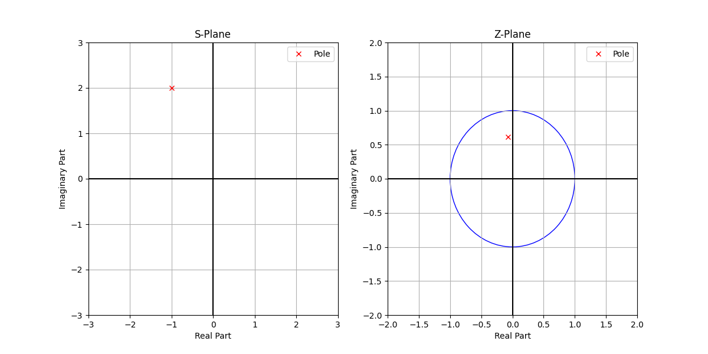

## Mamba: Linear-Time Sequence Modeling with Selective State Space
Mamba is a type of selective state space model (SSSM), `sss` like a snake and
therefor named Mamba. I've got some notes on [SSM](./state-space-models.md).

Mamba is said that it might be just as influential as the transformer
architecture but this is left to be seen.

One of the authors is Tri Dao, was also involved in the developement of 
[Flash Attention](./flash-attention.md) and there one part of Mamba is taking
advantage of the GPU hardware.

So we have transformers which I thought were the absolute latest and advanced
as they seem to be used all over the place. Transformers are effecient at
training as they can be parallelized, incontrast to RNNs which are sequential.

But, the issue with transformers is that they don't scale to long sequences
which is because the self attention mechanism is quadratic in the sequence
length. Every token has to attend to every other token in a sequenc (n²). So if
we have 40 tokens that means 1600 attention operations, which means more
computation and this just increases the longer the input sequence it.
In this respect RNNs are more performant as they don't have the quadratic
scaling issue that the self attention mechanism has (but do have other like
slower training).

The core of Mamba is state space models (SSMs). Before we go further it might
make sense to review [RNNs](./rnn.md) and [SSMs](./state-space-models.md).

Selective state space models, which Mamaba is a type of, give us a linear
recurrent network simliar to RRNs, but also have the fast training that we gets
from transformers. So we get the best of both worlds.

One major difference with state space models is that they have state which is
not something the transformers have. So transformers don't have an intrinsic
state which gets updated as the model processes a sequence. But neural networks
like RNNs do have state, but recall that they process the input sequentially.

To understand how Mamba fits in I found it useful to compare it to how
transformers look in an neural network:
```
Residul          ↑
     +---------> |
     |           |
     |   +-------------------+
     |   | Linear            |
     |   +-------------------+
     |           ↑
     |           |
     |   +-------------------+
     |   | Self-Attention    |
     |   +-------------------+
     |           ↑
     |           |
     |   +-------------------+
     |   | Normalization     |
     |   +-------------------+
     |           ↑
     |           |
     |           |
     +-----------+
                 |

```
And then we have Mamba:
```
Residul          ↑
     +---------> |
     |           |
     |   +-------------------+
     |   | Linear            |
     |   +-------------------+
     |           ↑
     |           |
     |   +-------------------+
     |   | SSM               |
     |   +-------------------+
     |           ↑
     |           |
     |   +-------------------+
     |   | Normalization     |
     |   +-------------------+
     |           ↑
     |           |
     |           |
     +-----------+
                 |

      SSNN (Selective State Neural Network)
```
So we can think of this as if we are swapping out the core layer but other
things stay pretty much the same.

### Selective State Space Models
Selective State Space is a type of state space and a state space is defined
by two funcions:
```
h'(t) = Ah(t) + Bx(t)     (state equation)
yₜ = Ch(t) + Dx(t)        (output equation) (Dx is not referred to in the paper)

h ∈ Rⁿ  is the like the hidden state in an RNN
x ∈ R¹  is the input sequence
y ∈ R¹  is the output sequence
A ∈ Rⁿ×ⁿ is the state transition matrix
B ∈ R¹×ⁿ is the input matrix
C ∈ Rⁿ×¹ is the output matrix
```
Now, the current state of the system is give in `h(t)`. And the matrix A can
be thought of as rules that dictates how the state of the system should evolve
independently of the input.
Lets say we have the following sequence of inputs:
```
"Dan loves icecream"

h'(t) = Ah(0) + B["Dan"]
```
This is the first time so the hidden state is initialized to zeros. B["Dan"] is
the transformation of the input "Dan" by matrix B, which allows this new
information to be integrated into the model.

At the next timestep, we will have:
```
h'(t) = Ah(t-1) + B["loves"]
```
This time h(t-1) will contain information about "Dan" and it will be transformed
by applying matrix A. This reflects how the context of "Dan" evolves before the
next word "loves" is added. And this process then continues. I think what I did
not get initially was that we are "integrating/evolving" the hidden state with
h(t-1), which evolves the hidden state with the output of the previous
iteration.

Now, above we have the A, and b, which are continuous values as per the
definition of a state space model. This makes sense if we think about it as
this is not specific to neural networks or even computers. Think about an analog
system, for example an IoT device that reads the temperature from a sensor
connected to it. To process this signal it needs to be converted into digital
form. A simliar thing needs to be done in this case as we can't use continous
signals with computers, just like an IoT can't process an analog signal
directly. So we need to convert into descrete time steps, similar to how an
Analog-to-Digital Converter ([ADC]) would convert the signal into quantized
 values. This step is called discretization in the state space model.

[ADC]: https://github.com/danbev/learning-iot/tree/master?tab=readme-ov-file#analog-to-digital-converter-adc

So instead of the using functions as shown above we concrete values we will
transform A and B into discrete values and the equations become:
```
     _       _ 
hₜ = Ahₜ₋₁ + Bxₜ
yₜ = Chₜ+ Dxₜ
```
To get the A_hat and B_hat values a process called discretization is used.

### Discretization
So we will first discretize the parameters A, and B of the state space model,
which means that we will convert them from continuous values to discrete values.

I think there are multiple methods/ways to do this but the paper mentions
the bilinear (Tustin's) transform method which is a method for converting a
continous time system into a discrete time system. It provides a way of
approximating the behaviour of a continuous time system with a discrete time
system.

The S-domain is the continuous time domain and the Z-domain is the discrete
time domain.
The S-plane is used in continuous systems and can be visualized as a x-y plane
but for complex numbers. The x-axis is the real part of the complex number,
and the y-axis is the imaginary part of the complex number: 
```
Imaginary
part         ↑
             |
             |
             |
             |
             +------------------→ Real part


S = σ + jω

σ = real part which represents the decay or growth rate
ω = imaginary part which represents the oscillation rate, 0 = no oscillation
j = √-1 (imaginary unit)
```

And then we have the Z-plane which is used in discrete systems and can be
visualized as a x-y plane but for complex numbers. The x-axis is the real part
of the complex number, and the y-axis is the imaginary part of the complex just
like in the S-plane:
```
Imaginary
part         ↑
             |
             |
             |
             |
             +------------------→ Real part

z = re^(jθ)

re = magnitude
e = Euler's number
θ = phase angle
j = √-1 (imaginary unit)
```
The Z-plane is often represented in polar coordinates because discrete-time
signals are inherently periodic due to sampling.

So the bilinear transform is taking a point (or points I guess, but lets use one
point for this example) in the S-plane and representing it as a point in the
Z-plane.

Lets take the following point in the S-plane, S = -1 +2j with a sampling
period of T = 1, and see how it is represented in the Z-plane:



So if we have a continuous time system represented by the variable S and we want
to convert it to a discrete time system represented equalivant variable z, we
use the inverse of the bilinear transform:
```
    2   (z - 1)
S = - * -------
    T   (z + 1)

We multiply both sides by the reciprical of 2/T which is T/2:
T       T   2   (z - 1)
- * S = - * - * -------
2       2   T   (z + 1)

Now, cross multiply to get rid of fractions:
        TS
(z + 1) -- = z - 1
        2

Rearrange the left side:
Ts
-- (z + 1) = z - 1
2

Expand the left side:
TS       TS
-- * z + -- = z - 1
2        2

Move Z to the left side:
TS                TS
-- * Z - Z = -1 - --
2                 2

  TS              TS
Z(-- - 1) = -1  - --
   2               2

Solve for Z by dividing both sides by (TS/2 - 1):
    -1 - (TS/2)
Z = -----------
    TS/2 - 1

    -2 - TS
Z = -------
    TS - 2

    -(TS + 2)
Z = ---------
     TS - 2

      TS + 2
Z = - ------
      TS - 2

```
And in our example above we had S=-1+2j and T=1 so we can plug those values in
(recall that j is the imaginary unit √-1):
```
      TS + 2
Z = - ------
      TS - 2

      1(-1+2j) + 2
Z = - ------------
      1(-1+2j) - 2

T times S is 1 (-1+2j) so we can replace TS with -1+2j:
      -1+2j + 2
Z = - ------------
      -1+2j - 2

Then we can add 2 to the real part of the numerator and denominator:
       1 + 2j
Z = - -------
      -3 + 2j

Multiple by the complex conjugate of the denominator (-3-2j):
      (1 + 2j)  (-3 - 2j)
Z = - -----------------
      (-3 + 2j) (-3 - 2j)

      -3 - 2j - 6j - 4j²
Z = - -----------------
        9 - 4j²

Replace j² with -1:
      -3 - 2j - 6j - 4(-1)
Z = - -----------------
       9 - 4(-1)

      -3 - 2j - 6j + 4
Z = - -----------------
       9 + 4

      -3 - 8j + 4
Z = - -----------
       13

Separate the real and imaginary parts:
      1 - 8j
Z = - -------
       13

       1    8j
Z = - --- - --
      13    13

       1    8j
Z = - --- + --
      13    13

-1/13 = -0.07692307692307693 which is the real part (or x-axis above)
8/13j = 0.6153846153846154j which is the imaginary part (or y-axis above)
```

When we apply the bilinear transform to the state space model we are
recalculating how the system's state should be updated in descrete time
intervales instead of continuous time intervals.

So instead of the using functions as shown above we concrete values we will
transform A and B into discrete values and the equations become:
```
     _       _ 
hₜ = Ahₜ₋₁ + Bxₜ
yₜ = Chₜ+ Dxₜ
```
Where A_hat and B_hat are:
```
A_hat = (I - Δ/2 A)⁻¹           (⁻¹ inverse bilinear transform)
B_hat = (I - Δ/2 A)⁻¹ ΔB        (⁻¹ inverse bilinear transform)

Δ = the time step, for example if we sample every minute then Δ = 1
I = the identity matrix
A = the state transition matrix
B = the input matrix
```

So at this point we have seen a continuous time system (the original form), and
a discrete time (the one where we discretized the parameters A and B). But there
is also a third form namely a convolutional representation.

So this was really confusing to me. I think of an SSM as an RNN which processes
input/token sequentially. With a convolutional representation we have
a filter that is moved over the input and the dot product is computed. My
thought was how is this possible when it the input is sequential, like it can't
access future values so what is it convolving over?  
I think the answer is that the causual convolution where the filter is only
applied to past values.

So it is that the system state is a representation of the past values and it can
then be seen as the filter is moving across those past values. So the filter in
this case are A and B matrices.
```
       +--------------+
       | 0| 0| 0| 0| 0|
       +--------------+ h(t = 0)  (initial state)
       | 0| 0| 0| 0| 0|
       +--------------+
       | 0| 0| 0| 0| 0|
       +--------------+


        +--------------+
        | 0| 0| 0| 0| 0|
        +--------------+ h(t = 0)  (initial state)
        | 0| 0| 0| 0| 0|
        +--------------+
        | 0| 0| 0| 0| 0|
        +--------------+
"Dan"   |  |  |  |  |  |
t = 1   +--------------+             
        [  A/B Filter  ]  ---->    +--------------+
                                   |1 | 1| 1| 1| 1|
                                   +--------------+ h(t = 1) (Updated state incorporating "Dan")
                                   |1 | 1| 1| 1| 1|
                                   +--------------+
                                   |1 | 1| 1| 1| 1|
                                   +--------------+

                        +--------------+
                        | 1| 1| 1| 1| 1|
                        +--------------+ h(t = 1) (Updated state incorporating "Dan")
                        | 1| 1| 1| 1| 1|
                        +--------------+
                        | 1| 1| 1| 1| 1|
                        +--------------+
               "loves"  |  |  |  |  |  |
               t = 2    +--------------+             
                        [  A/B Filter  ]  ---->    +--------------+
                                                   | 2| 2| 2| 2| 2|
                                                   +--------------+ h(t = 2)
                                                   | 2| 2| 2| 2| 2|
                                                   +--------------+
                                                   | 2| 2| 2| 2| 2|
                                                   +--------------+

                                        +--------------+
                                        | 2| 2| 2| 2| 2|
                                        +--------------+ 
                                        | 2| 2| 2| 2| 2|
                                        +--------------+
                                        | 2| 2| 2| 2| 2|
                                        +--------------+
                                 "ice"  |  |  |  |  |  |
                                 t = 3  +--------------+
                                        [  A/B Filter  ] ---->    +--------------+
                                                                  | 3| 3| 3| 3| 3|
                                                                  +--------------+ h(t = 3)
                                                                  | 3| 3| 3| 3| 3|
                                                                  +--------------+
                                                                  | 3| 3| 3| 3| 3|
                                                                  +--------------+

                                                        +--------------+
                                                        | 3| 3| 3| 3| 3|
                                                        +--------------+ 
                                                        | 3| 3| 3| 3| 3|
                                                        +--------------+
                                                        | 3| 3| 3| 3| 3|
                                                        +--------------+
                                               "cream"  |  |  |  |  |  |
                                               t = 4    +--------------+
                                                        [  A/B Filter  ]  ---->    +--------------+
                                                                                   | 4| 4| 4| 4| 4|
                                                                                   +--------------+ h(t = 4)
                                                                                   | 4| 4| 4| 4| 4|
                                                                                   +--------------+
                                                                                   | 4| 4| 4| 4| 4|
                                                                                   +--------------+
```
What I'm trying to convey here is that the filter is moving across the input
and at each timestep it is computing the weighted sums of the past state and
the current input. As move input comes in the filter is "moved" across to the
next input.

```
Initial State:
+--------------+
|  h(0)        |  (Initial state of the system, could be zeros or a predefined state)
+--------------+

Step 1: Process "Dan"
+--------------+    +--------------+
|  h(0)        |    |  "Dan"       |  (New input is added as a row)
+--------------+    +--------------+
     |                     |
     +------- A/B Filter --------> +--------------+
                                   |  h(1)        |  (Updated state incorporating "Dan")
                                   +--------------+

Step 2: Process "loves"
+--------------+    +--------------+
|  h(1)        |    |  "loves"     |  (New input is added to the updated state)
+--------------+    +--------------+
     |                     |
     +------- A/B Filter --------> +--------------+
                                   |  h(2)        |  (Updated state incorporating "loves")
                                   +--------------+

Step 3: Process "ice"
+--------------+    +--------------+
|  h(2)        |    |  "ice"       |  (Continuing the process)
+--------------+    +--------------+
     |                     |
     +------- A/B Filter --------> +--------------+
                                   |  h(3)        |  (State updated with "ice")
                                   +--------------+

Step 4: Process "cream"
+--------------+    +--------------+
|  h(3)        |    |  "cream"     |  (Adding "cream" to the sequence)
+--------------+    +--------------+
     |                     |
     +------- A/B Filter --------> +--------------+
                                   |  h(4)        |  (Final updated state with "cream")
                                   +--------------+
```

One thing to keep in mind is that the state h is intended to capture the history
of the sequence x. How this is done depends on the transformation matrices A
and B. In practice if the sequence is long then the model may forget earlier
information. The model prioritizes more recent information. Just to draw a
parallel to transformers, the self attention mechanism can take the entire
sequence into account but it this can become very computationally expensive
as the sequence becomes very long.


So that is what is called the state space model, but we have not touched upon
the selective part of this yet. This is where S4 (structured state space )comes
in and it is defined as:
```
S4 = SSM + HiPPO + Structured Matrices
```
So we have SSM which is what we discussed above, then we have the addition
of HiPPO (History Preserving Operator?), and finally structured matrices.

The HiPPO operator looks like this and is a special variant, well actually it
specifies a way to construct the A and B matrices in a way that ensures that
a model can retain a high-resulution of past inputs.
```
x' = Ax + Bu
```
In the HiPPO framework, the design of matrix A is crucial for determining how
the internal state evolves to preserve historical information. The matrices A
and B are called HiPPO matrices. As we mentioned above the matrices A and B are
learned during training and for the HiPPO matrices this is done by using special
algorithms.

HiPPO aims to optimize A to ensure that older inputs are gradually and smoothly
"compressed" into the model's state, without being abruptly forgotten. So A is
the transition from h(t) to h(t+1) and not that this is not dependent on the
current input token (u or x, whatever the name of the thing following B is).

Similarly, the HiPPO approach influences the design of matrix B, which governs
how new inputs are incorporated into the model's state. The goal is to integrate
new information in a way that complements the historical data already
represented within the model's internal state.

Recall that this is a mapping of the input u into the state space x (I know that
I'm using x as the state space where above I used h(t), and also using u as the
input. I've seen both of these ways of naming). The idea is to design a state
the can capture the inputs entire history.

One question that was "asked" was, "using the current state, x_t, can we
reconstruct the history of inputs?"

HiPPO operator:
```
x'(t) = Ax(t) + Bu(t)
```

HiPPO matrix

```
      { 0     n < k }
Aₙₖ = { n+1   n = k }
      { 2n+1  n > k } 

n = row index
k = column index
```
Lets say we have the following matrix:
```
         0  1  2  3  4
row 0  [ 1, 2, 3, 4, 5]
row 1  [ 1, 2, 0, 0, 5]
row 2  [ 1, 2, 3, 0, 5]
row 3  [ 1, 2, 3, 4, 5]
row 4  [ 1, 2, 3, 4, 5]
````
And if we start with the n < k condition:
```
n < k

         0  1  2  3  4
row 0  [ 1, 0, 0, 0, 0]
row 1  [ 1, 2, 0, 0, 0]
row 2  [ 1, 2, 3, 0, 0]
row 3  [ 1, 2, 3, 4, 0]
row 4  [ 1, 2, 3, 4, 5]
```
And if we only focus on n = k condition:
```
n = k
         0  1  2  3  4
row 0  [ 1, 0, 0, 0, 0]
row 1  [ 0, 2, 0, 0, 0]
row 2  [ 0, 0, 3, 0, 0]
row 3  [ 0, 0, 0, 4, 0]
row 4  [ 0, 0, 0, 0, 5]
```
And finally we only focus on n > k condition:
```
n > k
         0  1  2  3  4
row 0  [ 1, 0, 0, 0, 0]
row 1  [ 1, 2, 0, 0, 0]
row 2  [ 1, 2, 3, 0, 0]
row 3  [ 1, 2, 3, 5, 0]
row 4  [ 1, 2, 3, 4, 5]
```
And if we put it all together we get:
```
         0  1  2  3  4
row 0  [ 1, 0, 0, 0, 0]
row 1  [ 1, 2, 0, 0, 0]
row 2  [ 1, 2, 3, 0, 0]
row 3  [ 1, 2, 3, 4, 0]
row 4  [ 1, 2, 3, 4, 5]

__wip__
We can visualize this as
```
    +---+      +---+       +---+
----| x |------| h |---+---| y |----------------------------->
    +---+  ↑   +---+   |   +---+
           |   +---+   |
           +---| A |---+
               +---+
```
