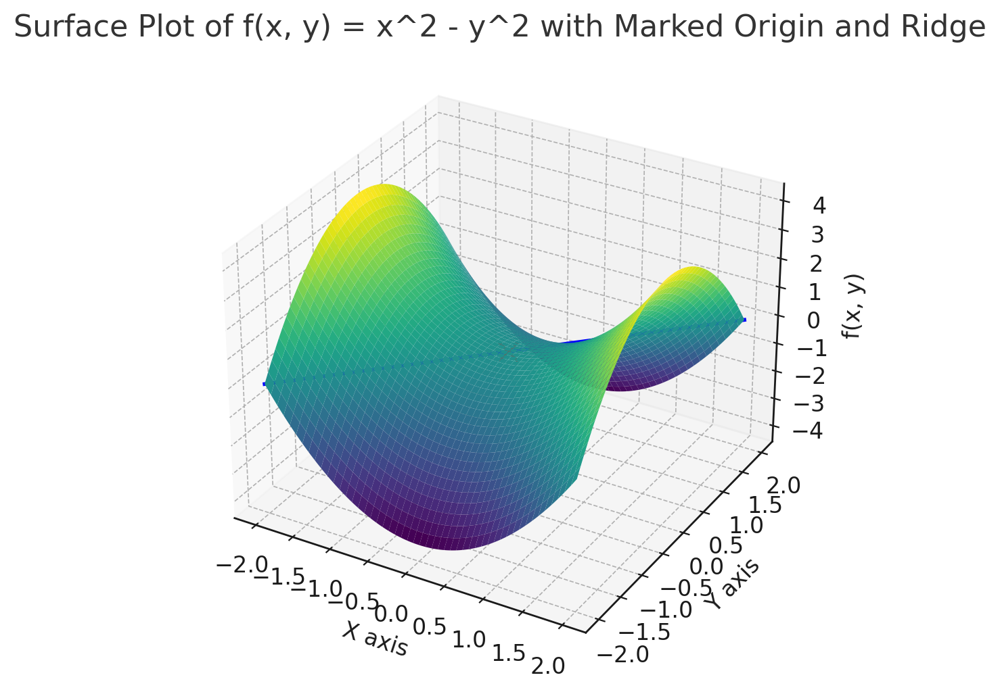

## Opimization Algorithms
Describes different optimization algorithms used in deep learning.

### Frequent vs Infrequent Parameters
To understand this I think an example is most useful. Take a text
classification task in NLP where we have a vocabulary of 10,000 words. Each
word in the vocabulary is a parameter/weight in the model.

In any given text sample used for training only a small fraction of these words
will actually be used. In most languages there are a small number of words that
are used very frequently and a large number of words that are used very
infrequently. Words like "the", "and", "a", "is", etc. are used very frequently
and the weights that correspond to these words will be updated more frequently
(they are always part of the gradient calculation).

With SGD all weights are updated uniformly. So the weights that correspond to
frequent words might get overemphasized and the weights that correspond to
infrequent words, which might be rare but also might actually have more
importance (carry more information because they are rare), will not be updated
with enough importance (perhaps they should be made more important as less
frequent words often convey more information).

In adaptive learning rate methods (like AdaGrad, RMSprop, or Adam), the learning
rates are adjusted based on the update history of each weight. Weights for rare
words get larger updates when they do appear, helping the model to pay attention
to these infrequent but potentially significant features.

### Batch Gradient Decent
Lets take the following example:
```
area         bedrooms     price
2600         3            550000 
3000         4            565000
3200         3            610000
3600         3            595000
4000         5            760000
4100         6            810000

   price = w₁ * area + w₂ * bedrooms + b
```
So we would take the first entry and perform the following calculation:
```
w₁ = 1, w₂ = 1, b = 1

   price = w₁ * area + w₂ * bedrooms + b
   price = w₁ * 2600 + w₂ * 3 + b
   price = 2600 + 3 + 1
   price = 2604
```
We would then calculate the error for this prediction:
```
error = (actual - predicted)²
error₁ = (550000 - 2604)²
```
And we would to this for all our samples, which are 6 in this case:
```
total_error = error₁ + error₂ + error₃ + error₄ + error₅ + error₆

MSE = 1/n * total_error
MSE = 1/6 * total_error

MSE = Mean Squared Error
```
What we then do is that we take the partial derivative of the MSE with respect
to each of the weights and the bias. This gives us the gradient for each of
the weights and the bias. We then update the weights and the bias with the
following formula:
```
w₁ = w₁ - α * ∂MSE/∂w₁
w₂ = w₂ - α * ∂MSE/∂w₂
b = b - α * ∂MSE/∂b

∂ = partial derivative
α = learning/step rate
```
Where α is the learning rate. This is the rate at which we update the weights
and the bias. If we set α to a high value we might overshoot the minimum and
if we set it to a low value it will take a long time to converge.

We take these new values for the weights and the bias and repeat the process
until we reach a minimum. Each one of these iterations is called an epoch.

We keep doing this until we reach an acceptable error rate/loss, which should be
as close to zero as possible. When this is achieved the values in the weights
and bias which should be correct enough that we can predict the price of a
house given the area and the number of bedrooms. The above is called batch 
gradient decent.

Notice that we went through all the training samples and calculated the error,
which means calculating the gradient for all the samples. In our case this is
not really a problem which such as small data set, but if we have millions of
samples this can be very inefficient. Also in this example we only have two
features (area and bedrooms) but in real life we might have
hundreds/thousand/millsions of features which means that we would have to
calculate the partial derivative for each of the features which can be very time
consuming.

The following is the Gradient decent formula (same as above but with different
notation as it might be written like this in places):
```
θ_new = θ_old - α * ∇J(θ)

θ = represents the parameters of function we are trying to optimize which are
    the weights.
α = step size/learning rate.
- = the opposite of the gradient, which is because we want to go down the hill.
∇ = Nabla symbol which is the gradient.
∇(J)(θ) = the gradient of the cost function J, with respect to the parameters θ.
          This tells us the slope of the hill under our feet.
```
The process is an iterative process where we start with an initial guess for
θ, and then repetedly update until theta converges to a value that minimizes the
cost function J(θ). Convergence means that the values of the parameters θ stop
changing significantly with each iteration, or they change within a very small
predefined threshold. When we can't go downward anymore we are done or after a
specific number of iterations (or perhaps a combination of both).


### Stochastic Gradient Descent (SGD)
Building off of the previous section SGD tries to address the issue with having
to calculate the error for all the samples in the training dataset. In this case
we only take one random sample at a time and calculate the error and update the
weights and bias. This is called an iteration. We then repeat this process until
we reach a minimum. This is called stochastic (random) gradient decent.

The problem with this approach is that it since we pick a random sample each
interation the calculated gradients can vary significantly between each
iteration. This is because we are only taking one sample at a time and the error
for that sample might be very high or very low which means that the gradient
will be very high or very low. This is called noise. This noise can actually be
beneficial. It adds a degree of randomness that can help the algorithm escape
local minima, potentially leading to better solutions in complex loss
landscapes.

This will cause the weights and bias to jump around the minimum. This is not a
problem if we have a lot of samples but if we have a small dataset this can be
a problem.

### Stochastic Gradient Descent with Mini-Batches
This builds upon SGD but adds small batches of random values to calculate
instead of a single value. The ideas is to avoid the noise/bouncing of SGD and
still be not have to calculate the error for all the samples. So instead of
taking one sample at a time we take a small batch.


### Stochastic Gradient Descent with Momentum
The idea of momentum in the context of SGD comes from physics, particularly the
concept of momentum in motion. It's like a ball rolling down hill; the momentum
term increases the speed of the descent.

So instead of just taking the current gradient into account, it also take the
previous gradient into account. So it needs to keep a vector of values that
contain a combination of the gradients from current step and the velocity of the
previous step, scaled by a parameter known as the momentum coefficient.

First, we update the velocity vector:
```
v = αv − η ∇f(θ) 
v = the velocity vector containing the accumlated gradients updates from the
    previous steps.
α = alpha is the momentum coefficient and this hyperparameter dictates how much
    of the previous velocity vector influences the current update.
η = eta is the learning rate and is also a hyperparameter.
∇f(θ) = ∇(Nabla/Del) is the symbol for the gradient operator. f(θ) is function
        of theta which represents the loss function with respect to the model
        parameters.

θ = theta which are the weights (parameters of the model)
```
And then we update the weights/parameters:
```
θ = θ + v
```
This helpful with saddle points where the slope of the function is zero but it
is not a local max or min. Because of momentum for us to have arrived at the
saddle point we must have been moving down hill and therefor the velocity vector
will cause the update to the weights to be larger and we will/can help move past
the saddle point. But it is also possible that the momentum will cause us to
miss a local minimum and the velocity could cause us to overshoot it. This is
controlled by the momentum coefficient alpha (α). There are adaptive learning
rate variants like AdaGrad and Adam that can help with this issue of
overshooting.

### AdaGrad
Adaptive Gradient Algorithm (AdaGrad) is an extension of traditional gradient
decent which adapts the learning rate (the Ada(pt) part of the name) to the
parameters, performing larger updates for infrequent parameters, and smaller
updates for frequent parameters.

AdaGrad modifies the general learning rate at each time step for every
parameter, based on the past gradients that have been computed for that
parameter.

So the learning rate is adapted for each parameter/weight. AdaGrad holds an
array of size N (the number of parameters) and the value in this array, is the
accumulated square of the gradients for each parameter. Recall that we are
talking about stochastic gradient decent, so a random sample will be taken and
the gradient will be calculated for that sample. This gradient will be squared
and then added to the array for that parameter. The next time this parameter is
randomly selected the gradient will be squared and added to the value in the
array for that parameter. 

Each parameters value in G will increase with each iteration since we take the
gradient and square it and then add it to the existing value in G[g]. Something
like following for each step:
```
G[i] += g²
```
The update equation then looks like this:
```
                   η
θ_new = θ_old - ------- * g
                 √(G+ε)  

θ = theta which are the weights (parameters of the model)
η = eta is the global learning rate and is also a hyperparameter.
G = the accumulated square of the gradients for each parameter.
ε = epsilon is a small value added to the denominator to avoid division by zero.
g = the gradient for the current step.
```
Now, like we mentioned above the accumulated square gradient will increase the
more a parameter is updated. But notice that this is then scaled by the global
learning rate (η)/√(G+ε). So the more a parameter is updated the larger its
accumulated gradient value in the G array will be, but this will then be scaled
by the global learning rate. For example:
```
η = 1

  1 / 2.5 = 0.4
  1 / 5.0 = 0.2
```
So the larger the gradient the smaller the value will be smaller which means
that the effective learning rate for that parameter decreases over time.
If a parameter has a large gradient this is like rough terrain and we want to
take smaller steps. If a parameter has a small gradient this is like smooth
terrain and we want to take larger steps.

The accumulated squared gradient in the denominator keeps increasing over time,
which continuously decreases the effective learning rate for each parameter.
As training progresses, this can lead to an excessively small learning rate,
causing the model to stop learning prematurely. This is particularly problematic
in long training sessions and for deep learning where learning rates need to be
more dynamic throughout the training process.

### RMSProp
Root Mean Squared (SMS) Propagation is an adaptive rate optimization which was
designed to address some of the shortcomings of AdaGrad. In particular it
addresses the issue of the learning rate becoming too small over time. RMSprop
modifies AdaGrad to make it more suitable for deep neural networks.

Instead of accumulating all past squared gradients, RMSprop keeps/calculates
a moving average which is used to keep track of the recent history of the
squared gradients. Recent is the key here so that we don't take into account all
the previous squared gradients, so we focus on more recent trends.
```
E[g²]ₜ= β * E[g²]ₜ₋₁ + (1 - β) * gₜ²

E[g²]ₜ= the moving average of the squared gradients for the current step.
β = beta is the decay factor and is a hyperparameter (normally something like
    0.9) and this determines how much of the past information we want to retain.
E[g²]ₜ₋₁ = the moving average of the squared gradients for the previous step.
gₜ = the current gradient.
gₜ² = the current gradient squared.
```
Lets break that down a little:
```
β * E[g²]ₜ₋₁
```
This is what carries forward the previous moving average and this is like the
memory of the algorithm since it retains information from the past step.
```
(1 - β) * gₜ²
```
This adds a portion of the current gradient squared to the moving average and is
the new information to be incorporated into the moving gradient.
So by adjusting the value of beta we can control how much of the past
information to be retained. A larger beta means that we retain more, longer
memory, of the past information and a smaller beta means that we focus on more
recent data.

So imagine that we have a parameter that at one point had a large gradient but
more recently has had smaller gradients. The moving average will be a
might eventually ignore the previous large gradient and focus on the more recent
making the gradients smoother.

The update equation then looks like this:
```
              η
θₜ₊₁ = θₜ - ----------- * gₜ
            √E[g²]ₜ + ε

θₜ₊₁ = the new updated parameter.
θₜ = the parameter for the current step.
η = eta is the global learning rate and is also a hyperparameter.
E[g²]ₜ = the moving average of the squared gradients for the current step.
ε = epsilon is a small value added to the denominator to avoid division by zero.
gₜ = the gradient for the current step.
```

RMSprop's performance is sensitive to the choice of the decay factor β for the
moving average of squared gradients. Choosing an appropriate β is crucial, as
it determines how much of the past gradients are considered. An inappropriate
value can lead to suboptimal convergence. We also have the learning rate η and
like other gradient descent methods, RMSprop's efficiency depends on the
learning rate and finding the right learning rate often requires trial and error
or grid search, which can be time-consuming.


### Adam
Adaptive Moment Estimation (Adam) is an adaptive learning rate optimization
algorithm that's been designed specifically for training deep neural networks.
It takes ideas from both RMSProp and Momentum.

The Moment term comes from statistics and it was not something I'd come across
before so lets just go though that quickly. 
Lets say we have the following dataset:
```
  [12 14 14 17 18]

                                            x        x  x
  |--|--|--|--|--|--|--|--|--|--|--|--x--|--x--|--|--|--|--|--|--|--|
  0  1  2  3  4  5  6  7  8  9 10 11 12 13 14 15 16 17 18 19 20 21 22
```
We can calculate the average distance from 0 using:
```
  ∑ xᵢ   12 + 14 + 14 + 17 + 18
  --- = ---------------------- = 15
    n               5
```
The first moment is really just that and is written as:
```
 μ'₁ = ∑ xᵢ / n
```
So on average the above dataset is a distance of 15 units from 0 and using the
first moment we can get a sense of where the average is. But we don't know how
the values are spread out, for example if all five values were 15 then the
average would still be 15 but the value would be spread out differently. The
second moment provides a away to detect this spread and does so by squaring the
values and then taking the average:
```
∑ xᵢ²   12² + 14² + 14² + 17² + 18²
  --- = -------------------------- = 229.8
    n                 5

∑ xᵢ²   15² + 15² + 15² + 15² + 14²
  --- = -------------------------- = 225
    n                 5

 μ'₂ = ∑ x²ᵢ / n
```
And we can see that we are now able to see that the if the second moment is
higher this indicates that it is more spread out. It is also possible to center
these value around the mean by subtracting the mean from each value and then
squaring them and then taking the average:
```
∑ (xᵢ - μ'₁)² (12 - 15)² + (14 - 15)² + (14 - 15)² + (17 - 15)² + (18 - 15)²
  --------- = ------------------------------------------------------------- = 4.8
       n                                   5

∑ (xᵢ - μ'₁)² (15 - 15)² + (15 - 15)² + (15 - 15)² + (15 - 15)² + (15 - 15)²
  --------- = ------------------------------------------------------------- = 0
       n                                   5
```

In RMSprop we stored the moving average of the squared gradients and for SGD
with Momentum we stored the velocity vector. And in Adam we will therefore have
two arrays of size N, named `m` and `v`.

The `m` vector is similar to the momentum vector in SGD with momentum and stores
the moving average of the gradients for each parameter/weight. This is the
first moment.

The update of `m` vector looks like this:
```
mₜ = β₁ * mₜ₋₁ + (1 - β₁) * gₜ

mₜ = the moving average of the gradients for the current step.
β₁ = beta₁ is the first moment decay rate and is a hyperparameter (typical value is 0.9)
     and determines how much of the past gradients we want to retain in the
     moving average.
mₜ₋₁ = the moving average of the gradients for the previous step.
gₜ = the current gradient.
```
So thinking back to the above paragraph about the first moment, the `m` vector
is the first moment and is the moving average of the gradients for each
parameter/weight. It is not the complete average as we can configure how much
of the past values to take into account. So this would give us an idea of
the average gradients for a parameter over time (possible over the entire
history or a reset subset of the history depending on the value of beta₁). 

The `v` vector is similar to the RMSprop vector and stores the moving average of
the squared gradients for each parameter/weight, similar to the gradient
accumulation in RMSprop.

The update of `v` vector looks like this:
```
vₜ = β₂ * vₜ₋₁ + (1 - β₂) * gₜ²

vₜ = the moving average of the squared gradients for the current step.
β₂ = beta₂ is the second moment decay rate and is a hyperparameter (typical value is 0.999)
     and determines the weighting given to the past values in the moving average.
vₜ₋₁ = the second moment vector from the previous iteration.
gₜ² = the current gradient squared.
```

Initially the `m` and `v` vectors are initialized to zero. This is a problem
because if we have a parameter that has a large gradient then the `m` and `v`
vectors will be zero and the update will be very small. 

```
mₜ = β₁ * mₜ₋₁ + (1 - β₁) * gₜ
mₜ = 0.9 * 0 + (1 - 0.9) * 12.35
mₜ = 1.235
```
Now, we apply the bias correction
```
^     mₜ
mₜ = ---
     1 - βᵗ₁

mₜ = 1.235
t = 1 (first iteration)
β₁ = 0.9

^    1.235     1.235
mₜ = ------- = ----- = 12.35
     1 - 0.9    0.1
```
Notice how this compensates for the initial low gradient when the `m` vector was
initialized to zero. This is called bias correction. And not that as `t` gets
larger the less impact the bias correction has:
```
t = 100

^    1.235       1.235
mₜ = -------   = ----------- = 1.235
     1 - 0.9¹⁰⁰  0.99999734
```
The same correction will be done for the `v` vector as well.

So the update process will be:
```
Update the first moment vector:
mₜ = β₁ * mₜ₋₁ + (1 - β₁) * gₜ

Bias correction for first moment:
m_hatₜ = mₜ / (1 - βᵗ₁)

Update the second moment vector:
vₜ = β₂ * vₜ₋₁ + (1 - β₂) * gₜ²

Bias correction for second moment:
v_hatₜ = vₜ / (1 - βᵗ₂)

Update the parameters:
               η        
θₜ₊₁ = θₜ - ------- * m_hatₜ
            √v_hatₜ + ε

η = (eta) is the global learning rate.
m_hatₜ = the bias corrected first moment vector.
v_hatₜ = the bias corrected second moment vector.
ε = (epsilon) is a small value added to the denominator to avoid division by zero.
```


### First-order Optimization Algorithms
These are algorithms that use the first derivative (gradient) of the objective
function, and examples of these are the ones we discussed above, like SGD,
AdaGrad, RMSProp, and Adam. These are efficient to compute but because the only
use the slope/gradient they can sometimes lead to less accurate steps in complex
landscapes. 

### Second-order Optimization Algorithms
These are algorithms that use the second derivative, a Hessian matrix that
provides information about the curvature of the function.
Lets look at an example:
```
f(x, y) = x² - y²

First order partial derivative:
fx = ∂f/∂x = 2x
fy = ∂f/∂y = -2y

Second order partial derivative:
fxx = ∂²f/∂x²  = 2
fyy = ∂²f/∂y²  = -2
fxy = ∂²f/∂x∂y = 0
fyx = ∂²f/∂y∂x = 0
```
The `fxx` format is subscript notation and the other notation is called
Leibniz's notation.
Now the Hessaian matrix uses the second order partial derivatives and looks like
this:
```
H = [fxx fxy] or H = [∂²f/∂x²   ∂²f/∂x∂y]
    [fyx fyy]        [∂²f/∂y∂x  ∂²f/∂y² ]

H = Hessian matrix
```
And for example function this gives us:
```
H = [2  0]
    [0 -2]
```
Notice that fxx is positive which means that this function curves upwards along
the x-axis. And fyy is negative which means that this function curves downwards
along the y-axis. The graph for this function looks like this:



There is an "X" that marks the origin. Notice that if we move along the x-axis
from the origin the function curves upwards. And if we move along the y-axis
from the origin the function curves downwards.

And if we take look at points where y = x, for example x = -1, and y = -1 above
the value of the function is 0. If we imaging placing a marker on this point
in the image and fixing x and just moving in the y direction we will go either
sharply upwards or sharply downwards. Likewise if we fix y and move in the x
direction we will go either sharply upwards or sharply downwards. This is what
refered to as ridges.

A Hessian is positive definite if all its eigenvalues are positive. This usually
indicates that the function has a local minimum at that point.

A Hessian is negative definite if all its eigenvalues are negative. This
generally indicates that the function has a local maximum at that point.

A Hessian is indefinite if it has both positive and negative eigenvalues. This
condition usually suggests that the function has a saddle point at that
location.

In our example above the eigenvalues of this matrix are 2 and -2 so it is
indefinite and therefor has a saddle point at the origin (0,0).
Now, for our example we can calculate the eigenvalues by solving:
```
det(A - λI) = 0

det = determinant
A = the matrix, which is our Hessian matrix
λ = lambda, which is the eigenvalues
I = the identity matrix

det([2  0] - λ[1 0]) = 0
    [0 -2]     [0 1]

We can write λI as a matrix 
det([2  0] - [λ 0]) = 0
    [0 -2]   [0 λ]

And the can subtract the matrices element wise:
det([2 - λ      0] = 0
    [0     -2 - λ]

The determinant is calculated as:
det([a b] = ad - bc
    [c d]
       (2 - λ)(-2 - λ) - (0 * 0) = 0
       (2 - λ)(-2 - λ) = 0
       (2 - λ)(-2 - λ) = 0
       -4 - 2λ + 2λ + λ² = 0
       -4 - λ² = 0
Find the roots:
λ² - 4 = (λ - 2)(λ + 2) = 0
So we can make λ - 2 = 0, to get an end result of 0 or, we can set λ + 2 = 0, to
get an end result of 0 order. That gives us:
λ = 2 or λ = -2
And these are the eigenvalues for our Hessian.
```
And recall that these values are important as if the eigenvalues are positive
that usually indicated that the function has a local minimum at a specific
point, that is f(x, y) = x² - y² and we have concrete (x₀ y₀) point. And
if the eigenvalues are negative that usually indicates that the function has a
local maximum at (x₀, y₀). And if the eigenvalues are both positive and
negative that usually indicates that the function has a saddle point (x₀, y₀).

These are more accurate but are more expensive to compute because calculating
the Hessian matrix is more complex. But since this method takes the curvature
into consideration, and not just the slope, it can take more effient steps.

In first-order optimization algorithms we specify a learning rate, but in
second-order optimization algorithms we don't need to specify a learning rate
because the Hessian matrix provides information about the curvature of the
function and the step size is automatically adjusted based on this information.
This can lead to faster convergence and removes the burden of learning rate
tuning. The algorithm dynamically adjusts the step size based on the local
curvature of the loss function.

Examples of second-order optimization algorithms are `Newton's method`,
`BFSG (Broyden-Fletcher-Goldfarb-Shanno)`, and `L-BFGS (Limited-memory BFGS)`.

### Newton's Method
Is also know as Newton-Raphson method and uses an iterative process for finding
better approximations to the roots (zeroes) of a real-valued function. In the
context of optimization, Newton's method finds the minimum or maximum of a
function.

```
                f'(X_old)
X_new = X_old - ---------
                f''(X_old)

f'(X_old) = the first derivative of the function at X_old.
f''(X_old) = the second derivative of the function at X_old or the Hessian
             if we are dealing with multivariable functions.
```

Lets use the same function as we use above, that is:
```
f(x, y) = x² - y²

Gradient (first derivative):
∇f(x, y) = (∂f/∂x, ∂f/∂y) = (2x -2y)

Hessian Matrix (second derivative):
H = [2  0]
    [0 -2]

For a multivariable function the update rule becomes:
(X_new) = (X_old) - H⁻¹ * ∇f(X_old, Y_old)
(Y_new)   (Y_old)

H⁻¹ = the inverse of the Hessian matrix. Since this is diagonal it is easy to
      compute.
```
So lets take a specific point, for example (x₀, y₀) = (1, 1):
```
∇f(x, y) = (2x,   -2y)
∇f(1, 1) = (2*1, -2*1)) = (2, -2)

H = [2  0]  H⁻¹ = [0.5    0]
    [0 -2]        [0   -0.5]

(X_new) = (X_old) - H⁻¹ * ∇f(X_old, Y_old)
            |        |            |
 +----------+        |            |
 |       +-----------+            |
 |       |         +--------------+
 ↓       ↓         ↓
[1] - [0.5   0] * [ 2] = [1] - [0.5*2 + 0*-2] = [1] - [1] = [0]
[1]   [0  -0.5]   [-2]   [1]   [0*2 + -0.5*-2]  [1]   [1]   [0]
```
In this case we jumped straight to the origin which is our case is the saddle
point as we showed previously.


So the goal is to find a point where the gradient (the first derivative) of the
function is zero (which indicates a potential minimum or maximum). It uses both
the first and second deriviates (recall that we said above that it was an
example of a second-order optimization algorithm).

The following is the normal gradient decent we saw earlier, but instead of using
θ we are using X (just to get used to using other symbols as I've see X used
frequently in places):
```
Gradient decent:
Xₖ₊₁ = Xₖ - α * ∇J(Xₖ)

Newtons method:
Xₖ₊₁ = Xₖ - [replace with matrix] * ∇J(Xₖ)
Xₖ₊₁ = Xₖ - ∇²f(Xₖ)⁻¹ * ∇J(Xₖ)
              ↑           ↑
            matrix       vector
```
The matrix is the inverse of the Hessian matrix and the vector is the gradient
of the cost function. The Hessian matrix is the second derivative of the cost
function. The Hessian matrix is a square matrix and is used to calculate the
local curvature of a function of many variables.

The result of the matrix vector multiplication is a vector that indicates how
much and in what direction to adjust Xₖ.


## Limited-memory Broyden-Fletcher-Goldfarb-Shanno (L-BFGS) algorithm
Is also an optimization algorithm like the above and like mentioned this
algorithm differers in that it uses second-order derivatives (the Hessian
matrix) to calculate the local curvature of the loss function.

It is a quasi-Newton method which means that it approximates the Newton method
which means that it approximates the Newton method without calculating and
inverting the Hessian matrix. It does this by an approximation of the inverse
Hessian and updating this approximation at each iteration.

The key idea in BFGS is to build up an approximation to the Hessian (or its
inverse) using only first-order derivative information (gradients), avoiding the
direct computation of second-order derivatives. Storing and updateing the
Hessian might not be possible for large datasets which is why L-BFGS was
developed. L-BFGS only maintains a few vectors that represnet the Hessian and
never constructs the full matrix which significatnly reduces memory usage.
