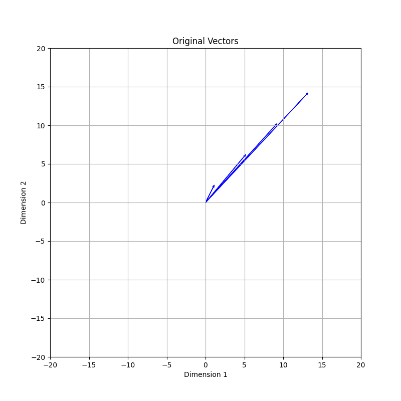
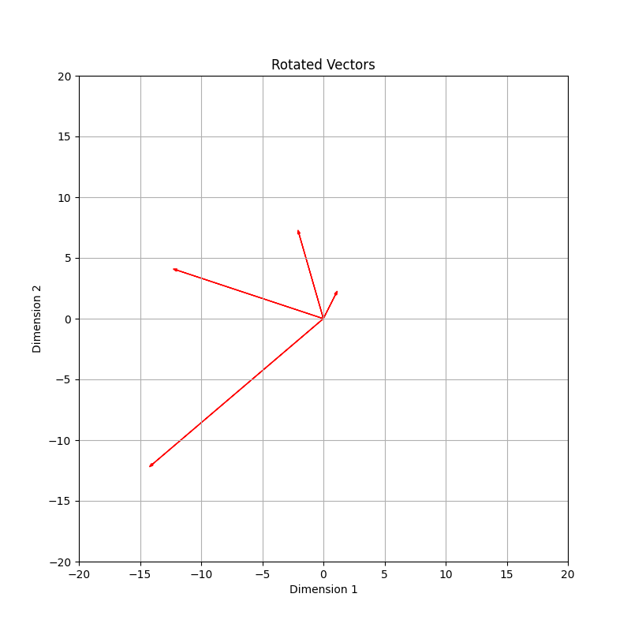
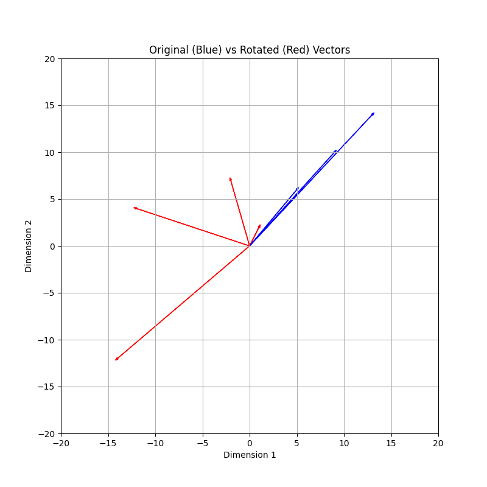
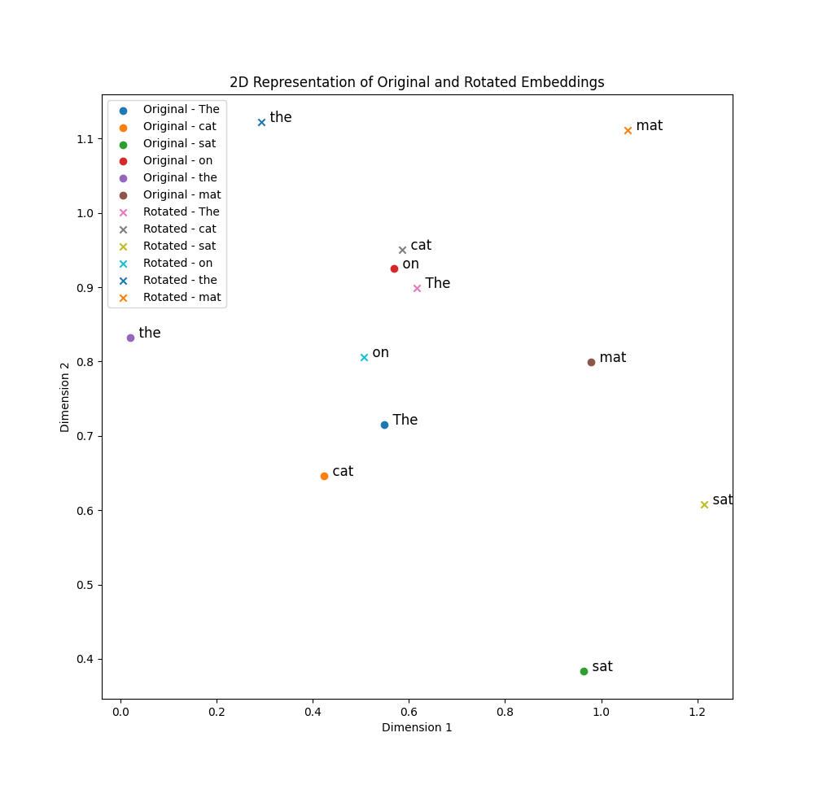

## Rotary Positional Embeddings (RoPE)
This is a type of positional encoding which is used in PaML, GPT-Neo and GPT-J,
and LLAMA (1 & 2).

I've written about positional encoding in
[positional-encoding.md](positional-encoding.md) which discussed absolute
positional embeddings.

There is an issue with absolute positional embeddings which is that after the
model has been trained on a certain sequence length, it will not be able to
handle longer sequence lengths very well, if at all. The intuition here is that
if we imagine the input embeddings being vectors being moved around according
to the sinusoidal functions (sine and cosine) then the vectors (think of them
as 2d vectors) will move around without any pattern to them. The llm will not
be able to see a pattern in this but instead learn that the positions are the
way they are. If we then try to add more tokens to the input the llm will not
be able to handle this very well. It is kinda like memorizing the answers to
exam questions instead of actually learning the material. You might do alright
on the exam (the context length you trained on) but if you get a question that
is not exactly the same as the ones you memorized you will not be able to
answer it.

The goal here is the same, to introduce positional encoding but instead of
adding this to the embeddings it will add them to the query and key matrices by
rotating them. The idea is to make the dot product of the query and key vectors
position-aware, encoding the relative positions of tokens into the attention
mechanism.

Lets take the following sequence "Dan loves ice".
```console
Input: "Dan loves ice"
Tokens: [Dan, loves, ice] -> indices [0, 1, 2]
Embeddings: matrix:
Row 0: Dan                  (but these would be embedding factors of some size)
Row 1: loves
Row 2: ice
```
So lets say the the embedding matrix is `inp_emb`
We multiply a learned weight matrix, `W_q`, to get the query matrix:
```
query = wq * inp_emb
```
And we do the same for the key matrix:
```
key = wk * inp_emb
```
Let's focus on the vector for "loves" (Position 1). We have a query vector loves
and a key vector loves.
Lets imaging the query vector like this with 6 dimensions:
```
query = [x1, y1, x2, y2, x3, y3]
```
RoPE will treat this as three pairs.
For Token 1:
```
("loves"):
Pair 1 (x1, y1): Rotates by 1 * theta_fast   (e.g., 10 degrees).
Pair 2 (x2, y2): Rotates by 1 * theta_medium (e.g., 1 degree).
Pair 3 (x3, y3): Rotates by 1 * theta_slow   (e.g., 0.1 degrees).
```
For Token 2:
```
("ice"):
Pair 1 (x1, y1): Rotates by 2 * theta_fast   (e.g., 20 degrees).
Pair 2 (x2, y2): Rotates by 2 * theta_medium (e.g., 2 degrees).
Pair 3 (x3, y3): Rotates by 2 * theta_slow   (e.g., 0.2 degrees).
```
Now, the attention mechanism calculates the similarity (dot product) between
"ice" (Query at pos 2) and "loves" (Key at pos 1).

To understand why we can group values into pairs without breaking the model,
think of the high-dimensional query or key as a single vector pointing to a
location in the hidden vector space.

We can visualize this vector as a sum of subvectors (pairs). To get to the final
tip of the query vector, you follow the path of these subvectors. When we apply
RoPE, we are simply rotating each subvector segment on its own 2D plane before
adding them up.

The length of the total vector stays the same.
The tip moves to a new location, effectively 'tagging' the original meaning with
a positional coordinate.

And recall that we rotate both the query and key vectors by the same logic, so
their relative angles stay the same.

The dot product sums up the overlaps of these pairs.
```
Pair 1 overlap: Depends on the angle difference (20  - 10  = 10).
Pair 2 overlap: Depends on the angle difference (2   - 1   = 1).
Pair 3 overlap: Depends on the angle difference (0.2 - 0.1 = 0.1).
```
Notice that the absolute positions (1 and 2) are gone. The result only depends
on the relative distance ($2 - 1 = 1$).

This seemed a bit strange as I have a mental model of the attention mechanism
where I think of the vectors as arrows in the embedding space. But we can also
view the attention like this:
```
q = [q_0, q_1, q_2, q_3]
k = [k_0, k_1, k_2, k_3]
```
So normally we would calculate the dot product like this:
```
attention_score = q_0 * k_0 + q_1 * k_1 + q_2 * k_2 + q_3 * k_3
```
But we could also view this as:
```
attention_score = (q_0 * k_0 + q_1 * k_1) + (q_2 * k_2 + q_3 * k_3)
```
The total attention score is simply the score of Pair 1 plus the score of
Pair 2.
Lets look at one pair, for example the first pair:
```
(q_0 * k_0 + q_1 * k_1)
```
This what it looks like before RoPE, but after RoPE we treat these are complex
numbers:
```
pair score = Magnitude(q) * Magnitude(k) * cos(θpos_diff)
```
The magnitude is how "strong" this feature is. This is not changed by RoPE.
cos(θpos_diff) is the cosine of the angle difference between the query and key
and it the rotation part.

If the relative rotation between two tokens is 0 then they are the same position
, cos(0) = 1 and the attention score is maximized for this pair.

If the relative rotation between two tokens is 90 degrees, they are far apart,
cos(90) = 0, then this pair contributes nothing (we will be multiplying by 0).

If the relative rotation is 180 degrees, they are opposite positions,
cos(180) = -1, then this pair contributes negatively to the attention score.


So a high frequency might mean "I only contribute a high score if we are 0, 5,
or 10 tokens apart.

```
Total Score = (Pair 1 score) + (Pair 2 score) + (Pair 3 score)
```
The model learns to use these slots strategically. It puts "local grammar"
information into the vector slots corresponding to Pair 1 (because those slots
are sensitive to small position changes). It puts "topic" information into the
slots for Pair 3 (because those slots stay stable over long distances).
This is done as part of the Wq and Wk learnt weight matrices. This multiplication
actually moves the embeddings into these different "frequency" slots.

You can think of the W_Q (and W_K) matrix as a sorting machine or a switchboard
operator. Before the multiplication, your input vector (the embedding) is just a
"bag of features."

The multiplication X * W_Q reshuffles and combines these features into the
specific slots that RoPE expects.

The matrix effectively says:
"Okay, I see 'Plural' and 'Noun' features. Those are grammar rules. I need to
move a combination of those into indices 0 and 1 (the Fast Rotation slots) so
they can track immediate neighbors."

"I see 'Cooking' and 'Food' features. Those are topic rules. I need to move those
into indices 126 and 127 (the Slow Rotation slots) so they stay active for the
whole document."

After the multiplication (but before RoPE is applied), your vector is now sorted
by frequency sensitivity.
* The top of the vector contains data that needs to expire quickly (local context).
* The bottom of the vector contains data that needs to last a long time (global context).

When rotating the query and key vectors they are rotated in a certain way that
is not caotic like the absolute positioning. For each position they are rotated
a certain "fixed" amount of degrees (theta).

So the matrix that rope operates on is the one that has been sorted by
frequency sensitivity by the Wq and Wk matrices. The rotations in rope are
fixed.

Rotation:
```
 [cos(θ) -sin(θ)]          θ = theta, the angle
 [sin(θ)  cos(θ)]
```
Rotating a vector does not change the length of the vector, it only changes the
direction of the vector.

 

Overlapping orginal and rotated vectors:


Notice that the first vector in the origin is not visable in this last image but
you can see it in the first image. And notice that the lenghts of the vectors
are the same, only the angles are different.

In the attention mechanism of transformers, the similarity between tokens is
computed as the dot product of their query and key vectors. Normally, without
positional encoding, this similarity only reflects the content of the tokens.
With RoPE, the similarity becomes a function of both content and relative
position.

In RoPE each dimension is rotated by a different angle which is a function of
both the position in the sequence and the dimension. So the angle encodes the
position information. So the formula for the angle needs take the position
index into account.

So a rotation is applied to each dimension of the query and key vectors. These
are then used to calculate the attention scores. The attention scores now have
taken the positional information into account.

The rotation is done pairwise, for example (dᵢ, dᵢ₊₁) where dᵢ is the dimension
and dᵢ₊₁ is the next dimension. It is like we are doing two dimensional rotations
for each entry in the query/key matrices.
We apply the rotation like we saw above:
```
 [cos(θp, i) -sin(θp, i)]          θ = theta, the angle
 [sin(θp, i)  cos(θp, i)]
```
Where `θp, i` is the rotation angle for the i-th dimension pair and p is the
position in the sequence.

The angle is calculated as follows:
```
θp,i = p x w^i
```
Where `w` is a constant which determines how much the angle changes with each
dimension. `i` is the dimension pair (index?) and `p` is the position in the
sequence.


Let say we have the following sentence:
```
The cat sat on the mat.
```
And lets say we have two dimensions in our embedding space. We can then imaging
`Cat` is a vector. And lets say we have the word `cat` somewhere in the vector
space as well. Now, in our sentence the word `cat` is the second word so this
would be a separate vector only rotated by a certain amount. If the word comes
even later in the sentence the vector would be rotated even more.

The following image shows the relative positional embeddings for the sentence
above with the original word vectors and the rotated word vectors:



So the original points are the vectors for the words as if we were not using
any rotations at all. Then the rotated points are the vectors for the words
to show how they have been rotated for this specific sentence.

Now, even if we added words to the start of the sentence or to the end of the
sentence, when we look at 'cat' and 'sat' they will still have the same angle
theta between them. So the relative position of the words is still the same. So
this gives us both positional endcoding and relative positional encoding in a
single type of embedding technique instead two separate techniques.


```
                ^-2(i-1)
Θ = { θᵢ = 10000 ------- ,  i ∈ {1, 2, ..., d/2 }
                    d
```
So, upper-case theta is a set of angles where each angle is calculated as
10000 raised to the power of -2(i-1). Notice that this is a set of pairs, we
have d/2 and we rotate each pair. `i` is the index of the pair, ranging from
1 - d/2.
The angles are then used in generating rotations matrices for positional
encodings.

`d` is the dimension of the embedding space, which for llama would be 4096.
10000 is a constant base used in the computation of angles. In llama.cpp this
is a parameter named `freq_base` I think.
```
θ₀ = 10000^(-2(0-1))/4096
   = 10000^(2/4096)
   = 10000^(2/4096)
   = 10000^(0.00048828125)
   = 1.004507364
```
And then if we do a few more using
[rope-rotations.py](../../fundamentals/python/src/rope-rotations.py)]:
```
1.0045073642544624
1.0
0.9955128609158502
0.9910458562488609
0.9865988956531019
0.9821718891880378
0.9777647473167089
0.9733773809039202
0.9690097012144389
0.9646616199111993
```

The rotation is angle-based and dimension-specific, meaning that pairs of
features (dimensions) within each token's embedding vector are rotated by
specific angles

Like if I have the sentence "Dan loves icecream", That might be tokenized in to
[2223, 25, 883, 10033] and some embeddings which might looks like this:
```
2223 : [1 2 3 4 5 6 7 8]
25   : [9 8 7 6 5 4 3 2]
883  : [1 2 3 4 5 6 7 8]
10033: [9 8 7 6 5 4 3 2]
```
The rotation will be applied for each pair for features in the embeddings and
the same rotation will be applied for the same positions of the embedddings:
```
        r1    r2    r3    r4
2223 : [1 2] [3 4] [5 6] [7 8]
25   : [9 8] [7 6] [5 4] [3 2]
883  : [1 2] [3 4] [5 6] [7 8]
10033: [9 8] [7 6] [5 4] [3 2]
        i=0   i=1   i=2   i=3
```
Now, we also want to take the position of the token embeddings in the sequence
into account and this is done by...

```
〔f_q(Xₘ, m), f_k(Xₙ, n)〕 = g(xₘ, xₙ, m-n)
```
〔〕is supposed to be angle brackets to indicate the dot product of two vectors
The vectors are the output of the functions `f_q` and `f_k`. And recall that
the dot product measures the similarity between the vectors. 
`f_q(Xₘ, m)` is the query vector for the m-th token in the sequence and
`f_k(Xₙ, n)` is the key vector for the n-th token in the sequence.
`g(xₘ, xₙ, m-n)` is a function that takes the embeddings of the query and key
embeddings, and as the third argument the relative position distance between the
two tokens. 

The expression `<f_q(Xₘ, m), f_k(Xₙ, n)> = g(xₘ, xₙ, m-n)` conveys that the
similarity between the query representation of a token at position m and the key
representation of a token at position n can be understood or represented as a
function of their respective embeddings and their relative positions (m-n).

```
f_q(Xₘ, m)
```
Just to clarify this `f_q` is a function that takes a "row" from the query
matrix. Each row in this matrix represents an token in the sequence. So Xₘ is
passing in one for these rows:
```
m₀    2223 : [1 2 3 4 5 6 7 8]
m₁    25   : [9 8 7 6 5 4 3 2]
m₂    883  : [1 2 3 4 5 6 7 8]
m₃    10033: [9 8 7 6 5 4 3 2]
```
And m is the position of that token in the sequence. So for a concrete example:
```
f_q([1 2 3 4 5 6 7 8], 2)
```

```
f_q(Xₘ, m) = (W_q xₘ)e^(imθ)
```

Where `W_q` is the query weight matrix, `xₘ` is the m-th row of the query matrix,
and `θ` is the rotation angle for the m-th position.
So, we take the W_q matrix and multiply it with the m-th row of the query matrix:
```
     W_q                  x₂
 [1 2 3 4 5 6 7 8]       [0]   [x₀]
 [1 2 3 4 5 6 7 8]       [1]   [x₁]
 [1 2 3 4 5 6 7 8]       [2]   [x₂]
 [1 2 3 4 5 6 7 8]       [3] = [x₃]
 [1 2 3 4 5 6 7 8]       [4]   [x₄]
 [1 2 3 4 5 6 7 8]       [5]   [x₅]
 [1 2 3 4 5 6 7 8]       [6]   [x₆]
 [1 2 3 4 5 6 7 8]       [7]   [x₇]
      8x8                8x1  
```
What happens then is not that we are raising the resulting vector elements to
e^imθ but instead we are applying a transformation which involved complex
numbers. Think of this as taking pairs of elements and rotating them, and how
much is determined by their position in the sequence and theta.

Recall that Euler's formula is:
```
e^iΘ = cos(Θ) + i sin(Θ)
```
But what does that mean? Well, it means that we can represent complex numbers
as a combination of a real part and an imaginary part. The real part is the
cosine part and the imaginary part is the sine part. So, if we have a complex
number `a + bi` we can represent it as `r(cos(θ) + i sin(θ))` where `r` is the
magnitude of the complex number and `θ` is the angle of the complex number.

And just to clarify this for myself, we can have a variable like m in the
exponentiation:
```
e^imΘ = cos(m * Θ) + i sin(m * Θ)
```
So in this case `m` is scaling the angle theta before calculating the cosine and
sine of the angle.

We can rewrite the above formula as
```
Original:
f_q(Xₘ, m) = (W_q xₘ)e^(imθ)

Rewritten:
f_q(Xₘ, m) = (W_q xₘ) (cos(m * θ) + i sin(m * θ))

m is the position of the token in the sequence.
θ is the rotation angle for the m-th position.
```

Each element of the output vector is just a number, think of it as a number
on the number line (or x-axis). It is not a vector so we can't rotate it.
What we are going to do is take pairs of elements of the output vector and use
one as the real number and one as the imaginary part of a complex number, which
we can rotate.

Lets take the first pair:
```
                            y 

 [x₀]  => (x₀, x₁)          ^
 [x₁]                       |
                            |
                        x₁  |--------*
                            |        |
                            |        |
                            +---------->  x
                                     x₀ 
```
And this would be a vector from the origin to the point (x₀, x₁). And we can
also represent this as a complex number:
```
z = x₀ + i x₁
```
Now, we want to rotate the above vector by an angle θ. We can do this by:
```
z * e^iθ
```
Which can be rewritten as:
```
z * (cos(θ) + i sin(θ))
```
And if we expand z we get:
```
(x₀ + i x₁) * (cos(θ) + i sin(θ))
```
This will result in a new vector in the complex plane, which is a rotation of
the original vector. The real part of this will give use the new x₀ coordinate,
and the imaginary part will give us the new x₁ coordinate.

Multipliying these two complex numbers, the first is the vector in the complex
plane, and the second is the rotation operation, which gives us:
```
[complex vector] * [rotation] = [rotated complex vector]

(x₀ + ix₁) * (cos(θ) + i sin(θ))
```
We can expand that to the following terms when we distribute:
```
x₀ * cos(θ)
x₀ * i sin(θ)
ix₁ * cos(θ)
ix₁ * i sin(θ)
```
And we can apply the multiplication:
```
x₀ * cos(θ)    = x₀ cos(θ)                                Real part
x₀ * i sin(θ)  = ix₀ sin(θ)                               Imaginary part
ix₁ * cos(θ)   = ix₁ cos(θ)                               Imaginary part
ix₁ * i sin(θ) = i²x₁ sin(θ) = -x₁ sin(θ)       (i² = -1) Real part
                              (-1x₁ sin(θ))
```
We can combine the real and imaginary parts to get the new vector:
```
[ real part         ]   [ imaginary part       ]

x₀ cos(θ) - x₁ sin(θ) + i(x₀ sin(θ) + x₁ cos(θ))

[  new_x₀           ]    [  new_x₁              ]
```
The result of the rotation for this pair will be:
```
   [new_x₀]    [x₀ cos(θ) - x₁ sin(θ)]
   [new_x₁]    [x₀ sin(θ) + x₁ cos(θ)]
```
And this is done for all pairs in the output vector.

Notice the we can represent the rotation as a matrix by taking out the x₀ and
x₁:
```
 [x₀ cos(θ) - x₁ sin(θ)]
 [x₀ sin(θ) + x₁ cos(θ)]

 [cos(θ) -sin(θ)]  [x₀]
 [sin(θ)  cos(θ)]  [x₁]
```
And theta is taken from the set of angles we calculated earlier (I think):
```
                ^-2(i-1)
Θ = { θᵢ = 10000 ------- ,  i ∈ {1, 2, ..., d/2 }
                    d
```
Now, I think that 10000 is the `base_freq` parameter in llama.cpp and perhaps
that -2 is the `freq_scale`.

### Position Interpolation (PI)
Is an extension of RoPE which allows for the model to handle longer sequences.
This is a way to squeeze larger context lengths into the length that the model
was trained on. Instead of extending the position indices beyond the range the
model was trained on, PI interpolates the positional embeddings for the new
positions.
PI introdues a scaling factor 's':
```
     L'
s =  --
     L

L' = the new longer context lenght.
L  = the original context length.

                 L'
m' = m * s = m * --
                 L

m  = any position in the token embedding sequence.

For example:
L  = 1024
L' = 2048
m  = 500
m  = 500 * 2048/1024 = 250
```

So the modified RoPE function becomes:
```
                mL'
f'(x, m) = f(x, ---)
                 L
```
The scaling introduced by Position Interpolation (PI) is applied directly to the
position index `𝑚`` before calling the original Rotary Position Embedding (RoPE)
function.
Doing this for all positions can make the cause the positions that are close to
each other (where the frequency is high) to be "crowded" and can effect the
attention calculation.

### NTK (Neural Tangent Kernel) Interpolation
Addresses the crowding issue of PI and instead of scaling all positions it
divides the range into groups which can have _different_ scaling factors. This
method aims to preserve more of the high-frequency information that can be lost
with uniform scaling.
My understanding is the NTK interpolation allows a different scaling factor for
lower dimensions (higher frequences) and one for higher dimension (lower
frequencies).

Al least in LongRope NTK uses two groups:
1.  A low-frequency group for shorter positions (smaller scaling factor).
2.  A high-frequency group for longer positions (larger scaling factor).

### YaRN (Yet another RoPE ExtensioN method)
Is also an extention of RoPE and builds upon the NTK idea as well.

The notation that the YaRN paper uses is a bit different from the one I have
used above:
```
f'w(x_m, m, Θ_d) = fw(x_m, g(m), h(Θ_d))
```
So the function `fw` is parameterized by W (W for weights). You can think of
this as a field/member of a struct/class that this function (f) is also a member
of. The other parameters as the input to the function. `x_m` is an embedding for a
token in the sequence. `m` is that tokens position in the sequence. And 'Θ_d' is
the set of angles for the dimensions of the embedding space.

For PI the function becomes:
```
g(m) = m/s
h(Θ_d) = Θ_d

s = L'/L
L' = extended context length
L  = original context length
```

YaRN introduces a new parameter lambda (λ) which is defined as:
```
      2Π     
λ_d = --- = 2Π b^(2d/|D|)
      Θ_d

Θ_d = the rotation angle for the d-th dimension.
b   = the base frequency.
|D| = the total number of dimensions in the embedding space.
```
The wavelength λ_d specifies how far along the sequence of input tokens we need
to go before the positional embedding for a particular dimension repeats.

'Θ_d' Each dimension in the embedding space has its own value for 'Θ_d'.

Lets try to understand this a little better. Take the following table that
tries to show the values for λ_d=4
```
Token postiion  λ_d      Rotation Angle (radians)  Rotation angle (degrees)
0               4        0                         0
1               4        π/2                       90
2               4        π                         180
3               4        3π/2                      270
4               4        2π   (same as 0)          360 (same as 0)
5               4        5π/2 (same as π/2)        450 (same as 90)                     
6               4        3π   (same as π)          540 (same as 180)
7               4        7π/2 (same as 3π/2)       630 (same as 270)
8               4        4π   (same as 0)          720 (same as 0)
9               4        9π/2 (same as π/2)        810 (same as 90)
```
Notice that after a full cycle (2π) the rotation angle is reset to 0 so there
are only 4 unique values for the rotation angle. Recall that sine/cosine are
cycles (think of the unit circle) and go around more than a complete cycle we
will land on the same positions (same angle rotation).

So the model will only be able to distinguish between 4 different tokens
positions for this dimension. Recall that Θ_d is the rotation angle for a
specific dimension, and after 4 tokens the this rotation angle will repeat so
at most the model will be able to distinguish between 4 tokens apart or something
like that.

And also notice that this dimension could be identified by asking for the
dimension where the number of a full rotation is 4.

The positional encoding allows the model to recognize patterns and relationships
within each span of 4 tokens uniquely. However, beyond this span, the same
values repeat, providing a way to capture periodic structures.

```
         emb₀ emb₁  emb₂  emb₃  emb₄
token₀: 
token₁:
token₂:
token₃:
token₄:
...
```
Each embedding has its own theta, namely Θ_d. And recall that each embedding
is/represents a feature. So every feature has a rotation angle.
```
         Θ₀   Θ₁    Θ₂    Θ₃    Θ₄
token₀: 
token₁:
token₂:
token₃:
token₄:
...
```
In YaRN every dimension can have a λ_d value which specifies how many tokens
that can be rotated before the cycle repeats. So if we have a λ_d value of 4
then the rotation angle will repeat every 4 tokens. There will be 4 unique
rotations.

```
Sequence: "Dan loves ice cream"

                    Θ₁
token₀ (Dan)        sin(0)=0, cos(0)=1
token₁ (loves)      sin(π/2)=1, cos(π/2)=0
token₂ (ice)        sin(π)=0, cos(π)=-1
token₃ (cream)      sin(3π/2)=-1, cos(3π/2)=0

token₄ (Dan)        sin(2π)=0, cos(2π)=1 (same as token₀)
token₅ (loves)      sin(5π/2)=1, cos(5π/2)=0 (same as token₁)
token₆ (ice)        sin(3π)=0, cos(3π)=-1 (same as token₂)
token₇ (cream)      sin(7π/2)=-1, cos(7π/2)=0 (same as token₃)
```
Now, keep in mind that each dimension represents a feature of some kind that
the model has learned. But keep in mind that we are only dealing with positional
encodings here so when a rotation angle repeats it does so for a this specific
dimension and each dimension has its own lambda value.

#### NTK-by-parts:
In PI and NTK-aware interpolation all RoPE demensions are scaled by the same
factor. On thing that was observed is that for a given context lenght L there
were dimensions that end up with a wavelength greater than the max context
length seen during training (lambda_d > L).

They also mention in the YaRN paper that when streching the RoPE dimensions
by either a scale 's' or by changing the base frequency 'b' all tokens become
closer to each other.
To address these issues they choose not to interpolate the higher frequencies
at all, while always interpolating the lower frequencies.
* if the wavelenght λ_d is much smaller than the context size L no interpolation
  is done.
* if the wavelenght λ_d is much larger, or equal, than the context size L the
  dimension is interpolated (not extrapolated).
* for dimensions in between the two above they do a bit of both, simlar token
  NTK-aware?

So there is a need to distinguish between when we don't interpolate and where
we do interpolate, and the range inbetween where we do a bit of both.

The rotation for a specific dimension is determined by:
```
         L          L
r(d) =  --- =  -----------
        λ_d     2Πb'^(2d/|D|)
```

They introduce two extra parameters `α` and `β` which are used to determine 
these ranges.
Where rd(d) < `α` we linearly interpolate by the scale `s` (same as PI).
Where rd(d) > `β` we don't interpolate at all (use 1).
```
y(r) = {0,      if r < α
        1,      if r > β
        r - a
        ------,  otherwise
        β - a
```

NTK-by-parts:
```
f'w(x_m, m, Θ_d) = fw(x_m, g(m), h(Θ_d))

                       Θ_d
h(Θ_d) = (1 - y(r(d))) --- + y(r(d)) Θ_d
                        s

y     = gamma symbol
Θ_d/s = the interpolated value.
Θ_d   = the extrapolated value.
```


### Theta calculation
The values of theta are per embedding dimension and are calculated as follows:
```
θ_j = 10000^-2j/d
```
Notice that this value, only theta does not depend on the position of the token
embedding in the sequence, it only depends on the dimension of the embedding.
`d` is the size of the embedding space divided by 2, so this is operating on
pairs of dimentions. So if we have an embedding space of 1024 dimensions, then
`d` would be 512. This means that if we know the size of the embedding space we
can pre-calculate the values of theta for each dimension.

Lets look at the first 10 values:
```
--- Dimensions 0-10 ---
theta_0: 1.036633
theta_1: 1.000000
theta_2: 0.964662
theta_3: 0.930572
theta_4: 0.897687
theta_5: 0.865964
theta_6: 0.835363
theta_7: 0.805842
theta_8: 0.777365
theta_9: 0.749894
```
So the values start of around 1 and then decrease as we go along the dimensions.
This will cause the earlier rotations to have longer "wavelengths" and thus lower
frequencies.

And then the last 10 values:
```
--- Dimensions 502-512 ---
theta_502: 0.0000000148550802
theta_503: 0.0000000143301257
theta_504: 0.0000000138237223
theta_505: 0.0000000133352143
theta_506: 0.0000000128639694
theta_507: 0.0000000124093776
theta_508: 0.0000000119708503
theta_509: 0.0000000115478198
theta_510: 0.0000000111397386
theta_511: 0.0000000107460783
```
And notice that these values are smaller and will therefor have shorter
"wavelengths" and thus higher frequencies.

If we look at the graph for this we will see something like this:

[image: rope-theta.png]

Now, to make this more concrete lets look at `theta_2`.
Recall that we have a rotation matrix that looks like this:
```
Rotation matrix: [cos(θ_i * p) -sin(θ_i * p)]
                 [sin(θ_i * p)  cos(θ_i * p)]

p = position in the sequence.

p = 1:
theta_2 = 0.964662

For p = 1    [cos(0.964662 * 1) -sin(0.964662 * 1)]
             [sin(0.964662 * 1)  cos(0.964662 * 1)]

For p = 2    [cos(0.964662 * 2) -sin(0.964662 * 2)]
             [sin(0.964662 * 2)  cos(0.964662 * 2)]
```
Now recall that we have an input sequence of token embeddings. Each token
embedding has a position in the input sequence, and is a vector of a certain
dimension. The grouping is of the dimensions of the embedding vector.

So, for `theta_2` we apply the same theta value but we multiply it by the
token embedding position.

```
Rotation matrix: [cos(θ_i * p) -sin(θ_i * p)]
                 [sin(θ_i * p)  cos(θ_i * p)]

v = [v₁, v₂]
[cos(θ_i * p) -sin(θ_i * p)] [v₁] = [v₁ cos(θ_i * p) - v₂ sin(θ_i * p)]
[sin(θ_i * p)  cos(θ_i * p)] [v₂]   [v₁ sin(θ_i * p) + v₂ cos(θ_i * p)]
```

Lets recap the process...We have token embeddings which describe the semantic
meaning of the tokens. So tokens that are simliar will be closer to each other.
By rotating these vectors (token embeddings) differently based on their position
in the sequence, RoPE modifies their direction slightly but distinctively. This
rotation does not fundamentally change the proximity of vectors with similar
meanings but adds a layer of positional nuance to them.
When embeddings are rotated by RoPE, the dot product between two embeddings now
captures not only their semantic similarity but also their relative positions.
The rotation ensures that even semantically identical tokens are distinguished
by their positions in the sequence.
During training, the model learns to interpret these rotations as indicators of
sequence structure. 

Where `i` is the index of the embedding dimension, and `d` is the total number
of dimensions in the embedding space.

Notice that the position 'p' is used above in the rotation matrix and depending
on the context length the model was trained on there will be a certain range
where the model is trained to handle. If we exceed this range the model might
not produce good results.


#### beta_fast and beta_slow (blending)
Imagine a model trained up to a context length of 512 tokens, and you wish to
extend its capabilities to handle up to 1024 tokens. A blending range might be
set from 400 to 600 tokens. In this range:

Positions closer to 400 would use predominantly interpolated embeddings, as
they're closer to the trained range. As positions move towards 600, there's an
increasing reliance on extrapolated embeddings.
Beyond 600 tokens, the model uses purely extrapolated embeddings for positional
information.
The parameters beta_fast and beta_slow control the blending of interpolated and
extrapolated embeddings.


### LongRope (Long Range RoPE)
Is an extension of RoPE that builds upon YaRN. In YaRN we have three groups or
ranges of embedding dimensions that are scaled differently. Those ranges are
configurable and set manually but picking values that work well in practice.
LongRope introduces a way to search for the optimal ranges of embedding
dimension scaling values. So each position embedding dimension will get its own
rescaling factor which will be learned and not set manually. So these values
would be a metadata value of the model (in config.json for example).

If we take a look at the model configuration file (config.json) for
[Phi-3-mini-128k-instruct](https://huggingface.co/microsoft/Phi-3-mini-128k-instruct/blob/main/config.json#L27)
we can see the following:
```
"rope_scaling": {
    "long_factor": [
      1.0700000524520874,
      1.1200000047683716,
      1.149999976158142,
      1.4199999570846558,
      1.5699999332427979,
      1.7999999523162842,
      2.129999876022339,
      2.129999876022339,
      3.009999990463257,
      5.910000324249268,
      6.950000286102295,
      9.070000648498535,
      9.930000305175781,
      10.710000038146973,
      11.130000114440918,
      14.609999656677246,
      ...
      64.12435150146484,
      64.15435028076172,
      64.19435119628906,
      64.24435424804688,
      64.57435607910156,
      64.69000244140625,
      64.76000213623047
    ],
    "short_factor": [
      1.1,
      1.1,
      1.1,
      1.3000000000000003,
      1.3500000000000003,
      2.0500000000000007,
      ...
      2.799999999999998,
      2.8999999999999977,
      3.049999999999997
    ],
      "type": "longrope"
  },
```
There are two lists and in total 96 values for position embedding rotation
values.
When a model like this is converted into GGUF format these two lists will become
tensors in the .gguf file:
```console
$ ./inspect-model.sh models/Phi-3.1-mini-128k-instruct-Q2_K.gguf 
INFO:gguf-dump:* Loading: models/Phi-3.1-mini-128k-instruct-Q2_K.gguf
* File is LITTLE endian, script is running on a LITTLE endian host.
* Dumping 43 key/value pair(s)
      1: UINT32     |        1 | GGUF.version = 3
      2: UINT64     |        1 | GGUF.tensor_count = 197
      3: UINT64     |        1 | GGUF.kv_count = 40
      4: STRING     |        1 | general.architecture = 'phi3'
      5: STRING     |        1 | general.type = 'model'
      6: STRING     |        1 | general.name = 'Phi 3 Mini 128k Instruct'
      7: STRING     |        1 | general.finetune = '128k-instruct'
      8: STRING     |        1 | general.basename = 'Phi-3'
      9: STRING     |        1 | general.size_label = 'mini'
     10: STRING     |        1 | general.license = 'mit'
     11: STRING     |        1 | general.license.link = 'https://huggingface.co/microsoft/Phi-3-mini-128k-instruct/re'
     12: [STRING]   |        3 | general.tags
     13: [STRING]   |        1 | general.languages
     14: UINT32     |        1 | phi3.context_length = 131072
     15: UINT32     |        1 | phi3.rope.scaling.original_context_length = 4096
     16: UINT32     |        1 | phi3.embedding_length = 3072
     17: UINT32     |        1 | phi3.feed_forward_length = 8192
     18: UINT32     |        1 | phi3.block_count = 32
     19: UINT32     |        1 | phi3.attention.head_count = 32
     20: UINT32     |        1 | phi3.attention.head_count_kv = 32
     21: FLOAT32    |        1 | phi3.attention.layer_norm_rms_epsilon = 9.999999747378752e-06
     22: UINT32     |        1 | phi3.rope.dimension_count = 96
     23: FLOAT32    |        1 | phi3.rope.freq_base = 10000.0
     24: UINT32     |        1 | general.file_type = 10
     25: UINT32     |        1 | phi3.attention.sliding_window = 262144
     26: FLOAT32    |        1 | phi3.rope.scaling.attn_factor = 1.190238118171692
     27: STRING     |        1 | tokenizer.ggml.model = 'llama'
     28: STRING     |        1 | tokenizer.ggml.pre = 'default'
     29: [STRING]   |    32064 | tokenizer.ggml.tokens
     30: [FLOAT32]  |    32064 | tokenizer.ggml.scores
     31: [INT32]    |    32064 | tokenizer.ggml.token_type
     32: UINT32     |        1 | tokenizer.ggml.bos_token_id = 1
     33: UINT32     |        1 | tokenizer.ggml.eos_token_id = 32000
     34: UINT32     |        1 | tokenizer.ggml.unknown_token_id = 0
     35: UINT32     |        1 | tokenizer.ggml.padding_token_id = 32000
     36: BOOL       |        1 | tokenizer.ggml.add_bos_token = False
     37: BOOL       |        1 | tokenizer.ggml.add_eos_token = False
     38: STRING     |        1 | tokenizer.chat_template = "{% if message['role'] == 'syste"
     39: UINT32     |        1 | general.quantization_version = 2
     40: STRING     |        1 | quantize.imatrix.file = '/models_out/Phi-3.1-mini-128k-instruct-GGUF/Phi-3.1-mini-128'
     41: STRING     |        1 | quantize.imatrix.dataset = '/training_dir/calibration_datav3.txt'
     42: INT32      |        1 | quantize.imatrix.entries_count = 128
     43: INT32      |        1 | quantize.imatrix.chunks_count = 151
* Dumping 197 tensor(s)
      1:   98500608 |  3072, 32064,     1,     1 | Q2_K    | token_embd.weight
    ...
    196:         48 |    48,     1,     1,     1 | F32     | rope_factors_long.weight
    197:         48 |    48,     1,     1,     1 | F32     | rope_factors_short.weight
```
