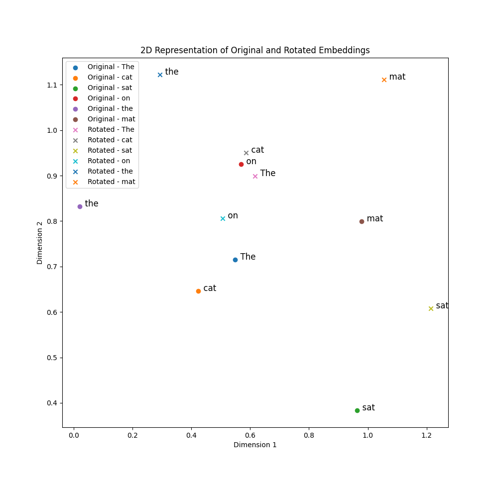

## Rotary Positional Embeddings (RoPE)
This is a type of positional encoding which is used in PaML, GPT-Neo and GPT-J,
and LLAMA (1 & 2).

I've written about positional encoding in
[positional-encoding.md](positional-encoding.md) which discussed absolute
positional embeddings. The goal here is the same, to introduce encode position
into the embeddings.

We can also have relative positional embeddings where we try to encode the
distance between tokens.

Let say we have the following sentence:
```
The cat sat on the mat.
```
And lets say we have two dimensions in our embedding space. We can then imaging
`Cat` is a vector. And lets say we have the word `cat` somewhere in the vector
space as well. Now, in our sentence the word `cat` is the second word so this
would be a separate vector only rotated by a certain amount. If the word comes
even later in the sentence the vector would be rotated even more.

The following image shows the relative positional embeddings for the sentence
above with the original word vectors and the rotated word vectors:



So the original points are the vectors for the words as if we were not using
any rotations at all. Then the rotated points are the vectors for the words
to show how they have been rotated for this specific sentence.

Now, even if we adding words to the start of the sentence or to the end of the
sentence, we we look at 'cat' and 'sat' they will still have the same angle
theta between them. So the relative position of the words is still the same. So
this gives us both positional endcoding and relative positional encoding in a
single type of embedding technique instead two separate techniques.

