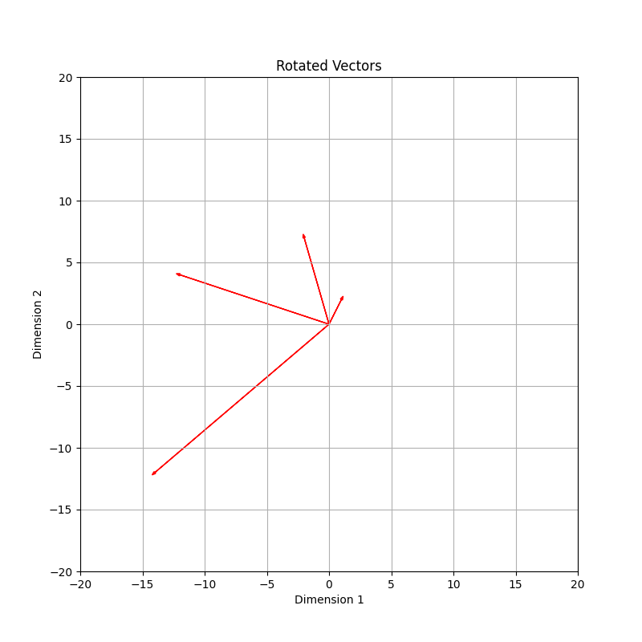
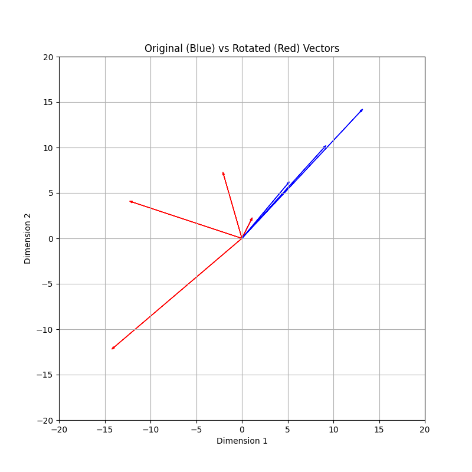

## Rotary Positional Embeddings (RoPE)
This is a type of positional encoding which is used in PaML, GPT-Neo and GPT-J,
and LLAMA (1 & 2).

I've written about positional encoding in
[positional-encoding.md](positional-encoding.md) which discussed absolute
positional embeddings.

There is an issue with absolute positional embeddings which is that after the
model has been trained on a certain sequence length, it will not be able to
handle longer sequence lengths very well, if at all. The intuition here is that
if we imagine the input embeddings being vectors being moved around according
to the sinusoidal functions (sine and cosine) then the vectors (think of them
as 2d vectors) will move around without any pattern to them. The llm will not
be able to see a pattern in this but instead learn that the positions are the
way they are. If wee then try to add more tokens to the input the llm will not
be able to handle this very well. It is kinda like memorizing the answers to
exam questions instead of actually learning the material. You might do alright
on the exam (the context length you trained on) but if you get a question that
is not exactly the same as the ones you memorized you will not be able to
answer it.

The goal here is the same, to introduce encode position but instead of adding
this to the embeddings it will add them to the query and key matrices by
rotating them. The idea is to make the dot product of the query
and key vectors position-aware, encoding the relative positions of tokens into
the attention mechanism.

When rotating the query and key vectors they are rotated in a certain way that
is not caotic like the absolute poisitioning. For each position they are
rotated a certain "fixes" amount of degrees (theta).

Rotation:
```
 [cos(θ) -sin(θ)]          θ = theta, the angle
 [sin(θ)  cos(θ)]
```
Rotating a vector does not change the length of the vector, it only changes the
direction of the vector.

 

Overlapping orginal and rotated vectors:


Notice that the first vector in the origin is not visable in this last image but
you can see it in the first image. And notice that the lenghts of the vectors
are the same, only the angles are different.

In the attention mechanism of transformers, the similarity between tokens is
computed as the dot product of their query and key vectors. Normally, without
positional encoding, this similarity only reflects the content of the tokens.
With RoPE, the similarity becomes a function of both content and relative
position.

In RoPE each dimension is rotated by a different angle which is a function of
both the position in the sequence and the dimension. So the angle encodes the
position information. So the forumal for the angle needs take the position
index into account.

So a rotation is applied to each dimension of the query and key vectors. These
are then used to calculate the attention scores. The attention scores now have
taken the positional information into account.

The rotation is done pairwise, for example (dᵢ, dᵢ₊₁) where dᵢ is the dimension
and dᵢ₊₁ is the next dimension. It is like we are doing two dimensional rotations
for each entry in the query/key matrices.
We apply the rotation like we saw above:
```
 [cos(θp, i) -sin(θp, i)]          θ = theta, the angle
 [sin(θp, i)  cos(θp, i)]
```
Where `θp, i` is the rotation angle for the i-th dimension pair and p is the
position in the sequence.

The angle is calculated as follows:
```
θp,i = p x w^i
```
Where `w` is a constant which determines how much the angle changes with each
dimension. `i` is the dimension pair (index?) and `p` is the position in the
sequence.


Let say we have the following sentence:
```
The cat sat on the mat.
```
And lets say we have two dimensions in our embedding space. We can then imaging
`Cat` is a vector. And lets say we have the word `cat` somewhere in the vector
space as well. Now, in our sentence the word `cat` is the second word so this
would be a separate vector only rotated by a certain amount. If the word comes
even later in the sentence the vector would be rotated even more.

The following image shows the relative positional embeddings for the sentence
above with the original word vectors and the rotated word vectors:


So the original points are the vectors for the words as if we were not using
any rotations at all. Then the rotated points are the vectors for the words
to show how they have been rotated for this specific sentence.

Now, even if we adding words to the start of the sentence or to the end of the
sentence, we we look at 'cat' and 'sat' they will still have the same angle
theta between them. So the relative position of the words is still the same. So
this gives us both positional endcoding and relative positional encoding in a
single type of embedding technique instead two separate techniques.

