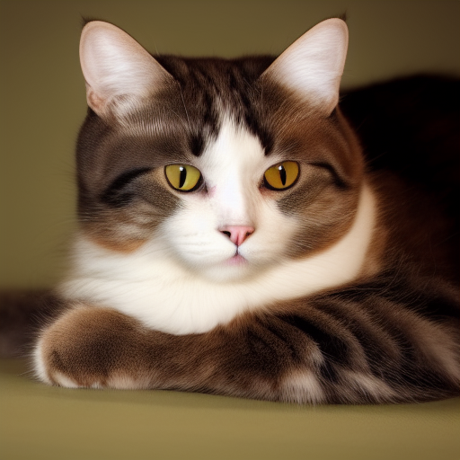

## Stable Diffusion
This page is about running stable diffusion locally using stable-diffusion.cpp.

### Installation
```console
$ git clone --recursive git@github.com:leejet/stable-diffusion.cpp.git
$ cd stable-diffusion.cpp
$ mkdir build && cd build
$ source ~/work/ai/learning-ai/fundamentals/llama.cpp/cuda-env.sh 
$ $ cmake .. -DSD_CUBLAS=ON
$ cmake --build . --config Release
```
Download a model:
```console
$ curl -L -O https://huggingface.co/CompVis/stable-diffusion-v-1-4-original/resolve/main/sd-v1-4.ckpt --output models/sd-v1-4.ckpt
```

### Image Generation
The executable is named `sd`.
```console
$ ./build/bin/sd --model models/sd-v1-4.ckpt -p "a lovely cat"
ggml_init_cublas: GGML_CUDA_FORCE_MMQ:   no
ggml_init_cublas: CUDA_USE_TENSOR_CORES: yes
ggml_init_cublas: found 1 CUDA devices:
  Device 0: NVIDIA GeForce RTX 4070, compute capability 8.9, VMM: yes
[INFO ] stable-diffusion.cpp:141  - loading model from 'models/sd-v1-4.ckpt'
[INFO ] model.cpp:648  - load models/sd-v1-4.ckpt using checkpoint format
[INFO ] stable-diffusion.cpp:169  - Stable Diffusion 1.x 
[INFO ] stable-diffusion.cpp:175  - Stable Diffusion weight type: f32
[INFO ] stable-diffusion.cpp:272  - total memory buffer size = 2731.59MB (clip 473.89MB, unet 2159.24MB, vae 98.47MB)
[INFO ] stable-diffusion.cpp:278  - loading model from 'models/sd-v1-4.ckpt' completed, taking 11.90s
[INFO ] stable-diffusion.cpp:292  - running in eps-prediction mode
[INFO ] stable-diffusion.cpp:1233 - apply_loras completed, taking 0.00s
[INFO ] stable-diffusion.cpp:1272 - get_learned_condition completed, taking 1687 ms
[INFO ] stable-diffusion.cpp:1288 - sampling using Euler A method
[INFO ] stable-diffusion.cpp:1292 - generating image: 1/1 - seed 42
  |==================================================| 20/20 - 6.41it/s
[INFO ] stable-diffusion.cpp:1304 - sampling completed, taking 3.26s
[INFO ] stable-diffusion.cpp:1312 - generating 1 latent images completed, taking 3.26s
[INFO ] stable-diffusion.cpp:1314 - decoding 1 latents
[INFO ] stable-diffusion.cpp:1324 - latent 1 decoded, taking 0.40s
[INFO ] stable-diffusion.cpp:1328 - decode_first_stage completed, taking 0.40s
[INFO ] stable-diffusion.cpp:1345 - txt2img completed in 5.34s
save result image to 'output.png'
```
The output image looks like this:




### Stable Diffusion 3.0
Paper: https://arxiv.org/pdf/2403.03206.pdf
