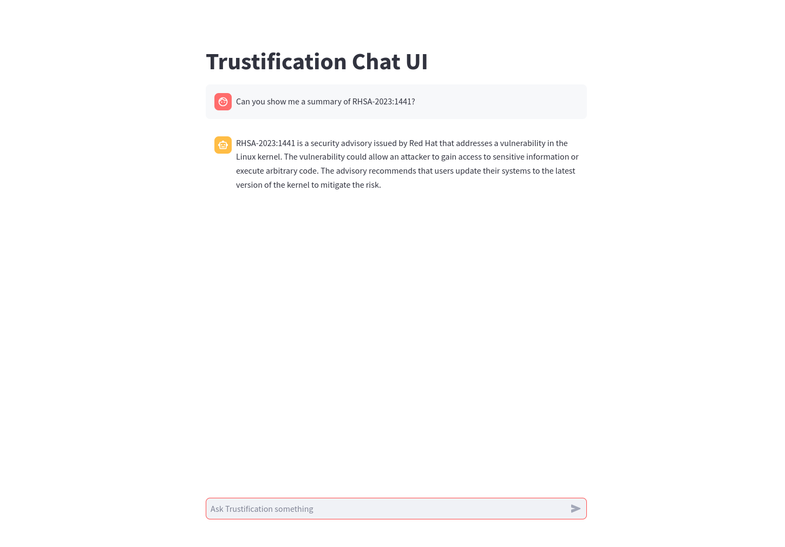
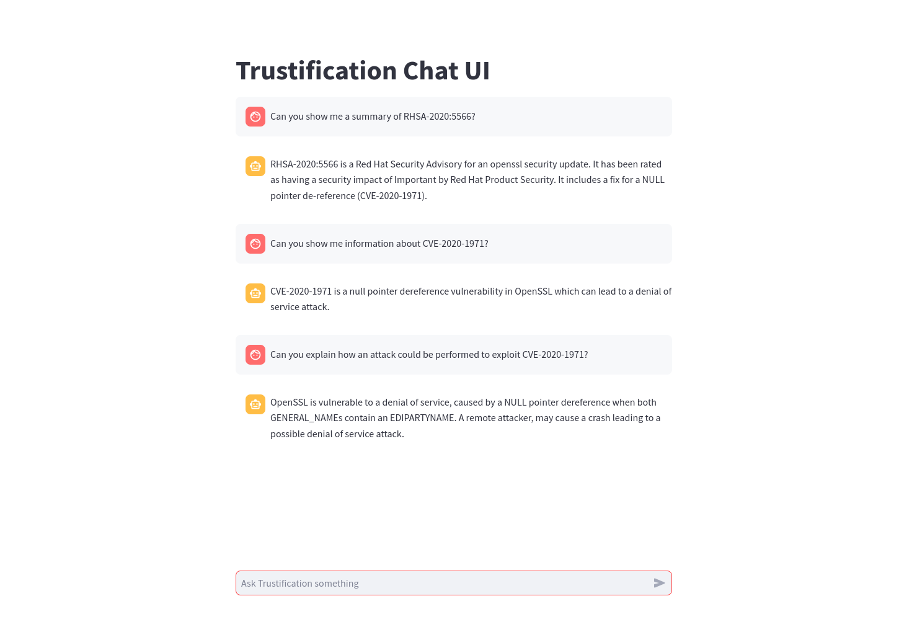
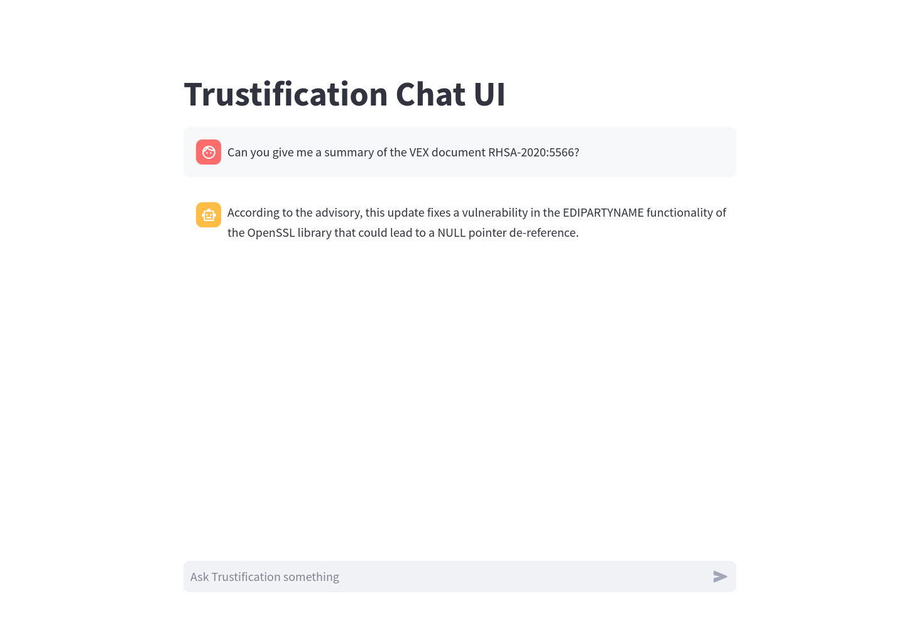
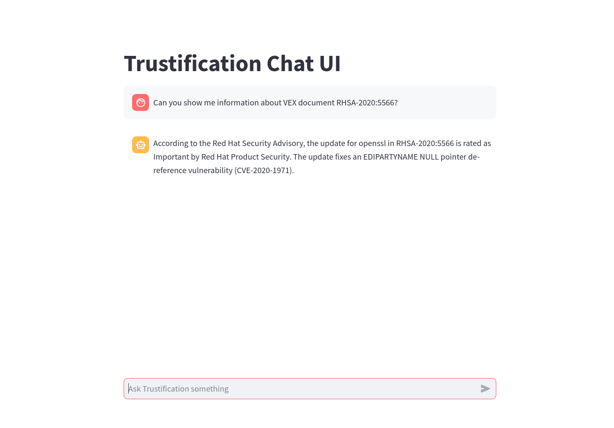

## AI/ML Investigation for Trustification
This task is about investigating the use of AI/ML for trustification and see if
there are ways to add value using AI/ML for trustification.

The suggestions in this document are just that, suggestions, and some might not
make sense or be feasible. This more of a brainstorming document.

### Vector database for VEX documents
Currently the trustification application/ui enables users to store SBOMs and
VEX (Vulnerability Exchange) documents in a database and then query the database
for vulnerabilities.

So in this case the user needs to manually know about what vulnerabilities or
what packages they use in their application to be able to query the database.

What if we took the VEX documents, or parts of them, and stored then in a vector
database:
```
                         Vector space
       +-----------------------------------------------+ 
       |                                 v₁            |
       |                                               |
       |        V₂                                     |
       |                 V₃                            |
       |                                               |
       |                                               |
       |                                               |
       +-----------------------------------------------+ 
                                            
                                           
V₁ = VEX for CVE-1
Vₛ = VEX for CVE-2
V₃ = VEX for CVE-3
```
And we could then take the package name and version of a project dependency and
create vector embeddings for them and use that to search for VEX related (near):
```
                         Vector space
       +-----------------------------------------------+ 
       |                                 v₁            |
       |                                  p₁           |
       |                                  ↑            |
       |                                  |            |
       |                                  |            |
       |                                  |            |
       |                                  |            |
       +----------------------------------|------------+ 
                                          | 
                                          |
V₁ = VEX for CVE-1234                     |
p₁ = Search for product name and version: +
```
Searching for vulnerabilities would then be a matter of finding the closest
vector in the vector database to the vector of the package name and version.
Just as an example to experiment with this idea there is
[vex.py](../../embeddings/python/src/vex.py). 

This example is just creating embeddings and computing the distance between
them. It does not use a vector database. But it could be a starting point for
experimenting with this idea and vector databases have more features like
filtering and such and might be worth looking into.

By using a vector database and having the information in it we could use this in
combination with an LLM to first query the vector database for documents
relative to the query and then pass them along to an LLM as context so that a
task/query agains the LLM can use that information. This way it would be
possible for the LLM to "have knowledge" about the vulnerabilities in our vector
database which it would not have access to otherwise. This concept is shown in
[github-search.py](../../langchain/src/github-search.py) but in this case
the example uses documents from github repository as the document source.
I believe that term for this model is
[Retrieval Augmented Generation (RAG)](./../rag.md).

What is the benefit of this?   
The motivation would be that we might then be able to extract all the
dependencies of a project from whatever build system, or package information
exists and provide a list of vulnerabilities for the project.

By using a vector database it can be updated with new VEX documents as they
become available.

### Use a language model to generate a vulnerability report/summary
Similar to the previous suggestion, but instead of detecting vulnerabilities
we could use a language model to generate a vulnerability report. 

There can be a lot of information in a VEX document, and in the documents that
it references. What might be possible is to fetch this related data and pass
that to an LLM which can then generate a summary. This summary could then 
be displayed in the trustification UI.

This report could be provided in the users preferred language as well by
instructing the LLM to do so (would require the llm to have been trained on that
language I think).

As an initial investigation into this,
[vex-search.py](../../langchain/src/vex-search.py) takes a single VEX documents
and inserts it into an in-memory vector database. It will then use LangChain
to ask an LLM to generate a summary for the vulnerability using a question like
this:
```
"Summaries RHSA-2020:5566 using a short sentence, including a list of CVE's and references."
```
LangChain will first query the vector database for related documents and then
pass those to the LLM as context. The LLM will then generate a summary for the
vulnerability:
```console
(langch) $ python src/vex-search.py 
splits len: 8, type: <class 'langchain.schema.document.Document'>
Answer:
RHSA-2020:5566 is a Red Hat Security Advisory that provides a security update for OpenSSL in Red Hat Enterprise Linux 7. The update is rated as having an important security impact. The advisory includes a Common Vulnerability Scoring System (CVSS) base score for each vulnerability, which can be found in the References section. 

CVEs: 
- CVE-2020-1971
- CVE-2020-1970
- CVE-2020-1968

References:
- Red Hat Security Advisory: https://access.redhat.com/security/data/csaf/v2/advisories/2020/rhsa-2020_5566.json
- Red Hat Errata: https://access.redhat.com/errata/RHSA-2020:5566
- Red Hat Security Updates Classification: https://access.redhat.com/security/updates/classification/#important
- Red Hat Product Security Contact Details: https://access.redhat.com/security/team/contact/
```

This will also report the `source_documents` that were used to generate the summary:
```console
Source documents:
/home/danielbevenius/work/ai/learning-ai/langchain/src/vex-stripped.json
/home/danielbevenius/work/ai/learning-ai/langchain/src/vex-stripped.json
/home/danielbevenius/work/ai/learning-ai/langchain/src/vex-stripped.json
/home/danielbevenius/work/ai/learning-ai/langchain/src/vex-stripped.json
```

So that was a single VEX document, now how about we add some of the CVEs that
are referenced in that VEX to the vector store and see if we can generate a
summary for them:
```console
$ curl -s https://services.nvd.nist.gov/rest/json/cves/2.0?cveId=CVE-2020-1971 > src/cve-2020-1971
$ curl -s https://services.nvd.nist.gov/rest/json/cves/2.0?cveId=CVE-2020-1968 > src/cve-2020-1968
```
I tried adding both of these types of documents to the same vector store but
the results were not good and I'm not sure why. So I created separate vector
store for the CVEs. The process was then to chain the queries by first
performing a query for the VEX document, and then using the CVE that it refers
to to perform a query for the CVE information. This is shown in
[vex-cve.py](../../langchain/src/vex_cve.py). Here we pass in a RHSA number
as a command line argument:
```console
(langch) $ python src/vex_cve.py RHSA-2020:5566

Query: Show a short summary of RHSA-2020:5566, including the cve.
Result: RHSA-2020:5566 is an update for openssl for Red Hat Enterprise Linux 7. It has a security impact of Important and is related to CVE-2020-1971, a NULL pointer de-reference.

Query: Which CVEs were mentioned
Result:  CVE-2020-1971

Query: Show me a detailed description of  CVE-2020-1971.
Result:  CVE-2020-1971 is a vulnerability in the TLS specification which can lead to an attacker being able to compute the pre-master secret in connections which have used a Diffie-Hellman (DH) based ciphersuite. In such a case this would result in the attacker being able to eavesdrop on all encrypted communications sent over that TLS connection. The attack can only be exploited if an implementation re-uses a DH secret across multiple TLS connections. Note that this issue only impacts DH ciphersuites and not ECDH ciphersuites.
```
I'm using OpenAI for these examples which means that they require an API key.
You can sign up and get a free trail period with token credits. The
[pricing](https://openai.com/pricing#language-models) is based on the number
of tokens used and it is possible to buy credits. I bought $10 worth of credits
and I'm still using not used up half of them yet.

The above is using RAG with a vector store to first retrieve the context to be
sent to the LLM. There is also the option to use Knowledge Graphs Promting (KGP)
which can more accurate in retrieving the correct contex. I'm going to read
up a little about this and see if it could be useful in our case. 

### Use a language model to generate suggestions fixing vulnerabilities
The idea here would be that we gather information about the vulnerability
and craft a prompt to get an LLM to generate suggestions for how to fix the
reported vulnerability.

### Measure of confidence of software projects
* Recent github activity
* Release number >= 1.0
* Number of github stars?
* Signed commits?
* End of support date validation
* End of life date validation
* [OpenSSF Scorecard](https://securityscorecards.dev/#what-is-openssf-scorecard)

This might be possible to do by first collecting this information from a 
github repository and then creating a prompt which can classify this as
a secure project.

So we would create a prompt template, something like this:
```
Categorise the following project based on the
number of stars, and the number of commits. The more starts and
commits the better the project is likely to be.

stars: {stars}
commits: {commits}
```
We could then populate it with the information we have collected, and then
and ask an LLM to classify it as a secure project or not.  As an example
[project-health.py](../../langchain/src/project-health.py) is something along
these lines.
```console
(langch) $ python src/project-health.py 
https://api.github.com/repos/danbev/learning-v8 has 2300 stars and 30 commits

"Going to prompt chatgpt (gpt-3.5-turbo-0301)"
content='This project has a high number of stars but a low number of commits, which suggests that it may have gained popularity but may not be actively maintained or developed.' additional_kwargs={} example=False
```

As an example of the OpenSSF scorecard, I ran this against the
trustification repository:
<details>
<summary> OpenSSF scorecard </summary>

```console
$ /home/danielbevenius/go/scorecard --repo=github.com/trustification/trustification
Starting [Pinned-Dependencies]
Starting [Dangerous-Workflow]
Starting [License]
Starting [Fuzzing]
Starting [Security-Policy]
Starting [Vulnerabilities]
Starting [Code-Review]
Starting [Branch-Protection]
Starting [Token-Permissions]
Starting [Dependency-Update-Tool]
Starting [Binary-Artifacts]
Starting [Contributors]
Starting [SAST]
Starting [Packaging]
Starting [CI-Tests]
Starting [CII-Best-Practices]
Starting [Maintained]
Starting [Signed-Releases]
Finished [Security-Policy]
Finished [Vulnerabilities]
Finished [Code-Review]
Finished [Branch-Protection]
Finished [Token-Permissions]
Finished [Dependency-Update-Tool]
Finished [Binary-Artifacts]
Finished [Contributors]
Finished [SAST]
Finished [Packaging]
Finished [CI-Tests]
Finished [CII-Best-Practices]
Finished [Maintained]
Finished [Signed-Releases]
Finished [Pinned-Dependencies]
Finished [Dangerous-Workflow]
Finished [License]
Finished [Fuzzing]

RESULTS
-------
Aggregate score: 4.7 / 10

Check scores:
|---------|------------------------|--------------------------------|-----------------------------------------------------------------------------------------------------------------------|
|  SCORE  |          NAME          |             REASON             |                                               DOCUMENTATION/REMEDIATION                                               |
|---------|------------------------|--------------------------------|-----------------------------------------------------------------------------------------------------------------------|
| 10 / 10 | Binary-Artifacts       | no binaries found in the repo  | https://github.com/ossf/scorecard/blob/7ed886f1bd917d19cb9d6ce6c10e80e81fa31c39/docs/checks.md#binary-artifacts       |
|---------|------------------------|--------------------------------|-----------------------------------------------------------------------------------------------------------------------|
| 2 / 10  | Branch-Protection      | branch protection is not       | https://github.com/ossf/scorecard/blob/7ed886f1bd917d19cb9d6ce6c10e80e81fa31c39/docs/checks.md#branch-protection      |
|         |                        | maximal on development and all |                                                                                                                       |
|         |                        | release branches               |                                                                                                                       |
|---------|------------------------|--------------------------------|-----------------------------------------------------------------------------------------------------------------------|
| 10 / 10 | CI-Tests               | 14 out of 14 merged PRs        | https://github.com/ossf/scorecard/blob/7ed886f1bd917d19cb9d6ce6c10e80e81fa31c39/docs/checks.md#ci-tests               |
|         |                        | checked by a CI test -- score  |                                                                                                                       |
|         |                        | normalized to 10               |                                                                                                                       |
|---------|------------------------|--------------------------------|-----------------------------------------------------------------------------------------------------------------------|
| 0 / 10  | CII-Best-Practices     | no effort to earn an OpenSSF   | https://github.com/ossf/scorecard/blob/7ed886f1bd917d19cb9d6ce6c10e80e81fa31c39/docs/checks.md#cii-best-practices     |
|         |                        | best practices badge detected  |                                                                                                                       |
|---------|------------------------|--------------------------------|-----------------------------------------------------------------------------------------------------------------------|
| 7 / 10  | Code-Review            | found 4 unreviewed changesets  | https://github.com/ossf/scorecard/blob/7ed886f1bd917d19cb9d6ce6c10e80e81fa31c39/docs/checks.md#code-review            |
|         |                        | out of 16 -- score normalized  |                                                                                                                       |
|         |                        | to 7                           |                                                                                                                       |
|---------|------------------------|--------------------------------|-----------------------------------------------------------------------------------------------------------------------|
| 10 / 10 | Contributors           | 25 different organizations     | https://github.com/ossf/scorecard/blob/7ed886f1bd917d19cb9d6ce6c10e80e81fa31c39/docs/checks.md#contributors           |
|         |                        | found -- score normalized to   |                                                                                                                       |
|         |                        | 10                             |                                                                                                                       |
|---------|------------------------|--------------------------------|-----------------------------------------------------------------------------------------------------------------------|
| 10 / 10 | Dangerous-Workflow     | no dangerous workflow patterns | https://github.com/ossf/scorecard/blob/7ed886f1bd917d19cb9d6ce6c10e80e81fa31c39/docs/checks.md#dangerous-workflow     |
|         |                        | detected                       |                                                                                                                       |
|---------|------------------------|--------------------------------|-----------------------------------------------------------------------------------------------------------------------|
| 0 / 10  | Dependency-Update-Tool | no update tool detected        | https://github.com/ossf/scorecard/blob/7ed886f1bd917d19cb9d6ce6c10e80e81fa31c39/docs/checks.md#dependency-update-tool |
|---------|------------------------|--------------------------------|-----------------------------------------------------------------------------------------------------------------------|
| 0 / 10  | Fuzzing                | project is not fuzzed          | https://github.com/ossf/scorecard/blob/7ed886f1bd917d19cb9d6ce6c10e80e81fa31c39/docs/checks.md#fuzzing                |
|---------|------------------------|--------------------------------|-----------------------------------------------------------------------------------------------------------------------|
| 10 / 10 | License                | license file detected          | https://github.com/ossf/scorecard/blob/7ed886f1bd917d19cb9d6ce6c10e80e81fa31c39/docs/checks.md#license                |
|---------|------------------------|--------------------------------|-----------------------------------------------------------------------------------------------------------------------|
| 10 / 10 | Maintained             | 30 commit(s) out of 30 and 30  | https://github.com/ossf/scorecard/blob/7ed886f1bd917d19cb9d6ce6c10e80e81fa31c39/docs/checks.md#maintained             |
|         |                        | issue activity out of 30 found |                                                                                                                       |
|         |                        | in the last 90 days -- score   |                                                                                                                       |
|         |                        | normalized to 10               |                                                                                                                       |
|---------|------------------------|--------------------------------|-----------------------------------------------------------------------------------------------------------------------|
| ?       | Packaging              | no published package detected  | https://github.com/ossf/scorecard/blob/7ed886f1bd917d19cb9d6ce6c10e80e81fa31c39/docs/checks.md#packaging              |
|---------|------------------------|--------------------------------|-----------------------------------------------------------------------------------------------------------------------|
| 3 / 10  | Pinned-Dependencies    | dependency not pinned by hash  | https://github.com/ossf/scorecard/blob/7ed886f1bd917d19cb9d6ce6c10e80e81fa31c39/docs/checks.md#pinned-dependencies    |
|         |                        | detected -- score normalized   |                                                                                                                       |
|         |                        | to 3                           |                                                                                                                       |
|---------|------------------------|--------------------------------|-----------------------------------------------------------------------------------------------------------------------|
| 0 / 10  | SAST                   | SAST tool is not run on all    | https://github.com/ossf/scorecard/blob/7ed886f1bd917d19cb9d6ce6c10e80e81fa31c39/docs/checks.md#sast                   |
|         |                        | commits -- score normalized to |                                                                                                                       |
|         |                        | 0                              |                                                                                                                       |
|---------|------------------------|--------------------------------|-----------------------------------------------------------------------------------------------------------------------|
| 0 / 10  | Security-Policy        | security policy file not       | https://github.com/ossf/scorecard/blob/7ed886f1bd917d19cb9d6ce6c10e80e81fa31c39/docs/checks.md#security-policy        |
|         |                        | detected                       |                                                                                                                       |
|---------|------------------------|--------------------------------|-----------------------------------------------------------------------------------------------------------------------|
| 8 / 10  | Signed-Releases        | 5 out of 5 artifacts are       | https://github.com/ossf/scorecard/blob/7ed886f1bd917d19cb9d6ce6c10e80e81fa31c39/docs/checks.md#signed-releases        |
|         |                        | signed or have provenance      |                                                                                                                       |
|---------|------------------------|--------------------------------|-----------------------------------------------------------------------------------------------------------------------|
| 0 / 10  | Token-Permissions      | detected GitHub workflow       | https://github.com/ossf/scorecard/blob/7ed886f1bd917d19cb9d6ce6c10e80e81fa31c39/docs/checks.md#token-permissions      |
|         |                        | tokens with excessive          |                                                                                                                       |
|         |                        | permissions                    |                                                                                                                       |
|---------|------------------------|--------------------------------|-----------------------------------------------------------------------------------------------------------------------|
| 0 / 10  | Vulnerabilities        | 17 existing vulnerabilities    | https://github.com/ossf/scorecard/blob/7ed886f1bd917d19cb9d6ce6c10e80e81fa31c39/docs/checks.md#vulnerabilities        |
|         |                        | detected                       |                                                                                                                       |
|---------|------------------------|--------------------------------|-----------------------------------------------------------------------------------------------------------------------|
```
</details>


### Investigate Low-Rank Adaptation (LoRA)
I'd like to do a spike on Low-Rank Adapation [LoRA](./../lora.md) to understand
how it works and what possibilities it might provide. The idea is to take a
pre-trained llm model and then fine-tune it for a specific dataset or tasks.

This does not require the whole model to be re-trained so it is not as time
consuming as training a model from scratch. This could possibly be something
like fine-tuning a model to generate a specific type of reports that we want
for our use case. So what it learns does not have to be new information but it
can also be a new way of presenting information.

I've done some experimentation with LoRA but only followed an example where
the model was fine-tuned for a different dataset. This was a little harder to
experiment with as it requires (or will run very very slowly) a GPU. I used
a Colab Pro account and can use this for further experimentation if we find a
good use case.

### Using ReAct
This is a suggestion where we could use an LLM to reason and act and access
our existing services.

For example, we could create an agent that use tools/expert modules to access
our existing APIs to retrieve information that is specific to our systems.

For example, the following uses the VEX OpenAPI to retrieve VEX documents
when given an advisory ID. It then extracts the CVEs from the VEX document
and returns them. 

```console
(langch) $ python src/agent-trust.py

> Entering new AgentExecutor chain...
Action: api_planner
Action Input: Find the VEX for RHSA-2023:1441 and show the CVEs
Observation: 1. GET /api/v1/vex with a query param to search for RHSA-2023:1441
2. Extract the CVEs from the returned VEX data.
Thought:I'm ready to execute the API calls.
Action: api_controller
Action Input: 1. GET /api/v1/vex with a query param to search for RHSA-2023:1441
2. Extract the CVEs from the returned VEX data.

> Entering new AgentExecutor chain...
I need to make a GET request to the /api/v1/vex endpoint with the advisory parameter set to RHSA-2023:1441. Then, I will extract the CVEs from the response.

Action: requests_get
Action Input: 
{
  "url": "http://localhost:8081/api/v1/vex",
  "params": {
    "advisory": "RHSA-2023:1441"
  },
  "output_instructions": "Extract the CVEs from the response"
}
Observation: The CVE mentioned in the API response is: CVE-2023-0286.
Thought:I have successfully retrieved the CVE from the VEX data.
Final Answer: The CVE associated with the advisory RHSA-2023:1441 is CVE-2023-0286.

> Finished chain.

Observation: The CVE associated with the advisory RHSA-2023:1441 is CVE-2023-0286.
Thought:I am finished executing a plan and have the information the user asked for.
Final Answer: The CVE associated with the advisory RHSA-2023:1441 is CVE-2023-0286.

> Finished chain.
The CVE associated with the advisory RHSA-2023:1441 is CVE-2023-0286.
```
This is only one service added but multiple could be added and as well as
other tools like web searching for example to find information that is not
available in our services, like references in the CVEs.

This is very much a work in progress and an investigation trying to figure out
possible interesting use cases for us.

This could possibly be used in a UI, something along the lines of:



This is actually something the LLM made up is not the actual inforation related
to this advisory. 
After fixing the above issue and trying again making sure that it uses the VEX
tool we have defined we get the following:
```console
$ streamlit run src/trust-chat.py

> Entering new AgentExecutor chain...
Thought: I need to find information related to a VEX using its advisory ID.
Action:
{
  "action": "VEX",
  "action_input": "RHSA-2023:1441"
}
...
  File "/home/danielbevenius/work/ai/learning-ai/langchain/langch/lib64/python3.11/site-packages/openai/api_requestor.py", line 765, in _interpret_response_line
    raise self.handle_error_response(
openai.error.InvalidRequestError: This model's maximum context length is 4097 tokens, however you requested 18967 tokens (18711 in your prompt; 256 for the completion). Please reduce your prompt; or completion length.
```
The returned VEX is simply to large for the model to handle and I don't think
this approach wll work for us. But a combination of a vector store and agents
could work I think where the agent has access to a vector store as a tool for
information retrieval about VEX information. It can then use this to further
reason about the information it has retrieved by sending that as the context
to the LLM. So we would be combining Agent and RAG in this case.

The following is an example where the agent uses the vector store to retrieve
information regarding VEX documents:



Agent console output:
```console
$ streamlit run src/trust-chat.py

> Entering new AgentExecutor chain...
Thought: I need to use the VEX tool to answer this question.
Action:
{
  "action": "VEX",
  "action_input": "RHSA-2020:5566"
}

> Entering new RetrievalQA chain...

> Finished chain.

Observation:  RHSA-2020:5566 is a Red Hat Security Advisory for an openssl security update. It has been rated as having a security impact of Important by Red Hat Product Security. It includes a fix for a NULL pointer de-reference (CVE-2020-1971).
Thought: I now know the final answer
Final Answer: RHSA-2020:5566 is a Red Hat Security Advisory for an openssl security update. It has been rated as having a security impact of Important by Red Hat Product Security. It includes a fix for a NULL pointer de-reference (CVE-2020-1971).

> Finished chain.


> Entering new AgentExecutor chain...
Thought: I need to find information about a CVE
Action:
{
  "action": "google_serper",
  "action_input": "CVE-2020-1971"
}

Observation: This function behaves incorrectly when both GENERAL_NAMEs contain an EDIPARTYNAME. A NULL pointer dereference and a crash may occur leading to a ... The highest threat from this vulnerability is to system availability. A null pointer dereference flaw was found in openssl. A remote attacker, ... The mission of the CVE® Program is to identify, define, and catalog publicly disclosed cybersecurity vulnerabilities. No information is available for this page. · Learn why This function behaves incorrectly when both GENERAL_NAMEs contain an EDIPARTYNAME. A NULL pointer dereference and a crash may occur leading to a possible denial ... The X.509 GeneralName type is a generic type for representing different types of names. One of those name types is known as EDIPartyName. Vulnerability Details. CVEID: CVE-2020-1971. DESCRIPTION: OpenSSL is vulnerable to a denial of service, caused by a NULL pointer dereference ... CVE-2020-1971 Common Vulnerabilities and Exposures. There are vulnerabilities in OpenSSL used by AIX. An attacker may cause a NULL pointer dereference and produce a core file, leading to a possible denial-of-service (DOS) attack. Security ...
Thought: I now know the final answer
Final Answer: CVE-2020-1971 is a null pointer dereference vulnerability in OpenSSL which can lead to a denial of service attack.

> Finished chain.


> Entering new AgentExecutor chain...
Thought: I need to find out more information about CVE-2020-1971
Action:
{
  "action": "google_serper",
  "action_input": "CVE-2020-1971"
}

Observation: This function behaves incorrectly when both GENERAL_NAMEs contain an EDIPARTYNAME. A NULL pointer dereference and a crash may occur leading to a ... The highest threat from this vulnerability is to system availability. A null pointer dereference flaw was found in openssl. A remote attacker, ... The mission of the CVE® Program is to identify, define, and catalog publicly disclosed cybersecurity vulnerabilities. No information is available for this page. · Learn why This function behaves incorrectly when both GENERAL_NAMEs contain an EDIPARTYNAME. A NULL pointer dereference and a crash may occur leading to a possible denial ... The X.509 GeneralName type is a generic type for representing different types of names. One of those name types is known as EDIPartyName. Vulnerability Details. CVEID: CVE-2020-1971. DESCRIPTION: OpenSSL is vulnerable to a denial of service, caused by a NULL pointer dereference ... CVE-2020-1971 Common Vulnerabilities and Exposures. There are vulnerabilities in OpenSSL used by AIX. An attacker may cause a NULL pointer dereference and produce a core file, leading to a possible denial-of-service (DOS) attack. Security ...
Thought: I now know the final answer
Final Answer: OpenSSL is vulnerable to a denial of service, caused by a NULL pointer dereference when both GENERAL_NAMEs contain an EDIPARTYNAME. A remote attacker, may cause a crash leading to a possible denial of service attack.

> Finished chain.
```

This agent also has a tool to perform web searches which it can use for other
questions. We could also add tools similar to the VEX tool but instead works
for SBOMs or other types of information.

This example is using [streamlit](https://streamlit.io/) to create the UI which
is written in Python. This is only for testing and exploration purposes and
if we do decide to pursue one of the approaches we could/would implement this in
Rust.

Here is [demo](./trustification-chat-demo.mkv) of the chat in action.

I've also tried to reproduce this example,
[trust-chat-local.py](../../langchain/src/trust-chat-local.py), running the LLM
locally and CPU-only, using [llama.cpp](https://github.com/ggerganov/llama.cpp).
This is very slow but works and there are some details about how to download
and convert the model in [README.md](../../langchain/README.md).

Below is a screenshot of the chat running locally:



And here is another example with a slightly different question::


This is a very rough demo and it takes minutes to run but it does show that it
can be done and with a GPU it would be much faster. The motivation for this is
not be be able to run locally but to see if it is possible to use this instead
of OpenAI's API on a server somewhere with some decent hardware.

