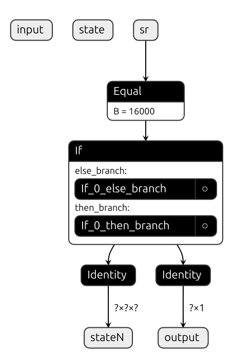

## Voice Activity Detection (VAD)
Also known as as speech activity detection (SAD) or speech detection.

Now, keep in mind that this is different than Automatic Speech Recognition (ASR)
which is the process of converting speech into text. VAD is used to determine
whether a segment of audio contains speech or not. It is often used as a
preprocessing step in ASR systems to filter out non-speech segments and reduce
the amount of data that needs to be processed. So it would be like a preprocessor
of an audio signal to remove silence or non-speech segments.
For example ASR systems may struggle with long periods of silence or noise, and
can output strange results if they are not filtered out.

So VAD should tell speech apart from noise and silence. It could be used in
mobil or IoT devices to detace human speech for example.
So the input is a small audio segment/chunk and the output is a probability
that this chunk contains speech.

### Silero-VAD
github: https://github.com/snakers4/silero-vad

The model that Silero-VAD has is not publicly available yet. I found this
discussion:
https://github.com/snakers4/silero-vad/discussions/371

But they do provide their model in two formats, one PyTorch JIT (Just In Time)
format and one in ONNX format. So we have access to the models, but the actual
PyTorch code for the model does not seem to be available which made it a little
difficult for me to figure out if the whisper.cpp version was correct or not.

To find out more about the model I used a few script like the following:
```console
(venv) $ python src/inspect-jit.py
RecursiveScriptModule(
  original_name=VADRNNJIT
  (stft): RecursiveScriptModule(
    original_name=STFT
    (padding): RecursiveScriptModule(original_name=ReflectionPad1d)
  )
  (encoder): RecursiveScriptModule(
    original_name=Sequential
    (0): RecursiveScriptModule(
      original_name=SileroVadBlock
      (se): RecursiveScriptModule(original_name=Identity)
      (activation): RecursiveScriptModule(original_name=ReLU)
      (reparam_conv): RecursiveScriptModule(original_name=Conv1d)
    )
    (1): RecursiveScriptModule(
      original_name=SileroVadBlock
      (se): RecursiveScriptModule(original_name=Identity)
      (activation): RecursiveScriptModule(original_name=ReLU)
      (reparam_conv): RecursiveScriptModule(original_name=Conv1d)
    )
    (2): RecursiveScriptModule(
      original_name=SileroVadBlock
      (se): RecursiveScriptModule(original_name=Identity)
      (activation): RecursiveScriptModule(original_name=ReLU)
      (reparam_conv): RecursiveScriptModule(original_name=Conv1d)
    )
    (3): RecursiveScriptModule(
      original_name=SileroVadBlock
      (se): RecursiveScriptModule(original_name=Identity)
      (activation): RecursiveScriptModule(original_name=ReLU)
      (reparam_conv): RecursiveScriptModule(original_name=Conv1d)
    )
  )
  (decoder): RecursiveScriptModule(
    original_name=VADDecoderRNNJIT
    (rnn): RecursiveScriptModule(original_name=LSTMCell)
    (decoder): RecursiveScriptModule(
      original_name=Sequential
      (0): RecursiveScriptModule(original_name=Dropout)
      (1): RecursiveScriptModule(original_name=ReLU)
      (2): RecursiveScriptModule(original_name=Conv1d)
      (3): RecursiveScriptModule(original_name=Sigmoid)
    )
  )
)
Module: RecursiveScriptModule
Parameter: _model.encoder.0.reparam_conv.weight, Shape: torch.Size([128, 129, 3])
Parameter: _model.encoder.0.reparam_conv.bias, Shape: torch.Size([128])
Parameter: _model.encoder.1.reparam_conv.weight, Shape: torch.Size([64, 128, 3])
Parameter: _model.encoder.1.reparam_conv.bias, Shape: torch.Size([64])
Parameter: _model.encoder.2.reparam_conv.weight, Shape: torch.Size([64, 64, 3])
Parameter: _model.encoder.2.reparam_conv.bias, Shape: torch.Size([64])
Parameter: _model.encoder.3.reparam_conv.weight, Shape: torch.Size([128, 64, 3])
Parameter: _model.encoder.3.reparam_conv.bias, Shape: torch.Size([128])
Parameter: _model.decoder.rnn.weight_ih, Shape: torch.Size([512, 128])
Parameter: _model.decoder.rnn.weight_hh, Shape: torch.Size([512, 128])
Parameter: _model.decoder.rnn.bias_ih, Shape: torch.Size([512])
Parameter: _model.decoder.rnn.bias_hh, Shape: torch.Size([512])
Parameter: _model.decoder.decoder.2.weight, Shape: torch.Size([1, 128, 1])
Parameter: _model.decoder.decoder.2.bias, Shape: torch.Size([1])
Buffer: _model.stft.forward_basis_buffer, Shape: torch.Size([258, 1, 256])
```
(I've removed the 8kHz model for now as we are not using it).

There is also one that can be used to inspect the onnx model:
```console
(venv) $ python src/inspect-onnx-model.py 
```
This outputs a lot of information but I slimmed it down a little and asked
Claude.ai to help me extract the information I needed. I actually did this
after getting a working python version running, but it was still not producing
probabilities that were close enough to the original. I'm mainly adding this for
completeness and so that I remember to do this next time.

Now, the problem I had was that I could not find a way to print out intermediate
tensor values, like printing the output of the STFT layer or any of the others
to verify that out whisper.cpp implementation was correct or not. I spent a good
chunk of time trying to do so before basically giving up. But I need something
to compare with so by inspecting the model more closely using the same script
as above I was able to get information about each part of the model.
For example in the `_model.stft` we can find:
```console
Transform method code:
def transform_(self,
    input_data: Tensor) -> Tuple[Tensor, Tensor]:
  padding = self.padding
  input_data0 = torch.unsqueeze((padding).forward(input_data, ), 1)
  forward_basis_buffer = self.forward_basis_buffer
  hop_length = self.hop_length
  forward_transform = torch.conv1d(input_data0, forward_basis_buffer, None, [hop_length], [0])
  filter_length = self.filter_length
  _0 = torch.add(torch.div(filter_length, 2), 1)
  cutoff = int(_0)
  _1 = torch.slice(torch.slice(forward_transform), 1, None, cutoff)
  real_part = torch.to(torch.slice(_1, 2), 6)
  _2 = torch.slice(torch.slice(forward_transform), 1, cutoff)
  imag_part = torch.to(torch.slice(_2, 2), 6)
  _3 = torch.add(torch.pow(real_part, 2), torch.pow(imag_part, 2))
  magnitude = torch.sqrt(_3)
  phase = torch.atan2(ops.prim.data(imag_part), ops.prim.data(real_part))
  return (magnitude, phase)

Module: RecursiveScriptModule
Buffer: forward_basis_buffer, Shape: torch.Size([258, 1, 256])
Available methods: ['T_destination', '__call__', 'add_module', 'apply', 'bfloat16', 'buffers', 'call_super_init', 'children', 'code', 'code_with_constants', 'compile', 'cpu', 'cuda', 'define', 'double', 'dump_patches', 'eval', 'extra_repr', 'float', 'forward', 'forward_basis_buffer', 'forward_magic_method', 'get_buffer', 'get_debug_state', 'get_extra_state', 'get_parameter', 'get_submodule', 'graph', 'graph_for', 'half', 'inlined_graph', 'ipu', 'load_state_dict', 'modules', 'mtia', 'named_buffers', 'named_children', 'named_modules', 'named_parameters', 'original_name', 'padding', 'parameters', 'register_backward_hook', 'register_buffer', 'register_forward_hook', 'register_forward_pre_hook', 'register_full_backward_hook', 'register_full_backward_pre_hook', 'register_load_state_dict_post_hook', 'register_load_state_dict_pre_hook', 'register_module', 'register_parameter', 'register_state_dict_post_hook', 'register_state_dict_pre_hook', 'requires_grad_', 'save', 'save_to_buffer', 'set_extra_state', 'set_submodule', 'share_memory', 'state_dict', 'to', 'to_empty', 'train', 'transform_', 'type', 'xpu', 'zero_grad']
Transform method code:
def transform_(self,
    input_data: Tensor) -> Tuple[Tensor, Tensor]:
  padding = self.padding
  input_data0 = torch.unsqueeze((padding).forward(input_data, ), 1)
  forward_basis_buffer = self.forward_basis_buffer
  hop_length = self.hop_length
  forward_transform = torch.conv1d(input_data0, forward_basis_buffer, None, [hop_length], [0])
  filter_length = self.filter_length
  _0 = torch.add(torch.div(filter_length, 2), 1)
  cutoff = int(_0)
  _1 = torch.slice(torch.slice(forward_transform), 1, None, cutoff)
  real_part = torch.to(torch.slice(_1, 2), 6)
  _2 = torch.slice(torch.slice(forward_transform), 1, cutoff)
  imag_part = torch.to(torch.slice(_2, 2), 6)
  _3 = torch.add(torch.pow(real_part, 2), torch.pow(imag_part, 2))
  magnitude = torch.sqrt(_3)
  phase = torch.atan2(ops.prim.data(imag_part), ops.prim.data(real_part))
  return (magnitude, phase)
```
And the gives us enough information to start writing a python model mimicking
the original model.

I also used a profile logger while running the [C++ example](https://github.com/snakers4/silero-vad/tree/master/examples/cpp)
in the silero-vad repository to get more information while running it using
onnx profiler.

I made the following changes to get it to compile and add the profiling:
```console
$ git diff
diff --git a/examples/cpp/silero-vad-onnx.cpp b/examples/cpp/silero-vad-onnx.cpp
index 380d76d..99fb289 100644
--- a/examples/cpp/silero-vad-onnx.cpp
+++ b/examples/cpp/silero-vad-onnx.cpp
@@ -131,7 +131,7 @@ private:
     timestamp_t current_speech;

     // Loads the ONNX model.
-    void init_onnx_model(const std::wstring& model_path) {
+    void init_onnx_model(const std::string& model_path) {
         init_engine_threads(1, 1);
         session = std::make_shared<Ort::Session>(env, model_path.c_str(), session_options);
     }
@@ -303,7 +303,7 @@ public:
 public:
     // Constructor: sets model path, sample rate, window size (ms), and other parameters.
     // The parameters are set to match the Python version.
-    VadIterator(const std::wstring ModelPath,
+    VadIterator(const std::string ModelPath,
         int Sample_rate = 16000, int windows_frame_size = 32,
         float Threshold = 0.5, int min_silence_duration_ms = 100,
         int speech_pad_ms = 30, int min_speech_duration_ms = 250,
@@ -329,7 +329,7 @@ public:

 int main() {
     // Read the WAV file (expects 16000 Hz, mono, PCM).
-    wav::WavReader wav_reader("audio/recorder.wav"); // File located in the "audio" folder.
+    wav::WavReader wav_reader("jfk.wav"); // File located in the "audio" folder.
     int numSamples = wav_reader.num_samples();
     std::vector<float> input_wav(static_cast<size_t>(numSamples));
     for (size_t i = 0; i < static_cast<size_t>(numSamples); i++) {
@@ -337,7 +337,7 @@ int main() {
     }

     // Set the ONNX model path (file located in the "model" folder).
-    std::wstring model_path = L"model/silero_vad.onnx";
+    std::string model_path = "../../src/silero_vad/data/silero_vad.onnx";

     // Initialize the VadIterator.
     VadIterator vad(model_path);
```
And a make file to build and run.
```console
ONNX_PATH=./onnxruntime-linux-x64-1.12.1

build:
	g++ silero-vad-onnx.cpp -I ${ONNX_PATH}/include/ \
		-L ${ONNX_PATH}/lib/ \
		-lonnxruntime \
		-Wl,-rpath,${ONNX_PATH}/lib/ \
		-o test

run: build
	./test
```
Now, this will create files in the current directory and if we inspect it we
can find some information about the shapes and operations, again for example
looking at the STFT layer:
```
20 {"cat" : "Node","pid" :34575,"tid" :34575,"dur" :0,"ts" :59304,"ph" : "X","name" :"If_0_then_branch__Inline_0__/stft/padding/Pad_fence_before","args" : {"op_name" : "Pad"}},
   21 {"cat" : "Node","pid" :34575,"tid" :34575,"dur" :6,"ts" :59304,"ph" : "X","name" :"If_0_then_branch__Inline_0__/stft/padding/Pad_kernel_time","args" : {"thread_scheduling_stats" : "","output_size" : "2560","parameter_size" : "32","activation_size" : "2304","output_t      ype_shape" : [{"float":[1,640]}],"exec_plan_index" : "7","graph_index" : "7","input_type_shape" : [{"float":[1,576]},{"int64":[4]}],"provider" : "CPUExecutionProvider","op_name" : "Pad"}},
   22 {"cat" : "Node","pid" :34575,"tid" :34575,"dur" :0,"ts" :59312,"ph" : "X","name" :"If_0_then_branch__Inline_0__/stft/padding/Pad_fence_after","args" : {"op_name" : "Pad"}},
   23 {"cat" : "Node","pid" :34575,"tid" :34575,"dur" :0,"ts" :59312,"ph" : "X","name" :"If_0_then_branch__Inline_0__/stft/Unsqueeze_fence_before","args" : {"op_name" : "Unsqueeze"}},
   24 {"cat" : "Node","pid" :34575,"tid" :34575,"dur" :2,"ts" :59313,"ph" : "X","name" :"If_0_then_branch__Inline_0__/stft/Unsqueeze_kernel_time","args" : {"thread_scheduling_stats" : "","output_size" : "2560","parameter_size" : "8","activation_size" : "2560","output_type      _shape" : [{"float":[1,1,640]}],"exec_plan_index" : "8","graph_index" : "8","input_type_shape" : [{"float":[1,640]},{"int64":[1]}],"provider" : "CPUExecutionProvider","op_name" : "Unsqueeze"}},
   25 {"cat" : "Node","pid" :34575,"tid" :34575,"dur" :0,"ts" :59317,"ph" : "X","name" :"If_0_then_branch__Inline_0__/stft/Unsqueeze_fence_after","args" : {"op_name" : "Unsqueeze"}},
   26 {"cat" : "Node","pid" :34575,"tid" :34575,"dur" :0,"ts" :59318,"ph" : "X","name" :"If_0_then_branch__Inline_0__/stft/Conv_fence_before","args" : {"op_name" : "Conv"}},
   27 {"cat" : "Node","pid" :34575,"tid" :34575,"dur" :54,"ts" :59318,"ph" : "X","name" :"If_0_then_branch__Inline_0__/stft/Conv_kernel_time","args" : {"thread_scheduling_stats" : "","output_size" : "4128","parameter_size" : "264192","activation_size" : "2560","output_typ      e_shape" : [{"float":[1,258,4]}],"exec_plan_index" : "9","graph_index" : "9","input_type_shape" : [{"float":[1,1,640]},{"float":[258,1,256]}],"provider" : "CPUExecutionProvider","op_name" : "Conv"}},
   28 {"cat" : "Node","pid" :34575,"tid" :34575,"dur" :0,"ts" :59375,"ph" : "X","name" :"If_0_then_branch__Inline_0__/stft/Conv_fence_after","args" : {"op_name" : "Conv"}},
   29 {"cat" : "Node","pid" :34575,"tid" :34575,"dur" :0,"ts" :59376,"ph" : "X","name" :"If_0_then_branch__Inline_0__/stft/Slice_3_fence_before","args" : {"op_name" : "Slice"}},
   30 {"cat" : "Node","pid" :34575,"tid" :34575,"dur" :6,"ts" :59377,"ph" : "X","name" :"If_0_then_branch__Inline_0__/stft/Slice_3_kernel_time","args" : {"thread_scheduling_stats" : "","output_size" : "2064","parameter_size" : "32","activation_size" : "4128","output_type_      shape" : [{"float":[1,129,4]}],"exec_plan_index" : "14","graph_index" : "14","input_type_shape" : [{"float":[1,258,4]},{"int64":[1]},{"int64":[1]},{"int64":[1]},{"int64":[1]}],"provider" : "CPUExecutionProvider","op_name" : "Slice"}},
   31 {"cat" : "Node","pid" :34575,"tid" :34575,"dur" :0,"ts" :59385,"ph" : "X","name" :"If_0_then_branch__Inline_0__/stft/Slice_3_fence_after","args" : {"op_name" : "Slice"}},
   32 {"cat" : "Node","pid" :34575,"tid" :34575,"dur" :0,"ts" :59386,"ph" : "X","name" :"If_0_then_branch__Inline_0__/stft/Pow_1_fence_before","args" : {"op_name" : "Pow"}},
   33 {"cat" : "Node","pid" :34575,"tid" :34575,"dur" :3,"ts" :59386,"ph" : "X","name" :"If_0_then_branch__Inline_0__/stft/Pow_1_kernel_time","args" : {"thread_scheduling_stats" : "","output_size" : "2064","parameter_size" : "4","activation_size" : "2064","output_type_sha      pe" : [{"float":[1,129,4]}],"exec_plan_index" : "18","graph_index" : "18","input_type_shape" : [{"float":[1,129,4]},{"float":[]}],"provider" : "CPUExecutionProvider","op_name" : "Pow"}},
   34 {"cat" : "Node","pid" :34575,"tid" :34575,"dur" :0,"ts" :59391,"ph" : "X","name" :"If_0_then_branch__Inline_0__/stft/Pow_1_fence_after","args" : {"op_name" : "Pow"}},
   35 {"cat" : "Node","pid" :34575,"tid" :34575,"dur" :0,"ts" :59393,"ph" : "X","name" :"If_0_then_branch__Inline_0__/stft/Slice_1_fence_before","args" : {"op_name" : "Slice"}},
   36 {"cat" : "Node","pid" :34575,"tid" :34575,"dur" :3,"ts" :59393,"ph" : "X","name" :"If_0_then_branch__Inline_0__/stft/Slice_1_kernel_time","args" : {"thread_scheduling_stats" : "","output_size" : "2064","parameter_size" : "32","activation_size" : "4128","output_type_      shape" : [{"float":[1,129,4]}],"exec_plan_index" : "11","graph_index" : "11","input_type_shape" : [{"float":[1,258,4]},{"int64":[1]},{"int64":[1]},{"int64":[1]},{"int64":[1]}],"provider" : "CPUExecutionProvider","op_name" : "Slice"}},
   37 {"cat" : "Node","pid" :34575,"tid" :34575,"dur" :0,"ts" :59398,"ph" : "X","name" :"If_0_then_branch__Inline_0__/stft/Slice_1_fence_after","args" : {"op_name" : "Slice"}},
   38 {"cat" : "Node","pid" :34575,"tid" :34575,"dur" :0,"ts" :59399,"ph" : "X","name" :"If_0_then_branch__Inline_0__/stft/Pow_fence_before","args" : {"op_name" : "Pow"}},
   39 {"cat" : "Node","pid" :34575,"tid" :34575,"dur" :2,"ts" :59399,"ph" : "X","name" :"If_0_then_branch__Inline_0__/stft/Pow_kernel_time","args" : {"thread_scheduling_stats" : "","output_size" : "2064","parameter_size" : "4","activation_size" : "2064","output_type_shape      " : [{"float":[1,129,4]}],"exec_plan_index" : "17","graph_index" : "17","input_type_shape" : [{"float":[1,129,4]},{"float":[]}],"provider" : "CPUExecutionProvider","op_name" : "Pow"}},
   40 {"cat" : "Node","pid" :34575,"tid" :34575,"dur" :0,"ts" :59403,"ph" : "X","name" :"If_0_then_branch__Inline_0__/stft/Pow_fence_after","args" : {"op_name" : "Pow"}},
   41 {"cat" : "Node","pid" :34575,"tid" :34575,"dur" :0,"ts" :59404,"ph" : "X","name" :"If_0_then_branch__Inline_0__/stft/Add_fence_before","args" : {"op_name" : "Add"}},
   42 {"cat" : "Node","pid" :34575,"tid" :34575,"dur" :3,"ts" :59404,"ph" : "X","name" :"If_0_then_branch__Inline_0__/stft/Add_kernel_time","args" : {"thread_scheduling_stats" : "","output_size" : "2064","parameter_size" : "0","activation_size" : "4128","output_type_shape      " : [{"float":[1,129,4]}],"exec_plan_index" : "19","graph_index" : "19","input_type_shape" : [{"float":[1,129,4]},{"float":[1,129,4]}],"provider" : "CPUExecutionProvider","op_name" : "Add"}},
   43 {"cat" : "Node","pid" :34575,"tid" :34575,"dur" :0,"ts" :59409,"ph" : "X","name" :"If_0_then_branch__Inline_0__/stft/Add_fence_after","args" : {"op_name" : "Add"}},
   44 {"cat" : "Node","pid" :34575,"tid" :34575,"dur" :0,"ts" :59410,"ph" : "X","name" :"If_0_then_branch__Inline_0__/stft/Sqrt_fence_before","args" : {"op_name" : "Sqrt"}},
   45 {"cat" : "Node","pid" :34575,"tid" :34575,"dur" :6,"ts" :59411,"ph" : "X","name" :"If_0_then_branch__Inline_0__/stft/Sqrt_kernel_time","args" : {"thread_scheduling_stats" : "","output_size" : "2064","parameter_size" : "0","activation_size" : "2064","output_type_shap      e" : [{"float":[1,129,4]}],"exec_plan_index" : "20","graph_index" : "20","input_type_shape" : [{"float":[1,129,4]}],"provider" : "CPUExecutionProvider","op_name" : "Sqrt"}},
```
So with that I created a script to extract the tensors from the JIT model, and
then implement the model in python using torch (this was not as straightforward
as it might sound here). The converted model can be found in
[audio/silero-vad](../audio/silero-vad/src/reverse-eng/).

Using the `jfk.wav` with the original silero-vad model these are the predictions:
```console
$ python src/jfk.py
[0] probability: 0.0120120458
[1] probability: 0.0106779542
[2] probability: 0.1321811974
[3] probability: 0.0654894710
[4] probability: 0.0445981026
[5] probability: 0.0223348271
[6] probability: 0.0260702968
[7] probability: 0.0116709163
[8] probability: 0.0081158215
[9] probability: 0.0067158826
[10] probability: 0.8111256361
[11] probability: 0.9633629322
[12] probability: 0.9310814142
[13] probability: 0.7854600549
[14] probability: 0.8146636486
[15] probability: 0.9672259092
[16] probability: 0.9664794803
[17] probability: 0.9530465603
[18] probability: 0.9773806334
[19] probability: 0.9515406489
[20] probability: 0.9235361218
[21] probability: 0.9561933875
[22] probability: 0.9820070863
[23] probability: 0.9649533629
[24] probability: 0.9486407042
[25] probability: 0.9199727774
[26] probability: 0.8507736921
[27] probability: 0.8281027675
[28] probability: 0.7944886088
[29] probability: 0.8232654929
[30] probability: 0.8295858502
[31] probability: 0.8030185699
[32] probability: 0.9451498985
[33] probability: 0.8949782848
[34] probability: 0.9032012224
[35] probability: 0.9025285244
[36] probability: 0.9016729593
[37] probability: 0.9391839504
[38] probability: 0.9761081338
[39] probability: 0.9765046835
[40] probability: 0.9614208937
[41] probability: 0.8868988156
[42] probability: 0.9054323435
[43] probability: 0.9729118943
[44] probability: 0.9419037700
[45] probability: 0.9301297665
[46] probability: 0.9049455523
[47] probability: 0.9192379713
[48] probability: 0.9463497400
[49] probability: 0.8815279603
[50] probability: 0.8565585017
[51] probability: 0.8562414050
[52] probability: 0.9654588103
[53] probability: 0.9728733301
[54] probability: 0.9644294381
[55] probability: 0.9485635757
[56] probability: 0.9216982722
[57] probability: 0.9331229329
[58] probability: 0.9122018218
[59] probability: 0.8967185020
[60] probability: 0.8226366639
[61] probability: 0.9199765325
[62] probability: 0.9400870204
[63] probability: 0.9173651338
[64] probability: 0.7509807944
[65] probability: 0.9055827856
[66] probability: 0.7457287908
[67] probability: 0.5512428880
[68] probability: 0.3979139328
[69] probability: 0.1968278140
[70] probability: 0.1336449385
[71] probability: 0.0854208618
[72] probability: 0.0512541421
[73] probability: 0.0213614609
[74] probability: 0.0087905023
[75] probability: 0.0050795670
[76] probability: 0.0036360626
[77] probability: 0.0029130245
[78] probability: 0.0062774355
[79] probability: 0.0060164286
[80] probability: 0.0036439903
[81] probability: 0.0020915263
[82] probability: 0.0016147600
[83] probability: 0.0014228907
[84] probability: 0.0012152086
[85] probability: 0.0016399137
[86] probability: 0.0007782626
[87] probability: 0.0012633284
[88] probability: 0.0011245427
[89] probability: 0.0012091363
[90] probability: 0.0024176650
[91] probability: 0.0012052481
[92] probability: 0.0006706595
[93] probability: 0.0004096399
[94] probability: 0.0005879427
[95] probability: 0.0003524663
[96] probability: 0.0006112840
[97] probability: 0.0004331781
[98] probability: 0.0012036999
[99] probability: 0.0004305345
[100] probability: 0.0003728746
[101] probability: 0.0005225370
[102] probability: 0.0181077644
[103] probability: 0.2840053737
[104] probability: 0.4943751991
[105] probability: 0.6032722592
[106] probability: 0.5436841846
[107] probability: 0.5589256883
[108] probability: 0.5062690377
[109] probability: 0.3489521742
[110] probability: 0.2822247148
[111] probability: 0.2502350807
[112] probability: 0.4467811286
[113] probability: 0.8259999156
[114] probability: 0.7331997752
[115] probability: 0.6296291947
[116] probability: 0.3672357500
[117] probability: 0.2370462567
[118] probability: 0.1266799271
[119] probability: 0.0863809213
[120] probability: 0.0577458292
[121] probability: 0.0126561048
[122] probability: 0.0058960663
[123] probability: 0.0066269282
[124] probability: 0.1001239195
[125] probability: 0.2267967612
[126] probability: 0.7768144608
[127] probability: 0.8881686330
[128] probability: 0.8496580720
[129] probability: 0.8128281832
[130] probability: 0.7959909439
[131] probability: 0.7936805487
[132] probability: 0.6849995852
[133] probability: 0.6143192053
[134] probability: 0.6148759723
[135] probability: 0.3155294359
[136] probability: 0.1442092806
[137] probability: 0.0466341823
[138] probability: 0.0278023500
[139] probability: 0.0182217564
[140] probability: 0.0088233612
[141] probability: 0.0095065329
[142] probability: 0.0044769812
[143] probability: 0.0031184589
[144] probability: 0.0016689267
[145] probability: 0.0023460335
[146] probability: 0.0007922960
[147] probability: 0.0028725227
[148] probability: 0.0011672110
[149] probability: 0.0020256110
[150] probability: 0.0020782938
[151] probability: 0.0009769580
[152] probability: 0.0009220199
[153] probability: 0.0024484431
[154] probability: 0.0046779355
[155] probability: 0.0024497141
[156] probability: 0.0018141053
[157] probability: 0.0012290307
[158] probability: 0.0009697533
[159] probability: 0.0011016321
[160] probability: 0.0010593801
[161] probability: 0.0018238472
[162] probability: 0.0009759203
[163] probability: 0.0007066324
[164] probability: 0.0006456191
[165] probability: 0.0013584567
[166] probability: 0.0006583764
[167] probability: 0.0014947796
[168] probability: 0.0012043880
[169] probability: 0.7265451550
[170] probability: 0.8275423646
[171] probability: 0.7977938652
[172] probability: 0.8630424142
[173] probability: 0.8654760718
[174] probability: 0.8103245497
[175] probability: 0.8888602853
[176] probability: 0.8212413788
[177] probability: 0.8759981394
[178] probability: 0.8938365579
[179] probability: 0.9498395920
[180] probability: 0.9528379440
[181] probability: 0.9281737804
[182] probability: 0.9655471444
[183] probability: 0.9308375120
[184] probability: 0.7055628300
[185] probability: 0.7111269236
[186] probability: 0.7741216421
[187] probability: 0.9365538359
[188] probability: 0.9579713345
[189] probability: 0.9543846846
[190] probability: 0.9655930400
[191] probability: 0.9719272852
[192] probability: 0.9262279868
[193] probability: 0.9058678150
[194] probability: 0.9641671181
[195] probability: 0.9669665694
[196] probability: 0.9642478228
[197] probability: 0.9578868747
[198] probability: 0.9696291685
[199] probability: 0.9675853848
[200] probability: 0.9736673832
[201] probability: 0.9782630801
[202] probability: 0.9718350172
[203] probability: 0.9790894389
[204] probability: 0.9796285033
[205] probability: 0.9683827758
[206] probability: 0.9775854349
[207] probability: 0.9806787968
[208] probability: 0.9728345275
[209] probability: 0.9756219387
[210] probability: 0.9809038043
[211] probability: 0.9838793874
[212] probability: 0.9794865847
[213] probability: 0.9755236506
[214] probability: 0.9861546159
[215] probability: 0.9860898256
[216] probability: 0.9652890563
[217] probability: 0.9375467896
[218] probability: 0.8729331493
[219] probability: 0.9602597356
[220] probability: 0.9770282507
[221] probability: 0.9740325809
[222] probability: 0.9711015224
[223] probability: 0.9773187041
[224] probability: 0.9826788902
[225] probability: 0.9807331562
[226] probability: 0.9793297648
[227] probability: 0.9699174166
[228] probability: 0.9644414783
[229] probability: 0.9687068462
[230] probability: 0.9681332111
[231] probability: 0.9577034712
[232] probability: 0.9728902578
[233] probability: 0.9768581390
[234] probability: 0.9660829902
[235] probability: 0.9392179251
[236] probability: 0.8526392579
[237] probability: 0.5641263723
[238] probability: 0.2013247162
[239] probability: 0.1066527665
[240] probability: 0.0310583655
[241] probability: 0.0157215856
[242] probability: 0.0130914506
[243] probability: 0.0044830763
[244] probability: 0.0069351792
[245] probability: 0.0024922192
[246] probability: 0.0027061312
[247] probability: 0.0020019219
[248] probability: 0.0011804849
[249] probability: 0.0020268953
[250] probability: 0.0007212795
[251] probability: 0.0010822940
[252] probability: 0.0006232891
[253] probability: 0.0007668757
[254] probability: 0.0010701693
[255] probability: 0.0008318963
[256] probability: 0.6040052772
[257] probability: 0.8263453245
[258] probability: 0.7968529463
[259] probability: 0.7766568065
[260] probability: 0.7201390862
[261] probability: 0.6486166120
[262] probability: 0.6912519336
[263] probability: 0.8114249706
[264] probability: 0.9494416118
[265] probability: 0.9156619310
[266] probability: 0.8544524908
[267] probability: 0.5401257277
[268] probability: 0.2489332706
[269] probability: 0.2530018091
[270] probability: 0.9610205293
[271] probability: 0.9751768708
[272] probability: 0.9762893319
[273] probability: 0.9723498225
[274] probability: 0.9672072530
[275] probability: 0.9852018952
[276] probability: 0.9831889272
[277] probability: 0.9588776827
[278] probability: 0.9845831394
[279] probability: 0.9928609729
[280] probability: 0.9928285480
[281] probability: 0.9938415289
[282] probability: 0.9930645823
[283] probability: 0.9940449595
[284] probability: 0.9893879890
[285] probability: 0.9955287576
[286] probability: 0.9922802448
[287] probability: 0.9916920662
[288] probability: 0.9911763668
[289] probability: 0.9976255298
[290] probability: 0.9954389930
[291] probability: 0.9819942117
[292] probability: 0.9935252666
[293] probability: 0.9948412776
[294] probability: 0.9961053729
[295] probability: 0.9935407043
[296] probability: 0.9927965999
[297] probability: 0.9935270548
[298] probability: 0.9914484620
[299] probability: 0.9969546795
[300] probability: 0.9937365055
[301] probability: 0.9903761744
[302] probability: 0.9891674519
[303] probability: 0.9745979309
[304] probability: 0.9902220964
[305] probability: 0.9918566942
[306] probability: 0.9890555143
[307] probability: 0.9960351586
[308] probability: 0.9963703156
[309] probability: 0.9965223074
[310] probability: 0.9939389229
[311] probability: 0.9927075505
[312] probability: 0.9939052463
[313] probability: 0.9901870489
[314] probability: 0.9839034081
[315] probability: 0.9867933393
[316] probability: 0.9954883456
[317] probability: 0.9951952100
[318] probability: 0.9929647446
[319] probability: 0.9927020073
[320] probability: 0.9865319133
[321] probability: 0.9708641768
[322] probability: 0.9639129043
[323] probability: 0.9845443368
[324] probability: 0.9337452650
[325] probability: 0.9636278749
[326] probability: 0.9665008783
[327] probability: 0.9497909546
[328] probability: 0.7639142275
[329] probability: 0.4962018728
[330] probability: 0.4612325430
[331] probability: 0.0821653679
[332] probability: 0.0405023694
[333] probability: 0.0188933071
[334] probability: 0.0258657020
[335] probability: 0.0101035936
[336] probability: 0.0146565679
[337] probability: 0.0091484794
[338] probability: 0.0068754503
[339] probability: 0.0583271906
[340] probability: 0.0139130643
[341] probability: 0.0289103184
[342] probability: 0.0327798538
[343] probability: 0.0748589560
```
And these are the predictions using the converted model:
```console
$ python src/reverse-eng/test_conv_model.py
Loading PyTorch model from silero_vad_conv_pytorch.pth
Original wav shape: torch.Size([176000]), duration: 11.00 seconds
Processing 344 chunks of 512 samples each

Processing 344 chunks, 512 samples each
Processed chunk 1/344, probability: 0.012012
Processed chunk 2/344, probability: 0.010678
Processed chunk 3/344, probability: 0.134902
Processed chunk 4/344, probability: 0.067619
Processed chunk 5/344, probability: 0.044206
Processed chunk 6/344, probability: 0.022378
Processed chunk 7/344, probability: 0.026570
Processed chunk 8/344, probability: 0.015477
Processed chunk 9/344, probability: 0.010394
Processed chunk 10/344, probability: 0.009044
Processed chunk 11/344, probability: 0.801516
Processed chunk 12/344, probability: 0.967756
Processed chunk 13/344, probability: 0.948483
Processed chunk 14/344, probability: 0.847339
Processed chunk 15/344, probability: 0.881343
Processed chunk 16/344, probability: 0.988561
Processed chunk 17/344, probability: 0.987626
Processed chunk 18/344, probability: 0.987003
Processed chunk 19/344, probability: 0.991312
Processed chunk 20/344, probability: 0.967938
Processed chunk 21/344, probability: 0.941374
Processed chunk 22/344, probability: 0.976868
Processed chunk 23/344, probability: 0.992506
Processed chunk 24/344, probability: 0.984591
Processed chunk 25/344, probability: 0.981827
Processed chunk 26/344, probability: 0.972652
Processed chunk 27/344, probability: 0.966940
Processed chunk 28/344, probability: 0.946134
Processed chunk 29/344, probability: 0.946222
Processed chunk 30/344, probability: 0.934935
Processed chunk 31/344, probability: 0.954735
Processed chunk 32/344, probability: 0.956355
Processed chunk 33/344, probability: 0.987123
Processed chunk 34/344, probability: 0.977915
Processed chunk 35/344, probability: 0.989642
Processed chunk 36/344, probability: 0.980470
Processed chunk 37/344, probability: 0.989347
Processed chunk 38/344, probability: 0.990307
Processed chunk 39/344, probability: 0.994231
Processed chunk 40/344, probability: 0.992121
Processed chunk 41/344, probability: 0.987436
Processed chunk 42/344, probability: 0.947828
Processed chunk 43/344, probability: 0.949818
Processed chunk 44/344, probability: 0.992078
Processed chunk 45/344, probability: 0.987081
Processed chunk 46/344, probability: 0.986460
Processed chunk 47/344, probability: 0.994254
Processed chunk 48/344, probability: 0.987236
Processed chunk 49/344, probability: 0.991114
Processed chunk 50/344, probability: 0.985029
Processed chunk 51/344, probability: 0.983447
Processed chunk 52/344, probability: 0.987586
Processed chunk 53/344, probability: 0.995151
Processed chunk 54/344, probability: 0.994763
Processed chunk 55/344, probability: 0.994210
Processed chunk 56/344, probability: 0.990759
Processed chunk 57/344, probability: 0.989706
Processed chunk 58/344, probability: 0.991229
Processed chunk 59/344, probability: 0.990931
Processed chunk 60/344, probability: 0.991196
Processed chunk 61/344, probability: 0.977459
Processed chunk 62/344, probability: 0.989099
Processed chunk 63/344, probability: 0.981913
Processed chunk 64/344, probability: 0.974358
Processed chunk 65/344, probability: 0.917437
Processed chunk 66/344, probability: 0.954228
Processed chunk 67/344, probability: 0.736511
Processed chunk 68/344, probability: 0.498635
Processed chunk 69/344, probability: 0.272796
Processed chunk 70/344, probability: 0.108244
Processed chunk 71/344, probability: 0.065023
Processed chunk 72/344, probability: 0.039997
Processed chunk 73/344, probability: 0.022214
Processed chunk 74/344, probability: 0.007552
Processed chunk 75/344, probability: 0.002180
Processed chunk 76/344, probability: 0.001076
Processed chunk 77/344, probability: 0.001030
Processed chunk 78/344, probability: 0.000840
Processed chunk 79/344, probability: 0.002888
Processed chunk 80/344, probability: 0.003764
Processed chunk 81/344, probability: 0.001825
Processed chunk 82/344, probability: 0.000749
Processed chunk 83/344, probability: 0.000618
Processed chunk 84/344, probability: 0.000448
Processed chunk 85/344, probability: 0.000376
Processed chunk 86/344, probability: 0.000601
Processed chunk 87/344, probability: 0.000281
Processed chunk 88/344, probability: 0.000585
Processed chunk 89/344, probability: 0.000509
Processed chunk 90/344, probability: 0.000566
Processed chunk 91/344, probability: 0.001475
Processed chunk 92/344, probability: 0.000698
Processed chunk 93/344, probability: 0.000339
Processed chunk 94/344, probability: 0.000185
Processed chunk 95/344, probability: 0.000279
Processed chunk 96/344, probability: 0.000182
Processed chunk 97/344, probability: 0.000499
Processed chunk 98/344, probability: 0.000375
Processed chunk 99/344, probability: 0.001036
Processed chunk 100/344, probability: 0.000303
Processed chunk 101/344, probability: 0.000307
Processed chunk 102/344, probability: 0.000418
Processed chunk 103/344, probability: 0.019232
Processed chunk 104/344, probability: 0.483172
Processed chunk 105/344, probability: 0.724946
Processed chunk 106/344, probability: 0.843535
Processed chunk 107/344, probability: 0.776854
Processed chunk 108/344, probability: 0.764040
Processed chunk 109/344, probability: 0.714851
Processed chunk 110/344, probability: 0.539554
Processed chunk 111/344, probability: 0.441129
Processed chunk 112/344, probability: 0.387719
Processed chunk 113/344, probability: 0.650770
Processed chunk 114/344, probability: 0.822168
Processed chunk 115/344, probability: 0.788848
Processed chunk 116/344, probability: 0.696666
Processed chunk 117/344, probability: 0.358840
Processed chunk 118/344, probability: 0.266000
Processed chunk 119/344, probability: 0.127013
Processed chunk 120/344, probability: 0.086666
Processed chunk 121/344, probability: 0.049116
Processed chunk 122/344, probability: 0.011348
Processed chunk 123/344, probability: 0.004349
Processed chunk 124/344, probability: 0.004049
Processed chunk 125/344, probability: 0.076736
Processed chunk 126/344, probability: 0.346196
Processed chunk 127/344, probability: 0.886279
Processed chunk 128/344, probability: 0.947677
Processed chunk 129/344, probability: 0.924657
Processed chunk 130/344, probability: 0.919498
Processed chunk 131/344, probability: 0.911383
Processed chunk 132/344, probability: 0.909261
Processed chunk 133/344, probability: 0.855568
Processed chunk 134/344, probability: 0.623502
Processed chunk 135/344, probability: 0.649330
Processed chunk 136/344, probability: 0.339228
Processed chunk 137/344, probability: 0.137961
Processed chunk 138/344, probability: 0.043029
Processed chunk 139/344, probability: 0.020923
Processed chunk 140/344, probability: 0.012781
Processed chunk 141/344, probability: 0.004686
Processed chunk 142/344, probability: 0.005479
Processed chunk 143/344, probability: 0.002308
Processed chunk 144/344, probability: 0.001264
Processed chunk 145/344, probability: 0.000632
Processed chunk 146/344, probability: 0.001147
Processed chunk 147/344, probability: 0.000373
Processed chunk 148/344, probability: 0.001561
Processed chunk 149/344, probability: 0.000810
Processed chunk 150/344, probability: 0.001377
Processed chunk 151/344, probability: 0.001419
Processed chunk 152/344, probability: 0.000653
Processed chunk 153/344, probability: 0.000586
Processed chunk 154/344, probability: 0.001570
Processed chunk 155/344, probability: 0.004520
Processed chunk 156/344, probability: 0.001700
Processed chunk 157/344, probability: 0.001487
Processed chunk 158/344, probability: 0.001045
Processed chunk 159/344, probability: 0.000758
Processed chunk 160/344, probability: 0.001007
Processed chunk 161/344, probability: 0.001006
Processed chunk 162/344, probability: 0.001810
Processed chunk 163/344, probability: 0.000729
Processed chunk 164/344, probability: 0.000421
Processed chunk 165/344, probability: 0.000546
Processed chunk 166/344, probability: 0.001244
Processed chunk 167/344, probability: 0.000686
Processed chunk 168/344, probability: 0.000949
Processed chunk 169/344, probability: 0.000663
Processed chunk 170/344, probability: 0.887771
Processed chunk 171/344, probability: 0.951721
Processed chunk 172/344, probability: 0.959894
Processed chunk 173/344, probability: 0.960801
Processed chunk 174/344, probability: 0.956471
Processed chunk 175/344, probability: 0.939085
Processed chunk 176/344, probability: 0.956059
Processed chunk 177/344, probability: 0.947813
Processed chunk 178/344, probability: 0.968974
Processed chunk 179/344, probability: 0.974231
Processed chunk 180/344, probability: 0.990773
Processed chunk 181/344, probability: 0.992943
Processed chunk 182/344, probability: 0.990365
Processed chunk 183/344, probability: 0.991071
Processed chunk 184/344, probability: 0.968221
Processed chunk 185/344, probability: 0.836166
Processed chunk 186/344, probability: 0.920024
Processed chunk 187/344, probability: 0.942741
Processed chunk 188/344, probability: 0.983795
Processed chunk 189/344, probability: 0.989750
Processed chunk 190/344, probability: 0.986305
Processed chunk 191/344, probability: 0.989409
Processed chunk 192/344, probability: 0.989052
Processed chunk 193/344, probability: 0.957319
Processed chunk 194/344, probability: 0.954408
Processed chunk 195/344, probability: 0.992891
Processed chunk 196/344, probability: 0.992727
Processed chunk 197/344, probability: 0.993757
Processed chunk 198/344, probability: 0.995101
Processed chunk 199/344, probability: 0.994449
Processed chunk 200/344, probability: 0.994247
Processed chunk 201/344, probability: 0.994492
Processed chunk 202/344, probability: 0.994847
Processed chunk 203/344, probability: 0.993133
Processed chunk 204/344, probability: 0.995974
Processed chunk 205/344, probability: 0.996059
Processed chunk 206/344, probability: 0.994959
Processed chunk 207/344, probability: 0.993988
Processed chunk 208/344, probability: 0.994609
Processed chunk 209/344, probability: 0.991713
Processed chunk 210/344, probability: 0.995459
Processed chunk 211/344, probability: 0.996475
Processed chunk 212/344, probability: 0.996615
Processed chunk 213/344, probability: 0.996620
Processed chunk 214/344, probability: 0.995906
Processed chunk 215/344, probability: 0.997581
Processed chunk 216/344, probability: 0.996590
Processed chunk 217/344, probability: 0.985096
Processed chunk 218/344, probability: 0.961144
Processed chunk 219/344, probability: 0.926228
Processed chunk 220/344, probability: 0.989682
Processed chunk 221/344, probability: 0.994073
Processed chunk 222/344, probability: 0.995452
Processed chunk 223/344, probability: 0.993938
Processed chunk 224/344, probability: 0.996248
Processed chunk 225/344, probability: 0.997172
Processed chunk 226/344, probability: 0.996677
Processed chunk 227/344, probability: 0.997917
Processed chunk 228/344, probability: 0.996794
Processed chunk 229/344, probability: 0.997340
Processed chunk 230/344, probability: 0.996768
Processed chunk 231/344, probability: 0.995658
Processed chunk 232/344, probability: 0.994337
Processed chunk 233/344, probability: 0.995718
Processed chunk 234/344, probability: 0.994828
Processed chunk 235/344, probability: 0.991228
Processed chunk 236/344, probability: 0.973411
Processed chunk 237/344, probability: 0.888169
Processed chunk 238/344, probability: 0.556419
Processed chunk 239/344, probability: 0.243645
Processed chunk 240/344, probability: 0.104577
Processed chunk 241/344, probability: 0.030970
Processed chunk 242/344, probability: 0.020219
Processed chunk 243/344, probability: 0.017127
Processed chunk 244/344, probability: 0.005674
Processed chunk 245/344, probability: 0.007944
Processed chunk 246/344, probability: 0.003248
Processed chunk 247/344, probability: 0.005667
Processed chunk 248/344, probability: 0.004915
Processed chunk 249/344, probability: 0.002843
Processed chunk 250/344, probability: 0.004534
Processed chunk 251/344, probability: 0.001293
Processed chunk 252/344, probability: 0.001281
Processed chunk 253/344, probability: 0.000687
Processed chunk 254/344, probability: 0.001058
Processed chunk 255/344, probability: 0.000712
Processed chunk 256/344, probability: 0.000759
Processed chunk 257/344, probability: 0.790800
Processed chunk 258/344, probability: 0.951755
Processed chunk 259/344, probability: 0.952921
Processed chunk 260/344, probability: 0.950069
Processed chunk 261/344, probability: 0.920372
Processed chunk 262/344, probability: 0.898453
Processed chunk 263/344, probability: 0.933529
Processed chunk 264/344, probability: 0.938747
Processed chunk 265/344, probability: 0.979345
Processed chunk 266/344, probability: 0.964874
Processed chunk 267/344, probability: 0.933213
Processed chunk 268/344, probability: 0.590767
Processed chunk 269/344, probability: 0.292085
Processed chunk 270/344, probability: 0.269409
Processed chunk 271/344, probability: 0.988825
Processed chunk 272/344, probability: 0.993867
Processed chunk 273/344, probability: 0.992221
Processed chunk 274/344, probability: 0.990302
Processed chunk 275/344, probability: 0.986854
Processed chunk 276/344, probability: 0.992501
Processed chunk 277/344, probability: 0.993705
Processed chunk 278/344, probability: 0.986940
Processed chunk 279/344, probability: 0.995615
Processed chunk 280/344, probability: 0.997961
Processed chunk 281/344, probability: 0.998242
Processed chunk 282/344, probability: 0.998267
Processed chunk 283/344, probability: 0.998229
Processed chunk 284/344, probability: 0.997700
Processed chunk 285/344, probability: 0.995844
Processed chunk 286/344, probability: 0.996167
Processed chunk 287/344, probability: 0.995010
Processed chunk 288/344, probability: 0.993550
Processed chunk 289/344, probability: 0.994172
Processed chunk 290/344, probability: 0.998977
Processed chunk 291/344, probability: 0.998718
Processed chunk 292/344, probability: 0.984297
Processed chunk 293/344, probability: 0.995188
Processed chunk 294/344, probability: 0.995833
Processed chunk 295/344, probability: 0.997455
Processed chunk 296/344, probability: 0.997510
Processed chunk 297/344, probability: 0.998209
Processed chunk 298/344, probability: 0.997610
Processed chunk 299/344, probability: 0.997218
Processed chunk 300/344, probability: 0.998902
Processed chunk 301/344, probability: 0.997759
Processed chunk 302/344, probability: 0.995634
Processed chunk 303/344, probability: 0.994237
Processed chunk 304/344, probability: 0.981528
Processed chunk 305/344, probability: 0.993798
Processed chunk 306/344, probability: 0.996106
Processed chunk 307/344, probability: 0.994824
Processed chunk 308/344, probability: 0.998539
Processed chunk 309/344, probability: 0.998623
Processed chunk 310/344, probability: 0.999335
Processed chunk 311/344, probability: 0.998052
Processed chunk 312/344, probability: 0.996163
Processed chunk 313/344, probability: 0.995931
Processed chunk 314/344, probability: 0.989514
Processed chunk 315/344, probability: 0.980688
Processed chunk 316/344, probability: 0.992613
Processed chunk 317/344, probability: 0.997990
Processed chunk 318/344, probability: 0.997851
Processed chunk 319/344, probability: 0.994903
Processed chunk 320/344, probability: 0.993937
Processed chunk 321/344, probability: 0.991407
Processed chunk 322/344, probability: 0.983657
Processed chunk 323/344, probability: 0.976440
Processed chunk 324/344, probability: 0.987355
Processed chunk 325/344, probability: 0.947428
Processed chunk 326/344, probability: 0.981755
Processed chunk 327/344, probability: 0.974207
Processed chunk 328/344, probability: 0.922254
Processed chunk 329/344, probability: 0.618826
Processed chunk 330/344, probability: 0.367760
Processed chunk 331/344, probability: 0.349064
Processed chunk 332/344, probability: 0.055211
Processed chunk 333/344, probability: 0.026080
Processed chunk 334/344, probability: 0.014929
Processed chunk 335/344, probability: 0.031394
Processed chunk 336/344, probability: 0.012769
Processed chunk 337/344, probability: 0.015270
Processed chunk 338/344, probability: 0.010987
Processed chunk 339/344, probability: 0.009747
Processed chunk 340/344, probability: 0.060893
Processed chunk 341/344, probability: 0.014793
Processed chunk 342/344, probability: 0.032270
Processed chunk 343/344, probability: 0.059025
Processed chunk 344/344, probability: 0.079825
```
My hope if that these are close enough to be of use for the whiper.cpp
implementation. One thing is that to get the predictions this close to the
original model I had to comment out the handling of previous context sample. The
idea here is that 64 samples from the previous frame are added to the beginning
of the next frame. But when enabling that I got values that are not as close
as the original values above. This could be something that is handled differently
in the jit model that I simply missed. But the values seem to follow the same
general pattern and hopefully this is enough to get the whisper.cpp version
working.

To try this out further we can run the silero-vad example that produces
speech timestamps:
```console
(venv) $ python src/silero-speech-timestamps.py 
Speech segment 0: start=0.30s, end=2.20s
Speech segment 1: start=3.30s, end=3.80s
Speech segment 2: start=4.00s, end=4.30s
Speech segment 3: start=5.40s, end=7.60s
Speech segment 4: start=8.20s, end=10.60s
```
And there is a python script which creates a wrapper around our custom PyTorch
model, and then it to the same silero-vad `get_speech_timestamps` function to
get the timestamps:
```console
(venv) $ python src/reverse-eng/speech-timestamps.py 
Detected speech segments:
Segment 1: 0.29s - 2.21s (duration: 1.92s)
Segment 2: 3.30s - 3.77s (duration: 0.48s)
Segment 3: 4.00s - 4.35s (duration: 0.35s)
Segment 4: 5.38s - 7.65s (duration: 2.27s)
Segment 5: 8.16s - 10.59s (duration: 2.43s)
```


The inputs to the model are the following, which I collected from https://netron.app/
using the ONNX model:
```
Name   
input: tensor: float32[?,?]

state: tensor: float32[2,?,128]

sr   : tensor: int64    (sampling rate)
```
This is what the model looks like:



The first node is checking that the sample rate is 16000. The model also
supports 8000Hz so this is probably what this check is about.

In the actual processing there first node is the STFT (Short-Time Fourier
Transform):
```
Padding operation:
Input:  [1, 576]        // 512 sample plus 64 samples from previous frame
Output: [1, 640]        // 567 + 64 = 640

Reshape/squeeze operation:
Reshapes [1,640] to [1,1,640] (adds dimension for batch)

conv1d operation:
Input shape: [1,1,640] (batch, channels, time)
Filter shape: [258,1,256] (num_filters, in_channels, kernel_size)
Output shape: [1,258,4]
Parameters: 264,192 (258 filters × 1 channel × 256 kernel + biases)

slice operation:
Slicing to [1,129,4] suggests extracting real components from complex numbers
```
This is then followed by a 4 encoder layers:
```
First encoder layer:
conv1d operation:
Input shape: [1,129,4] (batch, channels, time)
Filter shape: [128,129,3] (num_filters, in_channels, kernel_size)
Output shape: [1,128,4]
Parameters: 198,656 (128 filters × 129 channels × 3 kernel + biases)

Second encoder layer:
conv1d operation:
Input shape: [1,128,4] (batch, channels, time)
Filter shape: [64,128,3] (num_filters, in_channels, kernel_size)
Output shape: [1,64,2]
Parameters: 98,560 (64 filters × 128 channels × 3 kernel + biases)

Third encoder layer:
conv1d operation:
Input shape: [1,64,2] (batch, channels, time)
Filter shape: [64,64,3] (num_filters, in_channels, kernel_size)
Output shape: [1,64,1] 
Parameters: 49,408 (64 filters × 64 channels × 3 kernel + biases)

Fourth encoder layer:
conv1d operation:
Input shape: [1,64,1] (batch, channels, time)
Filter shape: [128,64,3] (num_filters, in_channels, kernel_size)
Output shape: [1,128,1]
Parameters: 98,816 (128 filters × 64 channels × 3 kernel + biases)
```

Decoder with LSTM:
```
sequeeze operation:
Removing dimension: [1,128,1] → [1,128]

LSTM operation:
- Input: [1,1,128] (sequence of 1 with 128 features)
- Parameters: 1024 weights
- Outputs: [1,1,1,128], [1,1,128], [1,1,128] (output, hidden, cell states)

ReLU operation:

Conv1d operation:
Input shape: [1,128,1] (batch, channels, time)
Filter shape: [1,128,1] (num_filters, in_channels, kernel_size)
Output shape: [1,1,1]
Parameters: 516 (1 filter × 128 channels × 1 kernel + biases)
```

There are two main components in the model, one named `_model` which takes care
of the 16kHz audio signal and the other one is named `_model_8k` which takes
care of the 8kHz audio signal. 

Both have the same layers but there tensor shapes might be different (more on
this later when we look at them).

### Tensors
The following are the tensor that are in the the model (only focusing on the 16kHz
and skipping the 8kHz model for now):
```console
Tensors to be written:
_model.stft.forward_basis_buffer: torch.Size([258, 1, 256])
_model.encoder.0.reparam_conv.weight: torch.Size([128, 129, 3])
_model.encoder.0.reparam_conv.bias: torch.Size([128])
_model.encoder.1.reparam_conv.weight: torch.Size([64, 128, 3])
_model.encoder.1.reparam_conv.bias: torch.Size([64])
_model.encoder.2.reparam_conv.weight: torch.Size([64, 64, 3])
_model.encoder.2.reparam_conv.bias: torch.Size([64])
_model.encoder.3.reparam_conv.weight: torch.Size([128, 64, 3])
_model.encoder.3.reparam_conv.bias: torch.Size([128])
_model.decoder.rnn.weight_ih: torch.Size([512, 128])
_model.decoder.rnn.weight_hh: torch.Size([512, 128])
_model.decoder.rnn.bias_ih: torch.Size([512])
_model.decoder.rnn.bias_hh: torch.Size([512])
_model.decoder.decoder.2.weight: torch.Size([1, 128, 1])
_model.decoder.decoder.2.bias: torch.Size([1])
```

#### Short-Time Fourier Transform (STFT)
So if we start with an raw audio input signal, this will first be sampled and
quantized, which will give us a vector of floats.

Next we divide this into frames/segments/chunks of the 512 samples. To this
we prepend the previous 64 samples to give a size of 576 samples. The a padding
of 64 applied to the left and right of the samples which is reflective. This produces
a size of 640 samples which is what the STFT will operate on.
```
samples: [0      511]                512
context: [0 63][0      511]          576
paddded: [0 63][0      576][0 63]    640
```

If we look closely that the node above we find this:
```
    (stft): RecursiveScriptModule(
      original_name=STFT
      (padding): RecursiveScriptModule(original_name=ReflectionPad1d)
    )
```
I missed this initially but this is an `ReflectionPad1d` which is not a simple
zero padding operation. This will add padding to the left and right of the
samples, and will use values from the respective sides.

If we inspect the models tensors (see below for details) we find that the
model contains a precomputed STFT basis buffer:
```console
_model.stft.forward_basis_buffer: torch.Size([258, 1, 256])
```
The first dimension is the filter length, which in this case is 258 and probably
129 complex number (real and imaginary) values for a total of 258 values. These
are the STFT kernel cooefficients (window function * complex exponential terms).
This prepopulated STFT tensor allows us to not have to recompute the STFT basis
every time we want to process an audio. We can use a convolution using this tensor
to get the frequency spectrogram for the segment and then pass it along to the
encoder blocks.

The second dimension is the number of channels, which for audio is a single
channel assuming mono and not stereo.

The third dimension 256 is the number of frequency output bins that we get from the
STFT. These are the frequencies that are of interest for human speach. For a typical
sampling rate of 16000 Hz, 256 bins gives about 31.25.

Now, for whisper/ggml we need to have the convolution tensor in the format:
```
{256, 1, 258},
```
That is a kernel size of 256, 1 channel, and 258 actual kernels/filters.
```
input [0            639]      // 512 reflection padded with 64 samples (640)

kernel matrix: {256, 1, 258}
0 
  0  [0         255]      [out0_0, out0_1, ...,       out0_255]
1 
  0  [0         255]      [out1_0, out1_1, ...,       out1_255]
2 
  0  [0         255]      [out2_0, out2_1, ...,       out2_255]
  .
  .
  .

257 
  0  [0         255]      [out257_0, out257_1, ..., out255_255]

Output: 
  <----      256 (x-axis)        ---->
  [out0_0, out0_1, ...,       out0_255]   ^
  [out1_0, out1_1, ...,       out1_255]   |
  [out2_0, out2_1, ...,       out2_255]
  .                                       258 (y-axis)
  .                                       
  .                                       |
  [out257_0, out255_1, ..., out255_255]   V

shape: {256, 258, 1}
```
That would be the ouput if we had a stride of 1, but in this case there stride
is 128:
```
input [0..............................................639]
      [0   257] (starts at 0)
               [0   257] (starts at 128)
                        [0   257]  (starts at 256) 
                                 [0   257]  (start at 384)

Output: 
  <----      4 (x-axis)   ---->
  [out0_0, out0_1, out0_2, out0_3]           ^
  [out1_0, out1_1, out1_2, out1_3]           |
  [out2_0, out2_1, out2_3, out2_3]
  .                                          258 (y-axis)
  .                                   
  .                                          |
  [out257_0, out257_1, out257_3, out257_4]   V

shape: {4, 258, 1}
```
Now, the output shape of this operation is:
```console
(gdb) p cur->ne
$13 = {4, 258, 1, 1}
```
So we have a kernel size of 256 and there are 258 actual kernels which contain
the values used in the dot product when we convolve over the input. There are
258 as there are 129 for the cosine/real parts (how much or a specific cosine
frequency exists) and 129 for the sine/imaginary (how much of a specific sine
frequency exists).

This represents 4 time steps (the 4 segments).
```
```

So the first layer, `(sftf)` above, will take raw audio samples, 512 samples at
16kHz which is about 32ms.
```
duration = = 1 / 16000 * 512 = 0.032
```
The actual values in the tensor `_model.stft.forward_basis_buffer` are the
precomputed STFT coefficients and also include the HANN window compution. This
is possible as the number of frequencies is set to 256 which so all the information
required is availble beforehand.

And the actual output from the STFT layer is only the magnitues so the shape will
be:
```console
(gdb) p cur->ne
$1 = {4, 129, 1, 1}
```
That is 258/2 = 129 complex numbers (real and imaginary) which is the output
which will become the input to the encoder block.

#### Encoder block
The there is an encoder, `(encoder)` above, block which has 4 layers:
```
spectral features → 
Conv1D → ReLU →             Expands to 128 channels
Conv1D → ReLU →             Reduces to 64 channels
Conv1D → ReLU →             Maintains 64 channels
Conv1D → ReLU →             Expands to 128 channels

Kernel size: 3
```
So lets take a look at the first layer:
```
Writing _model.encoder.0.reparam_conv.weight with shape torch.Size([128, 129, 3])

128 output channels
129 input channels
3 kernel size

In ggml this will become a 3D tensor of shape [3, 129, 128]
So this would looks something like this:

0
   0  [0  2]
      ...
 128  [0  2]

...
127
   0  [0  2]
      ...
 128  [0  2]


And the input will have a shape of:
[4, 129, 1, 1]
```
This might look something like this in c++:
```c++
static ggml_tensor * whisper_vad_build_encoder_layer(ggml_context* ctx0,
        const whisper_vad_model & model, ggml_tensor * cur) {
    // First Conv1D: expands to 128 channels.
    cur = ggml_conv_1d(ctx0, model.encoder_0_weight, cur, 1, 1, 1);
    cur = ggml_add(ctx0, cur, ggml_reshape_3d(ctx0, model.encoder_0_bias, 1, 128, 1));
    cur = ggml_relu(ctx0, cur);

    // Second Conv1D: reduces to 64 channels.
    cur = ggml_conv_1d(ctx0, model.encoder_1_weight, cur, 2, 1, 1);
    cur = ggml_add(ctx0, cur, ggml_reshape_3d(ctx0, model.encoder_1_bias, 1, 64, 1));
    cur = ggml_relu(ctx0, cur);

    // Third Conv1D: maintains 64 channels
    cur = ggml_conv_1d(ctx0, model.encoder_2_weight, cur, 2, 1, 1);
    cur = ggml_add(ctx0, cur, ggml_reshape_3d(ctx0, model.encoder_2_bias, 1, 64, 1));
    cur = ggml_relu(ctx0, cur);

    // Fourth Conv1D: expands to 128 channels
    cur = ggml_conv_1d(ctx0, model.encoder_3_weight, cur, 1, 1, 1);
    cur = ggml_add(ctx0, cur, ggml_reshape_3d(ctx0, model.encoder_3_bias, 1, 128, 1));
    cur = ggml_relu(ctx0, cur);

    return cur;
}
```
So the input, `cur` above is the output from the STFT layer and this will be
the magnitudes of the STFT. We can think of the first 1d convolution asg

#### Decoder block
Then we have a decoder, `(decoder)` above, block which has 4 layers:
```
encoded features → LSTM Cell → Dropout → ReLU → Conv1D → Sigmoid → speech probability
```
Notice that this is using an LSTM so it is maintaining a hidden state.
The LSTM cell holds state between calls, allowing it to "remember" previous
audio frames. I was a little surprised to see an LSTM here as I read a blog
post prior to looking into Silero-VAD which contained:
```
A few days back we published a new totally reworked Silero VAD. You can try it
on your own voice via interactive demo with a video here or via basic demo here.
We employ a multi-head attention (MHA) based neural network under the hood with
the Short-time Fourier transform as features. This architecture was chosen due
to the fact that MHA-based networks have shown promising results in many
applications ranging from natural language processing to computer vision and
speech processing, but our experiments and recent papers show that you can
achieve good results with any sort of fully feedforward network, you just need
to do enough experiments (i.e. typical choices are MHA-only or transformer
networks, convolutional neural networks or their hybrids) and optimize the
architecture.
```
Perhaps this newer version has not been made available, or have I been looking
at an older version of the model perhaps?  
TODO: Look into this and try to figure out what is going on.

The final sigmoid outputs probability (0-1) of speech presence.

The tensor in the model are the following for the LSTM layer:
```
_model.decoder.rnn.weight_ih, Shape: torch.Size([512, 128])
_model.decoder.rnn.bias_ih, Shape: torch.Size([512])

_model.decoder.rnn.weight_hh, Shape: torch.Size([512, 128])
_model.decoder.rnn.bias_hh, Shape: torch.Size([512])
```
The `ih` stands for `input to hidden` and is used to compute the input gate.
Now, notice that the shape is 512, 128 which might seem odd at first but this
actually contains all the vectors for the 4 gates stacked into a matrix.
So we can perform on matrix multiplication to get the input gate.

For the `_model` we have the following parameters:
```
First encoder layer (input 129 frequency bins, output 128 channels, 3 kernel size),
and the bias for that layer:
_model.encoder.0.reparam_conv.weight, Shape: torch.Size([128, 129, 3])
_model.encoder.0.reparam_conv.bias, Shape: torch.Size([128])

_model.encoder.1.reparam_conv.weight, Shape: torch.Size([64, 128, 3])
_model.encoder.1.reparam_conv.bias, Shape: torch.Size([64])

_model.encoder.2.reparam_conv.weight, Shape: torch.Size([64, 64, 3])
_model.encoder.2.reparam_conv.bias, Shape: torch.Size([64])

_model.encoder.3.reparam_conv.weight, Shape: torch.Size([128, 64, 3])
_model.encoder.3.reparam_conv.bias, Shape: torch.Size([128])

The decoder LSTM cell has the following parameters:
_model.decoder.rnn.weight_ih, Shape: torch.Size([512, 128])
_model.decoder.rnn.weight_hh, Shape: torch.Size([512, 128])
_model.decoder.rnn.bias_ih, Shape: torch.Size([512])
_model.decoder.rnn.bias_hh, Shape: torch.Size([512])

Final output layer:
_model.decoder.decoder.2.weight, Shape: torch.Size([1, 128, 1])
_model.decoder.decoder.2.bias, Shape: torch.Size([1])
```

### Output layer
```
_model.decoder.decoder.2.weight, Shape: torch.Size([1, 128, 1])
_model.decoder.decoder.2.bias, Shape: torch.Size([1])
```

So, if we start with the raw audio input which consists a samples (floats).
We resample this into either 16kHz or 8kHz, which can be done (at least the 16kHz)
by using `examples/common-whisper.cpp`:
```c++
bool read_audio_data(const std::string & fname,
    std::vector<float>& pcmf32,
    std::vector<std::vector<float>>& pcmf32s,
    bool stereo);
```
One thing to not that this uses `WHISPER_SAMPLE_RATE` which is set to 16000 and
perhaps we should only be focusing on the 16kHz model for now and skip the 8kHz
model?  

So with the output from `read_audio_data` we can then pass this to the VAD.
```c++
std::vector<float> pcmf32;               // mono-channel F32 PCM
std::vector<std::vector<float>> pcmf32s; // stereo-channel F32 PCM
```

### Whisper.cpp integration

Branch:  https://github.com/danbev/whisper.cpp/tree/vad

The initial goal is to get the model conversion working and then be able to
load the model and run the graph computation. This currently works and the
test below will run the model and output some results (which don't seem to
be correct).

With this in place I'll start iterating upon this and going through and making
sure that the weights are loaded correctly, and that dimensions for tensors
are correct. Also clean up the code while doing that as I only wanted to get
something working at this stage.

#### Model conversion
To convert silero-vad model first create a virtual environment and install
the version of silero-vad that you want to convert. Then run the conversion:
```console
 $ (venv) pip install silero-vad
 $ (venv) $ python models/convert-silero-vad-to-ggml.py --output models/silero.bin
 Saving GGML Silero-VAD model to models/silero-v5.1.2-ggml.bin

Tensors to be written:
_model.stft.forward_basis_buffer: torch.Size([258, 1, 256])
_model.encoder.0.reparam_conv.weight: torch.Size([128, 129, 3])
_model.encoder.0.reparam_conv.bias: torch.Size([128])
_model.encoder.1.reparam_conv.weight: torch.Size([64, 128, 3])
_model.encoder.1.reparam_conv.bias: torch.Size([64])
_model.encoder.2.reparam_conv.weight: torch.Size([64, 64, 3])
_model.encoder.2.reparam_conv.bias: torch.Size([64])
_model.encoder.3.reparam_conv.weight: torch.Size([128, 64, 3])
_model.encoder.3.reparam_conv.bias: torch.Size([128])
_model.decoder.rnn.weight_ih: torch.Size([512, 128])
_model.decoder.rnn.weight_hh: torch.Size([512, 128])
_model.decoder.rnn.bias_ih: torch.Size([512])
_model.decoder.rnn.bias_hh: torch.Size([512])
_model.decoder.decoder.2.weight: torch.Size([1, 128, 1])
_model.decoder.decoder.2.bias: torch.Size([1])

Writing model weights:
Processing variable: _model.encoder.0.reparam_conv.weight with shape: (128, 129, 3)
  Keeping original convolution weight shape: (128, 129, 3)
Processing variable: _model.encoder.0.reparam_conv.bias with shape: (128,)
  Converting to float32
Processing variable: _model.encoder.1.reparam_conv.weight with shape: (64, 128, 3)
  Keeping original convolution weight shape: (64, 128, 3)
Processing variable: _model.encoder.1.reparam_conv.bias with shape: (64,)
  Converting to float32
Processing variable: _model.encoder.2.reparam_conv.weight with shape: (64, 64, 3)
  Keeping original convolution weight shape: (64, 64, 3)
Processing variable: _model.encoder.2.reparam_conv.bias with shape: (64,)
  Converting to float32
Processing variable: _model.encoder.3.reparam_conv.weight with shape: (128, 64, 3)
  Keeping original convolution weight shape: (128, 64, 3)
Processing variable: _model.encoder.3.reparam_conv.bias with shape: (128,)
  Converting to float32
Processing variable: _model.decoder.rnn.weight_ih with shape: (512, 128)
Processing variable: _model.decoder.rnn.weight_hh with shape: (512, 128)
Processing variable: _model.decoder.rnn.bias_ih with shape: (512,)
  Converting to float32
Processing variable: _model.decoder.rnn.bias_hh with shape: (512,)
  Converting to float32
Processing variable: _model.decoder.decoder.2.weight with shape: (128,)
  Converting to float32
Processing variable: _model.decoder.decoder.2.bias with shape: ()
  Converting to float32
Processing variable: _model.stft.forward_basis_buffer with shape: (258, 256)
Done! Model has been converted to GGML format: models/silero-v5.1.2-ggml.bin
```

#### Running Test
Run the test:
```console
$ cmake --build build --target test-vad && \
    ctest -R test-vad --test-dir build --output-on-failure -VV
    ...
10: whisper_vad_init_from_file_with_params_no_state: loading VAD model from '../../models/silero-v5.1.2-ggml.bin'
10: whisper_vad_init_from_file_with_params_no_state: threshold    = 0.500000
10: whisper_vad_init_from_file_with_params_no_state: min_speech_duration_ms = 100
10: whisper_vad_init_from_file_with_params_no_state: min_silence_duration_ms = 100
10: whisper_vad_init_from_file_with_params_no_state: window_size_samples = 512
10: whisper_vad_init_from_file_with_params_no_state: sample_rate = 16000
10: whisper_vad_init_from_file_with_params_no_state: use_f16 = 1
10: whisper_vad_init_from_file_with_params_no_state: n_encoder_layers = 4
10: whisper_vad_init_from_file_with_params_no_state: encoder_in_channels[0] = 129
10: whisper_vad_init_from_file_with_params_no_state: encoder_in_channels[1] = 128
10: whisper_vad_init_from_file_with_params_no_state: encoder_in_channels[2] = 64
10: whisper_vad_init_from_file_with_params_no_state: encoder_in_channels[3] = 64
10: whisper_vad_init_from_file_with_params_no_state: encoder_out_channels[0] = 128
10: whisper_vad_init_from_file_with_params_no_state: encoder_out_channels[1] = 64
10: whisper_vad_init_from_file_with_params_no_state: encoder_out_channels[2] = 64
10: whisper_vad_init_from_file_with_params_no_state: encoder_out_channels[3] = 128
10: whisper_vad_init_from_file_with_params_no_state: kernel_sizes[0] = 3
10: whisper_vad_init_from_file_with_params_no_state: kernel_sizes[1] = 3
10: whisper_vad_init_from_file_with_params_no_state: kernel_sizes[2] = 3
10: whisper_vad_init_from_file_with_params_no_state: kernel_sizes[3] = 3
10: whisper_vad_init_from_file_with_params_no_state: lstm_input_size = 128
10: whisper_vad_init_from_file_with_params_no_state: lstm_hidden_size = 128
10: whisper_vad_init_from_file_with_params_no_state: final_conv_in = 128
10: whisper_vad_init_from_file_with_params_no_state: final_conv_out = 1
10: register_backend: registered backend CPU (1 devices)
10: register_device: registered device CPU (12th Gen Intel(R) Core(TM) i7-1260P)
10: whisper_vad_init_from_file_with_params_no_state:          CPU total size =     0.62 MB
10: whisper_vad_init_from_file_with_params_no_state: model size    =    0.62 MB
10: whisper_backend_init_gpu: no GPU found
10: whisper_vad_build_graph: Building VAD graph
10: whisper_vad_build_encoder_layer: building encoder layer
10: whisper_vad_build_lstm_layer: building LSTM layer
10: whisper_vad_init_state: compute buffer (VAD)   =    1.58 MB
10: whisper_vad_detect_speech: detecting speech in 176000 samples
10: whisper_vad_build_graph: Building VAD graph
10: whisper_vad_build_encoder_layer: building encoder layer
10: whisper_vad_build_lstm_layer: building LSTM layer
10: whisper_vad_detect_speech: window_with_context.size() = 256
10: whisper_vad_detect_speech: window_sample_size: 192
10: whisper_vad_detect_speech: context_sample_size: 64
10: whisper_vad_detect_speech: effective_window_size: 256
10: whisper_vad_detect_speech: frame tensor size: 256
10: whisper_vad_detect_speech: finished processing 176000 samples
10: whisper_vad_detect_speech: prob[0]: 0.030489
10: whisper_vad_detect_speech: prob[1]: 0.020316
10: whisper_vad_detect_speech: prob[2]: 0.016475
10: whisper_vad_detect_speech: prob[3]: 0.011185
10: whisper_vad_detect_speech: prob[4]: 0.010197
10: whisper_vad_detect_speech: prob[5]: 0.007823
10: whisper_vad_detect_speech: prob[6]: 0.008767
10: whisper_vad_detect_speech: prob[7]: 0.006645
10: whisper_vad_detect_speech: prob[8]: 0.005273
10: whisper_vad_detect_speech: prob[9]: 0.010585
10: whisper_vad_detect_speech: prob[10]: 0.007144
10: whisper_vad_detect_speech: prob[11]: 0.003635
10: whisper_vad_detect_speech: prob[12]: 0.004149
10: whisper_vad_detect_speech: prob[13]: 0.005139
10: whisper_vad_detect_speech: prob[14]: 0.003650
10: whisper_vad_detect_speech: prob[15]: 0.007306
10: whisper_vad_detect_speech: prob[16]: 0.004238
10: whisper_vad_detect_speech: prob[17]: 0.004754
10: whisper_vad_detect_speech: prob[18]: 0.003174
10: whisper_vad_detect_speech: prob[19]: 0.001825
10: whisper_vad_detect_speech: prob[20]: 0.005317
10: whisper_vad_detect_speech: prob[21]: 0.004083
10: whisper_vad_detect_speech: prob[22]: 0.002842
10: whisper_vad_detect_speech: prob[23]: 0.004745
```
When I compare this output to the silaro-vad example the values are
very different:
```console
0.0120120458
0.0106779542
0.1321811974
0.0654894710
0.0445981026
0.0223348271
0.0260702968
0.0116709163
0.0081158215
0.0067158826
0.8111256361
0.9633629322
0.9310814142
0.7854600549
0.8146636486
0.9672259092
```
But that was somewhat expected as this was just an attempt to get the model
up and running. Next step will be to go through and figure out where I might
have gotten things wrong.

So lets start by checking that the weights that we are loading are correct.

Lets start with `_model.stft.forward_basis_buffer`:
```console
Original model:
[
0.0,
0.00015059065481182188,
0.0006022718735039234,
0.0013547716662287712,
0.0024076367262750864,
0.003760232590138912,
0.005411745049059391,
0.007361178752034903,
0.009607359766960144,
0.012148935347795486]

GGML model:
```

### Troubleshooting
I started by looking at the tensor `_model.stft.forward_basis_buffer` and printed
out the value from the original model and the whisper.cpp model. The values
from the original model are:
```console
  [0]: 0.0
    [1]: 0.00015059065481182188
    [2]: 0.0006022718735039234
    [3]: 0.0013547716662287712
    [4]: 0.0024076367262750864
    [5]: 0.003760232590138912
    [6]: 0.005411745049059391
    [7]: 0.007361178752034903
    [8]: 0.009607359766960144
    [9]: 0.012148935347795486
```
And from whisper.cpp:
```console
10: whisper_vad_init_from_file_with_params_no_state: stft_forward_basis[0]: 0.000000
10: whisper_vad_init_from_file_with_params_no_state: stft_forward_basis[1]: 0.000000
10: whisper_vad_init_from_file_with_params_no_state: stft_forward_basis[2]: 0.000000
10: whisper_vad_init_from_file_with_params_no_state: stft_forward_basis[3]: 0.000000
10: whisper_vad_init_from_file_with_params_no_state: stft_forward_basis[4]: 0.000000
10: whisper_vad_init_from_file_with_params_no_state: stft_forward_basis[5]: 0.000000
10: whisper_vad_init_from_file_with_params_no_state: stft_forward_basis[6]: 0.000000
10: whisper_vad_init_from_file_with_params_no_state: stft_forward_basis[7]: 0.000000
10: whisper_vad_init_from_file_with_params_no_state: stft_forward_basis[8]: 0.000000
10: whisper_vad_init_from_file_with_params_no_state: stft_forward_basis[9]: 0.000000
```
This was because I was not using the correct tensor type. I had make this
configurable to use either `float32` or `float16` but I this will not work with
all operations in GGML. So I've updated the script to for f32 for convolution
operations and after that the values are correct:
```console
10: whisper_vad_init_from_file_with_params_no_state: stft_forward_basis[0]: 0.000000
10: whisper_vad_init_from_file_with_params_no_state: stft_forward_basis[1]: 0.000151
10: whisper_vad_init_from_file_with_params_no_state: stft_forward_basis[2]: 0.000602
10: whisper_vad_init_from_file_with_params_no_state: stft_forward_basis[3]: 0.001355
10: whisper_vad_init_from_file_with_params_no_state: stft_forward_basis[4]: 0.002408
10: whisper_vad_init_from_file_with_params_no_state: stft_forward_basis[5]: 0.003760
10: whisper_vad_init_from_file_with_params_no_state: stft_forward_basis[6]: 0.005412
10: whisper_vad_init_from_file_with_params_no_state: stft_forward_basis[7]: 0.007361
10: whisper_vad_init_from_file_with_params_no_state: stft_forward_basis[8]: 0.009607
10: whisper_vad_init_from_file_with_params_no_state: stft_forward_basis[9]: 0.012149
```
But the probabilities are still not the same but I think we can rule out this
tensor (at least how it is read) as the problem here and look at the others.

Now, lets looks at `_model.encoder.0.reparam_conv.weight`
```console
Processing variable: _model.encoder.0.reparam_conv.weight with shape: (128, 129, 3)
  First 10 values for _model.encoder.0.reparam_conv.weight:
    [0]: 0.023059863597154617
    [1]: 0.03755207359790802
    [2]: -0.001536684576421976
    [3]: 0.05659930780529976
    [4]: 0.09177722781896591
    [5]: 0.06459362804889679
    [6]: -0.040349289774894714
    [7]: 0.040909357368946075
    [8]: -0.07200204581022263
    [9]: -0.12808682024478912
  Keeping original convolution weight shape: (128, 129, 3)
  Original tensor dtype: torch.float32
  This tensor will be forced to F16 for GGML im2col compatibility
```
And in whisper.cpp:
```console
0: whisper_vad_init_from_file_with_params_no_state: model.encoder.0.reparam_conv: [0]: 0.023056 (raw: 0x25e7)
10: whisper_vad_init_from_file_with_params_no_state: model.encoder.0.reparam_conv: [1]: 0.037567 (raw: 0x28cf)
10: whisper_vad_init_from_file_with_params_no_state: model.encoder.0.reparam_conv: [2]: -0.001536 (raw: 0x964b)
10: whisper_vad_init_from_file_with_params_no_state: model.encoder.0.reparam_conv: [3]: 0.056610 (raw: 0x2b3f)
10: whisper_vad_init_from_file_with_params_no_state: model.encoder.0.reparam_conv: [4]: 0.091797 (raw: 0x2de0)
10: whisper_vad_init_from_file_with_params_no_state: model.encoder.0.reparam_conv: [5]: 0.064575 (raw: 0x2c22)
10: whisper_vad_init_from_file_with_params_no_state: model.encoder.0.reparam_conv: [6]: -0.040344 (raw: 0xa92a)
10: whisper_vad_init_from_file_with_params_no_state: model.encoder.0.reparam_conv: [7]: 0.040924 (raw: 0x293d)
10: whisper_vad_init_from_file_with_params_no_state: model.encoder.0.reparam_conv: [8]: -0.072021 (raw: 0xac9c)
10: whisper_vad_init_from_file_with_params_no_state: model.encoder.0.reparam_conv: [9]: -0.128052 (raw: 0xb019)
```
Lets also check the bias:
```console
Processing variable: _model.encoder.0.reparam_conv.bias with shape: (128,)
  First 10 values for _model.encoder.0.reparam_conv.bias:
    [0]: 0.20333558320999146
    [1]: -0.24448169767856598
    [2]: -2.1663601398468018
    [3]: 0.3871806859970093
    [4]: 0.055092066526412964
    [5]: 0.05976399779319763
    [6]: 0.0019018948078155518
    [7]: 0.8512471914291382
    [8]: -0.11439383029937744
    [9]: -0.0516715943813324
  Original tensor dtype: torch.float32

```
And the bias in whisper.cpp:
```console
10: whisper_vad_init_from_file_with_params_no_state: encoder_0_bias: [0]: 0.203336
10: whisper_vad_init_from_file_with_params_no_state: encoder_0_bias: [1]: -0.244482
10: whisper_vad_init_from_file_with_params_no_state: encoder_0_bias: [2]: -2.166360
10: whisper_vad_init_from_file_with_params_no_state: encoder_0_bias: [3]: 0.387181
10: whisper_vad_init_from_file_with_params_no_state: encoder_0_bias: [4]: 0.055092
10: whisper_vad_init_from_file_with_params_no_state: encoder_0_bias: [5]: 0.059764
10: whisper_vad_init_from_file_with_params_no_state: encoder_0_bias: [6]: 0.001902
10: whisper_vad_init_from_file_with_params_no_state: encoder_0_bias: [7]: 0.851247
10: whisper_vad_init_from_file_with_params_no_state: encoder_0_bias: [8]: -0.114394
10: whisper_vad_init_from_file_with_params_no_state: encoder_0_bias: [9]: -0.051672
```
So these tensors also look correct

Next we have `_model.encoder.1.reparam_conv.weight` and bias:
```console
Processing variable: _model.encoder.1.reparam_conv.weight with shape: (64, 128, 3)
  First 10 values for _model.encoder.1.reparam_conv.weight:
    [0]: -0.01762554980814457
    [1]: -0.007143480237573385
    [2]: 0.022292815148830414
    [3]: -0.0391620509326458
    [4]: -0.11304397881031036
    [5]: -0.03947301208972931
    [6]: -0.007277275435626507
    [7]: 0.03176437318325043
    [8]: 0.03668201342225075
    [9]: 0.04778497666120529
  Keeping original convolution weight shape: (64, 128, 3)
  Original tensor dtype: torch.float32
  This tensor will be forced to F16 for GGML im2col compatibility
Processing variable: _model.encoder.1.reparam_conv.bias with shape: (64,)
  First 10 values for _model.encoder.1.reparam_conv.bias:
    [0]: 3.2966432571411133
    [1]: 1.6271023750305176
    [2]: -7.954858779907227
    [3]: 2.7928881645202637
    [4]: 0.10639765858650208
    [5]: 1.5769203901290894
    [6]: 1.2196542024612427
    [7]: 1.5114142894744873
    [8]: 0.9804346561431885
    [9]: -7.94569206237793
  Original tensor dtype: torch.float32

```
And from whisper.cpp:
```console
10: whisper_vad_init_from_file_with_params_no_state: model.encoder.1.reparam_conv: [0]: -0.017624 (raw: 0xa483)
10: whisper_vad_init_from_file_with_params_no_state: model.encoder.1.reparam_conv: [1]: -0.007145 (raw: 0x9f51)
10: whisper_vad_init_from_file_with_params_no_state: model.encoder.1.reparam_conv: [2]: 0.022293 (raw: 0x25b5)
10: whisper_vad_init_from_file_with_params_no_state: model.encoder.1.reparam_conv: [3]: -0.039154 (raw: 0xa903)
10: whisper_vad_init_from_file_with_params_no_state: model.encoder.1.reparam_conv: [4]: -0.113037 (raw: 0xaf3c)
10: whisper_vad_init_from_file_with_params_no_state: model.encoder.1.reparam_conv: [5]: -0.039459 (raw: 0xa90d)
10: whisper_vad_init_from_file_with_params_no_state: model.encoder.1.reparam_conv: [6]: -0.007278 (raw: 0x9f74)
10: whisper_vad_init_from_file_with_params_no_state: model.encoder.1.reparam_conv: [7]: 0.031769 (raw: 0x2811)
10: whisper_vad_init_from_file_with_params_no_state: model.encoder.1.reparam_conv: [8]: 0.036682 (raw: 0x28b2)
10: whisper_vad_init_from_file_with_params_no_state: model.encoder.1.reparam_conv: [9]: 0.047791 (raw: 0x2a1e)
10: whisper_vad_init_from_file_with_params_no_state: encoder_1_bias: [0]: 3.296643
10: whisper_vad_init_from_file_with_params_no_state: encoder_1_bias: [1]: 1.627102
10: whisper_vad_init_from_file_with_params_no_state: encoder_1_bias: [2]: -7.954859
10: whisper_vad_init_from_file_with_params_no_state: encoder_1_bias: [3]: 2.792888
10: whisper_vad_init_from_file_with_params_no_state: encoder_1_bias: [4]: 0.106398
10: whisper_vad_init_from_file_with_params_no_state: encoder_1_bias: [5]: 1.576920
10: whisper_vad_init_from_file_with_params_no_state: encoder_1_bias: [6]: 1.219654
10: whisper_vad_init_from_file_with_params_no_state: encoder_1_bias: [7]: 1.511414
10: whisper_vad_init_from_file_with_params_no_state: encoder_1_bias: [8]: 0.980435
10: whisper_vad_init_from_file_with_params_no_state: encoder_1_bias: [9]: -7.945692
```
The look correct as well.

Then we have `_model.encoder.2.reparam_conv.weight` and bias:
```console
Processing variable: _model.encoder.2.reparam_conv.weight with shape: (64, 64, 3)
  First 10 values for _model.encoder.2.reparam_conv.weight:
    [0]: -0.0072915456257760525
    [1]: -0.10136377811431885
    [2]: -0.19760535657405853
    [3]: -0.0005110583733767271
    [4]: -0.01200706698000431
    [5]: -0.0048386408016085625
    [6]: -0.006183745805174112
    [7]: 0.07137007266283035
    [8]: 0.05046859756112099
    [9]: -0.003160792402923107
  Keeping original convolution weight shape: (64, 64, 3)
  Original tensor dtype: torch.float32
  This tensor will be forced to F16 for GGML im2col compatibility
Processing variable: _model.encoder.2.reparam_conv.bias with shape: (64,)
  First 10 values for _model.encoder.2.reparam_conv.bias:
    [0]: 4.060866832733154
    [1]: 3.816256523132324
    [2]: 0.053663045167922974
    [3]: 0.9439471960067749
    [4]: 2.875575065612793
    [5]: 0.27411338686943054
    [6]: 0.8237091302871704
    [7]: -1.587329626083374
    [8]: -0.9315840005874634
    [9]: 1.7247822284698486
  Original tensor dtype: torch.float32

```
And from whisper.cpp:
```console
10: whisper_vad_init_from_file_with_params_no_state: model.encoder.2.reparam_conv: [0]: -0.007290 (raw: 0x9f77)
10: whisper_vad_init_from_file_with_params_no_state: model.encoder.2.reparam_conv: [1]: -0.101379 (raw: 0xae7d)
10: whisper_vad_init_from_file_with_params_no_state: model.encoder.2.reparam_conv: [2]: -0.197632 (raw: 0xb253)
10: whisper_vad_init_from_file_with_params_no_state: model.encoder.2.reparam_conv: [3]: -0.000511 (raw: 0x9030)
10: whisper_vad_init_from_file_with_params_no_state: model.encoder.2.reparam_conv: [4]: -0.012009 (raw: 0xa226)
10: whisper_vad_init_from_file_with_params_no_state: model.encoder.2.reparam_conv: [5]: -0.004837 (raw: 0x9cf4)
10: whisper_vad_init_from_file_with_params_no_state: model.encoder.2.reparam_conv: [6]: -0.006184 (raw: 0x9e55)
10: whisper_vad_init_from_file_with_params_no_state: model.encoder.2.reparam_conv: [7]: 0.071350 (raw: 0x2c91)
10: whisper_vad_init_from_file_with_params_no_state: model.encoder.2.reparam_conv: [8]: 0.050476 (raw: 0x2a76)
10: whisper_vad_init_from_file_with_params_no_state: model.encoder.2.reparam_conv: [9]: -0.003160 (raw: 0x9a79)
10: whisper_vad_init_from_file_with_params_no_state: encoder_2_bias: [0]: 4.060867
10: whisper_vad_init_from_file_with_params_no_state: encoder_2_bias: [1]: 3.816257
10: whisper_vad_init_from_file_with_params_no_state: encoder_2_bias: [2]: 0.053663
10: whisper_vad_init_from_file_with_params_no_state: encoder_2_bias: [3]: 0.943947
10: whisper_vad_init_from_file_with_params_no_state: encoder_2_bias: [4]: 2.875575
10: whisper_vad_init_from_file_with_params_no_state: encoder_2_bias: [5]: 0.274113
10: whisper_vad_init_from_file_with_params_no_state: encoder_2_bias: [6]: 0.823709
10: whisper_vad_init_from_file_with_params_no_state: encoder_2_bias: [7]: -1.587330
10: whisper_vad_init_from_file_with_params_no_state: encoder_2_bias: [8]: -0.931584
10: whisper_vad_init_from_file_with_params_no_state: encoder_2_bias: [9]: 1.724782
```
And these look correct as well.

The we have `_model.encoder.3.reparam_conv.weight` and bias:
```console
Processing variable: _model.encoder.3.reparam_conv.weight with shape: (128, 64, 3)
  First 10 values for _model.encoder.3.reparam_conv.weight:
    [0]: 0.00868716835975647
    [1]: -0.08090031892061234
    [2]: 0.01122092455625534
    [3]: 0.0034291022457182407
    [4]: 0.023257968947291374
    [5]: 0.008206821046769619
    [6]: 0.006397297605872154
    [7]: 0.18601815402507782
    [8]: 0.007254657801240683
    [9]: -0.0012539586750790477
  Keeping original convolution weight shape: (128, 64, 3)
  Original tensor dtype: torch.float32
  This tensor will be forced to F16 for GGML im2col compatibility
Processing variable: _model.encoder.3.reparam_conv.bias with shape: (128,)
  First 10 values for _model.encoder.3.reparam_conv.bias:
    [0]: 0.9335513114929199
    [1]: 0.11157345771789551
    [2]: 0.09006297588348389
    [3]: 0.6109893918037415
    [4]: -0.6373689770698547
    [5]: 0.00609125941991806
    [6]: 1.0473954677581787
    [7]: -0.6057872176170349
    [8]: 1.885377049446106
    [9]: -3.769871711730957
  Original tensor dtype: torch.float32
```
And from whisper.cpp:
```console
10: whisper_vad_init_from_file_with_params_no_state: model.encoder.2.reparam_conv: [0]: 0.008690 (raw: 0x2073)
10: whisper_vad_init_from_file_with_params_no_state: model.encoder.2.reparam_conv: [1]: -0.080872 (raw: 0xad2d)
10: whisper_vad_init_from_file_with_params_no_state: model.encoder.2.reparam_conv: [2]: 0.011223 (raw: 0x21bf)
10: whisper_vad_init_from_file_with_params_no_state: model.encoder.2.reparam_conv: [3]: 0.003429 (raw: 0x1b06)
10: whisper_vad_init_from_file_with_params_no_state: model.encoder.2.reparam_conv: [4]: 0.023254 (raw: 0x25f4)
10: whisper_vad_init_from_file_with_params_no_state: model.encoder.2.reparam_conv: [5]: 0.008209 (raw: 0x2034)
10: whisper_vad_init_from_file_with_params_no_state: model.encoder.2.reparam_conv: [6]: 0.006397 (raw: 0x1e8d)
10: whisper_vad_init_from_file_with_params_no_state: model.encoder.2.reparam_conv: [7]: 0.186035 (raw: 0x31f4)
10: whisper_vad_init_from_file_with_params_no_state: model.encoder.2.reparam_conv: [8]: 0.007256 (raw: 0x1f6e)
10: whisper_vad_init_from_file_with_params_no_state: model.encoder.2.reparam_conv: [9]: -0.001254 (raw: 0x9523)
10: whisper_vad_init_from_file_with_params_no_state: encoder_3_bias: [0]: 0.933551
10: whisper_vad_init_from_file_with_params_no_state: encoder_3_bias: [1]: 0.111573
10: whisper_vad_init_from_file_with_params_no_state: encoder_3_bias: [2]: 0.090063
10: whisper_vad_init_from_file_with_params_no_state: encoder_3_bias: [3]: 0.610989
10: whisper_vad_init_from_file_with_params_no_state: encoder_3_bias: [4]: -0.637369
10: whisper_vad_init_from_file_with_params_no_state: encoder_3_bias: [5]: 0.006091
10: whisper_vad_init_from_file_with_params_no_state: encoder_3_bias: [6]: 1.047395
10: whisper_vad_init_from_file_with_params_no_state: encoder_3_bias: [7]: -0.605787
10: whisper_vad_init_from_file_with_params_no_state: encoder_3_bias: [8]: 1.885377
10: whisper_vad_init_from_file_with_params_no_state: encoder_3_bias: [9]: -3.769872
```
And these also look correct. 

Next lets check the LSTM/RNN tensors:
```console
Processing variable: _model.decoder.rnn.weight_ih with shape: (512, 128)
  First 10 values for _model.decoder.rnn.weight_ih:
    [0]: -0.1975371241569519
    [1]: -0.13793830573558807
    [2]: 0.16510847210884094
    [3]: 0.007955566048622131
    [4]: 0.029819002375006676
    [5]: -0.3347293436527252
    [6]: 0.019417593255639076
    [7]: 0.00517271226271987
    [8]: -0.08036171644926071
    [9]: 0.14333027601242065
  Original tensor dtype: torch.float32
Processing variable: _model.decoder.rnn.bias_ih with shape: (512,)
  First 10 values for _model.decoder.rnn.bias_ih:
    [0]: -0.1524425894021988
    [1]: -0.12193526327610016
    [2]: -0.08168794959783554
    [3]: -0.29849109053611755
    [4]: -0.2474878579378128
    [5]: 0.03450224548578262
    [6]: -0.08904067426919937
    [7]: -0.06718937307596207
    [8]: -0.12373599410057068
    [9]: -0.392291396856308
  Original tensor dtype: torch.float32

```
And from whisper.cpp:
```console
10: whisper_vad_init_from_file_with_params_no_state: lstm_weight_ih: [0]: -0.197537
10: whisper_vad_init_from_file_with_params_no_state: lstm_weight_ih: [1]: -0.137938
10: whisper_vad_init_from_file_with_params_no_state: lstm_weight_ih: [2]: 0.165108
10: whisper_vad_init_from_file_with_params_no_state: lstm_weight_ih: [3]: 0.007956
10: whisper_vad_init_from_file_with_params_no_state: lstm_weight_ih: [4]: 0.029819
10: whisper_vad_init_from_file_with_params_no_state: lstm_weight_ih: [5]: -0.334729
10: whisper_vad_init_from_file_with_params_no_state: lstm_weight_ih: [6]: 0.019418
10: whisper_vad_init_from_file_with_params_no_state: lstm_weight_ih: [7]: 0.005173
10: whisper_vad_init_from_file_with_params_no_state: lstm_weight_ih: [8]: -0.080362
10: whisper_vad_init_from_file_with_params_no_state: lstm_weight_ih: [9]: 0.143330

10: whisper_vad_init_from_file_with_params_no_state: lstm_bias_ih: [0]: -0.152443
10: whisper_vad_init_from_file_with_params_no_state: lstm_bias_ih: [1]: -0.121935
10: whisper_vad_init_from_file_with_params_no_state: lstm_bias_ih: [2]: -0.081688
10: whisper_vad_init_from_file_with_params_no_state: lstm_bias_ih: [3]: -0.298491
10: whisper_vad_init_from_file_with_params_no_state: lstm_bias_ih: [4]: -0.247488
10: whisper_vad_init_from_file_with_params_no_state: lstm_bias_ih: [5]: 0.034502
10: whisper_vad_init_from_file_with_params_no_state: lstm_bias_ih: [6]: -0.089041
10: whisper_vad_init_from_file_with_params_no_state: lstm_bias_ih: [7]: -0.067189
10: whisper_vad_init_from_file_with_params_no_state: lstm_bias_ih: [8]: -0.123736
10: whisper_vad_init_from_file_with_params_no_state: lstm_bias_ih: [9]: -0.392291
```
These look correct as well (apart for an inconsistency in the nameing of the
tensor in whisper.cpp, I'll fix that).

Next we have `_model.decoder.rnn.weight_hh`:
```console
Processing variable: _model.decoder.rnn.weight_hh with shape: (512, 128)
  First 10 values for _model.decoder.rnn.weight_hh:
    [0]: -0.3621460497379303
    [1]: 0.14502376317977905
    [2]: -0.29783394932746887
    [3]: 0.034422460943460464
    [4]: 0.17480415105819702
    [5]: -0.1250990778207779
    [6]: -0.24738839268684387
    [7]: -0.06837962567806244
    [8]: 0.32639244198799133
    [9]: -0.18058985471725464
  Original tensor dtype: torch.float32
Processing variable: _model.decoder.rnn.bias_hh with shape: (512,)
  First 10 values for _model.decoder.rnn.bias_hh:
    [0]: -0.023373831063508987
    [1]: -0.13415886461734772
    [2]: -0.04436622932553291
    [3]: -0.4029233157634735
    [4]: -0.23194685578346252
    [5]: -0.01958276331424713
    [6]: -0.03060426004230976
    [7]: -0.03582705929875374
    [8]: -0.17606812715530396
    [9]: -0.2881392538547516
  Original tensor dtype: torch.float32
```
And from whisper.cpp:
```console
10: whisper_vad_init_from_file_with_params_no_state: lstm_weight_hh: [0]: -0.362146
10: whisper_vad_init_from_file_with_params_no_state: lstm_weight_hh: [1]: 0.145024
10: whisper_vad_init_from_file_with_params_no_state: lstm_weight_hh: [2]: -0.297834
10: whisper_vad_init_from_file_with_params_no_state: lstm_weight_hh: [3]: 0.034422
10: whisper_vad_init_from_file_with_params_no_state: lstm_weight_hh: [4]: 0.174804
10: whisper_vad_init_from_file_with_params_no_state: lstm_weight_hh: [5]: -0.125099
10: whisper_vad_init_from_file_with_params_no_state: lstm_weight_hh: [6]: -0.247388
10: whisper_vad_init_from_file_with_params_no_state: lstm_weight_hh: [7]: -0.068380
10: whisper_vad_init_from_file_with_params_no_state: lstm_weight_hh: [8]: 0.326392
10: whisper_vad_init_from_file_with_params_no_state: lstm_weight_hh: [9]: -0.180590

10: whisper_vad_init_from_file_with_params_no_state: lstm_bias_hh: [0]: -0.023374
10: whisper_vad_init_from_file_with_params_no_state: lstm_bias_hh: [1]: -0.134159
10: whisper_vad_init_from_file_with_params_no_state: lstm_bias_hh: [2]: -0.044366
10: whisper_vad_init_from_file_with_params_no_state: lstm_bias_hh: [3]: -0.402923
10: whisper_vad_init_from_file_with_params_no_state: lstm_bias_hh: [4]: -0.231947
10: whisper_vad_init_from_file_with_params_no_state: lstm_bias_hh: [5]: -0.019583
10: whisper_vad_init_from_file_with_params_no_state: lstm_bias_hh: [6]: -0.030604
10: whisper_vad_init_from_file_with_params_no_state: lstm_bias_hh: [7]: -0.035827
10: whisper_vad_init_from_file_with_params_no_state: lstm_bias_hh: [8]: -0.176068
10: whisper_vad_init_from_file_with_params_no_state: lstm_bias_hh: [9]: -0.288139
````
And these look correct as well.

And finally we have `_model.decoder.decoder.2.weight` and bias:
```console
Processing variable: _model.decoder.decoder.2.weight with shape: (128,)
  First 10 values for _model.decoder.decoder.2.weight:
    [0]: 0.10062672197818756
    [1]: 0.17330233752727509
    [2]: -0.251087486743927
    [3]: -1.1117055416107178
    [4]: 0.30843374133110046
    [5]: -0.44464311003685
    [6]: -0.45811617374420166
    [7]: -0.027409639209508896
    [8]: 0.3915608525276184
    [9]: 1.2692075967788696
  Original tensor dtype: torch.float32
Processing variable: _model.decoder.decoder.2.bias with shape: ()
  First 10 values for _model.decoder.decoder.2.bias:
    [0]: -0.19063705205917358
  Original tensor dtype: torch.float32
```
And from whisper.cpp:
```console
10: whisper_vad_init_from_file_with_params_no_state: final_conv_weight: [0]: 0.100627
10: whisper_vad_init_from_file_with_params_no_state: final_conv_weight: [1]: 0.173302
10: whisper_vad_init_from_file_with_params_no_state: final_conv_weight: [2]: -0.251087
10: whisper_vad_init_from_file_with_params_no_state: final_conv_weight: [3]: -1.111706
10: whisper_vad_init_from_file_with_params_no_state: final_conv_weight: [4]: 0.308434
10: whisper_vad_init_from_file_with_params_no_state: final_conv_weight: [5]: -0.444643
10: whisper_vad_init_from_file_with_params_no_state: final_conv_weight: [6]: -0.458116
10: whisper_vad_init_from_file_with_params_no_state: final_conv_weight: [7]: -0.027410
10: whisper_vad_init_from_file_with_params_no_state: final_conv_weight: [8]: 0.391561
10: whisper_vad_init_from_file_with_params_no_state: final_conv_weight: [9]: 1.269208

10: whisper_vad_init_from_file_with_params_no_state: final_conv_bias: [0]: -0.190637
```
So the weight seem to be correct for this as well.

Looking little more carefully at the origal model above I noticed a mistake
I've made.
```
    (decoder): RecursiveScriptModule(
      original_name=VADDecoderRNNJIT
      (rnn): RecursiveScriptModule(original_name=LSTMCell)
      (decoder): RecursiveScriptModule(
        original_name=Sequential
        (0): RecursiveScriptModule(original_name=Dropout)
        (1): RecursiveScriptModule(original_name=ReLU)
        (2): RecursiveScriptModule(original_name=Conv1d)
        (3): RecursiveScriptModule(original_name=Sigmoid)
      )
    )
```
This shows a the LSTM layer, followed by a dropout, a relu, and conv1d and then
a sigmoid. I did not include a drop out or a ReLU, and also instead of a conv1d I
has a simple linear layer (mul_mat plus add bias). This is a mistake, and I've
now updated with these layers.

With those changes in place I get the following probabilities:
```console
10: whisper_vad_detect_speech: prob[0]: 0.433458
10: whisper_vad_detect_speech: prob[1]: 0.231823
10: whisper_vad_detect_speech: prob[2]: 0.180998
10: whisper_vad_detect_speech: prob[3]: 0.151418
10: whisper_vad_detect_speech: prob[4]: 0.129234
10: whisper_vad_detect_speech: prob[5]: 0.118154
10: whisper_vad_detect_speech: prob[6]: 0.117612
10: whisper_vad_detect_speech: prob[7]: 0.103644
10: whisper_vad_detect_speech: prob[8]: 0.100053
10: whisper_vad_detect_speech: prob[9]: 0.095149
10: whisper_vad_detect_speech: prob[10]: 0.081977
10: whisper_vad_detect_speech: prob[11]: 0.080713
10: whisper_vad_detect_speech: prob[12]: 0.083069
10: whisper_vad_detect_speech: prob[13]: 0.081101
10: whisper_vad_detect_speech: prob[14]: 0.081165
10: whisper_vad_detect_speech: prob[15]: 0.069563
10: whisper_vad_detect_speech: prob[16]: 0.059652
10: whisper_vad_detect_speech: prob[17]: 0.060627
10: whisper_vad_detect_speech: prob[18]: 0.060169
```
Which are better but still not the same as the original model.
```console
0.0120120458
0.0106779542
0.1321811974
0.0654894710
0.0445981026
0.0223348271
0.0260702968
0.0116709163
0.0081158215
0.0067158826
0.8111256361
0.9633629322
0.9310814142
0.7854600549
0.8146636486
```

Now, I noticed another thing that in the original model and the python example
and also the C++ example they use a window size of 512 where I've been using
192, which was basically just to allow the matrix multiplication to work with
the stft matrix. Stepping back a little this is how I understand the process
up until this point:
We have samples, in this specific case around 17000 samples. These are split
into chunks for 512 (which if I recall correctly is about 32ms and close to the
threshold of human perception of sound). We add an extra 64 samples which we
take from the previous window to avoid spectral leakage. Now we want to multiple
these sample by the matrix provided by the silero-vad model which contains
precomputed sine and cosine values. But doing this we get the values in the
frequency domain (as complex numbers but we only care about the real part here).
Now, this matrix has the shape {256, 258}, and the frame tensor is {576} and
these cannot be multiplied with each other.

I took a look at the ONNX runtime and it seems to be implementing this as a
convolution operation and not a matrix multiplication which was what I did.

Here is an excert from the onnxruntime log:
```console
   20 {"cat" : "Node","pid" :34575,"tid" :34575,"dur" :0,"ts" :59304,"ph" : "X","name" :"If_0_then_branch__Inline_0__/stft/padding/Pad_fence_before","args" : {"op_name" : "Pad"}},
   21 {"cat" : "Node","pid" :34575,"tid" :34575,"dur" :6,"ts" :59304,"ph" : "X","name" :"If_0_then_branch__Inline_0__/stft/padding/Pad_kernel_time","args" : {"thread_scheduling_stats" : "","output_size" : "2560","parameter_size" : "32","activation_size" : "2304","output_t      ype_shape" : [{"float":[1,640]}],"exec_plan_index" : "7","graph_index" : "7","input_type_shape" : [{"float":[1,576]},{"int64":[4]}],"provider" : "CPUExecutionProvider","op_name" : "Pad"}},
   22 {"cat" : "Node","pid" :34575,"tid" :34575,"dur" :0,"ts" :59312,"ph" : "X","name" :"If_0_then_branch__Inline_0__/stft/padding/Pad_fence_after","args" : {"op_name" : "Pad"}},
   23 {"cat" : "Node","pid" :34575,"tid" :34575,"dur" :0,"ts" :59312,"ph" : "X","name" :"If_0_then_branch__Inline_0__/stft/Unsqueeze_fence_before","args" : {"op_name" : "Unsqueeze"}},
   24 {"cat" : "Node","pid" :34575,"tid" :34575,"dur" :2,"ts" :59313,"ph" : "X","name" :"If_0_then_branch__Inline_0__/stft/Unsqueeze_kernel_time","args" : {"thread_scheduling_stats" : "","output_size" : "2560","parameter_size" : "8","activation_size" : "2560","output_type      _shape" : [{"float":[1,1,640]}],"exec_plan_index" : "8","graph_index" : "8","input_type_shape" : [{"float":[1,640]},{"int64":[1]}],"provider" : "CPUExecutionProvider","op_name" : "Unsqueeze"}},
   25 {"cat" : "Node","pid" :34575,"tid" :34575,"dur" :0,"ts" :59317,"ph" : "X","name" :"If_0_then_branch__Inline_0__/stft/Unsqueeze_fence_after","args" : {"op_name" : "Unsqueeze"}},
   26 {"cat" : "Node","pid" :34575,"tid" :34575,"dur" :0,"ts" :59318,"ph" : "X","name" :"If_0_then_branch__Inline_0__/stft/Conv_fence_before","args" : {"op_name" : "Conv"}},
   27 {"cat" : "Node","pid" :34575,"tid" :34575,"dur" :54,"ts" :59318,"ph" : "X","name" :"If_0_then_branch__Inline_0__/stft/Conv_kernel_time","args" : {"thread_scheduling_stats" : "","output_size" : "4128","parameter_size" : "264192","activation_size" : "2560","output_typ      e_shape" : [{"float":[1,258,4]}],"exec_plan_index" : "9","graph_index" : "9","input_type_shape" : [{"float":[1,1,640]},{"float":[258,1,256]}],"provider" : "CPUExecutionProvider","op_name" : "Conv"}},
   28 {"cat" : "Node","pid" :34575,"tid" :34575,"dur" :0,"ts" :59375,"ph" : "X","name" :"If_0_then_branch__Inline_0__/stft/Conv_fence_after","args" : {"op_name" : "Conv"}},
   29 {"cat" : "Node","pid" :34575,"tid" :34575,"dur" :0,"ts" :59376,"ph" : "X","name" :"If_0_then_branch__Inline_0__/stft/Slice_3_fence_before","args" : {"op_name" : "Slice"}},
   30 {"cat" : "Node","pid" :34575,"tid" :34575,"dur" :6,"ts" :59377,"ph" : "X","name" :"If_0_then_branch__Inline_0__/stft/Slice_3_kernel_time","args" : {"thread_scheduling_stats" : "","output_size" : "2064","parameter_size" : "32","activation_size" : "4128","output_type_      shape" : [{"float":[1,129,4]}],"exec_plan_index" : "14","graph_index" : "14","input_type_shape" : [{"float":[1,258,4]},{"int64":[1]},{"int64":[1]},{"int64":[1]},{"int64":[1]}],"provider" : "CPUExecutionProvider","op_name" : "Slice"}},
   31 {"cat" : "Node","pid" :34575,"tid" :34575,"dur" :0,"ts" :59385,"ph" : "X","name" :"If_0_then_branch__Inline_0__/stft/Slice_3_fence_after","args" : {"op_name" : "Slice"}},
   32 {"cat" : "Node","pid" :34575,"tid" :34575,"dur" :0,"ts" :59386,"ph" : "X","name" :"If_0_then_branch__Inline_0__/stft/Pow_1_fence_before","args" : {"op_name" : "Pow"}},
   33 {"cat" : "Node","pid" :34575,"tid" :34575,"dur" :3,"ts" :59386,"ph" : "X","name" :"If_0_then_branch__Inline_0__/stft/Pow_1_kernel_time","args" : {"thread_scheduling_stats" : "","output_size" : "2064","parameter_size" : "4","activation_size" : "2064","output_type_sha      pe" : [{"float":[1,129,4]}],"exec_plan_index" : "18","graph_index" : "18","input_type_shape" : [{"float":[1,129,4]},{"float":[]}],"provider" : "CPUExecutionProvider","op_name" : "Pow"}},
   34 {"cat" : "Node","pid" :34575,"tid" :34575,"dur" :0,"ts" :59391,"ph" : "X","name" :"If_0_then_branch__Inline_0__/stft/Pow_1_fence_after","args" : {"op_name" : "Pow"}},
   35 {"cat" : "Node","pid" :34575,"tid" :34575,"dur" :0,"ts" :59393,"ph" : "X","name" :"If_0_then_branch__Inline_0__/stft/Slice_1_fence_before","args" : {"op_name" : "Slice"}},
   36 {"cat" : "Node","pid" :34575,"tid" :34575,"dur" :3,"ts" :59393,"ph" : "X","name" :"If_0_then_branch__Inline_0__/stft/Slice_1_kernel_time","args" : {"thread_scheduling_stats" : "","output_size" : "2064","parameter_size" : "32","activation_size" : "4128","output_type_      shape" : [{"float":[1,129,4]}],"exec_plan_index" : "11","graph_index" : "11","input_type_shape" : [{"float":[1,258,4]},{"int64":[1]},{"int64":[1]},{"int64":[1]},{"int64":[1]}],"provider" : "CPUExecutionProvider","op_name" : "Slice"}},
   37 {"cat" : "Node","pid" :34575,"tid" :34575,"dur" :0,"ts" :59398,"ph" : "X","name" :"If_0_then_branch__Inline_0__/stft/Slice_1_fence_after","args" : {"op_name" : "Slice"}},
   38 {"cat" : "Node","pid" :34575,"tid" :34575,"dur" :0,"ts" :59399,"ph" : "X","name" :"If_0_then_branch__Inline_0__/stft/Pow_fence_before","args" : {"op_name" : "Pow"}},
   39 {"cat" : "Node","pid" :34575,"tid" :34575,"dur" :2,"ts" :59399,"ph" : "X","name" :"If_0_then_branch__Inline_0__/stft/Pow_kernel_time","args" : {"thread_scheduling_stats" : "","output_size" : "2064","parameter_size" : "4","activation_size" : "2064","output_type_shape      " : [{"float":[1,129,4]}],"exec_plan_index" : "17","graph_index" : "17","input_type_shape" : [{"float":[1,129,4]},{"float":[]}],"provider" : "CPUExecutionProvider","op_name" : "Pow"}},
   40 {"cat" : "Node","pid" :34575,"tid" :34575,"dur" :0,"ts" :59403,"ph" : "X","name" :"If_0_then_branch__Inline_0__/stft/Pow_fence_after","args" : {"op_name" : "Pow"}},
   41 {"cat" : "Node","pid" :34575,"tid" :34575,"dur" :0,"ts" :59404,"ph" : "X","name" :"If_0_then_branch__Inline_0__/stft/Add_fence_before","args" : {"op_name" : "Add"}},
   42 {"cat" : "Node","pid" :34575,"tid" :34575,"dur" :3,"ts" :59404,"ph" : "X","name" :"If_0_then_branch__Inline_0__/stft/Add_kernel_time","args" : {"thread_scheduling_stats" : "","output_size" : "2064","parameter_size" : "0","activation_size" : "4128","output_type_shape      " : [{"float":[1,129,4]}],"exec_plan_index" : "19","graph_index" : "19","input_type_shape" : [{"float":[1,129,4]},{"float":[1,129,4]}],"provider" : "CPUExecutionProvider","op_name" : "Add"}},
   43 {"cat" : "Node","pid" :34575,"tid" :34575,"dur" :0,"ts" :59409,"ph" : "X","name" :"If_0_then_branch__Inline_0__/stft/Add_fence_after","args" : {"op_name" : "Add"}},
   44 {"cat" : "Node","pid" :34575,"tid" :34575,"dur" :0,"ts" :59410,"ph" : "X","name" :"If_0_then_branch__Inline_0__/stft/Sqrt_fence_before","args" : {"op_name" : "Sqrt"}},
   45 {"cat" : "Node","pid" :34575,"tid" :34575,"dur" :6,"ts" :59411,"ph" : "X","name" :"If_0_then_branch__Inline_0__/stft/Sqrt_kernel_time","args" : {"thread_scheduling_stats" : "","output_size" : "2064","parameter_size" : "0","activation_size" : "2064","output_type_shap      e" : [{"float":[1,129,4]}],"exec_plan_index" : "20","graph_index" : "20","input_type_shape" : [{"float":[1,129,4]}],"provider" : "CPUExecutionProvider","op_name" : "Sqrt"}},
   46 {"cat" : "Node","pid" :34575,"tid" :34575,"dur" :0,"ts" :59418,"ph" : "X","name" :"If_0_then_branch__Inline_0__/stft/Sqrt_fence_after","args" : {"op_name" : "Sqrt"}},
```
So after consulting Claude.ai about this is looks like ONNX is performing a
convolution operation. So I tried this and the results were the exact same I
think:
```console
10: whisper_vad_detect_speech: prob[0]: 0.433458
10: whisper_vad_detect_speech: prob[1]: 0.231823
10: whisper_vad_detect_speech: prob[2]: 0.180998
10: whisper_vad_detect_speech: prob[3]: 0.151459
10: whisper_vad_detect_speech: prob[4]: 0.129263
10: whisper_vad_detect_speech: prob[5]: 0.115693
10: whisper_vad_detect_speech: prob[6]: 0.106706
10: whisper_vad_detect_speech: prob[7]: 0.101227
10: whisper_vad_detect_speech: prob[8]: 0.097039
10: whisper_vad_detect_speech: prob[9]: 0.093106
10: whisper_vad_detect_speech: prob[10]: 0.088892
10: whisper_vad_detect_speech: prob[11]: 0.084535
10: whisper_vad_detect_speech: prob[12]: 0.079914
10: whisper_vad_detect_speech: prob[13]: 0.075425
```

So I'm getting the following output at the moment:
```console
10: whisper_vad_detect_speech: prob[0]: 0.017022
10: whisper_vad_detect_speech: prob[1]: 0.018527
10: whisper_vad_detect_speech: prob[2]: 0.011746
10: whisper_vad_detect_speech: prob[3]: 0.008625
10: whisper_vad_detect_speech: prob[4]: 0.004357
10: whisper_vad_detect_speech: prob[5]: 0.003329
10: whisper_vad_detect_speech: prob[6]: 0.002859
10: whisper_vad_detect_speech: prob[7]: 0.005444
10: whisper_vad_detect_speech: prob[8]: 0.007293
10: whisper_vad_detect_speech: prob[9]: 0.004256
```
Compared to the output from the silero-vad pythons example:
```console
0.012012
0.010678
0.132181
0.065489
0.044598
0.022335
0.026070
0.011671
0.008116
0.006716
```
One thing I noticed is that if I comment out the actual setting of the pcm32
data, I get the same result.
```c++
        // Copy the current samples from pcmf32 into the window_with_context,
        // starting after the context buffer copied above.
        //std::copy(&pcmf32[i], &pcmf32[i + vctx->window_size_samples], window_with_context.begin() + vctx->context_samples);
```

So it is like the probabilities I'm seeing are
just noise.

```console
10: whisper_vad_detect_speech: prob[0]: 0.017022
10: whisper_vad_detect_speech: prob[1]: 0.018406
10: whisper_vad_detect_speech: prob[2]: 0.051465
10: whisper_vad_detect_speech: prob[3]: 0.028821
10: whisper_vad_detect_speech: prob[4]: 0.012965
10: whisper_vad_detect_speech: prob[5]: 0.022604
10: whisper_vad_detect_speech: prob[6]: 0.056287
10: whisper_vad_detect_speech: prob[7]: 0.020504
10: whisper_vad_detect_speech: prob[8]: 0.015851
10: whisper_vad_detect_speech: prob[9]: 0.018630
10: whisper_vad_detect_speech: prob[10]: 0.037504
10: whisper_vad_detect_speech: prob[11]: 0.141271
10: whisper_vad_detect_speech: prob[12]: 0.051602
10: whisper_vad_detect_speech: prob[13]: 0.029109
10: whisper_vad_detect_speech: prob[14]: 0.110565
10: whisper_vad_detect_speech: prob[15]: 0.047791
10: whisper_vad_detect_speech: prob[16]: 0.031876
10: whisper_vad_detect_speech: prob[17]: 0.086297
10: whisper_vad_detect_speech: prob[18]: 0.041629
10: whisper_vad_detect_speech: prob[19]: 0.097479
10: whisper_vad_detect_speech: prob[20]: 0.073999
10: whisper_vad_detect_speech: prob[21]: 0.063608
10: whisper_vad_detect_speech: prob[22]: 0.078973
10: whisper_vad_detect_speech: prob[23]: 0.486158
10: whisper_vad_detect_speech: prob[24]: 0.609635
10: whisper_vad_detect_speech: prob[25]: 0.028430
```

Inpsecting the silero-vad model a little closer I found:
```console
5030         node {
5031           input: "If_0_then_branch__Inline_0__/stft/Unsqueeze_output_0"
5032           input: "If_0_then_branch__Inline_0__stft.forward_basis_buffer"
5033           output: "If_0_then_branch__Inline_0__/stft/Conv_output_0"
5034           name: "If_0_then_branch__Inline_0__/stft/Conv"
5035           op_type: "Conv"
5036           attribute {
5037             name: "dilations"
5038             ints: 1
5039             type: INTS
5040           }
5041           attribute {
5042             name: "group"
5043             i: 1
5044             type: INT
5045           }
5046           attribute {
5047             name: "kernel_shape"
5048             ints: 256
5049             type: INTS
5050           }
5051           attribute {
5052             name: "pads"
5053             ints: 0
5054             ints: 0
5055             type: INTS
5056           }
5057           attribute {
5058             name: "strides"
5059             ints: 128
5060             type: INTS
5061           }
5062         }
```
So it looks like I was using incorrect padding and stride values. I've updated
this now and the results are much the same. But I'm still only able to inspect
the final probabilities and I don't know for sure if the sftf values are correct
or not. I need to be able to print the intermediate values from the onnx runtime
and compare them. 

After doing throught model once more and looking that the shapes for the
dimensions and stride for some of the convolution operations that I was missing
the probabilities are now:
```console
10: whisper_vad_detect_speech: prob[0]: 0.001881
10: whisper_vad_detect_speech: prob[1]: 0.001317
10: whisper_vad_detect_speech: prob[2]: 0.008114
10: whisper_vad_detect_speech: prob[3]: 0.002658
10: whisper_vad_detect_speech: prob[4]: 0.000671
10: whisper_vad_detect_speech: prob[5]: 0.000244
10: whisper_vad_detect_speech: prob[6]: 0.000759
10: whisper_vad_detect_speech: prob[7]: 0.005907
10: whisper_vad_detect_speech: prob[8]: 0.005715
10: whisper_vad_detect_speech: prob[9]: 0.005150
```

```console
0.0120120458
0.0106779542
0.1321811974
0.0654894710
0.0445981026
0.0223348271
0.0260702968
0.0116709163
0.0081158215
0.0067158826
0.8111256361
0.9633629322
0.9310814142
0.7854600549
0.8146636486
0.9672259092
```

### Mimic the silero-vad model

I've not been able find an good way of being able to print intermediate values
in the silero-vad model so I resorted creating a PyTorch implementation, and
then converting the model, similar to how we convert the model to ggml format.
```console
$ cd audio/silero-vad
(venv) $ python src/reverse-eng/extract_conv_weights.py
Loading JIT model from /home/danbev/work/ai/audio/silero-vad/src/silero_vad/data/silero_vad.jit
Found 30 parameters in JIT model
Transferred: _model.stft.forward_basis_buffer -> stft.forward_basis_buffer, Shape: torch.Size([258, 1, 256])
Transferred: _model.encoder.0.reparam_conv.weight -> encoder.0.reparam_conv.weight, Shape: torch.Size([128, 129, 3])
Transferred: _model.encoder.0.reparam_conv.bias -> encoder.0.reparam_conv.bias, Shape: torch.Size([128])
Transferred: _model.encoder.1.reparam_conv.weight -> encoder.1.reparam_conv.weight, Shape: torch.Size([64, 128, 3])
Transferred: _model.encoder.1.reparam_conv.bias -> encoder.1.reparam_conv.bias, Shape: torch.Size([64])
Transferred: _model.encoder.2.reparam_conv.weight -> encoder.2.reparam_conv.weight, Shape: torch.Size([64, 64, 3])
Transferred: _model.encoder.2.reparam_conv.bias -> encoder.2.reparam_conv.bias, Shape: torch.Size([64])
Transferred: _model.encoder.3.reparam_conv.weight -> encoder.3.reparam_conv.weight, Shape: torch.Size([128, 64, 3])
Transferred: _model.encoder.3.reparam_conv.bias -> encoder.3.reparam_conv.bias, Shape: torch.Size([128])
Transferred: _model.decoder.rnn.weight_ih -> decoder.rnn.weight_ih, Shape: torch.Size([512, 128])
Transferred: _model.decoder.rnn.weight_hh -> decoder.rnn.weight_hh, Shape: torch.Size([512, 128])
Transferred: _model.decoder.rnn.bias_ih -> decoder.rnn.bias_ih, Shape: torch.Size([512])
Transferred: _model.decoder.rnn.bias_hh -> decoder.rnn.bias_hh, Shape: torch.Size([512])
Transferred: _model.decoder.decoder.2.weight -> decoder.decoder.2.weight, Shape: torch.Size([1, 128, 1])
Transferred: _model.decoder.decoder.2.bias -> decoder.decoder.2.bias, Shape: torch.Size([1])
Saved PyTorch model to silero_vad_conv_pytorch.pth
Weight extraction complete!
```
With the model extracted we can now run an single inference and compare it to
values that we produce and to what the original model produces:
```console
(venv) $ python src/reverse-eng/test_conv_model_with_weights.py
Loading PyTorch model from silero_vad_conv_pytorch.pth
STFT basis buffer samples: tensor([[0.0000, 0.0002, 0.0006, 0.0014, 0.0024],
        [0.0000, 0.0002, 0.0006, 0.0014, 0.0024],
        [0.0000, 0.0002, 0.0006, 0.0013, 0.0024],
        [0.0000, 0.0002, 0.0006, 0.0013, 0.0023],
        [0.0000, 0.0001, 0.0006, 0.0013, 0.0022]])
Input tensor shape: torch.Size([1, 512])
STFT basis buffer samples: tensor([[0.0000, 0.0002, 0.0006, 0.0014, 0.0024],
        [0.0000, 0.0002, 0.0006, 0.0014, 0.0024],
        [0.0000, 0.0002, 0.0006, 0.0013, 0.0024],
        [0.0000, 0.0002, 0.0006, 0.0013, 0.0023],
        [0.0000, 0.0001, 0.0006, 0.0013, 0.0022]])
shape of STFT output: torch.Size([1, 258, 4])
Full STFT (before slicing): tensor([0., 0., 0., 0., 0., 0., 0., 0., 0., 0.])

Intermediate shapes from PyTorch model:
  input: torch.Size([1, 512])
    Sample values: tensor([0., 0., 0., 0., 0.])
  stft_out: torch.Size([1, 129, 4])
    Sample values: tensor([0., 0., 0., 0., 0.])
  encoder_out: torch.Size([1, 128, 1])
    Sample values: tensor([0.0000, 0.2486, 1.7993, 0.0000, 0.3163])
  features: torch.Size([1, 128])
    Sample values: tensor([0.0000, 0.2486, 1.7993, 0.0000, 0.3163])
  lstm_h: torch.Size([1, 128])
    Sample values: tensor([0.0037, 0.2473, 0.0583, 0.2980, 0.0026])
  lstm_c: torch.Size([1, 128])
    Sample values: tensor([0.0041, 0.2626, 0.0706, 0.3206, 0.0569])

PyTorch output: 0.001875
Saved activation visualization to conv_model_activations.png
```
And then compare this to the values that whisper.cpp produces (also just one
sample):
```console
$ ./test-vad.sh
10: whisper_vad_detect_speech: sftf shape: {4, 258, 1}
10: whisper_vad_detect_speech: sftf: [0]: -2.878450
10: whisper_vad_detect_speech: sftf: [1]: 0.008860
10: whisper_vad_detect_speech: sftf: [2]: -2.506309
10: whisper_vad_detect_speech: sftf: [3]: -0.403049
10: whisper_vad_detect_speech: sftf: [4]: -2.481766
10: whisper_vad_detect_speech: sftf: [5]: -2.231346
10: whisper_vad_detect_speech: sftf: [6]: 1.069640
10: whisper_vad_detect_speech: sftf: [7]: -0.406165
10: whisper_vad_detect_speech: sftf: [8]: -1.768491
10: whisper_vad_detect_speech: sftf: [9]: -5.376316
10: whisper_vad_detect_speech: final_conv: [0]: -6.274172
10: whisper_vad_detect_speech: h_state first 3 values: 0.003820, 0.247065, 0.058351
10: whisper_vad_detect_speech: c_state first 3 values: 0.004212, 0.262400, 0.070621
10: whisper_vad_detect_speech: finished processing 176000 samples
10: whisper_vad_detect_speech: prob[0]: 0.001881
```
Hopefully by doing this and comparing step by step I can try to figure out where
I'm going wrong. So the idea is to get the these two implementation to produce
the same output as the original model.
Notice the difference in the output here for the intermediate values of the
stft operation. In the python version it is all zeros while in whisper.cpp the
have very different values. This is becuase whisper.cpp is using a schduler and
this means that tensors can be reused for different operations as an
optimization. If we instead create a copy of the tensor:
```c++
    struct ggml_tensor * stft_copy = ggml_conv_1d(ctx0, stft_reshaped, padded, 128, 0, 1);
    ggml_set_name(stft_copy, "stft_copy");
    ggml_set_output(stft_copy);
    ggml_build_forward_expand(gf, stft_copy);
```
And print out that tensor instead we get:
```console
10: whisper_vad_detect_speech: sftf: [0]: 0.000000
10: whisper_vad_detect_speech: sftf: [1]: 0.000000
10: whisper_vad_detect_speech: sftf: [2]: 0.000000
10: whisper_vad_detect_speech: sftf: [3]: 0.000000
10: whisper_vad_detect_speech: sftf: [4]: 0.000000
10: whisper_vad_detect_speech: sftf: [5]: 0.000000
10: whisper_vad_detect_speech: sftf: [6]: 0.000000
10: whisper_vad_detect_speech: sftf: [7]: 0.000000
10: whisper_vad_detect_speech: sftf: [8]: 0.000000
10: whisper_vad_detect_speech: sftf: [9]: 0.000000
```
I need to keep this in mind when debugging!


With the lastest changes to the whisper.cpp side I'm looking at the following
probabilities:
```console
whisper.cpp        python
0.012001           0.012012
0.007428           0.010678
0.331066           0.134902
0.144101           0.067619
0.080282           0.044206
```
Now the first values are almost identical. The first chunk that is processed
in the audio is all zeros which is quite nice in this case. And for the first
chunk there will be no previous LSTM state either which make is a little easier
to reason about.

So, the second chunk contains actual audio data and not just zeros. If we think
about model the first think that happens is that the STFT is calculated.
Lets first make sure the input to the second iteration is actually the same in
both version:
```
Python:
stft_in shape shape:  torch.Size([1, 512])
stft_in shape: [0]: 0.000000
stft_in shape: [1]: 0.000000
stft_in shape: [2]: 0.000000
stft_in shape: [3]: 0.000000
stft_in shape: [4]: 0.000000
stft_in shape: [5]: 0.000000
stft_in shape: [6]: 0.000000
stft_in shape: [7]: 0.000000
stft_in shape: [8]: 0.000000
stft_in shape: [9]: 0.000000
stft_in shape: [10]: 0.000000
stft_in shape: [11]: 0.000000
stft_in shape: [12]: 0.000000
stft_in shape: [13]: 0.000000
stft_in shape: [14]: 0.000000
stft_in shape: [15]: 0.000000
stft_in shape: [16]: 0.000000
stft_in shape: [17]: 0.000000
stft_in shape: [18]: 0.000000
stft_in shape: [19]: 0.000000
stft_in shape: [20]: 0.000000
stft_in shape: [21]: 0.000000
stft_in shape: [22]: 0.000000
stft_in shape: [23]: 0.000000
stft_in shape: [24]: 0.000000
stft_in shape: [25]: 0.000000
stft_in shape: [26]: 0.000000
stft_in shape: [27]: 0.000000
stft_in shape: [28]: 0.000000
stft_in shape: [29]: 0.000000
stft_in shape: [30]: 0.000000
stft_in shape: [31]: 0.000000
stft_in shape: [32]: 0.000000
stft_in shape: [33]: 0.000000
stft_in shape: [34]: 0.000000
stft_in shape: [35]: 0.000000
stft_in shape: [36]: 0.000000
stft_in shape: [37]: 0.000000
stft_in shape: [38]: 0.000000
stft_in shape: [39]: 0.000000
stft_in shape: [40]: 0.000000
stft_in shape: [41]: 0.000000
stft_in shape: [42]: 0.000000
stft_in shape: [43]: 0.000000
stft_in shape: [44]: 0.000000
stft_in shape: [45]: 0.000000
stft_in shape: [46]: 0.000000
stft_in shape: [47]: 0.000000
stft_in shape: [48]: 0.000000
stft_in shape: [49]: 0.000000
stft_in shape: [50]: 0.000000
stft_in shape: [51]: 0.000000
stft_in shape: [52]: 0.000000
stft_in shape: [53]: 0.000000
stft_in shape: [54]: 0.000000
stft_in shape: [55]: 0.000000
stft_in shape: [56]: 0.000000
stft_in shape: [57]: 0.000000
stft_in shape: [58]: 0.000000
stft_in shape: [59]: 0.000000
stft_in shape: [60]: 0.000000
stft_in shape: [61]: 0.000000
stft_in shape: [62]: 0.000000
stft_in shape: [63]: 0.000000
stft_in shape: [64]: 0.000000
stft_in shape: [65]: 0.000000
stft_in shape: [66]: 0.000000
stft_in shape: [67]: 0.000000
stft_in shape: [68]: 0.000000
stft_in shape: [69]: 0.000000
stft_in shape: [70]: 0.000000
stft_in shape: [71]: 0.000000
stft_in shape: [72]: 0.000000
stft_in shape: [73]: 0.000000
stft_in shape: [74]: 0.000000
stft_in shape: [75]: 0.000000
stft_in shape: [76]: 0.000000
stft_in shape: [77]: 0.000000
stft_in shape: [78]: 0.000000
stft_in shape: [79]: 0.000000
stft_in shape: [80]: 0.000000
stft_in shape: [81]: 0.000000
stft_in shape: [82]: 0.000000
stft_in shape: [83]: 0.000000
stft_in shape: [84]: 0.000000
stft_in shape: [85]: 0.000000
stft_in shape: [86]: 0.000000
stft_in shape: [87]: 0.000000
stft_in shape: [88]: 0.000000
stft_in shape: [89]: 0.000000
stft_in shape: [90]: 0.000000
stft_in shape: [91]: 0.000000
stft_in shape: [92]: 0.000000
stft_in shape: [93]: 0.000000
stft_in shape: [94]: 0.000000
stft_in shape: [95]: 0.000000
stft_in shape: [96]: 0.000000
stft_in shape: [97]: 0.000000
stft_in shape: [98]: 0.000000
stft_in shape: [99]: 0.000000
stft_in shape: [100]: 0.000000
stft_in shape: [101]: 0.000000
stft_in shape: [102]: 0.000000
stft_in shape: [103]: 0.000000
stft_in shape: [104]: 0.000000
stft_in shape: [105]: 0.000000
stft_in shape: [106]: 0.000000
stft_in shape: [107]: 0.000000
stft_in shape: [108]: 0.000000
stft_in shape: [109]: 0.000000
stft_in shape: [110]: 0.000000
stft_in shape: [111]: 0.000000
stft_in shape: [112]: 0.000000
stft_in shape: [113]: 0.000000
stft_in shape: [114]: 0.000000
stft_in shape: [115]: 0.000000
stft_in shape: [116]: 0.000000
stft_in shape: [117]: 0.000000
stft_in shape: [118]: 0.000000
stft_in shape: [119]: 0.000000
stft_in shape: [120]: 0.000000
stft_in shape: [121]: 0.000000
stft_in shape: [122]: 0.000000
stft_in shape: [123]: 0.000000
stft_in shape: [124]: 0.000000
stft_in shape: [125]: 0.000000
stft_in shape: [126]: 0.000000
stft_in shape: [127]: 0.000000
stft_in shape: [128]: 0.000000
stft_in shape: [129]: 0.000000
stft_in shape: [130]: 0.000000
stft_in shape: [131]: 0.000000
stft_in shape: [132]: 0.000000
stft_in shape: [133]: 0.000000
stft_in shape: [134]: 0.000000
stft_in shape: [135]: 0.000000
stft_in shape: [136]: 0.000000
stft_in shape: [137]: 0.000000
stft_in shape: [138]: 0.000000
stft_in shape: [139]: 0.000000
stft_in shape: [140]: 0.000000
stft_in shape: [141]: 0.000000
stft_in shape: [142]: 0.000000
stft_in shape: [143]: 0.000000
stft_in shape: [144]: 0.000000
stft_in shape: [145]: 0.000000
stft_in shape: [146]: 0.000000
stft_in shape: [147]: 0.000000
stft_in shape: [148]: 0.000000
stft_in shape: [149]: 0.000000
stft_in shape: [150]: 0.000000
stft_in shape: [151]: 0.000000
stft_in shape: [152]: 0.000000
stft_in shape: [153]: 0.000000
stft_in shape: [154]: 0.000000
stft_in shape: [155]: 0.000000
stft_in shape: [156]: 0.000000
stft_in shape: [157]: 0.000000
stft_in shape: [158]: 0.000000
stft_in shape: [159]: 0.000000
stft_in shape: [160]: 0.000000
stft_in shape: [161]: 0.000000
stft_in shape: [162]: 0.000000
stft_in shape: [163]: 0.000000
stft_in shape: [164]: 0.000000
stft_in shape: [165]: 0.000000
stft_in shape: [166]: 0.000000
stft_in shape: [167]: 0.000000
stft_in shape: [168]: 0.000000
stft_in shape: [169]: 0.000000
stft_in shape: [170]: 0.000000
stft_in shape: [171]: 0.000000
stft_in shape: [172]: 0.000000
stft_in shape: [173]: 0.000000
stft_in shape: [174]: 0.000000
stft_in shape: [175]: 0.000000
stft_in shape: [176]: 0.000000
stft_in shape: [177]: 0.000000
stft_in shape: [178]: 0.000000
stft_in shape: [179]: 0.000000
stft_in shape: [180]: 0.000000
stft_in shape: [181]: 0.000000
stft_in shape: [182]: 0.000000
stft_in shape: [183]: 0.000000
stft_in shape: [184]: 0.000000
stft_in shape: [185]: 0.000000
stft_in shape: [186]: 0.000000
stft_in shape: [187]: -0.000031   <-------- First non-zero value
stft_in shape: [188]: 0.000000
stft_in shape: [189]: 0.000000
stft_in shape: [190]: 0.000000
stft_in shape: [191]: 0.000000
stft_in shape: [192]: 0.000000
stft_in shape: [193]: 0.000000
stft_in shape: [194]: 0.000000
stft_in shape: [195]: 0.000000
stft_in shape: [196]: 0.000000
stft_in shape: [197]: 0.000000
stft_in shape: [198]: 0.000000
stft_in shape: [199]: 0.000000
stft_in shape: [200]: 0.000000
stft_in shape: [201]: -0.000031
stft_in shape: [202]: -0.000031
stft_in shape: [203]: 0.000000
stft_in shape: [204]: 0.000000
stft_in shape: [205]: 0.000000
stft_in shape: [206]: 0.000000
stft_in shape: [207]: 0.000000
stft_in shape: [208]: 0.000031
stft_in shape: [209]: 0.000000
stft_in shape: [210]: 0.000000
stft_in shape: [211]: -0.000031
stft_in shape: [212]: 0.000000
stft_in shape: [213]: -0.000031
stft_in shape: [214]: 0.000000
stft_in shape: [215]: 0.000000
stft_in shape: [216]: -0.000031
stft_in shape: [217]: 0.000000
stft_in shape: [218]: -0.000031
stft_in shape: [219]: -0.000031
stft_in shape: [220]: 0.000000
stft_in shape: [221]: 0.000000
stft_in shape: [222]: 0.000000
stft_in shape: [223]: 0.000031
stft_in shape: [224]: 0.000031
stft_in shape: [225]: 0.000031
stft_in shape: [226]: 0.000031
stft_in shape: [227]: 0.000031
stft_in shape: [228]: 0.000000
stft_in shape: [229]: 0.000000
stft_in shape: [230]: 0.000000
stft_in shape: [231]: 0.000000
stft_in shape: [232]: 0.000031
stft_in shape: [233]: 0.000000
stft_in shape: [234]: 0.000031
stft_in shape: [235]: 0.000031
stft_in shape: [236]: 0.000031
stft_in shape: [237]: 0.000031
stft_in shape: [238]: 0.000000
stft_in shape: [239]: 0.000000
stft_in shape: [240]: -0.000031
stft_in shape: [241]: -0.000031
stft_in shape: [242]: -0.000031
stft_in shape: [243]: 0.000000
stft_in shape: [244]: 0.000000
stft_in shape: [245]: 0.000000
stft_in shape: [246]: -0.000031
stft_in shape: [247]: -0.000031
stft_in shape: [248]: -0.000031
stft_in shape: [249]: -0.000031
stft_in shape: [250]: 0.000000
stft_in shape: [251]: 0.000000
stft_in shape: [252]: 0.000000
stft_in shape: [253]: 0.000031
stft_in shape: [254]: 0.000000
stft_in shape: [255]: 0.000000
stft_in shape: [256]: 0.000000
stft_in shape: [257]: 0.000000
stft_in shape: [258]: 0.000000
stft_in shape: [259]: 0.000000
stft_in shape: [260]: 0.000000
stft_in shape: [261]: 0.000000
stft_in shape: [262]: 0.000000
stft_in shape: [263]: 0.000000
stft_in shape: [264]: 0.000000
stft_in shape: [265]: 0.000000
stft_in shape: [266]: 0.000000
stft_in shape: [267]: 0.000031
stft_in shape: [268]: 0.000031
stft_in shape: [269]: 0.000031
stft_in shape: [270]: 0.000031
stft_in shape: [271]: 0.000000
stft_in shape: [272]: 0.000000
stft_in shape: [273]: 0.000000
stft_in shape: [274]: 0.000000
stft_in shape: [275]: 0.000000
stft_in shape: [276]: 0.000000
stft_in shape: [277]: 0.000000
stft_in shape: [278]: 0.000000
stft_in shape: [279]: 0.000000
stft_in shape: [280]: -0.000061
stft_in shape: [281]: -0.000061
stft_in shape: [282]: -0.000031
stft_in shape: [283]: -0.000061
stft_in shape: [284]: -0.000061
stft_in shape: [285]: 0.000000
stft_in shape: [286]: 0.000000
stft_in shape: [287]: 0.000031
stft_in shape: [288]: 0.000000
stft_in shape: [289]: 0.000031
stft_in shape: [290]: 0.000000
stft_in shape: [291]: -0.000031
stft_in shape: [292]: 0.000000
stft_in shape: [293]: 0.000000
stft_in shape: [294]: 0.000000
stft_in shape: [295]: 0.000000
stft_in shape: [296]: 0.000031
stft_in shape: [297]: 0.000061
stft_in shape: [298]: 0.000061
stft_in shape: [299]: 0.000092
stft_in shape: [300]: 0.000092
stft_in shape: [301]: 0.000061
stft_in shape: [302]: 0.000000
stft_in shape: [303]: 0.000000
stft_in shape: [304]: 0.000000
stft_in shape: [305]: -0.000061
stft_in shape: [306]: 0.000000
stft_in shape: [307]: 0.000000
stft_in shape: [308]: 0.000000
stft_in shape: [309]: 0.000031
stft_in shape: [310]: 0.000000
stft_in shape: [311]: 0.000000
stft_in shape: [312]: 0.000000
stft_in shape: [313]: 0.000031
stft_in shape: [314]: 0.000031
stft_in shape: [315]: 0.000031
stft_in shape: [316]: -0.000031
stft_in shape: [317]: 0.000031
stft_in shape: [318]: 0.000031
stft_in shape: [319]: -0.000031
stft_in shape: [320]: -0.000031
stft_in shape: [321]: -0.000061
stft_in shape: [322]: 0.000000
stft_in shape: [323]: 0.000000
stft_in shape: [324]: -0.000031
stft_in shape: [325]: -0.000031
stft_in shape: [326]: 0.000000
stft_in shape: [327]: -0.000031
stft_in shape: [328]: 0.000000
stft_in shape: [329]: -0.000031
stft_in shape: [330]: 0.000000
stft_in shape: [331]: 0.000000
stft_in shape: [332]: 0.000031
stft_in shape: [333]: 0.000000
stft_in shape: [334]: -0.000061
stft_in shape: [335]: -0.000031
stft_in shape: [336]: -0.000031
stft_in shape: [337]: 0.000000
stft_in shape: [338]: 0.000000
stft_in shape: [339]: 0.000000
stft_in shape: [340]: 0.000031
stft_in shape: [341]: -0.000031
stft_in shape: [342]: -0.000031
stft_in shape: [343]: -0.000031
stft_in shape: [344]: -0.000031
stft_in shape: [345]: 0.000000
stft_in shape: [346]: 0.000000
stft_in shape: [347]: 0.000000
stft_in shape: [348]: -0.000061
stft_in shape: [349]: -0.000031
stft_in shape: [350]: -0.000031
stft_in shape: [351]: -0.000031
stft_in shape: [352]: -0.000031
stft_in shape: [353]: -0.000031
stft_in shape: [354]: -0.000061
stft_in shape: [355]: -0.000061
stft_in shape: [356]: 0.000000
stft_in shape: [357]: 0.000000
stft_in shape: [358]: 0.000061
stft_in shape: [359]: 0.000061
stft_in shape: [360]: 0.000031
stft_in shape: [361]: 0.000031
stft_in shape: [362]: -0.000031
stft_in shape: [363]: -0.000061
stft_in shape: [364]: 0.000000
stft_in shape: [365]: 0.000031
stft_in shape: [366]: 0.000031
stft_in shape: [367]: 0.000031
stft_in shape: [368]: 0.000000
stft_in shape: [369]: 0.000000
stft_in shape: [370]: 0.000000
stft_in shape: [371]: -0.000031
stft_in shape: [372]: -0.000031
stft_in shape: [373]: 0.000000
stft_in shape: [374]: 0.000031
stft_in shape: [375]: 0.000000
stft_in shape: [376]: -0.000061
stft_in shape: [377]: -0.000031
stft_in shape: [378]: -0.000061
stft_in shape: [379]: -0.000031
stft_in shape: [380]: -0.000031
stft_in shape: [381]: 0.000031
stft_in shape: [382]: 0.000031
stft_in shape: [383]: 0.000031
stft_in shape: [384]: 0.000061
stft_in shape: [385]: 0.000031
stft_in shape: [386]: 0.000031
stft_in shape: [387]: 0.000000
stft_in shape: [388]: 0.000000
stft_in shape: [389]: -0.000061
stft_in shape: [390]: 0.000031
stft_in shape: [391]: -0.000031
stft_in shape: [392]: -0.000092
stft_in shape: [393]: 0.000000
stft_in shape: [394]: 0.000031
stft_in shape: [395]: 0.000000
stft_in shape: [396]: -0.000031
stft_in shape: [397]: -0.000061
stft_in shape: [398]: -0.000122
stft_in shape: [399]: -0.000092
stft_in shape: [400]: -0.000092
stft_in shape: [401]: -0.000092
stft_in shape: [402]: 0.000000
stft_in shape: [403]: 0.000031
stft_in shape: [404]: 0.000061
stft_in shape: [405]: 0.000031
stft_in shape: [406]: -0.000061
stft_in shape: [407]: -0.000122
stft_in shape: [408]: -0.000031
stft_in shape: [409]: -0.000061
stft_in shape: [410]: -0.000061
stft_in shape: [411]: 0.000031
stft_in shape: [412]: 0.000122
stft_in shape: [413]: 0.000092
stft_in shape: [414]: 0.000031
stft_in shape: [415]: 0.000061
stft_in shape: [416]: 0.000031
stft_in shape: [417]: -0.000061
stft_in shape: [418]: -0.000061
stft_in shape: [419]: -0.000031
stft_in shape: [420]: 0.000061
stft_in shape: [421]: 0.000000
stft_in shape: [422]: -0.000122
stft_in shape: [423]: -0.000153
stft_in shape: [424]: -0.000183
stft_in shape: [425]: -0.000214
stft_in shape: [426]: -0.000061
stft_in shape: [427]: -0.000061
stft_in shape: [428]: -0.000092
stft_in shape: [429]: 0.000061
stft_in shape: [430]: 0.000061
stft_in shape: [431]: 0.000061
stft_in shape: [432]: -0.000031
stft_in shape: [433]: 0.000000
stft_in shape: [434]: 0.000031
stft_in shape: [435]: 0.000000
stft_in shape: [436]: -0.000061
stft_in shape: [437]: 0.000061
stft_in shape: [438]: 0.000000
stft_in shape: [439]: 0.000031
stft_in shape: [440]: 0.000122
stft_in shape: [441]: 0.000092
stft_in shape: [442]: 0.000122
stft_in shape: [443]: 0.000092
stft_in shape: [444]: -0.000153
stft_in shape: [445]: -0.000122
stft_in shape: [446]: -0.000061
stft_in shape: [447]: 0.000061
stft_in shape: [448]: 0.000061
stft_in shape: [449]: 0.000092
stft_in shape: [450]: 0.000122
stft_in shape: [451]: 0.000061
stft_in shape: [452]: 0.000183
stft_in shape: [453]: 0.000092
stft_in shape: [454]: 0.000153
stft_in shape: [455]: 0.000214
stft_in shape: [456]: 0.000183
stft_in shape: [457]: 0.000153
stft_in shape: [458]: -0.000092
stft_in shape: [459]: -0.000031
stft_in shape: [460]: -0.000061
stft_in shape: [461]: 0.000000
stft_in shape: [462]: -0.000092
stft_in shape: [463]: -0.000092
stft_in shape: [464]: 0.000031
stft_in shape: [465]: -0.000122
stft_in shape: [466]: -0.000031
stft_in shape: [467]: -0.000214
stft_in shape: [468]: 0.000000
stft_in shape: [469]: 0.000092
stft_in shape: [470]: 0.000122
stft_in shape: [471]: -0.000061
stft_in shape: [472]: -0.000092
stft_in shape: [473]: -0.000122
stft_in shape: [474]: -0.000122
stft_in shape: [475]: 0.000031
stft_in shape: [476]: -0.000214
stft_in shape: [477]: -0.000061
stft_in shape: [478]: -0.000214
stft_in shape: [479]: -0.000183
stft_in shape: [480]: -0.000183
stft_in shape: [481]: -0.000305
stft_in shape: [482]: -0.000122
stft_in shape: [483]: -0.000061
stft_in shape: [484]: -0.000031
stft_in shape: [485]: -0.000031
stft_in shape: [486]: -0.000061
stft_in shape: [487]: 0.000061
stft_in shape: [488]: 0.000031
stft_in shape: [489]: 0.000122
stft_in shape: [490]: 0.000031
stft_in shape: [491]: 0.000153
stft_in shape: [492]: 0.000275
stft_in shape: [493]: 0.000244
stft_in shape: [494]: 0.000000
stft_in shape: [495]: -0.000092
stft_in shape: [496]: 0.000031
stft_in shape: [497]: 0.000000
stft_in shape: [498]: 0.000214
stft_in shape: [499]: 0.000061
stft_in shape: [500]: 0.000122
stft_in shape: [501]: -0.000183
stft_in shape: [502]: 0.000122
stft_in shape: [503]: -0.000519
stft_in shape: [504]: 0.001892
stft_in shape: [505]: 0.004211
stft_in shape: [506]: 0.001038
stft_in shape: [507]: 0.000610
stft_in shape: [508]: -0.000061
stft_in shape: [509]: 0.000031
stft_in shape: [510]: 0.000671
stft_in shape: [511]: -0.000305
```
So the first non-zero value was at index 187 in the python output.
```console
stft_in shape: [187]: -0.000031   <-------- First non-zero value
stft_in shape: [188]: 0.000000
stft_in shape: [189]: 0.000000
stft_in shape: [190]: 0.000000
stft_in shape: [191]: 0.000000
stft_in shape: [192]: 0.000000
stft_in shape: [193]: 0.000000
stft_in shape: [194]: 0.000000
stft_in shape: [195]: 0.000000
stft_in shape: [196]: 0.000000
stft_in shape: [197]: 0.000000
stft_in shape: [198]: 0.000000
stft_in shape: [199]: 0.000000
stft_in shape: [200]: 0.000000
stft_in shape: [201]: -0.000031
stft_in shape: [202]: -0.000031
```

C++:
```console
10: whisper_vad_detect_speech: frame shape [512, 1, 1, 1]
10: whisper_vad_detect_speech: input: [0]: 0.000000
10: whisper_vad_detect_speech: input: [1]: 0.000000
10: whisper_vad_detect_speech: input: [2]: 0.000000
10: whisper_vad_detect_speech: input: [3]: 0.000000
10: whisper_vad_detect_speech: input: [4]: 0.000000
10: whisper_vad_detect_speech: input: [5]: 0.000000
10: whisper_vad_detect_speech: input: [6]: 0.000000
10: whisper_vad_detect_speech: input: [7]: 0.000000
10: whisper_vad_detect_speech: input: [8]: 0.000000
10: whisper_vad_detect_speech: input: [9]: 0.000000
10: whisper_vad_detect_speech: input: [10]: 0.000000
10: whisper_vad_detect_speech: input: [11]: 0.000000
10: whisper_vad_detect_speech: input: [12]: 0.000000
10: whisper_vad_detect_speech: input: [13]: 0.000000
10: whisper_vad_detect_speech: input: [14]: 0.000000
10: whisper_vad_detect_speech: input: [15]: 0.000000
10: whisper_vad_detect_speech: input: [16]: 0.000000
10: whisper_vad_detect_speech: input: [17]: 0.000000
10: whisper_vad_detect_speech: input: [18]: 0.000000
10: whisper_vad_detect_speech: input: [19]: 0.000000
10: whisper_vad_detect_speech: input: [20]: 0.000000
10: whisper_vad_detect_speech: input: [21]: 0.000000
10: whisper_vad_detect_speech: input: [22]: 0.000000
10: whisper_vad_detect_speech: input: [23]: 0.000000
10: whisper_vad_detect_speech: input: [24]: 0.000000
10: whisper_vad_detect_speech: input: [25]: 0.000000
10: whisper_vad_detect_speech: input: [26]: 0.000000
10: whisper_vad_detect_speech: input: [27]: 0.000000
10: whisper_vad_detect_speech: input: [28]: 0.000000
10: whisper_vad_detect_speech: input: [29]: 0.000000
10: whisper_vad_detect_speech: input: [30]: 0.000000
10: whisper_vad_detect_speech: input: [31]: 0.000000
10: whisper_vad_detect_speech: input: [32]: 0.000000
10: whisper_vad_detect_speech: input: [33]: 0.000000
10: whisper_vad_detect_speech: input: [34]: 0.000000
10: whisper_vad_detect_speech: input: [35]: 0.000000
10: whisper_vad_detect_speech: input: [36]: 0.000000
10: whisper_vad_detect_speech: input: [37]: 0.000000
10: whisper_vad_detect_speech: input: [38]: 0.000000
10: whisper_vad_detect_speech: input: [39]: 0.000000
10: whisper_vad_detect_speech: input: [40]: 0.000000
10: whisper_vad_detect_speech: input: [41]: 0.000000
10: whisper_vad_detect_speech: input: [42]: 0.000000
10: whisper_vad_detect_speech: input: [43]: 0.000000
10: whisper_vad_detect_speech: input: [44]: 0.000000
10: whisper_vad_detect_speech: input: [45]: 0.000000
10: whisper_vad_detect_speech: input: [46]: 0.000000
10: whisper_vad_detect_speech: input: [47]: 0.000000
10: whisper_vad_detect_speech: input: [48]: 0.000000
10: whisper_vad_detect_speech: input: [49]: 0.000000
10: whisper_vad_detect_speech: input: [50]: 0.000000
10: whisper_vad_detect_speech: input: [51]: 0.000000
10: whisper_vad_detect_speech: input: [52]: 0.000000
10: whisper_vad_detect_speech: input: [53]: 0.000000
10: whisper_vad_detect_speech: input: [54]: 0.000000
10: whisper_vad_detect_speech: input: [55]: 0.000000
10: whisper_vad_detect_speech: input: [56]: 0.000000
10: whisper_vad_detect_speech: input: [57]: 0.000000
10: whisper_vad_detect_speech: input: [58]: 0.000000
10: whisper_vad_detect_speech: input: [59]: 0.000000
10: whisper_vad_detect_speech: input: [60]: 0.000000
10: whisper_vad_detect_speech: input: [61]: 0.000000
10: whisper_vad_detect_speech: input: [62]: 0.000000
10: whisper_vad_detect_speech: input: [63]: 0.000000
10: whisper_vad_detect_speech: input: [64]: 0.000000
10: whisper_vad_detect_speech: input: [65]: 0.000000
10: whisper_vad_detect_speech: input: [66]: 0.000000
10: whisper_vad_detect_speech: input: [67]: 0.000000
10: whisper_vad_detect_speech: input: [68]: 0.000000
10: whisper_vad_detect_speech: input: [69]: 0.000000
10: whisper_vad_detect_speech: input: [70]: 0.000000
10: whisper_vad_detect_speech: input: [71]: 0.000000
10: whisper_vad_detect_speech: input: [72]: 0.000000
10: whisper_vad_detect_speech: input: [73]: 0.000000
10: whisper_vad_detect_speech: input: [74]: 0.000000
10: whisper_vad_detect_speech: input: [75]: 0.000000
10: whisper_vad_detect_speech: input: [76]: 0.000000
10: whisper_vad_detect_speech: input: [77]: 0.000000
10: whisper_vad_detect_speech: input: [78]: 0.000000
10: whisper_vad_detect_speech: input: [79]: 0.000000
10: whisper_vad_detect_speech: input: [80]: 0.000000
10: whisper_vad_detect_speech: input: [81]: 0.000000
10: whisper_vad_detect_speech: input: [82]: 0.000000
10: whisper_vad_detect_speech: input: [83]: 0.000000
10: whisper_vad_detect_speech: input: [84]: 0.000000
10: whisper_vad_detect_speech: input: [85]: 0.000000
10: whisper_vad_detect_speech: input: [86]: 0.000000
10: whisper_vad_detect_speech: input: [87]: 0.000000
10: whisper_vad_detect_speech: input: [88]: 0.000000
10: whisper_vad_detect_speech: input: [89]: 0.000000
10: whisper_vad_detect_speech: input: [90]: 0.000000
10: whisper_vad_detect_speech: input: [91]: 0.000000
10: whisper_vad_detect_speech: input: [92]: 0.000000
10: whisper_vad_detect_speech: input: [93]: 0.000000
10: whisper_vad_detect_speech: input: [94]: 0.000000
10: whisper_vad_detect_speech: input: [95]: 0.000000
10: whisper_vad_detect_speech: input: [96]: 0.000000
10: whisper_vad_detect_speech: input: [97]: 0.000000
10: whisper_vad_detect_speech: input: [98]: 0.000000
10: whisper_vad_detect_speech: input: [99]: 0.000000
10: whisper_vad_detect_speech: input: [100]: 0.000000
10: whisper_vad_detect_speech: input: [101]: 0.000000
10: whisper_vad_detect_speech: input: [102]: 0.000000
10: whisper_vad_detect_speech: input: [103]: 0.000000
10: whisper_vad_detect_speech: input: [104]: 0.000000
10: whisper_vad_detect_speech: input: [105]: 0.000000
10: whisper_vad_detect_speech: input: [106]: 0.000000
10: whisper_vad_detect_speech: input: [107]: 0.000000
10: whisper_vad_detect_speech: input: [108]: 0.000000
10: whisper_vad_detect_speech: input: [109]: 0.000000
10: whisper_vad_detect_speech: input: [110]: 0.000000
10: whisper_vad_detect_speech: input: [111]: 0.000000
10: whisper_vad_detect_speech: input: [112]: 0.000000
10: whisper_vad_detect_speech: input: [113]: 0.000000
10: whisper_vad_detect_speech: input: [114]: 0.000000
10: whisper_vad_detect_speech: input: [115]: 0.000000
10: whisper_vad_detect_speech: input: [116]: 0.000000
10: whisper_vad_detect_speech: input: [117]: 0.000000
10: whisper_vad_detect_speech: input: [118]: 0.000000
10: whisper_vad_detect_speech: input: [119]: 0.000000
10: whisper_vad_detect_speech: input: [120]: 0.000000
10: whisper_vad_detect_speech: input: [121]: 0.000000
10: whisper_vad_detect_speech: input: [122]: 0.000000
10: whisper_vad_detect_speech: input: [123]: 0.000000
10: whisper_vad_detect_speech: input: [124]: 0.000000
10: whisper_vad_detect_speech: input: [125]: 0.000000
10: whisper_vad_detect_speech: input: [126]: 0.000000
10: whisper_vad_detect_speech: input: [127]: 0.000000
10: whisper_vad_detect_speech: input: [128]: 0.000000
10: whisper_vad_detect_speech: input: [129]: 0.000000
10: whisper_vad_detect_speech: input: [130]: 0.000000
10: whisper_vad_detect_speech: input: [131]: 0.000000
10: whisper_vad_detect_speech: input: [132]: 0.000000
10: whisper_vad_detect_speech: input: [133]: 0.000000
10: whisper_vad_detect_speech: input: [134]: 0.000000
10: whisper_vad_detect_speech: input: [135]: 0.000000
10: whisper_vad_detect_speech: input: [136]: 0.000000
10: whisper_vad_detect_speech: input: [137]: 0.000000
10: whisper_vad_detect_speech: input: [138]: 0.000000
10: whisper_vad_detect_speech: input: [139]: 0.000000
10: whisper_vad_detect_speech: input: [140]: 0.000000
10: whisper_vad_detect_speech: input: [141]: 0.000000
10: whisper_vad_detect_speech: input: [142]: 0.000000
10: whisper_vad_detect_speech: input: [143]: 0.000000
10: whisper_vad_detect_speech: input: [144]: 0.000000
10: whisper_vad_detect_speech: input: [145]: 0.000000
10: whisper_vad_detect_speech: input: [146]: 0.000000
10: whisper_vad_detect_speech: input: [147]: 0.000000
10: whisper_vad_detect_speech: input: [148]: 0.000000
10: whisper_vad_detect_speech: input: [149]: 0.000000
10: whisper_vad_detect_speech: input: [150]: 0.000000
10: whisper_vad_detect_speech: input: [151]: 0.000000
10: whisper_vad_detect_speech: input: [152]: 0.000000
10: whisper_vad_detect_speech: input: [153]: 0.000000
10: whisper_vad_detect_speech: input: [154]: 0.000000
10: whisper_vad_detect_speech: input: [155]: 0.000000
10: whisper_vad_detect_speech: input: [156]: 0.000000
10: whisper_vad_detect_speech: input: [157]: 0.000000
10: whisper_vad_detect_speech: input: [158]: 0.000000
10: whisper_vad_detect_speech: input: [159]: 0.000000
10: whisper_vad_detect_speech: input: [160]: 0.000000
10: whisper_vad_detect_speech: input: [161]: 0.000000
10: whisper_vad_detect_speech: input: [162]: 0.000000
10: whisper_vad_detect_speech: input: [163]: 0.000000
10: whisper_vad_detect_speech: input: [164]: 0.000000
10: whisper_vad_detect_speech: input: [165]: 0.000000
10: whisper_vad_detect_speech: input: [166]: 0.000000
10: whisper_vad_detect_speech: input: [167]: 0.000000
10: whisper_vad_detect_speech: input: [168]: 0.000000
10: whisper_vad_detect_speech: input: [169]: 0.000000
10: whisper_vad_detect_speech: input: [170]: 0.000000
10: whisper_vad_detect_speech: input: [171]: 0.000000
10: whisper_vad_detect_speech: input: [172]: 0.000000
10: whisper_vad_detect_speech: input: [173]: 0.000000
10: whisper_vad_detect_speech: input: [174]: 0.000000
10: whisper_vad_detect_speech: input: [175]: 0.000000
10: whisper_vad_detect_speech: input: [176]: 0.000000
10: whisper_vad_detect_speech: input: [177]: 0.000000
10: whisper_vad_detect_speech: input: [178]: 0.000000
10: whisper_vad_detect_speech: input: [179]: 0.000000
10: whisper_vad_detect_speech: input: [180]: 0.000000
10: whisper_vad_detect_speech: input: [181]: 0.000000
10: whisper_vad_detect_speech: input: [182]: 0.000000
10: whisper_vad_detect_speech: input: [183]: 0.000000
10: whisper_vad_detect_speech: input: [184]: 0.000000
10: whisper_vad_detect_speech: input: [185]: 0.000000
10: whisper_vad_detect_speech: input: [186]: 0.000000
10: whisper_vad_detect_speech: input: [187]: 0.000000
10: whisper_vad_detect_speech: input: [188]: 0.000000
10: whisper_vad_detect_speech: input: [189]: 0.000000
10: whisper_vad_detect_speech: input: [190]: 0.000000
10: whisper_vad_detect_speech: input: [191]: 0.000000
10: whisper_vad_detect_speech: input: [192]: 0.000000
10: whisper_vad_detect_speech: input: [193]: 0.000000
10: whisper_vad_detect_speech: input: [194]: 0.000000
10: whisper_vad_detect_speech: input: [195]: 0.000000
10: whisper_vad_detect_speech: input: [196]: 0.000000
10: whisper_vad_detect_speech: input: [197]: 0.000000
10: whisper_vad_detect_speech: input: [198]: 0.000000
10: whisper_vad_detect_speech: input: [199]: 0.000000
10: whisper_vad_detect_speech: input: [200]: 0.000000
10: whisper_vad_detect_speech: input: [201]: 0.000000
10: whisper_vad_detect_speech: input: [202]: 0.000000
10: whisper_vad_detect_speech: input: [203]: 0.000000
10: whisper_vad_detect_speech: input: [204]: 0.000000
10: whisper_vad_detect_speech: input: [205]: 0.000000
10: whisper_vad_detect_speech: input: [206]: 0.000000
10: whisper_vad_detect_speech: input: [207]: 0.000000
10: whisper_vad_detect_speech: input: [208]: 0.000000
10: whisper_vad_detect_speech: input: [209]: 0.000000
10: whisper_vad_detect_speech: input: [210]: 0.000000
10: whisper_vad_detect_speech: input: [211]: 0.000000
10: whisper_vad_detect_speech: input: [212]: 0.000000
10: whisper_vad_detect_speech: input: [213]: 0.000000
10: whisper_vad_detect_speech: input: [214]: 0.000000
10: whisper_vad_detect_speech: input: [215]: 0.000000
10: whisper_vad_detect_speech: input: [216]: 0.000000
10: whisper_vad_detect_speech: input: [217]: 0.000000
10: whisper_vad_detect_speech: input: [218]: 0.000000
10: whisper_vad_detect_speech: input: [219]: 0.000000
10: whisper_vad_detect_speech: input: [220]: 0.000000
10: whisper_vad_detect_speech: input: [221]: 0.000000
10: whisper_vad_detect_speech: input: [222]: 0.000000
10: whisper_vad_detect_speech: input: [223]: 0.000000
10: whisper_vad_detect_speech: input: [224]: 0.000000
10: whisper_vad_detect_speech: input: [225]: 0.000000
10: whisper_vad_detect_speech: input: [226]: 0.000000
10: whisper_vad_detect_speech: input: [227]: 0.000000
10: whisper_vad_detect_speech: input: [228]: 0.000000
10: whisper_vad_detect_speech: input: [229]: 0.000000
10: whisper_vad_detect_speech: input: [230]: 0.000000
10: whisper_vad_detect_speech: input: [231]: 0.000000
10: whisper_vad_detect_speech: input: [232]: 0.000000
10: whisper_vad_detect_speech: input: [233]: 0.000000
10: whisper_vad_detect_speech: input: [234]: 0.000000
10: whisper_vad_detect_speech: input: [235]: 0.000000
10: whisper_vad_detect_speech: input: [236]: 0.000000
10: whisper_vad_detect_speech: input: [237]: 0.000000
10: whisper_vad_detect_speech: input: [238]: 0.000000
10: whisper_vad_detect_speech: input: [239]: 0.000000
10: whisper_vad_detect_speech: input: [240]: 0.000000
10: whisper_vad_detect_speech: input: [241]: 0.000000
10: whisper_vad_detect_speech: input: [242]: 0.000000
10: whisper_vad_detect_speech: input: [243]: 0.000000
10: whisper_vad_detect_speech: input: [244]: 0.000000
10: whisper_vad_detect_speech: input: [245]: 0.000000
10: whisper_vad_detect_speech: input: [246]: 0.000000
10: whisper_vad_detect_speech: input: [247]: 0.000000
10: whisper_vad_detect_speech: input: [248]: 0.000000
10: whisper_vad_detect_speech: input: [249]: 0.000000
10: whisper_vad_detect_speech: input: [250]: 0.000000
10: whisper_vad_detect_speech: input: [251]: -0.000031  <-- first non-zero value
10: whisper_vad_detect_speech: input: [252]: 0.000000
10: whisper_vad_detect_speech: input: [253]: 0.000000
10: whisper_vad_detect_speech: input: [254]: 0.000000
10: whisper_vad_detect_speech: input: [255]: 0.000000
10: whisper_vad_detect_speech: input: [256]: 0.000000
10: whisper_vad_detect_speech: input: [257]: 0.000000
10: whisper_vad_detect_speech: input: [258]: 0.000000
10: whisper_vad_detect_speech: input: [259]: 0.000000
10: whisper_vad_detect_speech: input: [260]: 0.000000
10: whisper_vad_detect_speech: input: [261]: 0.000000
10: whisper_vad_detect_speech: input: [262]: 0.000000
10: whisper_vad_detect_speech: input: [263]: 0.000000
10: whisper_vad_detect_speech: input: [264]: 0.000000
10: whisper_vad_detect_speech: input: [265]: -0.000031
10: whisper_vad_detect_speech: input: [266]: -0.000031
10: whisper_vad_detect_speech: input: [267]: 0.000000
10: whisper_vad_detect_speech: input: [268]: 0.000000
10: whisper_vad_detect_speech: input: [269]: 0.000000
10: whisper_vad_detect_speech: input: [270]: 0.000000
10: whisper_vad_detect_speech: input: [271]: 0.000000
10: whisper_vad_detect_speech: input: [272]: 0.000031
10: whisper_vad_detect_speech: input: [273]: 0.000000
10: whisper_vad_detect_speech: input: [274]: 0.000000
10: whisper_vad_detect_speech: input: [275]: -0.000031
10: whisper_vad_detect_speech: input: [276]: 0.000000
10: whisper_vad_detect_speech: input: [277]: -0.000031
10: whisper_vad_detect_speech: input: [278]: 0.000000
10: whisper_vad_detect_speech: input: [279]: 0.000000
10: whisper_vad_detect_speech: input: [280]: -0.000031
10: whisper_vad_detect_speech: input: [281]: 0.000000
10: whisper_vad_detect_speech: input: [282]: -0.000031
10: whisper_vad_detect_speech: input: [283]: -0.000031
10: whisper_vad_detect_speech: input: [284]: 0.000000
10: whisper_vad_detect_speech: input: [285]: 0.000000
10: whisper_vad_detect_speech: input: [286]: 0.000000
10: whisper_vad_detect_speech: input: [287]: 0.000031
10: whisper_vad_detect_speech: input: [288]: 0.000031
10: whisper_vad_detect_speech: input: [289]: 0.000031
10: whisper_vad_detect_speech: input: [290]: 0.000031
10: whisper_vad_detect_speech: input: [291]: 0.000031
10: whisper_vad_detect_speech: input: [292]: 0.000000
10: whisper_vad_detect_speech: input: [293]: 0.000000
10: whisper_vad_detect_speech: input: [294]: 0.000000
10: whisper_vad_detect_speech: input: [295]: 0.000000
10: whisper_vad_detect_speech: input: [296]: 0.000031
10: whisper_vad_detect_speech: input: [297]: 0.000000
10: whisper_vad_detect_speech: input: [298]: 0.000031
10: whisper_vad_detect_speech: input: [299]: 0.000031
10: whisper_vad_detect_speech: input: [300]: 0.000031
10: whisper_vad_detect_speech: input: [301]: 0.000031
10: whisper_vad_detect_speech: input: [302]: 0.000000
10: whisper_vad_detect_speech: input: [303]: 0.000000
10: whisper_vad_detect_speech: input: [304]: -0.000031
10: whisper_vad_detect_speech: input: [305]: -0.000031
10: whisper_vad_detect_speech: input: [306]: -0.000031
10: whisper_vad_detect_speech: input: [307]: 0.000000
10: whisper_vad_detect_speech: input: [308]: 0.000000
10: whisper_vad_detect_speech: input: [309]: 0.000000
10: whisper_vad_detect_speech: input: [310]: -0.000031
10: whisper_vad_detect_speech: input: [311]: -0.000031
10: whisper_vad_detect_speech: input: [312]: -0.000031
10: whisper_vad_detect_speech: input: [313]: -0.000031
10: whisper_vad_detect_speech: input: [314]: 0.000000
10: whisper_vad_detect_speech: input: [315]: 0.000000
10: whisper_vad_detect_speech: input: [316]: 0.000000
10: whisper_vad_detect_speech: input: [317]: 0.000031
10: whisper_vad_detect_speech: input: [318]: 0.000000
10: whisper_vad_detect_speech: input: [319]: 0.000000
10: whisper_vad_detect_speech: input: [320]: 0.000000
10: whisper_vad_detect_speech: input: [321]: 0.000000
10: whisper_vad_detect_speech: input: [322]: 0.000000
10: whisper_vad_detect_speech: input: [323]: 0.000000
10: whisper_vad_detect_speech: input: [324]: 0.000000
10: whisper_vad_detect_speech: input: [325]: 0.000000
10: whisper_vad_detect_speech: input: [326]: 0.000000
10: whisper_vad_detect_speech: input: [327]: 0.000000
10: whisper_vad_detect_speech: input: [328]: 0.000000
10: whisper_vad_detect_speech: input: [329]: 0.000000
10: whisper_vad_detect_speech: input: [330]: 0.000000
10: whisper_vad_detect_speech: input: [331]: 0.000031
10: whisper_vad_detect_speech: input: [332]: 0.000031
10: whisper_vad_detect_speech: input: [333]: 0.000031
10: whisper_vad_detect_speech: input: [334]: 0.000031
10: whisper_vad_detect_speech: input: [335]: 0.000000
10: whisper_vad_detect_speech: input: [336]: 0.000000
10: whisper_vad_detect_speech: input: [337]: 0.000000
10: whisper_vad_detect_speech: input: [338]: 0.000000
10: whisper_vad_detect_speech: input: [339]: 0.000000
10: whisper_vad_detect_speech: input: [340]: 0.000000
10: whisper_vad_detect_speech: input: [341]: 0.000000
10: whisper_vad_detect_speech: input: [342]: 0.000000
10: whisper_vad_detect_speech: input: [343]: 0.000000
10: whisper_vad_detect_speech: input: [344]: -0.000061
10: whisper_vad_detect_speech: input: [345]: -0.000061
10: whisper_vad_detect_speech: input: [346]: -0.000031
10: whisper_vad_detect_speech: input: [347]: -0.000061
10: whisper_vad_detect_speech: input: [348]: -0.000061
10: whisper_vad_detect_speech: input: [349]: 0.000000
10: whisper_vad_detect_speech: input: [350]: 0.000000
10: whisper_vad_detect_speech: input: [351]: 0.000031
10: whisper_vad_detect_speech: input: [352]: 0.000000
10: whisper_vad_detect_speech: input: [353]: 0.000031
10: whisper_vad_detect_speech: input: [354]: 0.000000
10: whisper_vad_detect_speech: input: [355]: -0.000031
10: whisper_vad_detect_speech: input: [356]: 0.000000
10: whisper_vad_detect_speech: input: [357]: 0.000000
10: whisper_vad_detect_speech: input: [358]: 0.000000
10: whisper_vad_detect_speech: input: [359]: 0.000000
10: whisper_vad_detect_speech: input: [360]: 0.000031
10: whisper_vad_detect_speech: input: [361]: 0.000061
10: whisper_vad_detect_speech: input: [362]: 0.000061
10: whisper_vad_detect_speech: input: [363]: 0.000092
10: whisper_vad_detect_speech: input: [364]: 0.000092
10: whisper_vad_detect_speech: input: [365]: 0.000061
10: whisper_vad_detect_speech: input: [366]: 0.000000
10: whisper_vad_detect_speech: input: [367]: 0.000000
10: whisper_vad_detect_speech: input: [368]: 0.000000
10: whisper_vad_detect_speech: input: [369]: -0.000061
10: whisper_vad_detect_speech: input: [370]: 0.000000
10: whisper_vad_detect_speech: input: [371]: 0.000000
10: whisper_vad_detect_speech: input: [372]: 0.000000
10: whisper_vad_detect_speech: input: [373]: 0.000031
10: whisper_vad_detect_speech: input: [374]: 0.000000
10: whisper_vad_detect_speech: input: [375]: 0.000000
10: whisper_vad_detect_speech: input: [376]: 0.000000
10: whisper_vad_detect_speech: input: [377]: 0.000031
10: whisper_vad_detect_speech: input: [378]: 0.000031
10: whisper_vad_detect_speech: input: [379]: 0.000031
10: whisper_vad_detect_speech: input: [380]: -0.000031
10: whisper_vad_detect_speech: input: [381]: 0.000031
10: whisper_vad_detect_speech: input: [382]: 0.000031
10: whisper_vad_detect_speech: input: [383]: -0.000031
10: whisper_vad_detect_speech: input: [384]: -0.000031
10: whisper_vad_detect_speech: input: [385]: -0.000061
10: whisper_vad_detect_speech: input: [386]: 0.000000
10: whisper_vad_detect_speech: input: [387]: 0.000000
10: whisper_vad_detect_speech: input: [388]: -0.000031
10: whisper_vad_detect_speech: input: [389]: -0.000031
10: whisper_vad_detect_speech: input: [390]: 0.000000
10: whisper_vad_detect_speech: input: [391]: -0.000031
10: whisper_vad_detect_speech: input: [392]: 0.000000
10: whisper_vad_detect_speech: input: [393]: -0.000031
10: whisper_vad_detect_speech: input: [394]: 0.000000
10: whisper_vad_detect_speech: input: [395]: 0.000000
10: whisper_vad_detect_speech: input: [396]: 0.000031
10: whisper_vad_detect_speech: input: [397]: 0.000000
10: whisper_vad_detect_speech: input: [398]: -0.000061
10: whisper_vad_detect_speech: input: [399]: -0.000031
10: whisper_vad_detect_speech: input: [400]: -0.000031
10: whisper_vad_detect_speech: input: [401]: 0.000000
10: whisper_vad_detect_speech: input: [402]: 0.000000
10: whisper_vad_detect_speech: input: [403]: 0.000000
10: whisper_vad_detect_speech: input: [404]: 0.000031
10: whisper_vad_detect_speech: input: [405]: -0.000031
10: whisper_vad_detect_speech: input: [406]: -0.000031
10: whisper_vad_detect_speech: input: [407]: -0.000031
10: whisper_vad_detect_speech: input: [408]: -0.000031
10: whisper_vad_detect_speech: input: [409]: 0.000000
10: whisper_vad_detect_speech: input: [410]: 0.000000
10: whisper_vad_detect_speech: input: [411]: 0.000000
10: whisper_vad_detect_speech: input: [412]: -0.000061
10: whisper_vad_detect_speech: input: [413]: -0.000031
10: whisper_vad_detect_speech: input: [414]: -0.000031
10: whisper_vad_detect_speech: input: [415]: -0.000031
10: whisper_vad_detect_speech: input: [416]: -0.000031
10: whisper_vad_detect_speech: input: [417]: -0.000031
10: whisper_vad_detect_speech: input: [418]: -0.000061
10: whisper_vad_detect_speech: input: [419]: -0.000061
10: whisper_vad_detect_speech: input: [420]: 0.000000
10: whisper_vad_detect_speech: input: [421]: 0.000000
10: whisper_vad_detect_speech: input: [422]: 0.000061
10: whisper_vad_detect_speech: input: [423]: 0.000061
10: whisper_vad_detect_speech: input: [424]: 0.000031
10: whisper_vad_detect_speech: input: [425]: 0.000031
10: whisper_vad_detect_speech: input: [426]: -0.000031
10: whisper_vad_detect_speech: input: [427]: -0.000061
10: whisper_vad_detect_speech: input: [428]: 0.000000
10: whisper_vad_detect_speech: input: [429]: 0.000031
10: whisper_vad_detect_speech: input: [430]: 0.000031
10: whisper_vad_detect_speech: input: [431]: 0.000031
10: whisper_vad_detect_speech: input: [432]: 0.000000
10: whisper_vad_detect_speech: input: [433]: 0.000000
10: whisper_vad_detect_speech: input: [434]: 0.000000
10: whisper_vad_detect_speech: input: [435]: -0.000031
10: whisper_vad_detect_speech: input: [436]: -0.000031
10: whisper_vad_detect_speech: input: [437]: 0.000000
10: whisper_vad_detect_speech: input: [438]: 0.000031
10: whisper_vad_detect_speech: input: [439]: 0.000000
10: whisper_vad_detect_speech: input: [440]: -0.000061
10: whisper_vad_detect_speech: input: [441]: -0.000031
10: whisper_vad_detect_speech: input: [442]: -0.000061
10: whisper_vad_detect_speech: input: [443]: -0.000031
10: whisper_vad_detect_speech: input: [444]: -0.000031
10: whisper_vad_detect_speech: input: [445]: 0.000031
10: whisper_vad_detect_speech: input: [446]: 0.000031
10: whisper_vad_detect_speech: input: [447]: 0.000031
10: whisper_vad_detect_speech: input: [448]: 0.000061
10: whisper_vad_detect_speech: input: [449]: 0.000031
10: whisper_vad_detect_speech: input: [450]: 0.000031
10: whisper_vad_detect_speech: input: [451]: 0.000000
10: whisper_vad_detect_speech: input: [452]: 0.000000
10: whisper_vad_detect_speech: input: [453]: -0.000061
10: whisper_vad_detect_speech: input: [454]: 0.000031
10: whisper_vad_detect_speech: input: [455]: -0.000031
10: whisper_vad_detect_speech: input: [456]: -0.000092
10: whisper_vad_detect_speech: input: [457]: 0.000000
10: whisper_vad_detect_speech: input: [458]: 0.000031
10: whisper_vad_detect_speech: input: [459]: 0.000000
10: whisper_vad_detect_speech: input: [460]: -0.000031
10: whisper_vad_detect_speech: input: [461]: -0.000061
10: whisper_vad_detect_speech: input: [462]: -0.000122
10: whisper_vad_detect_speech: input: [463]: -0.000092
10: whisper_vad_detect_speech: input: [464]: -0.000092
10: whisper_vad_detect_speech: input: [465]: -0.000092
10: whisper_vad_detect_speech: input: [466]: 0.000000
10: whisper_vad_detect_speech: input: [467]: 0.000031
10: whisper_vad_detect_speech: input: [468]: 0.000061
10: whisper_vad_detect_speech: input: [469]: 0.000031
10: whisper_vad_detect_speech: input: [470]: -0.000061
10: whisper_vad_detect_speech: input: [471]: -0.000122
10: whisper_vad_detect_speech: input: [472]: -0.000031
10: whisper_vad_detect_speech: input: [473]: -0.000061
10: whisper_vad_detect_speech: input: [474]: -0.000061
10: whisper_vad_detect_speech: input: [475]: 0.000031
10: whisper_vad_detect_speech: input: [476]: 0.000122
10: whisper_vad_detect_speech: input: [477]: 0.000092
10: whisper_vad_detect_speech: input: [478]: 0.000031
10: whisper_vad_detect_speech: input: [479]: 0.000061
10: whisper_vad_detect_speech: input: [480]: 0.000031
10: whisper_vad_detect_speech: input: [481]: -0.000061
10: whisper_vad_detect_speech: input: [482]: -0.000061
10: whisper_vad_detect_speech: input: [483]: -0.000031
10: whisper_vad_detect_speech: input: [484]: 0.000061
10: whisper_vad_detect_speech: input: [485]: 0.000000
10: whisper_vad_detect_speech: input: [486]: -0.000122
10: whisper_vad_detect_speech: input: [487]: -0.000153
10: whisper_vad_detect_speech: input: [488]: -0.000183
10: whisper_vad_detect_speech: input: [489]: -0.000214
10: whisper_vad_detect_speech: input: [490]: -0.000061
10: whisper_vad_detect_speech: input: [491]: -0.000061
10: whisper_vad_detect_speech: input: [492]: -0.000092
10: whisper_vad_detect_speech: input: [493]: 0.000061
10: whisper_vad_detect_speech: input: [494]: 0.000061
10: whisper_vad_detect_speech: input: [495]: 0.000061
10: whisper_vad_detect_speech: input: [496]: -0.000031
10: whisper_vad_detect_speech: input: [497]: 0.000000
10: whisper_vad_detect_speech: input: [498]: 0.000031
10: whisper_vad_detect_speech: input: [499]: 0.000000
10: whisper_vad_detect_speech: input: [500]: -0.000061
10: whisper_vad_detect_speech: input: [501]: 0.000061
10: whisper_vad_detect_speech: input: [502]: 0.000000
10: whisper_vad_detect_speech: input: [503]: 0.000031
10: whisper_vad_detect_speech: input: [504]: 0.000122
10: whisper_vad_detect_speech: input: [505]: 0.000092
10: whisper_vad_detect_speech: input: [506]: 0.000122
10: whisper_vad_detect_speech: input: [507]: 0.000092
10: whisper_vad_detect_speech: input: [508]: -0.000153
10: whisper_vad_detect_speech: input: [509]: -0.000122
10: whisper_vad_detect_speech: input: [510]: -0.000061
10: whisper_vad_detect_speech: input: [511]: 0.000061
```
And notice that the first non-zero value appears at index 251:
```console
10: whisper_vad_detect_speech: input: [251]: -0.000031  <-- first non-zero value
10: whisper_vad_detect_speech: input: [252]: 0.000000
10: whisper_vad_detect_speech: input: [253]: 0.000000
10: whisper_vad_detect_speech: input: [254]: 0.000000
10: whisper_vad_detect_speech: input: [255]: 0.000000
10: whisper_vad_detect_speech: input: [256]: 0.000000
10: whisper_vad_detect_speech: input: [257]: 0.000000
10: whisper_vad_detect_speech: input: [258]: 0.000000
10: whisper_vad_detect_speech: input: [259]: 0.000000
10: whisper_vad_detect_speech: input: [260]: 0.000000
10: whisper_vad_detect_speech: input: [261]: 0.000000
10: whisper_vad_detect_speech: input: [262]: 0.000000
10: whisper_vad_detect_speech: input: [263]: 0.000000
10: whisper_vad_detect_speech: input: [264]: 0.000000
10: whisper_vad_detect_speech: input: [265]: -0.000031
10: whisper_vad_detect_speech: input: [266]: -0.000031
```
But these chunks actually seem to be the same. So the c++ input is shifted
by 64, the same size of the context window! Right, the python implementation
is not using the context window but the c++ version still is.
```console
stft_in shape: [187]: -0.000031   <-------- First non-zero value
stft_in shape: [188]: 0.000000
stft_in shape: [189]: 0.000000
stft_in shape: [190]: 0.000000
stft_in shape: [191]: 0.000000
stft_in shape: [192]: 0.000000
stft_in shape: [193]: 0.000000
stft_in shape: [194]: 0.000000
stft_in shape: [195]: 0.000000
stft_in shape: [196]: 0.000000
stft_in shape: [197]: 0.000000
stft_in shape: [198]: 0.000000
stft_in shape: [199]: 0.000000
stft_in shape: [200]: 0.000000
stft_in shape: [201]: -0.000031
stft_in shape: [202]: -0.000031
```
Disabling the window context in whisper.cpp produces the following probabilities:
which are very close to the python implementation:
```console
10: whisper_vad_timestamps_from_probs: prob[0]: 0.012001
10: whisper_vad_timestamps_from_probs: prob[1]: 0.010672
10: whisper_vad_timestamps_from_probs: prob[2]: 0.134665
10: whisper_vad_timestamps_from_probs: prob[3]: 0.067471
10: whisper_vad_timestamps_from_probs: prob[4]: 0.044168
10: whisper_vad_timestamps_from_probs: prob[5]: 0.022385
10: whisper_vad_timestamps_from_probs: prob[6]: 0.026545
10: whisper_vad_timestamps_from_probs: prob[7]: 0.015443
10: whisper_vad_timestamps_from_probs: prob[8]: 0.010377
10: whisper_vad_timestamps_from_probs: prob[9]: 0.009025
10: whisper_vad_timestamps_from_probs: prob[10]: 0.801591
10: whisper_vad_timestamps_from_probs: prob[11]: 0.967808
10: whisper_vad_timestamps_from_probs: prob[12]: 0.948503
10: whisper_vad_timestamps_from_probs: prob[13]: 0.847411
10: whisper_vad_timestamps_from_probs: prob[14]: 0.881345
10: whisper_vad_timestamps_from_probs: prob[15]: 0.988558
10: whisper_vad_timestamps_from_probs: prob[16]: 0.987633
10: whisper_vad_timestamps_from_probs: prob[17]: 0.987017
10: whisper_vad_timestamps_from_probs: prob[18]: 0.991334
10: whisper_vad_timestamps_from_probs: prob[19]: 0.967957
10: whisper_vad_timestamps_from_probs: prob[20]: 0.941380
10: whisper_vad_timestamps_from_probs: prob[21]: 0.976850
10: whisper_vad_timestamps_from_probs: prob[22]: 0.992508
10: whisper_vad_timestamps_from_probs: prob[23]: 0.984572
10: whisper_vad_timestamps_from_probs: prob[24]: 0.981803
10: whisper_vad_timestamps_from_probs: prob[25]: 0.972612
10: whisper_vad_timestamps_from_probs: prob[26]: 0.966895
10: whisper_vad_timestamps_from_probs: prob[27]: 0.946038
10: whisper_vad_timestamps_from_probs: prob[28]: 0.946078
10: whisper_vad_timestamps_from_probs: prob[29]: 0.934741
10: whisper_vad_timestamps_from_probs: prob[30]: 0.954642
10: whisper_vad_timestamps_from_probs: prob[31]: 0.956298
10: whisper_vad_timestamps_from_probs: prob[32]: 0.987144
10: whisper_vad_timestamps_from_probs: prob[33]: 0.977998
10: whisper_vad_timestamps_from_probs: prob[34]: 0.989672
10: whisper_vad_timestamps_from_probs: prob[35]: 0.980521
10: whisper_vad_timestamps_from_probs: prob[36]: 0.989348
10: whisper_vad_timestamps_from_probs: prob[37]: 0.990335
10: whisper_vad_timestamps_from_probs: prob[38]: 0.994238
10: whisper_vad_timestamps_from_probs: prob[39]: 0.992114
10: whisper_vad_timestamps_from_probs: prob[40]: 0.987423
10: whisper_vad_timestamps_from_probs: prob[41]: 0.947715
10: whisper_vad_timestamps_from_probs: prob[42]: 0.949750
10: whisper_vad_timestamps_from_probs: prob[43]: 0.992069
10: whisper_vad_timestamps_from_probs: prob[44]: 0.987111
10: whisper_vad_timestamps_from_probs: prob[45]: 0.986469
10: whisper_vad_timestamps_from_probs: prob[46]: 0.994245
10: whisper_vad_timestamps_from_probs: prob[47]: 0.987243
10: whisper_vad_timestamps_from_probs: prob[48]: 0.991113
10: whisper_vad_timestamps_from_probs: prob[49]: 0.985052
10: whisper_vad_timestamps_from_probs: prob[50]: 0.983485
10: whisper_vad_timestamps_from_probs: prob[51]: 0.987608
10: whisper_vad_timestamps_from_probs: prob[52]: 0.995153
10: whisper_vad_timestamps_from_probs: prob[53]: 0.994778
10: whisper_vad_timestamps_from_probs: prob[54]: 0.994212
10: whisper_vad_timestamps_from_probs: prob[55]: 0.990779
10: whisper_vad_timestamps_from_probs: prob[56]: 0.989729
10: whisper_vad_timestamps_from_probs: prob[57]: 0.991242
10: whisper_vad_timestamps_from_probs: prob[58]: 0.990943
10: whisper_vad_timestamps_from_probs: prob[59]: 0.991212
10: whisper_vad_timestamps_from_probs: prob[60]: 0.977480
10: whisper_vad_timestamps_from_probs: prob[61]: 0.989098
10: whisper_vad_timestamps_from_probs: prob[62]: 0.981907
10: whisper_vad_timestamps_from_probs: prob[63]: 0.974352
10: whisper_vad_timestamps_from_probs: prob[64]: 0.917224
10: whisper_vad_timestamps_from_probs: prob[65]: 0.954175
10: whisper_vad_timestamps_from_probs: prob[66]: 0.736242
10: whisper_vad_timestamps_from_probs: prob[67]: 0.498162
10: whisper_vad_timestamps_from_probs: prob[68]: 0.272698
10: whisper_vad_timestamps_from_probs: prob[69]: 0.108057
10: whisper_vad_timestamps_from_probs: prob[70]: 0.064830
10: whisper_vad_timestamps_from_probs: prob[71]: 0.039887
10: whisper_vad_timestamps_from_probs: prob[72]: 0.022179
10: whisper_vad_timestamps_from_probs: prob[73]: 0.007536
10: whisper_vad_timestamps_from_probs: prob[74]: 0.002180
10: whisper_vad_timestamps_from_probs: prob[75]: 0.001076
10: whisper_vad_timestamps_from_probs: prob[76]: 0.001029
10: whisper_vad_timestamps_from_probs: prob[77]: 0.000839
10: whisper_vad_timestamps_from_probs: prob[78]: 0.002893
10: whisper_vad_timestamps_from_probs: prob[79]: 0.003783
10: whisper_vad_timestamps_from_probs: prob[80]: 0.001830
10: whisper_vad_timestamps_from_probs: prob[81]: 0.000750
10: whisper_vad_timestamps_from_probs: prob[82]: 0.000620
10: whisper_vad_timestamps_from_probs: prob[83]: 0.000448
10: whisper_vad_timestamps_from_probs: prob[84]: 0.000376
10: whisper_vad_timestamps_from_probs: prob[85]: 0.000601
10: whisper_vad_timestamps_from_probs: prob[86]: 0.000281
10: whisper_vad_timestamps_from_probs: prob[87]: 0.000585
10: whisper_vad_timestamps_from_probs: prob[88]: 0.000510
10: whisper_vad_timestamps_from_probs: prob[89]: 0.000568
10: whisper_vad_timestamps_from_probs: prob[90]: 0.001478
10: whisper_vad_timestamps_from_probs: prob[91]: 0.000698
10: whisper_vad_timestamps_from_probs: prob[92]: 0.000340
10: whisper_vad_timestamps_from_probs: prob[93]: 0.000185
10: whisper_vad_timestamps_from_probs: prob[94]: 0.000280
10: whisper_vad_timestamps_from_probs: prob[95]: 0.000183
10: whisper_vad_timestamps_from_probs: prob[96]: 0.000500
10: whisper_vad_timestamps_from_probs: prob[97]: 0.000376
10: whisper_vad_timestamps_from_probs: prob[98]: 0.001037
10: whisper_vad_timestamps_from_probs: prob[99]: 0.000302
10: whisper_vad_timestamps_from_probs: prob[100]: 0.000308
10: whisper_vad_timestamps_from_probs: prob[101]: 0.000419
10: whisper_vad_timestamps_from_probs: prob[102]: 0.019259
10: whisper_vad_timestamps_from_probs: prob[103]: 0.484366
10: whisper_vad_timestamps_from_probs: prob[104]: 0.725902
10: whisper_vad_timestamps_from_probs: prob[105]: 0.843806
10: whisper_vad_timestamps_from_probs: prob[106]: 0.777166
10: whisper_vad_timestamps_from_probs: prob[107]: 0.764819
10: whisper_vad_timestamps_from_probs: prob[108]: 0.715374
10: whisper_vad_timestamps_from_probs: prob[109]: 0.540123
10: whisper_vad_timestamps_from_probs: prob[110]: 0.441695
10: whisper_vad_timestamps_from_probs: prob[111]: 0.388434
10: whisper_vad_timestamps_from_probs: prob[112]: 0.651316
10: whisper_vad_timestamps_from_probs: prob[113]: 0.822298
10: whisper_vad_timestamps_from_probs: prob[114]: 0.788787
10: whisper_vad_timestamps_from_probs: prob[115]: 0.695826
10: whisper_vad_timestamps_from_probs: prob[116]: 0.358252
10: whisper_vad_timestamps_from_probs: prob[117]: 0.265080
10: whisper_vad_timestamps_from_probs: prob[118]: 0.126515
10: whisper_vad_timestamps_from_probs: prob[119]: 0.086191
10: whisper_vad_timestamps_from_probs: prob[120]: 0.048898
10: whisper_vad_timestamps_from_probs: prob[121]: 0.011295
10: whisper_vad_timestamps_from_probs: prob[122]: 0.004327
10: whisper_vad_timestamps_from_probs: prob[123]: 0.004031
10: whisper_vad_timestamps_from_probs: prob[124]: 0.076619
10: whisper_vad_timestamps_from_probs: prob[125]: 0.345781
10: whisper_vad_timestamps_from_probs: prob[126]: 0.886212
10: whisper_vad_timestamps_from_probs: prob[127]: 0.947769
10: whisper_vad_timestamps_from_probs: prob[128]: 0.924743
10: whisper_vad_timestamps_from_probs: prob[129]: 0.919568
10: whisper_vad_timestamps_from_probs: prob[130]: 0.911623
10: whisper_vad_timestamps_from_probs: prob[131]: 0.909414
10: whisper_vad_timestamps_from_probs: prob[132]: 0.855655
10: whisper_vad_timestamps_from_probs: prob[133]: 0.623644
10: whisper_vad_timestamps_from_probs: prob[134]: 0.649287
10: whisper_vad_timestamps_from_probs: prob[135]: 0.338862
10: whisper_vad_timestamps_from_probs: prob[136]: 0.137700
10: whisper_vad_timestamps_from_probs: prob[137]: 0.043002
10: whisper_vad_timestamps_from_probs: prob[138]: 0.020867
10: whisper_vad_timestamps_from_probs: prob[139]: 0.012764
10: whisper_vad_timestamps_from_probs: prob[140]: 0.004675
10: whisper_vad_timestamps_from_probs: prob[141]: 0.005471
10: whisper_vad_timestamps_from_probs: prob[142]: 0.002298
10: whisper_vad_timestamps_from_probs: prob[143]: 0.001259
10: whisper_vad_timestamps_from_probs: prob[144]: 0.000631
10: whisper_vad_timestamps_from_probs: prob[145]: 0.001145
10: whisper_vad_timestamps_from_probs: prob[146]: 0.000372
10: whisper_vad_timestamps_from_probs: prob[147]: 0.001558
10: whisper_vad_timestamps_from_probs: prob[148]: 0.000809
10: whisper_vad_timestamps_from_probs: prob[149]: 0.001375
10: whisper_vad_timestamps_from_probs: prob[150]: 0.001418
10: whisper_vad_timestamps_from_probs: prob[151]: 0.000652
10: whisper_vad_timestamps_from_probs: prob[152]: 0.000586
10: whisper_vad_timestamps_from_probs: prob[153]: 0.001567
10: whisper_vad_timestamps_from_probs: prob[154]: 0.004522
10: whisper_vad_timestamps_from_probs: prob[155]: 0.001698
10: whisper_vad_timestamps_from_probs: prob[156]: 0.001487
10: whisper_vad_timestamps_from_probs: prob[157]: 0.001045
10: whisper_vad_timestamps_from_probs: prob[158]: 0.000758
10: whisper_vad_timestamps_from_probs: prob[159]: 0.001005
10: whisper_vad_timestamps_from_probs: prob[160]: 0.001004
10: whisper_vad_timestamps_from_probs: prob[161]: 0.001809
10: whisper_vad_timestamps_from_probs: prob[162]: 0.000726
10: whisper_vad_timestamps_from_probs: prob[163]: 0.000421
10: whisper_vad_timestamps_from_probs: prob[164]: 0.000545
10: whisper_vad_timestamps_from_probs: prob[165]: 0.001243
10: whisper_vad_timestamps_from_probs: prob[166]: 0.000686
10: whisper_vad_timestamps_from_probs: prob[167]: 0.000949
10: whisper_vad_timestamps_from_probs: prob[168]: 0.000663
10: whisper_vad_timestamps_from_probs: prob[169]: 0.887771
10: whisper_vad_timestamps_from_probs: prob[170]: 0.951664
10: whisper_vad_timestamps_from_probs: prob[171]: 0.959969
10: whisper_vad_timestamps_from_probs: prob[172]: 0.960810
10: whisper_vad_timestamps_from_probs: prob[173]: 0.956397
10: whisper_vad_timestamps_from_probs: prob[174]: 0.938920
10: whisper_vad_timestamps_from_probs: prob[175]: 0.955906
10: whisper_vad_timestamps_from_probs: prob[176]: 0.947698
10: whisper_vad_timestamps_from_probs: prob[177]: 0.968947
10: whisper_vad_timestamps_from_probs: prob[178]: 0.974285
10: whisper_vad_timestamps_from_probs: prob[179]: 0.990768
10: whisper_vad_timestamps_from_probs: prob[180]: 0.992916
10: whisper_vad_timestamps_from_probs: prob[181]: 0.990326
10: whisper_vad_timestamps_from_probs: prob[182]: 0.991061
10: whisper_vad_timestamps_from_probs: prob[183]: 0.968197
10: whisper_vad_timestamps_from_probs: prob[184]: 0.836102
10: whisper_vad_timestamps_from_probs: prob[185]: 0.919978
10: whisper_vad_timestamps_from_probs: prob[186]: 0.942662
10: whisper_vad_timestamps_from_probs: prob[187]: 0.983781
10: whisper_vad_timestamps_from_probs: prob[188]: 0.989736
10: whisper_vad_timestamps_from_probs: prob[189]: 0.986300
10: whisper_vad_timestamps_from_probs: prob[190]: 0.989399
10: whisper_vad_timestamps_from_probs: prob[191]: 0.989054
10: whisper_vad_timestamps_from_probs: prob[192]: 0.957289
10: whisper_vad_timestamps_from_probs: prob[193]: 0.954293
10: whisper_vad_timestamps_from_probs: prob[194]: 0.992889
10: whisper_vad_timestamps_from_probs: prob[195]: 0.992716
10: whisper_vad_timestamps_from_probs: prob[196]: 0.993765
10: whisper_vad_timestamps_from_probs: prob[197]: 0.995097
10: whisper_vad_timestamps_from_probs: prob[198]: 0.994451
10: whisper_vad_timestamps_from_probs: prob[199]: 0.994260
10: whisper_vad_timestamps_from_probs: prob[200]: 0.994491
10: whisper_vad_timestamps_from_probs: prob[201]: 0.994847
10: whisper_vad_timestamps_from_probs: prob[202]: 0.993133
10: whisper_vad_timestamps_from_probs: prob[203]: 0.995968
10: whisper_vad_timestamps_from_probs: prob[204]: 0.996056
10: whisper_vad_timestamps_from_probs: prob[205]: 0.994954
10: whisper_vad_timestamps_from_probs: prob[206]: 0.993989
10: whisper_vad_timestamps_from_probs: prob[207]: 0.994613
10: whisper_vad_timestamps_from_probs: prob[208]: 0.991711
10: whisper_vad_timestamps_from_probs: prob[209]: 0.995456
10: whisper_vad_timestamps_from_probs: prob[210]: 0.996475
10: whisper_vad_timestamps_from_probs: prob[211]: 0.996619
10: whisper_vad_timestamps_from_probs: prob[212]: 0.996630
10: whisper_vad_timestamps_from_probs: prob[213]: 0.995905
10: whisper_vad_timestamps_from_probs: prob[214]: 0.997586
10: whisper_vad_timestamps_from_probs: prob[215]: 0.996595
10: whisper_vad_timestamps_from_probs: prob[216]: 0.985095
10: whisper_vad_timestamps_from_probs: prob[217]: 0.961088
10: whisper_vad_timestamps_from_probs: prob[218]: 0.926073
10: whisper_vad_timestamps_from_probs: prob[219]: 0.989660
10: whisper_vad_timestamps_from_probs: prob[220]: 0.994074
10: whisper_vad_timestamps_from_probs: prob[221]: 0.995448
10: whisper_vad_timestamps_from_probs: prob[222]: 0.993948
10: whisper_vad_timestamps_from_probs: prob[223]: 0.996247
10: whisper_vad_timestamps_from_probs: prob[224]: 0.997172
10: whisper_vad_timestamps_from_probs: prob[225]: 0.996675
10: whisper_vad_timestamps_from_probs: prob[226]: 0.997916
10: whisper_vad_timestamps_from_probs: prob[227]: 0.996795
10: whisper_vad_timestamps_from_probs: prob[228]: 0.997338
10: whisper_vad_timestamps_from_probs: prob[229]: 0.996770
10: whisper_vad_timestamps_from_probs: prob[230]: 0.995667
10: whisper_vad_timestamps_from_probs: prob[231]: 0.994341
10: whisper_vad_timestamps_from_probs: prob[232]: 0.995714
10: whisper_vad_timestamps_from_probs: prob[233]: 0.994832
10: whisper_vad_timestamps_from_probs: prob[234]: 0.991222
10: whisper_vad_timestamps_from_probs: prob[235]: 0.973394
10: whisper_vad_timestamps_from_probs: prob[236]: 0.888041
10: whisper_vad_timestamps_from_probs: prob[237]: 0.554909
10: whisper_vad_timestamps_from_probs: prob[238]: 0.242485
10: whisper_vad_timestamps_from_probs: prob[239]: 0.104074
10: whisper_vad_timestamps_from_probs: prob[240]: 0.030848
10: whisper_vad_timestamps_from_probs: prob[241]: 0.020115
10: whisper_vad_timestamps_from_probs: prob[242]: 0.017060
10: whisper_vad_timestamps_from_probs: prob[243]: 0.005652
10: whisper_vad_timestamps_from_probs: prob[244]: 0.007963
10: whisper_vad_timestamps_from_probs: prob[245]: 0.003245
10: whisper_vad_timestamps_from_probs: prob[246]: 0.005664
10: whisper_vad_timestamps_from_probs: prob[247]: 0.004915
10: whisper_vad_timestamps_from_probs: prob[248]: 0.002842
10: whisper_vad_timestamps_from_probs: prob[249]: 0.004533
10: whisper_vad_timestamps_from_probs: prob[250]: 0.001294
10: whisper_vad_timestamps_from_probs: prob[251]: 0.001281
10: whisper_vad_timestamps_from_probs: prob[252]: 0.000685
10: whisper_vad_timestamps_from_probs: prob[253]: 0.001055
10: whisper_vad_timestamps_from_probs: prob[254]: 0.000709
10: whisper_vad_timestamps_from_probs: prob[255]: 0.000759
10: whisper_vad_timestamps_from_probs: prob[256]: 0.790933
10: whisper_vad_timestamps_from_probs: prob[257]: 0.951910
10: whisper_vad_timestamps_from_probs: prob[258]: 0.953082
10: whisper_vad_timestamps_from_probs: prob[259]: 0.950200
10: whisper_vad_timestamps_from_probs: prob[260]: 0.920607
10: whisper_vad_timestamps_from_probs: prob[261]: 0.898687
10: whisper_vad_timestamps_from_probs: prob[262]: 0.933610
10: whisper_vad_timestamps_from_probs: prob[263]: 0.938679
10: whisper_vad_timestamps_from_probs: prob[264]: 0.979345
10: whisper_vad_timestamps_from_probs: prob[265]: 0.964899
10: whisper_vad_timestamps_from_probs: prob[266]: 0.933279
10: whisper_vad_timestamps_from_probs: prob[267]: 0.590659
10: whisper_vad_timestamps_from_probs: prob[268]: 0.292076
10: whisper_vad_timestamps_from_probs: prob[269]: 0.269315
10: whisper_vad_timestamps_from_probs: prob[270]: 0.988798
10: whisper_vad_timestamps_from_probs: prob[271]: 0.993873
10: whisper_vad_timestamps_from_probs: prob[272]: 0.992220
10: whisper_vad_timestamps_from_probs: prob[273]: 0.990311
10: whisper_vad_timestamps_from_probs: prob[274]: 0.986879
10: whisper_vad_timestamps_from_probs: prob[275]: 0.992512
10: whisper_vad_timestamps_from_probs: prob[276]: 0.993714
10: whisper_vad_timestamps_from_probs: prob[277]: 0.986938
10: whisper_vad_timestamps_from_probs: prob[278]: 0.995619
10: whisper_vad_timestamps_from_probs: prob[279]: 0.997964
10: whisper_vad_timestamps_from_probs: prob[280]: 0.998243
10: whisper_vad_timestamps_from_probs: prob[281]: 0.998271
10: whisper_vad_timestamps_from_probs: prob[282]: 0.998228
10: whisper_vad_timestamps_from_probs: prob[283]: 0.997698
10: whisper_vad_timestamps_from_probs: prob[284]: 0.995847
10: whisper_vad_timestamps_from_probs: prob[285]: 0.996162
10: whisper_vad_timestamps_from_probs: prob[286]: 0.995008
10: whisper_vad_timestamps_from_probs: prob[287]: 0.993541
10: whisper_vad_timestamps_from_probs: prob[288]: 0.994158
10: whisper_vad_timestamps_from_probs: prob[289]: 0.998978
10: whisper_vad_timestamps_from_probs: prob[290]: 0.998720
10: whisper_vad_timestamps_from_probs: prob[291]: 0.984313
10: whisper_vad_timestamps_from_probs: prob[292]: 0.995194
10: whisper_vad_timestamps_from_probs: prob[293]: 0.995836
10: whisper_vad_timestamps_from_probs: prob[294]: 0.997457
10: whisper_vad_timestamps_from_probs: prob[295]: 0.997506
10: whisper_vad_timestamps_from_probs: prob[296]: 0.998204
10: whisper_vad_timestamps_from_probs: prob[297]: 0.997606
10: whisper_vad_timestamps_from_probs: prob[298]: 0.997223
10: whisper_vad_timestamps_from_probs: prob[299]: 0.998902
10: whisper_vad_timestamps_from_probs: prob[300]: 0.997760
10: whisper_vad_timestamps_from_probs: prob[301]: 0.995635
10: whisper_vad_timestamps_from_probs: prob[302]: 0.994244
10: whisper_vad_timestamps_from_probs: prob[303]: 0.981558
10: whisper_vad_timestamps_from_probs: prob[304]: 0.993781
10: whisper_vad_timestamps_from_probs: prob[305]: 0.996102
10: whisper_vad_timestamps_from_probs: prob[306]: 0.994828
10: whisper_vad_timestamps_from_probs: prob[307]: 0.998538
10: whisper_vad_timestamps_from_probs: prob[308]: 0.998623
10: whisper_vad_timestamps_from_probs: prob[309]: 0.999335
10: whisper_vad_timestamps_from_probs: prob[310]: 0.998050
10: whisper_vad_timestamps_from_probs: prob[311]: 0.996130
10: whisper_vad_timestamps_from_probs: prob[312]: 0.995917
10: whisper_vad_timestamps_from_probs: prob[313]: 0.989493
10: whisper_vad_timestamps_from_probs: prob[314]: 0.980640
10: whisper_vad_timestamps_from_probs: prob[315]: 0.992617
10: whisper_vad_timestamps_from_probs: prob[316]: 0.997989
10: whisper_vad_timestamps_from_probs: prob[317]: 0.997855
10: whisper_vad_timestamps_from_probs: prob[318]: 0.994898
10: whisper_vad_timestamps_from_probs: prob[319]: 0.993932
10: whisper_vad_timestamps_from_probs: prob[320]: 0.991402
10: whisper_vad_timestamps_from_probs: prob[321]: 0.983676
10: whisper_vad_timestamps_from_probs: prob[322]: 0.976405
10: whisper_vad_timestamps_from_probs: prob[323]: 0.987372
10: whisper_vad_timestamps_from_probs: prob[324]: 0.947383
10: whisper_vad_timestamps_from_probs: prob[325]: 0.981776
10: whisper_vad_timestamps_from_probs: prob[326]: 0.974242
10: whisper_vad_timestamps_from_probs: prob[327]: 0.922282
10: whisper_vad_timestamps_from_probs: prob[328]: 0.619073
10: whisper_vad_timestamps_from_probs: prob[329]: 0.367380
10: whisper_vad_timestamps_from_probs: prob[330]: 0.349272
10: whisper_vad_timestamps_from_probs: prob[331]: 0.055215
10: whisper_vad_timestamps_from_probs: prob[332]: 0.026074
10: whisper_vad_timestamps_from_probs: prob[333]: 0.014925
10: whisper_vad_timestamps_from_probs: prob[334]: 0.031369
10: whisper_vad_timestamps_from_probs: prob[335]: 0.012756
10: whisper_vad_timestamps_from_probs: prob[336]: 0.015248
10: whisper_vad_timestamps_from_probs: prob[337]: 0.010971
10: whisper_vad_timestamps_from_probs: prob[338]: 0.009744
10: whisper_vad_timestamps_from_probs: prob[339]: 0.060828
10: whisper_vad_timestamps_from_probs: prob[340]: 0.014786
10: whisper_vad_timestamps_from_probs: prob[341]: 0.032224
10: whisper_vad_timestamps_from_probs: prob[342]: 0.059045
10: whisper_vad_timestamps_from_probs: prob[343]: 0.079717
```

Adding support for timestamps this is the output from the original python version:
```console
(venv) $ python src/silero-speech-timestamps.py
Speech segment 0: start=0.30s, end=2.20s
Speech segment 1: start=3.30s, end=3.80s
Speech segment 2: start=4.00s, end=4.30s
Speech segment 3: start=5.40s, end=7.60s
Speech segment 4: start=8.20s, end=10.60s
```
And this is the output from whisper.cpp:
```console
10: Speech segments: 5
10: Segment 0: start = 0.29, end = 2.17
10: Segment 1: start = 3.30, end = 3.71
10: Segment 2: start = 4.00, end = 4.35
10: Segment 3: start = 5.38, end = 7.65
10: Segment 4: start = 8.16, end = 10.56
```

Now, in whisper.cpp what we are really interested in is to reduce the amount of
processing for transcribing or translating audio. For example we might have a
long audio file but not all of it is speech but we still have to process the
complete file. If we instead could use the information here, the probabilities
and/or the timestamps to reduce the input audio file before actually passing
this along to whipser.


### whisper_vad_timestamps_from_probs
Just for some background...we have the probabilities for each sample window, 512
window size in in this case which produced 344 probabilities, that were already
generated using our VAD implementation, and here we are trying to extract
the segments (start, end) for the ones that contains speech.
344 windows × 512 samples per window = 176,128 samples at 16,000 Hz sample rate,
is approximately 11 seconds of audio.


We do this for example by using the threshold, anything over this is considered
the start of a speech segment (a number of samples), and neg_threshold is used
to detect the end of a segment. We don't want the exact same value as we might
"dip" down below the threshold temporarily so this is like an extra check to not
create close the segment.

The sample rate in whisper is 16000.
```console
(gdb) p params
$16 = {
threshold = 0.5,
min_speech_duration_ms = 250,
min_silence_duration_ms = 100,
max_speech_duration_s = 3.40282347e+38,
speech_pad_ms = 30,
window_size_samples = 512}
```
So for a speech segment to be considered valid we define a minimum duration
that a speech segment must be in order to be considered valid:
```c++
    int min_speech_samples      = sample_rate * min_speech_duration_ms / 1000;
```
So sample rate is 16000 in whisper.cpp, and min_speech_duration is by default
250:
```console
$9 = 16000
(gdb) p min_speech_duration_ms 
$10 = 250
(gdb) p sample_rate * min_speech_duration_ms
$11 = 4000000
(gdb) p sample_rate * min_speech_duration_ms / 1000
$12 = 4000
```
The calculation gives 4000 samples as the minimum length for a segment to be
considered valid speech (converted to seconds from milliseconds).
So we have 160000 samples per second, and we have set the min speeach duration
to 250 ms

We also have padding:
```c++
    int speech_pad_samples      = sample_rate * speech_pad_ms / 1000;
```
This is the number of samples to add as padding to the start and end of detected
speech segments. This ensures that the beginning and end of the speech segment
are not cut off to abruptly. The default value is 30 ms, which is 480 samples at
```console
(gdb) p speech_pad_samples
$1 = 480
```

```c++
    int max_speech_samples;
    if (max_speech_duration_s > 100000.0f) {
        max_speech_samples = INT_MAX / 2;
    } else {
        int64_t temp = (int64_t)sample_rate * (int64_t)(max_speech_duration_s) - window_size_samples - 2 * speech_pad_samples;
        max_speech_samples = (temp > INT_MAX) ? INT_MAX / 2 : (int)temp;
        if (max_speech_samples < 0) {
            max_speech_samples = INT_MAX / 2;
        }
    }
```
max_speech_samples is the maximum number of samples to consider for a speech
segment before it is split into multiple segments.

```c++
    typedef struct {
        int start;
        int end;
    } speech_segment_t;

    // Allocate initial memory for segments
    speech_segment_t* speeches = (speech_segment_t*)malloc(16 * sizeof(speech_segment_t));
    if (!speeches) {
        WHISPER_LOG_ERROR("%s: failed to allocate memory for temporary segments\n", __func__);
        return { 0, nullptr };
    }

    // Initialize all segments to avoid undefined behavior
    for (int i = 0; i < 16; i++) {
        speeches[i].start = 0;
        speeches[i].end = 0;
    }
```
This struct is what will be used to store the speech segments and we initially
have capacity for 16 segments which can grow later if needed.

```c++
    // Detect silence period that exceeds this value, then that location (sample)
    // is marked a potention place where the segment could be split if the
    // max_speech_samples is reached. The value 98 was taken from the original
    // silaro-vad python implementation:
    //https://github.com/snakers4/silero-vad/blob/0dd45f0bcd7271463c234f3bae5ad25181f9df8b/src/silero_vad/utils_vad.py#L291
    int     min_silence_samples_at_max_speech = sample_rate * 98 / 1000;
```
This appears to be part of a special mechanism for handling very long speech
segments. When a speech segment reaches the maximum allowed duration
(max_speech_samples), the algorithm needs to find a good place to split it.
The value min_silence_samples_at_max_speech (98ms worth of samples) is used to
identify potential "good" places to split a long speech segment. When the
algorithm detects a silence period that exceeds this threshold (98ms), it marks
that location (stored in prev_end) as a potential place where the segment could
be split if it reaches the maximum duration.
This is a more intelligent approach than simply cutting off a segment at an
arbitrary point when it reaches the maximum length. Instead, the algorithm tries
to find a natural pause in speech that's at least 98ms long, which would be a
more natural place to split the audio.
The specific value of 98ms seems to be a carefully chosen threshold that's long
enough to identify a meaningful pause but short enough to be likely to occur in
normal speech patterns.

```c++
    // Calculate lower threshold for silence detection.
    float neg_threshold = threshold - 0.15f;
    if (neg_threshold < 0.01f) {
        neg_threshold = 0.01f;
    }
```
While there already is a threshold for detecting the start of speech, this one
if for detecting the end of a speech segment.

A bit further down we have the main iteration where we are going to iterate
over all the generated probabilites for each sample that was generated by 
VAD:
```c++
    for (int i = 0; i < n_probs; i++) {
        float curr_prob = probs[i];
        int current_sample = window_size_samples * i;
```
So this will iterate over all the probs which are 344.
```console
(gdb) p curr_prob
$2 = 0.0120014185
(gdb) p window_size_samples
$3 = 512
(gdb) p current_sample
$5 = 0
(gdb) p threshold
$6 = 0.5
```
The current speech_prob.
```c++
        if ((curr_prob >= threshold) && !is_speech_segment) {
            is_speech_segment = true;
            current_speech_start = current_sample;
            has_current_speech = true;
            continue;
        }
```
This is not the case for this prob.

Next we have:
```c++
        if (is_speech_segment && (curr_sample - curr_speech_start) > max_speech_samples) {
        }
```
And we know we are not in a speech segment so this block will not be entred
this time through.
```c++
        if ((curr_prob < neg_threshold) && is_speech_segment) {
```
Now, the current probabilty is less that then negative threshold but we are not
in a speech segment. 

And this will then continue the iteration again:
```c++
(gdb) p curr_prob
$5 = 0.0106722685
(gdb) p i
$6 = 1
(gdb) p curr_sample 
$7 = 512
```
So we are now processing the second probability which is for the second window
of size 512. This prob is also less than the threshold to detect speech so the
first if block will not be entered, just like last time.
So this will actually continue until we hit a probability that is greater than
the 0.5 threshold. Looking at the probs we can see that element 10 is greater
than the threshold:
```console
(gdb) p probs[10]
$20 = 0.801590681
```
So lets set a break point:
```console
(gdb) br whisper.cpp:5617 if i == 10
(gdb) c

(gdb) p i
$25 = 10

(gdb) p curr_sample
$23 = 5120
(gdb) p curr_prob
$24 = 0.801590681
```
This time we will enter this if block:
```console
        if ((curr_prob >= threshold) && !is_speech_segment) {
            is_speech_segment = true;
            curr_speech_start = curr_sample;
            has_curr_speech = true;
            continue;
        }
```
And notice that we are now setting the curr_speech_start to the current sample.
And `is_speech_segment` is set to true as well as `has_curr_speech`. These are
actually used in different ways which we will see later.
And then we will continue iteration with the next probability.
This time through `is_speech_segment` will be true to the above if block will
not be executed for this probability.
```c++
        if (is_speech_segment && (curr_sample - curr_speech_start) > max_speech_samples) {
```
Recall that we stored the start of the sample when we detected a probability
over our speech threshold. We only have one at the moment but we would have many
of them. This is checking that we don't exceed the maximum speech samples.
```c++
        if ((curr_prob < neg_threshold) && is_speech_segment) {
```
And we are not below the threshold to end a speech segment so this will not be
entered either and weill will continue the iteration.

So the above will continue until we hit a probability that is less than the
threshold:
```
(gdb) p probs[70]
$53 = 0.0648296997
(gdb) p probs[71]
$54 = 0.0398868658
(gdb) br whisper.cpp:5617 if i == 71

```

### Alignment of Timestamp
When processing an audio file the output are timestamps like the following:
```console
[00:00:00.000 --> 00:00:11.000]   And so my fellow Americans, ask not what your country can do for you, ask what you can do for your country.
```
And is we use VAD the output will be:
```console
[00:00:00.000 --> 00:00:08.140]   And so my fellow Americans, ask not what your country can do for you, ask what you can do for your country.
```
Notice that the timestamps in the output do not match. This is because I perhaps
naively just passed the filtered samples to `whisper_pcm_to_mel_with_state` so
what whisper_full then sees is only these samples.

So what is happing is that a new float array is created to hold the filtered/
reduced audio samples, only the ones detected as speach:
```c++
            filtered_samples = (float*)malloc(total_samples_needed*sizeof(float));
            ...
            int offset = 0;
            for (int i = 0; i < timestamps.n_segments; i++) {
                int segment_start_samples = timestamps.segments[i].start * WHISPER_SAMPLE_RATE;
                int segment_end_samples = timestamps.segments[i].end * WHISPER_SAMPLE_RATE;

                if (i < timestamps.n_segments - 1) {
                    segment_end_samples += overlap_samples;
                }

                segment_start_samples = std::min(segment_start_samples, n_samples - 1);
                segment_end_samples = std::min(segment_end_samples, n_samples);
                int segment_length = segment_end_samples - segment_start_samples;

                if (segment_length > 0) {
                    // Copy this speech segment
                    memcpy(filtered_samples + offset, samples + segment_start_samples, segment_length * sizeof(float));
                    offset += segment_length;

                    // Add silence after this segment (except after the last segment)
                    if (i < timestamps.n_segments - 1) {
                        // Fill with zeros (silence)
                        memset(filtered_samples + offset, 0, silence_samples * sizeof(float));
                        offset += silence_samples;
                    }
                }
```
In the first `memcpy` we are copying into the destination `filtered_samples`,
and the source is the `samples` which is the original audio.
And this is then passed to `whisper_pcm_to_mel_with_state`:
```c++
            if (whisper_pcm_to_mel_with_state(ctx, state, filtered_samples, filtered_n_samples, params.n_threads) != 0) {
                WHISPER_LOG_ERROR("%s: failed to compute log mel spectrogram\n", __func__);
                return -2;
            }
```
```c++
int whisper_pcm_to_mel_with_state(struct whisper_context * ctx, struct whisper_state * state, const float * samples, int n_samples, int n_threads) {
    if (!log_mel_spectrogram(*state, samples, n_samples, WHISPER_SAMPLE_RATE, WHISPER_N_FFT, WHISPER_HOP_LENGTH, ctx->model.filters.n_mel, n_threads, ctx->model.filters, false, state->mel)) {
        WHISPER_LOG_ERROR("%s: failed to compute mel spectrogram\n", __func__);
        return -1;
    }

    return 0;
}
```
Notice that `state->mel` is passed as the last argument.
```c++
static bool log_mel_spectrogram(
              whisper_state & wstate,
              const float * samples,
              const int   n_samples,
              const int   /*sample_rate*/,
              const int   frame_size,
              const int   frame_step,
              const int   n_mel,
              const int   n_threads,
              const whisper_filters & filters,
              const bool   debug,
              whisper_mel & mel) {
```
Now, after this the mel spectrogram is in the whisper state and used for the
encoding of the audio data. The decoder will then use the output of the
encoder in the cross attention.

I'm trying to figure out the best way to handling this correlation of timestamps
in a good way. When I copy the samples to filtered samples perhaps I can store
some information about where offset is and convert this in some way to like the
original audio samples with the new filtered samples.

So we should probably store some vad information in whisper state so that this
can then be used to calculate the timestamps. When we copy the samples to the
filtered samples we know the start and end of the signal/segment in the original
signal. We should base the output timestamps on the original signal, for example
lets say that the first speech segment starts after 0.29 seconds, the filtered
signal will not contain the silence before it. So if we store the start and
end of both the original and the detected speech segment we can then use this to
calculate the timestamps.

```c++
struct whisper_state {
    ...
    struct vad_segment_info {
        float orig_start;
        float orig_end;
        float vad_start;
        float vad_end;
    };
    std::vector<vad_segment_info> vad_segments;
    bool has_vad_segments = false;
};
```
So we can create the `vad_segments` vector like this is vad is enabled:
```c++
        if (timestamps.n_segments > 0) {
            state->has_vad_segments = true;
            ctx->state->vad_segments.clear();
            ctx->state->vad_segments.reserve(timestamps.n_segments);
```
And then create a vad_segment_info for each segment:
```c++
                    whisper_state::vad_segment_info segment;
                    segment.orig_start = offset / (float)WHISPER_SAMPLE_RATE;
                    segment.orig_end = (offset + segment_length) / (float)WHISPER_SAMPLE_RATE;
                    segment.vad_start = timestamps.segments[i].start;
                    segment.vad_end = timestamps.segments[i].end;
                    ctx->state->vad_segments.push_back(segment);
```

After whisper has processed the VAD filtered samples, the callback, in the case
of whisper-cli will call:
```c++
    for (int i = s0; i < n_segments; i++) {
        if (!params.no_timestamps || params.diarize) {
            t0 = whisper_full_get_segment_t0(ctx, i);
            t1 = whisper_full_get_segment_t1(ctx, i);
        }
```
In this case we only have one segment:
```console
(gdb) p n_segments
$1 = 1
```
So this is calling into whisper to get the starting timestamp for this segment:
```c++
int64_t whisper_full_get_segment_t0(struct whisper_context * ctx, int i_segment) {
    ...
}
```
Now, if we inspect the VAD segments we see that we have 5 segments:
```console
whisper_full_with_state: vad_segment_info: orig_start: 0.00, orig_end: 2.02, vad_start: 0.29, vad_end: 2.21
whisper_full_with_state: vad_segment_info: orig_start: 2.12, orig_end: 2.69, vad_start: 3.30, vad_end: 3.77
whisper_full_with_state: vad_segment_info: orig_start: 2.79, orig_end: 3.24, vad_start: 4.00, vad_end: 4.35
whisper_full_with_state: vad_segment_info: orig_start: 3.34, orig_end: 5.71, vad_start: 5.38, vad_end: 7.65
whisper_full_with_state: vad_segment_info: orig_start: 5.81, orig_end: 8.24, vad_start: 8.16, vad_end: 10.59
```
Without VAD the output is:
```console
[00:00:00.000 --> 00:00:08.140]   And so my fellow Americans, ask not what your country can do for you, ask what you can do for your country.
```

After some trail and error I think I have a solution that works:
```
whisper_full_with_state: detected 5 speech segments
whisper_full_with_state: Including segment 0: 0.29 - 2.31 (duration: 2.02)
whisper_full_with_state: Including segment 1: 3.30 - 3.87 (duration: 0.58)
whisper_full_with_state: Including segment 2: 4.00 - 4.45 (duration: 0.45)
whisper_full_with_state: Including segment 3: 5.38 - 7.75 (duration: 2.37)
whisper_full_with_state: Including segment 4: 8.16 - 10.59 (duration: 2.43)
whisper_full_with_state: total duration of speech segments: 7.84 seconds
whisper_full_with_state: vad_segment_info: orig_start: 0.00, orig_end: 2.02, vad_start: 0.29, vad_end: 2.31
whisper_full_with_state: vad_segment_info: orig_start: 2.12, orig_end: 2.69, vad_start: 3.30, vad_end: 3.87
whisper_full_with_state: vad_segment_info: orig_start: 2.79, orig_end: 3.24, vad_start: 4.00, vad_end: 4.45
whisper_full_with_state: vad_segment_info: orig_start: 3.34, orig_end: 5.71, vad_start: 5.38, vad_end: 7.75
whisper_full_with_state: vad_segment_info: orig_start: 5.81, orig_end: 8.24, vad_start: 8.16, vad_end: 10.59
whisper_full_with_state: Reduced audio from 176000 to 131778 samples (25.1% reduction)

[00:00:00.000 --> 00:00:08.230]   And so my fellow Americans, ask not what your country can do for you, ask what you can do for your country.
```

So when `whisper_full_get_segment_t1` is called with a segment index and VAD is
enabled we need to get the timestamp first. 
```console
whisper_full_with_state: vad_segment_info: orig_start: 0.00, orig_end: 2.02, vad_start: 0.29, vad_end: 2.31
whisper_full_with_state: vad_segment_info: orig_start: 2.12, orig_end: 2.69, vad_start: 3.30, vad_end: 3.87
whisper_full_with_state: vad_segment_info: orig_start: 2.79, orig_end: 3.24, vad_start: 4.00, vad_end: 4.45
whisper_full_with_state: vad_segment_info: orig_start: 3.34, orig_end: 5.71, vad_start: 5.38, vad_end: 7.75
whisper_full_with_state: vad_segment_info: orig_start: 5.81, orig_end: 8.24, vad_start: 8.16, vad_end: 10.59

(gdb) p vad_t1
$6 = 8.14000034
```
So we need to go through all the vad segments to find in which segment in the
original audio the current segment came from. So we start from the beginning
and check if `vad_t1` is greater that or equals to `vad_start` and less than
or equals to `vad_end`:
```c++
        if (vad_t1 >= segment.vad_start && vad_t1 <= segment.vad_end) {
```

Let's say we have a VAD segment with these properties:
In the original audio: from 10.0s to 15.0s (5 seconds long)
In the filtered audio: from 7.0s to 10.0s (3 seconds long)

Now, Whisper processes the filtered audio and generates a timestamp at 8.5s in
the filtered timeline (which is halfway between 7.0s and 10.0s).
Question: Where should this timestamp appear in the original audio timeline?
Approach 1 (Without Proportion): Just use the original start or end time.

Result: Either 10.0s or 15.0s, but neither is correct.

Approach 2 (With Proportion): Map it proportionally.

The timestamp is 1.5s into a 3.0s segment, which is 50% of the way through.
In the original timeline, 50% through the 5.0s segment (10.0s to 15.0s) would be
at 12.5s.
Result: 12.5s, which correctly preserves the relative position.

Why Proportion Matters
The proportion matters because:

VAD processing may compress or expand the timeline
Speech segments might be spoken at different rates
We want to maintain the relative position of timestamps within a segment

Without the proportion, timestamps would get clustered at the start or end of
segments, losing their relative positioning.

### Alignment of Timestamp take 2
So with the previous implementation I had misunderstood the goal. 

What we want is something like the following
```console
. = silence
x = speech

.............................................................xxxxx
                                                             hello
```
With the above and current implementation this output would be:
```
[00:00:00.000 --> 00:00:30.000]   hello
```
But what we actually want is something like this:
```
[00:00:25.000 --> 00:00:30.000]   hello
```
I had added a check for the first segments and handled it differently, it always
started from 00:00:00.000 and then added the vad_start to the end time. I've
removed this now and the output is:
```console
$ ./build/bin/whisper-cli -f ./samples/hello.wav \
    -m ./models/ggml-base.en.bin \
    --vad --vad-model ./models/for-tests-silero-v5.1.2-ggml.bin
...

[00:00:25.180 --> 00:00:26.020]   - Hello.
```

### Parameters
```console
Voice Activity Detection (VAD) options:
  -v,        --vad                           [false  ] enable Voice Activity Detection (VAD)
  -vm FNAME, --vad-model FNAME               [       ] VAD model path
  -vt N,     --vad-threshold N               [0.50   ] VAD threshold for speech recognition
  -vspd N,   --vad-min-speech-duration-ms  N [250    ] VAD min speech duration
  -vsd N,    --vad-min-silence-duration-ms N [100    ] VAD min silence duration
  -vmsd N,   --vad-max-speech-duration-s   N [FLT_MAX] VAD max speech duration
  -vp N,     --vad_speech_pad_ms           N [30     ] VAD speech padding
  -vo N,     --vad_samples_overlap         N [0.10   ] VAD samples overlap size
```

* --vad-threshold: Threshold probability for speech detection. A probability
for a speech segment/frame above this threshold will be considered as speech.

* --vad-min-speech-duration-ms: Minimum speech duration in milliseconds. Speech
segments shorter than this value will be discarded to filter out brief noise or
false positives.

* --vad-min-silence-duration-ms: Minimum silence duration in milliseconds. Silence
periods must be at least this long to end a speech segment. Shorter silence
periods will be ignored and included as part of the speech.

* --vad-max-speech-duration-s: Maximum speech duration in seconds. Speech segments
longer than this will be automatically split into multiple segments at silence
points exceeding 98ms to prevent excessively long segments.

* --vad_speech_pad_ms: Speech padding in milliseconds. Adds this amount of padding
before and after each detected speech segment to avoid cutting off speech edges.

* --vad_samples_overlap: Amount of audio to extend from each speech segment into
the next one, in seconds (e.g., 0.10 = 100ms overlap). This ensures speech isn't
cut off abruptly between segments when they're concatenated together.

```console
Voice Activity Detection (VAD) options:
  -v,        --vad                           [false  ] enable Voice Activity Detection (VAD)
  -vm FNAME, --vad-model FNAME               [       ] VAD model path
  -vt N,     --vad-threshold N               [0.50   ] VAD threshold for speech detection (0.0-1.0)
  -vspd N,   --vad-min-speech-duration-ms  N [250    ] VAD min speech duration (discard shorter segments)
  -vsd N,    --vad-min-silence-duration-ms N [100    ] VAD min silence duration (to split segments)
  -vmsd N,   --vad-max-speech-duration-s   N [FLT_MAX] VAD max speech duration (auto-split longer)
  -vp N,     --vad_speech_pad_ms           N [30     ] VAD speech padding (extend segments)
  -vo N,     --vad_samples_overlap         N [0.10   ] VAD samples overlap (seconds between segments)
```
