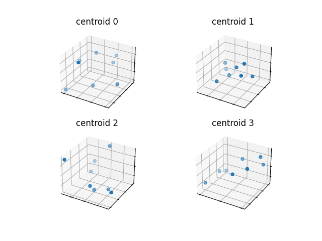

## Vector databases
These are databases that store vector [embeddings](./embedding-vector.md) of
words/tokens. So these store vectors of numbers, floats that represent these
tokens. And tokens that are similar will have similar vectors and hence will be
closer to each other in the vector space.

So lets say we want to search for something in one of these vector databases.
We would take our query and convert it into an embedding. Then we would search
for the closest vectors to this query vector. And the closest vectors will be
the most similar to the query.
```
                                                     Vector space
 +----------+    +-----------+    +----------+      *   *     ***  *
 | query    | -> | embedding | -> | database |    *   *   *   *  ***  *
 +----------+    +-----------+    +----------+     ***   *x*   *** ** ***
                    |                                     ↑
                  q[...]----------------------------------+
                                                               
```
This is trying to illustrate that the query is converted into an embedding and
then we search for the closest vectors to this query vector. And the closest
vectors will be the most similar to the query which are then returned.

Vector databases can be used to find content related to a query. Let’s say that
we have documents that we would like to search but they will not fit into the
context of an llm. What we can do is read all the documents and split them up
and create vector embeddings for then and store them in a vector database. This
way we can take the query and create a vector embedded of the query and then use
that embedding to query the vector database. This will then return a document
relevant to the query which can then be passed to the llm as context. So to be
clear we are sending the relant documents as context to the llm. For example,
we might write a prompt template using a placeholder like `{context}` which 
will could populate with the document retrieved from the vector database. There
are libraries/frameworks like Langchain that can perform this for you as a
specific chain.

There is an example in
[github-search.py](../langchain/src/github-search.py) which uses
a github repository to retreive all the documents in it and create inserts
them into a vector database. It then uses a query to search for the most
relevant document related to the query from the vector database, and then uses
those documents as context for prompting llm.
```console
(langch) $ python src/github-search.py 
cosine=0.8627952938295214, lora.md
cosine=0.8627952938295214, lora.md
cosine=0.8627952938295214, lora.md
cosine=0.8627952938295214, lora.md
cosine=0.8635670973473751, lora.md

Answer:
LoRa, short for "long range," is a wireless communication technology that is specifically designed for the Internet of Things (IoT). It provides a long-range communication link with low power consumption, allowing small battery-driven sensor devices to connect to a gateway that can be located between 1km to 10km away. These devices are expected to operate on the same battery for approximately 2 years. 

LoRa has a greater range compared to cellular networks, which typically have a range of a few hundred meters to 1km. In Europe, the frequencies used for LoRa are 433MHz and 868MHz. It is important to be cautious when configuring LoRa devices, as using the 915MHz frequency, which is allowed in other parts of the world, may be illegal in Europe.

In terms of its architecture, LoRa serves as the physical layer that enables the long-range communication link. It is a proprietary technology that was patented in June 2014. LoRaWAN, on the other hand, is a media access control (MAC) layer that is built on top of LoRa. It was released in January 2015 and provides additional features for managing the communication between LoRa devices and the network.

source_documents:
notes/lora.md
notes/lora.md
notes/lora.md
notes/lora.md
```
This example will first retrieve all documents from 
https://github.com/danbev/learning-iot.git and split these into chunks and
insert them into an in-memory vector database. It will then use a query to
search for the most relevant document related to the query from the vector
database, and then uses those documents as context for prompting llm.
This is an example of how you can use the an LLM to operate on data that are
your own and that it might not have been exposed to. 
Also notice that we get references to the docs that it used as the source which
could be valuable when one needs to provide references to the source of the
information.

### Embeddings
Lets see what an embedding looks like we can do this in this document by adding
the following comment:
```
# Can you show me an example of creating an embedding in Python using Huggingface?
```
And the response from copilot was the following:
```
Sure, lets say we want to create an embedding for the word "cat" using
Huggingface. We would do the following:
```

```python
from transformers import AutoTokenizer, AutoModel
tokenizer = AutoTokenizer.from_pretrained("bert-base-cased")
model = AutoModel.from_pretrained("bert-base-cased")
input_ids = tokenizer("cat", return_tensors="pt")["input_ids"]
embeddings = model(input_ids)[0]
```
(I added a print statement to print the shape and the embeddings at the end)

We can run this using:
```console
(hug) $ python embeddings/python/src/from-copilot.py 
embeddings.shape=torch.Size([1, 3, 768])
embeddings=tensor([[[ 0.4580,  0.2269,  0.1635,  ...,  0.3517,  0.2860,  0.0937],
         [ 0.8024, -0.6908,  0.4293,  ..., -0.0977,  0.5675,  0.1083],
         [ 1.5082,  0.3579, -0.4193,  ...,  0.2796,  1.3568,  0.0853]]],
       grad_fn=<NativeLayerNormBackward0>)
```

### Filters/labels
TODO:

### Searching
So we have a vector database and we want to search it. So we have a query and
we want to find the closest vectors to this query vector.

#### KNN (K-Nearest Neighbors)
This is a way of searching for the closest vectors to a query vector. So we
have a query vector and we want to find the closest vectors to this query.
This is done by calculating the distance between the query vector and all the
vectors in the database. Notice that this says `all` the vectors in the
database. So this is not very efficient. 

This method is also sometimes called flat searching and is not very efficient
but the quality of the searches is 100% as all vectors in the database will be
compared to the query vector. This works well for a small database but might
become an issue with larger ones as the search time will increase as the number
of vectors inserted into the vector database increases. We need a way that
scales and makes the search time independent of the number of vectors in the
database which leads us to approximate nearest neighbor (ANN) searching.

#### ANN (Approximate Nearest Neighbor)
This is a way of searching for the closest vectors to a query vector which out
having to perform an exhaustive search, though this might be less accurate hence
the "appoximate" part of the name.

### Indexing
This is about creating datastructures that allow efficient searching. This
section will go through a few the most common ones (I think).

Indexing can be hash-based, tree-based, graph-based, or inverted file based.

#### LSH (Locality Sensitive Hashing) (hash-based)
Is an example of approximate nearest neighbor searching. Instead of comparing
the query vector to all other vectors we want to reduce the number by finding
potential candidates. This is done by using a hash function that will hash the

LSH is a general method for finding approximate nearest neighbors and the
traditional way of doing this is using Shingling, Min-Hashing, and LSH.

First I'd like to just mention Jaccard similarity. This is a way of measuring
the similarity between two sets. It is defined as the size of the intersection
divided by the size of the union of the two sets. So if we have two sets:
```
A = {1, 2, 3, 4}
B = {3, 4, 5, 6}

    |A ∩ B|  |{3, 4}|                2
J = ------- = -------------------- = - = 0.33
    |A ∪ B|  |{1, 2, 3, 4, 5, 6}|    6
```
We can use the interection or rather the size/cardinality of it to see how
similar two sets are. But what does it mean that the intersection is 4 as an
example. That means that two sets have 4 elements in common which is a lot if
we only have 6 elements in total, but if the total number of elements is 1000
then 4 is not that much. This is when Jaccard comes into the picture and
normalizes the intersection by the union.

Now, lets try to understand what Singling's are. I think the work originates
from laying a roof or wall with overlapping pieces of wood or some other
material (not important for our case). But we are working with characters and
so what we do is that we take a string and split it into overlapping pieces of
k characters and put these into a set, so there will not be any duplicate
values.

For example, the following 
```console
$ python src/lsh.py 
Singlings for a: "Dan loves ice cream" 
{'am', ' c', 'es', 'an', 'ic', 'ov', ' i', 'ce', 've', 's ', 'cr', 'e ', 're', 'n ', 'Da', 'ea', 'lo', ' l'}
```
We also create singlings for the whole document corpus that we have, for example
the above string can be thought of as our query string and we want to find the
most similar document to this query string. This is called the vocubulary and
contains the union of all the singlings from all the documents in the corpus.

So with that we have singles but we want to have these in vector format so we
use one-hot encoding for them. So we can take the singlings for a in the example
above and create a one-hot encoding for it by creating a vector of the size of
the vocabulary and setting the index of the singling to 1 and the rest to 0.

Now, we have these sparse vectors which can be pretty big if we have a large
vocabulary so we want to transform them into dense vectors.
This is done be creating signatures for the one-hot encoded vectors. In our
example our vocabulary is of lenth 130 which is also the length of our one-hot
encoded vectors.
Let say we have the following one-hot encoded vector:
```
                  0  1  2  3  4  5  6  7  8  9
one-hot:         [0, 1, 0, 0, 0, 0, 0, 0, 0, 0]
```
What we do is that we take the an array of the same length as the one-hot and
filled with the indices, from 0-9 in this example, and suffle them.
```
                  0  1  2  3  4  5  6  7  8  9
one-hot:         [0, 1, 0, 0, 0, 0, 0, 0, 0, 0]

shuffled index:  [5, 9, 4, 1, 8, 2, 0, 3, 6, 7]
```
We then iterate through this shuffled index array and check the one-hot encoded
vector for the first index that is 1 and set the signature vector to that index.
```
                  0  1  2  3  4  5  6  7  8  9
one-hot:         [0, 1, 0, 0, 0, 0, 0, 0, 0, 0]
                  ↑  ↑  ↑  ↑  ↑  ↑  ↑  ↑  ↑  ↑
                  |  |  |  |  |  |  |  |  |  |
shuffled index:  [5, 9, 4, 1, 8, 2, 0, 3, 6, 7]
                     |
                  ↓--+  
signature:       [9, ]
```
So we start with the value index 1 in the shuffled index array and check if
the matching value in the one-hot encoded vector is 1, if it is we set the
signature value to that value, else we just move on.

And we do this multiple times (shuffling the index vector each time):
```
                  0  1  2  3  4  5  6  7  8  9
one-hot:         [0, 1, 0, 0, 0, 0, 0, 0, 0, 0]
                     ↑  ↑  ↑  ↑     ↑  ↑  ↑  ↑
                     |  |  |  |     |  |  |  |
shuffled index:  [9, 7, 0, 5, 1, 8, 6, 3, 4, 2]
                     |
                     ↓
signature:       [9, 7]
```
We can continue doing this until we have a dense vector which is the signature
vector. The length of the signature vector is the number of times we shuffle
the index vector. These are really just compressed versions of the one-hot
encoded vectors. And we can still uses these vector to compare the similarity
using the Jaccard similarity.

Now, that brings us to the LSH function itself. It takes the signature that
we created above and splits it into subvectors of a equal length, and then 
these subvectors are then hashed into buckets:
```
signature a:  [9, 7, 1, 3, 4, 7, 8, 9, 6] 
 
   [9, 7, 1]     [3, 4, 7]    [8, 9, 6]
      ↓             ↓             ↓
  +---------+   +---------+   +---------+
  | hash 1  |   | hash 2  |   | hash 3  |
  +---------+   +---------+   +---------+
      ↓              ↓             ↓
  +-----------+ +-----------+ +-----------+
  |  |X |  |  | |  |  |  |  | |  |  |  |X |
  +-----------+ +-----------+ +-----------+
  |  |  |  |  | |  |  |X |  | |  |  |  |  |
  +-----------+ +-----------+ +-----------+
```
And we can do the same thing with a different signature:
```
signature a:  [8, 2, 6, 5, 1, 0, 8, 9, 6] 
 
   [8, 2, 6]     [5, 1, 0]    [8, 9, 6]
      ↓             ↓             ↓
  +---------+   +---------+   +---------+
  | hash 1  |   | hash 2  |   | hash 3  |
  +---------+   +---------+   +---------+
      ↓              ↓             ↓
  +-----------+ +-----------+ +-----------+
  |  |  |  |  | |  |  |  |  | |  |  |  |X |
  +-----------+ +-----------+ +-----------+
  |X |  |  |  | |  |X |  |  | |  |  |  |  |
  +-----------+ +-----------+ +-----------+
```
Notice that in the same hash functions are used and that for both signatures
there third subvector is the same. This is called a candidate pair.

```
  P = 1 - (1 - s^r)^b

s = simliarity
r = number of rows
b = number of bands (subvectors)
```

#### IVF (Inverted File) (inverted file based indexing)
In general an inverted file refers to how one might for each term store a list
of documents that contain that term.

But in this case we talking about vector databases and hence we don't have
terms in that sense. In this case the vector space is divided into clusters
of vectors each with a centroid. This is done at the time of indexing. I think
these regions/clusters are called Voronoi cells. We can think each centeroid
as the terms we would have with inverted files.

When a query comes in we can then find the closest centroid(s?) to the query.
The query is then compared to a number of K closest centroid into which the
query is then compared to the vectors in that cluster.


#### HNSW (Hierarchical Navigable Small World) (graph based indexing)
To understand this we can start by looking at skip list first:
The lowest layer is a linked-list which includes all the elements:
```
Level 3: 1 -----------------------> 8
Level 2: 1 --------> 4 -----------> 8 -----> 10
Level 1: 1 -> 2 -> 3 -> 4 -> 5 -> 6 -> 7 -> 8 -> 9 -> 10
```
So when searching for 5 we start at the top and move to the right until we
find a value that is greater than 5 which in this case is 8 at the end of the
first line. We then move down to level 2 and continue until we hit 4 which is
not greater then 5 so we drop straight down to level 1 and continue until and
the move one position to the right and we have found 5.
The advantage here is that when we have a lot of elements we can skip a lot of
elements in the list to find the element we are looking for which improves
performance. This kind of layering is also used in HNSW which I think is the
hierarchical part of the name.

Next we have Navigable Small World (NSW) graphs.
The names comes from the saying "Its a small world" when you meet someone and
they know someone you know. 

We can start by thinking of a graph where node/veritces that are connected to
each other, then the edges are called friends.
The idea is that we have a graph and we most often have a sinlge entry point
and we want to find the most efficient way to get to a specific node.
When we do is looks at all the friends of the node and then pick the one that
is closest to our target node and then move along to that node and repeat the
process until we have found the target node.

#### Vamana (graph based indexing)
TODO:

#### Approximate Nearest Neighbour Oh Yeah (ANNOY) (tree based indexing)
TODO:


### Quantization based indexing
This is an index that combines an existing index, like IVF, or HNSW, with
a compression method to reduce memory usage by reducing the size of the vectors
but not their lenght (dimsionality reduction). The idea is that we can use
quantization to reduce the number of bits needed to represent a vector.

This can be done using scalar quantization where instead of using floating
point numbers we use integers.

#### Scalar Quantization (SQ)
So in this case we are going to take floating point values and convert them into
integers. Now if we take a vector of float 32 values they will normally not
"use" the complete range of values that can be represented. Instead the
distribution will most likely be a normal distribution.
Integers also have a range of values that they can represent. For an 8bit
integer we can represent values from 0 to 255 or -128 to 127.

```
i8 = (f32 - offset)
     --------------
           α

f32 = α * i8 + offset
```
The first expression converts an i8 to a f32 by first scaling the i8 value by
α and then adding the offset. If α is greater then 1 then it will scale the i8
value up, and if it is between 0-1 it will scale the value down. The offset
ensures that the converted value is centered around a perticualar value which I
think is the range of the values mentioned above.

Lets look at an example:
```
          [4.8, 5.0, 5.2 6.0, 7.0]

i8 = (f32 - 5.0) / 0.1

4.8: (4.8 - 5.0) / 1.0 = -0.2 / 0.1 = -2
5.0: (5.0 - 5.0) / 1.0 =  0.0 / 0.1 =  0
5.2: (5.2 - 5.0) / 1.0 =  0.2 / 0.1 =  2
6.0: (6.0 - 5.0) / 1.0 =  1.0 / 0.1 = 10
7.0: (7.0 - 5.0) / 1.0 =  2.0 / 0.1 = 20

[-2, 0, 2, 10, 20]
```
A common strategy for choosing the offset is to take the min value in the range
plus the max value and divide by 2 to get the center of the range. In this case
the min value is 4.8 and the max value is 7.0. So the offset would be:

```
offset = 4.8 + 7.0 / 2 = 5.9 / 2 = 2.95

i8 = (f32 - 2.95) / 0.1
4.8: (4.8 - 2.95) / 1.0 =  1.85 / 0.1 =  18.5
5.0: (5.0 - 2.95) / 1.0 =  2.05 / 0.1 =  20.5
5.2: (5.2 - 2.95) / 1.0 =  2.25 / 0.1 =  22.5
6.0: (6.0 - 2.95) / 1.0 =  3.05 / 0.1 =  30.5
7.0: (7.0 - 2.95) / 1.0 =  4.05 / 0.1 =  40.5

[18, 20, 22, 30, 40]

f32 = 0.1 * 18 + 2.95 = 0.1 * 18 + 2.95 = 4.8
0.1 * 18 = 1.8
1.8 + 2.95 = 4.75
```
To get a "feel" for this there is an example in
[scalar-quantization.py](../fundamentals/python/src/scalar-quantization.py)

```
                    Scope (S)
   +------------------------------------------------+
   |    |    |   |    |    |    |    |    |    |    |
   |    |    |   |    |    |    |    |    |    |    |
   |    |    |   |    |    |    |    |    |    |    |
D  |    |    |   |    |    |    |    |    |    |    |
   |    |    |   |    |    |    |    |    |    |    |
   |    |    |   |    |    |    |    |    |    |    |
   |    |    |   |    |    |    |    |    |    |    |
   |    |    |   |    |    |    |    |    |    |    |
   |    |    |   |    |    |    |    |    |    |    |
   +------------------------------------------------+
                         ↓

                    Scope (S)
   +----------------------------+
   |    |    |   |    |    |    |
   |    |    |   |    |    |    |
   |    |    |   |    |    |    |
D  |    |    |   |    |    |    |
   |    |    |   |    |    |    |
   |    |    |   |    |    |    |
   |    |    |   |    |    |    |
   |    |    |   |    |    |    |
   |    |    |   |    |    |    |
   +----------------------------+
```

#### Product Quantization (PQ)
Like scalar quantization this is also a technique for vector compression

```
    0                      d                       128
    +-----------------------------------------------+               4096 bits
b   |f32|f32|f32|f32|f32|f32|f32|f32|f32|f32|f32|f32|
    +-----------------------------------------------+

d = 128 (slots/elements)
b = 32 bits
mem = 128 * 32 = 4096 bits
```
The goals is to reduce the memory footprint of this vector.
We start by splitting the vector into subvectors:
```
    +-----+  +----+  +----+  +----+  +----+  +----+  +----+ +----+ Still floating point numbers
    | S₀  |  | S₁ |  | S₂ |  | S₃ |  | S₄ |  | S₅ |  | S₆ | | S₇ |
    +-----+  +----+  +----+  +----+  +----+  +----+  +----+ +----+
       |       |        |       |       |       |       |      |
       |       |        |       |       |       |       |      |
       |  k-means clustering for all of the subvectors
 +-----+      
 |   +-------------+ 
 |   | Centroid S₀₀|
 |   | Centroid S₀₁|              8 bits
 |   | Centroid S₀₂|             +-----+
 +-->| Centroid S₀₃|------------>|  3  |
     | Centroid S₀₄|             +-----+
     | Centroid S₀₅|
     | Centroid S₀₆|
     | Centroid S₀₇|
     +-------------+
```
Each vector will replaced by a sequence of 8 centroid ids which are stored as
ints. So instead of a 128 floating point vector taking up 4096 bits we have
8*8=64 bits.

Each subvector is will have its own set of centroids which are specific to
that subvector.



_work in progress_

#### Neighbourhood Graph & Tree (NGT) (graph and tree based indexing)
TODO:


### Qdrant (Rust)
Qdrant is a vector database written in Rust. It is a vector database that is
open source and is written in Rust.

[Qdrant Python example](../vector-databases/qdrant/python)  

[Qdrant Rust example](../vector-databases/qdrant/rust/README.md)


### LanceDB 
[LanceDB](https://github.com/lancedb/lancedb) is also an opensource vector
database written in Rust.

[LanceDB Python example](../vector-databases/lancedb/python/src/lancedb-example.py)

[LanceDB Rust example](../vector-databases/lancedb/rust/lancedb-example/README.md)
