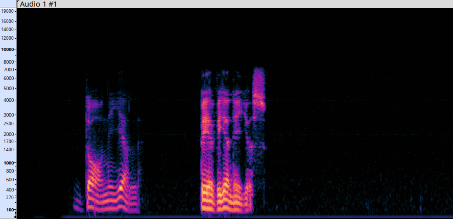

## whisper.cpp
This is a automatic speech recognition (ASR) library for C/C++.

### Spectrogram
When we process raw audio it is in a wave form which is in the time domain. We
see a single amplitude at each point in time. This amplitude represents the 
total sum of all frequencies at that point in time.


The wave form is a continuous signal in time and in in amplitude. To represent
this information in a digital form we need to sample it, that is read specific
points (or rather intervals) and store them. These intervalls are ofter denoted
by T, the time between each sample. The number of samples per second is called
the sample rate. The sample rate is often 44.1 kHz or 44,100 samples per second.
Now, if we sample with a low rate we run the risk of losing information so I
though that using a higher sample rate would always be better. But this is not
the case. There is a theorem called the Nyquist-Shannon theorem which states
that the sample rate must be at least twice the highest frequency in the signal
to accurately represent it. So if we have a signal with a maximum frequency of
22 kHz we need a sample rate of at least 44.1 kHz. This is why the sample rate
is often 44.1 kHz. The human ear can hear frequencies up to 20 kHz so this is
why the sample rate is often 44.1 kHz.
Speach is often between 80-8000Hz and music 20-20000Hz.

In this recording I'm just saying my name: "Daniel Bevenius"
I can see that the frequency is not higher than 8000hz which is the limit for
human speech. I start with a frequency at around 100h, which is my fundamental
frequency F0. This is the base vibration rate of my vocal folds.
The "D" sound doesn't have very high amplitude in the waveform because it's what
is call a "stop consonant" - it involves briefly stopping airflow before
releasing it. They tend to be quieter than vowels.
The parallel horizontal lines above the fundamental frequency (at ~200Hz, ~300Hz,
etc.) - these are the harmonics.

"a" in "Daniel" and "e" in "Bevenius" are vowels and they have a lot of energy
in the higher frequencies. The "a" sound has a lot of energy at around 800Hz and

Consonants like "n", "l", "b", "v" each have distinctive patterns. By using
the spectrogram it is actually possible to "read" what letters are being spoken
and this is what the ASR system use. But the ARS systems are trained on a lot
of millions of examples and use statistical models to predict what is being
said.

The Fourier Transform decomposes this signal into its constituent frequencies.
The x-axis is time just like in the wave form, but the y-axis is frequency (not
amplitude). So the spectrogram is showing the whole spectrum of frequencies
possible for each point in time. Now, the color of each point, the point at
time/frequence (x, y) intersection represents the amplitude/energy at that point.



Whisper uses mel spectrogram which is a spectrogram where the frequencies are
converted to the mel scale. The mel scale is a scale of pitches that are
perceived by humans as being equally spaced.

### Mel Spectrograms
In the spectrogram we saw above the y-axis was the frequency in Hz. But this is
not great for humans because we don't perceive frequencies linearly. We perceive
frequencies logarithmically. So what do we mean by that?  
Well, if we have a sound at 1000Hz and another at 2000Hz the difference between
them is 1000Hz. Now, if we have a sound at 10000Hz and another at 11000Hz the
difference is is also 1000Hz. But we perceive the difference between 1000Hz and
2000Hz as being much greater than the difference between 10000Hz and 11000Hz. So
the mel scale is a scale that is designed to mimic the way humans perceive sound.
The mel scale is a logarithmic scale that is linear below 1000Hz and logarithmic
above 1000Hz.

So to recap a little and get an overview of the process:  
1. We start with the original analog signal which is continuous in time and
   amplitude.

2. Digitalize the signal by sampling it at a certain rate to create a digital
   waveform. This is now digital (descrete) but still just amplitude values over
   time.
 
3. Standard spectrogram: The digitized audio undergoes a Short-Time Fourier
   Transform (STFT) to break it into frequency components. Say we sample at a
   rate of 16Khz this would show frequencies up to 8Khz (Nyquist limit).
   A standard spectrogram might have frequency resolution of 10Hz per bin,
   resulting in 800 bins for 8000Hz.

4. Mel spectrogram: This is where the data reduction happens. Instead of keeping
   all the 800 frequency bins, we combine them into just 80 mel scaled bins.
   In this process of converting from the spectrogram to the mel spectrogram we
   apply a set of overlapping triangular filters to the spectrogram which are
   called mel filterbanks. These filters combine multiple frequency bins into
   a single mel bin.

   For example, to create mel bin #10, we might take a weighted average of linear
   frequency bins 50-70, giving us a single value that represents that entire
   frequency range.
   After this process, each time frame now has only 80 amplitude values instead
   of 800.

Visualize this as a matrix:
```
spectrogram:
              800 (frequency bins)
        +-----------------------------+
        |                             |
        |                             |
        |                             |  500 (time frames)
        |                             |
        |                             |
        |                             |
        |                             |
        +-----------------------------+
                       |
                       ↓ 
mel spectrogram:
              80 (frequency bins)
        +------------+
        |            |
        |            |
        |            |  500 (time frames)
        |            |
        |            |
        |            |
        |            |
        +------------+
```
This is like resizing an image from 800x500 to 80x500. Like we are compressing
the data and it will take up less space. But also it will contain more of the
information that is important to humans speech which is what we want for 
whisper.

For example, in our above spectrogram we had 8000Hz as the max frequency. And
these are evenly divided into ranges, lets say there might be 800+ frequency
ranges (or bins) for 8000Hz.

This might get divided into 80 "bins/buckets" in the mel spectrogram:
```
Bin 1-20:     0-1000Hz (about 50Hz per bin)
Bin 21-40: 1000-2500Hz (about 75Hz per bin)
Bin 41-60: 2500-5000Hz (about 125Hz per bin)
Bin 61-80: 5000-8000Hz (about 150Hz per bin)
```

Converting to mel spectrograms reduces the input data dimensionality while
preserving perceptually important information.

### Inference Processing
The raw audio is first split into smaller segment of 30 second chunks. This 30
second limit comes from Whispers training where 30 second segments where used
and its position embeddings are designed for this duration.

Then for each chunk:
The chunk is converted into a mel spectrogram which is then processed by the
encoder.

The decoder starts with initial tokens:
* `<SOT>` (Start of Transcript),
* language token (like `<EN>`),
* task token which will be one of:
  - `<TRANSCRIBE>`
  - `<TRANSLATE>`
* no timestamp token

The decoder generates one token at a time.

For a single 30-second chunk, the result will be the transcribed tokens
corresponding to the speech in that 30-second segment. 

The special tokens (like language markers, timestamp indicators) provide task
control. By intermixing these with the text, Whisper can perform multiple tasks
with a single model, directing it to transcribe, translate, or identify the
language.

In whisper.cpp, these tokens are setup in the `whisper_full_with_state` function:
```c++
int whisper_full_with_state(
        struct whisper_context * ctx,
          struct whisper_state * state,
    struct whisper_full_params   params,
                   const float * samples,
                           int   n_samples) {
    ...

    std::vector<whisper_token> prompt_init = { whisper_token_sot(ctx), };
```
And we can inspect the tokes added when translation is enabled using the
command line option `-tr`:
```console
(std::vector<int>) size=3 {
  [0] = 50258
  [1] = 50259
  [2] = 50358
}
(lldb) p ctx->vocab.id_to_token.at(50258)
(std::map<int, std::string>::mapped_type) "[_SOT_]"
(lldb) p ctx->vocab.id_to_token.at(50259)
(std::map<int, std::string>::mapped_type) "[_LANG_en]"
(lldb) p ctx->vocab.id_to_token.at(50358)
(std::map<int, std::string>::mapped_type) "[_TRANSLATE_]"
```
Transcribe is token:
```console
(lldb) p ctx->vocab.id_to_token.at(50359)
(std::map<int, std::string>::mapped_type) "[_TRANSCRIBE_]"
```

In Whisper models (including implementations like whisper.cpp), the task token (<|transcribe|> or <|translate|>) fundamentally changes what the model does with the audio input. These are mutually exclusive paths in the model's processing:

<|transcribe|> instructs the model to output text in the same language as the audio
<|translate|> instructs the model to translate the speech into English

To get both the original transcription and an English translation, you would indeed need to run two separate inference passes over the same audio:

First pass with <|transcribe|> to get the original language transcription
Second pass with <|translate|> to get the English translation

This is a fundamental limitation of how the model was designed and trained. It's not simply a software limitation that could be worked around in the implementation - the model architecture itself expects to perform one task at a time.

### Diarization
There is a parameter named 'diarize' which indicates if speaker identification
or diarization should be performed. This is about who spoke when. The system
will attempt to identify the speaker and assign a label to each speaker. So
the output will have an identifier like "Speaker 0", "Speaker 1", etc.


### Dynamic Time Warping (DTW)
This is about aligning the transcribed text with precise timestamps in the
audio. When whisper generated text from audio it needs to determine preciely
when each word was spoken. But the encoder-decoder model does not have this
concept of timestamps. 


### Pulse Code Modulation (PCM)
So when we a raw audio signal which is continuous, we sample it at a certain
fixed rate called the sample rate. This is measuring the amplitude of the sound
wave at regular intervals. Each value is then quantied to a fixed number of bits
, the number is determined by the bit depth. This gives us a discrete value.
```
8  bits = 2^8  = 256 levels
16 bits = 2^16 = 65536 levels
24 bits = 2^24 = 16777216 levels
32 bits = 2^32 = 4294967296 levels
```
These quantized values are the codes in Pulse Code Modulation (PCM). Each code
represents the amplitude of the sound wave at that point in time. This data
can then be stored in a file and for a WAV file the header will contain metadata
like the sample rate, bit depth, number of channels, etc.

### Waveform Audio File Format (WAV)
This is a subset of Microsoft's Microsoft’s Resource Interchange File Format (RIFF)
specification for the storage of digital audio. There is no compression involved
in this format.

We can inspect the wav metadata using the `mediainfo` command:
```console
$ hexdump -C -n 500 samples/jfk.wav
00000000  52 49 46 46 46 5f 05 00  57 41 56 45 66 6d 74 20  |RIFFF_..WAVEfmt |
00000010  10 00 00 00 01 00 01 00  80 3e 00 00 00 7d 00 00  |.........>...}..|
00000020  02 00 10 00 4c 49 53 54  1a 00 00 00 49 4e 46 4f  |....LIST....INFO|
00000030  49 53 46 54 0e 00 00 00  4c 61 76 66 35 39 2e 32  |ISFT....Lavf59.2|
00000040  37 2e 31 30 30 00 64 61  74 61 00 5f 05 00 00 00  |7.100.data._....|
00000050  00 00 00 00 00 00 00 00  00 00 00 00 00 00 00 00  |................|
```
whisper.cpp uses [miniaudio](https://github.com/mackron/miniaudio) to read wav
files.

### Model

```c++
struct whisper_model {
    e_model type = MODEL_UNKNOWN;

    whisper_hparams hparams;
    whisper_filters filters;

    // encoder.positional_embedding
    struct ggml_tensor * e_pe;

    // encoder.conv1
    struct ggml_tensor * e_conv_1_w;
    struct ggml_tensor * e_conv_1_b;

    // encoder.conv2
    struct ggml_tensor * e_conv_2_w;
    struct ggml_tensor * e_conv_2_b;

    // encoder.ln_post
    struct ggml_tensor * e_ln_w;
    struct ggml_tensor * e_ln_b;

    // decoder.positional_embedding
    struct ggml_tensor * d_pe;

    // decoder.token_embedding
    struct ggml_tensor * d_te;

    // decoder.ln
    struct ggml_tensor * d_ln_w;
    struct ggml_tensor * d_ln_b;

    std::vector<whisper_layer_encoder> layers_encoder;
    std::vector<whisper_layer_decoder> layers_decoder;

    // ggml context that contains all the meta information about the model tensors
    struct ggml_context * ctx = nullptr;

    // the model backend data is read-only and can be shared between processors
    ggml_backend_buffer_t buffer = nullptr;

    // tensors
    int n_loaded;
    std::map<std::string, struct ggml_tensor *> tensors;
};
```
In `whisper_model_load` the model tensor are created:
```c++
        // encoder
        {
            model.e_pe = ggml_new_tensor_2d(ctx, GGML_TYPE_F32, n_audio_state, n_audio_ctx);
```
This is the encoders position encoder (pe)
```console
(gdb) p model.e_pe.ne
$35 = {384, 1500, 1, 1}

(gdb) p model.hparams.n_audio_state 
$9 = 384
(gdb) p model.hparams.n_audio_ctx 
$10 = 1500
```
So we can see this is a matrix with 384 dimensions and 1500 rows.
```
0     [0                  383]
            .
            .
            .
1499  [0                  383]
```
Audio is processed at 50 frames per second so 1500 frames corresponds to 30
seconds of audio (1500/50 = 30). So each row in this matrix represents a specific
time position the 30 second audio chunk or segment. The positional information
is added so that the model know not only the spectral information (which frequencies
are present) but also when they occur.

Next we have the two 1D convolutions:
```c++
            model.e_conv_1_w     = ggml_new_tensor_3d(ctx, vtype,         3, n_mels,     n_audio_state);
            model.e_conv_1_b     = ggml_new_tensor_2d(ctx, GGML_TYPE_F32,         1,     n_audio_state);

            model.e_conv_2_w     = ggml_new_tensor_3d(ctx, vtype,         3, n_audio_state, n_audio_state);
            model.e_conv_2_b     = ggml_new_tensor_2d(ctx, GGML_TYPE_F32,                1, n_audio_state);
```
```console
(gdb) p model.e_conv_1_w->ne
$12 = {3, 80, 384, 1}

(gdb) p model.e_conv_2_w->ne
$13 = {3, 384, 384, 1}
```
TODO: Add more information about the convolutions.

Next, we have the encoder layers.
And following that we have the decoder tensors.
```c++
        // decoder
        {
            model.d_pe   = ggml_new_tensor_2d(ctx, GGML_TYPE_F32, n_text_state, n_text_ctx);

            model.d_te   = ggml_new_tensor_2d(ctx, wtype,         n_text_state, n_vocab);
```
These are the decoders positional embedding and token embedding tensors.
```console
(gdb) p model.d_pe->ne
$19 = {384, 448, 1, 1}

(gdb) p model.d_te->ne
$20 = {384, 51864, 1, 1}
```
These tensors are later used in :
```c++
static struct ggml_cgraph * whisper_build_graph_conv(
        whisper_context & wctx,
          whisper_state & wstate) {
    ...
    struct ggml_tensor * mel = ggml_new_tensor_2d(ctx0, GGML_TYPE_F32, 2*n_ctx, n_mels);
    ggml_set_name(mel, "mel");
    ggml_set_input(mel);

    struct ggml_tensor * cur = nullptr;

    if (!whisper_encode_external(wstate)) {
        // convolution + gelu
        {
            cur = ggml_conv_1d_ph(ctx0, model.e_conv_1_w, mel, 1, 1);
            cur = ggml_add(ctx0, cur, model.e_conv_1_b);

            cur = ggml_gelu(ctx0, cur);

            cur = ggml_conv_1d_ph(ctx0, model.e_conv_2_w, cur, 2, 1);
            cur = ggml_add(ctx0, cur, model.e_conv_2_b);

            cur = ggml_gelu(ctx0, cur);
        }

        ggml_set_name(cur, "embd_conv");
        wstate.embd_conv = cur;
```
```console
(gdb) p mel->ne
$31 = {3000, 80, 1, 1}
```

### whisper-cli
An initial walk through of the cli example to get familiar with the code.
```console
gdb --args ./build/bin/whisper-cli \
	-m models/ggml-tiny.en.bin \
	-f samples/jfk.wav \
	-di
```

```c++
int main(int argc, char ** argv) {
    whisper_params params;
    ...

    struct whisper_context_params cparams = whisper_context_default_params();
    ...
    struct whisper_context * ctx = whisper_init_from_file_with_params(params.model.c_str(), cparams);
}
```
```console
(gdb) set print pretty on
(gdb) p params
$4 = {
  n_threads = 4,
  n_processors = 1,
  offset_t_ms = 0,
  offset_n = 0,
  duration_ms = 0,
  progress_step = 5,
  max_context = -1,
  max_len = 0,
  best_of = 5,
  beam_size = 5,
  audio_ctx = 0,
  word_thold = 0.00999999978,
  entropy_thold = 2.4000001,
  logprob_thold = -1,
  no_speech_thold = 0.600000024,
  grammar_penalty = 100,
  temperature = 0,
  temperature_inc = 0.200000003,
  debug_mode = false,
  translate = false,
  detect_language = false,
  diarize = true,
  tinydiarize = false,
  split_on_word = false,
  no_fallback = false,
  output_txt = false,
  output_vtt = false,
  output_srt = false,
  output_wts = false,
  output_csv = false,
  output_jsn = false,
  output_jsn_full = false,
  output_lrc = false,
  no_prints = false,
  print_special = false,
  print_colors = false,
  print_progress = false,
  no_timestamps = false,
  log_score = false,
  use_gpu = true,
  flash_attn = false,
  suppress_nst = false,
  language = "en",
  prompt = "",
  font_path = "/System/Library/Fonts/Supplemental/Courier New Bold.ttf",
  model = "models/ggml-tiny.en.bin",
  grammar = "",
  grammar_rule = "",
  tdrz_speaker_turn = " [SPEAKER_TURN]",
  suppress_regex = "",
  openvino_encode_device = "CPU",
  dtw = "",
  fname_inp = std::vector of length 1, capacity 1 = {"samples/jfk.wav"},
  fname_out = std::vector of length 0, capacity 0,
  grammar_parsed = {
    symbol_ids = std::map with 0 elements,
    rules = std::vector of length 0, capacity 0
  }
}

gdb) p cparams
$5 = {
  use_gpu = true,
  flash_attn = false,
  gpu_device = 0,
  dtw_token_timestamps = false,
  dtw_aheads_preset = WHISPER_AHEADS_NONE,
  dtw_n_top = -1,
  dtw_aheads = {
    n_heads = 0,
    heads = 0x0
  },
  dtw_mem_size = 134217728
}

```
So lets take a look at the model is loaded:
```console
(gdb) br whisper_init_from_file_with_params_no_state
(gdb) c
```
```c++
struct whisper_context * whisper_init_from_file_with_params_no_state(const char * path_model,
    struct whisper_context_params params) {
    WHISPER_LOG_INFO("%s: loading model from '%s'\n", __func__, path_model);


```

### Beam Search
Lets take the whisper-cli as the example and see how the beam search works.
```c++
int main(int argc, char ** argv) {
    ...
    struct whisper_context * ctx = whisper_init_from_file_with_params(params.model.c_str(), cparams);
```
```c++
struct whisper_context * whisper_init_from_file_with_params(const char * path_model, struct whisper_context_params params) {
    whisper_context * ctx = whisper_init_from_file_with_params_no_state(path_model, params);
    if (!ctx) {
        return nullptr;
    }

    ctx->state = whisper_init_state(ctx);
    if (!ctx->state) {
        whisper_free(ctx);
        return nullptr;
    }

    return ctx;
}
```
```c++
struct whisper_context * whisper_init_from_file_with_params_no_state(const char * path_model, struct whisper_context_params params) {
    WHISPER_LOG_INFO("%s: loading model from '%s'\n", __func__, path_model);
#ifdef _MSC_VER
    // Convert UTF-8 path to wide string (UTF-16) for Windows, resolving character encoding issues.
    std::wstring_convert<std::codecvt_utf8<wchar_t>> converter;
    std::wstring path_model_wide = converter.from_bytes(path_model);
    auto fin = std::ifstream(path_model_wide, std::ios::binary);
#else
    auto fin = std::ifstream(path_model, std::ios::binary);
#endif
    if (!fin) {
        WHISPER_LOG_ERROR("%s: failed to open '%s'\n", __func__, path_model);
        return nullptr;
    }

    whisper_model_loader loader = {};
    ...

    auto ctx = whisper_init_with_params_no_state(&loader, params);
```
```c++
struct whisper_context * whisper_init_with_params_no_state(struct whisper_model_loader * loader, struct whisper_context_params params) {
    ...

    whisper_context * ctx = new whisper_context;
    ctx->params = params;

    if (!whisper_model_load(loader, *ctx)) {
        loader->close(loader->context);
        WHISPER_LOG_ERROR("%s: failed to load model\n", __func__);
        delete ctx;
        return nullptr;
    }
}
```
```c++
static bool whisper_model_load(struct whisper_model_loader * loader, whisper_context & wctx) {
    WHISPER_LOG_INFO("%s: loading model\n", __func__);

    const int64_t t_start_us = ggml_time_us();

    wctx.t_start_us = t_start_us;

    auto & model = wctx.model;
    auto & vocab = wctx.vocab;

    // verify magic
    {
        uint32_t magic;
        read_safe(loader, magic);
        if (magic != GGML_FILE_MAGIC) {
            WHISPER_LOG_ERROR("%s: invalid model data (bad magic)\n", __func__);
            return false;
        }
    }
```
TODO: take a closer look at the verify magic check in combination with using a Core ML
model. This check forces there to be an ggml model even though there might be cases
where only a Core ML model is used.

The actual inference is started by `cli.cpp`:
```c++
    whisper_full_params wparams = whisper_full_default_params(WHISPER_SAMPLING_GREEDY);
    ...
    if (whisper_full_parallel(ctx, wparams, pcmf32.data(), pcmf32.size(), params.n_processors) != 0) {
        fprintf(stderr, "%s: failed to process audio\n", argv[0]);
        return 10;
    }
```
```c++
int whisper_full_parallel(
        struct whisper_context * ctx,
        struct whisper_full_params params,
        const float * samples,
        int n_samples,
        int n_processors) {
    if (n_processors == 1) {
        return whisper_full(ctx, params, samples, n_samples);
    }
```
```c++
int whisper_full(
        struct whisper_context * ctx,
    struct whisper_full_params   params,
                   const float * samples,
                           int   n_samples) {
    return whisper_full_with_state(ctx, ctx->state, params, samples, n_samples);
}
```
```c++
int whisper_full_with_state(
        struct whisper_context * ctx,
          struct whisper_state * state,
    struct whisper_full_params   params,
                   const float * samples,
                           int   n_samples) {
    ...
    if (n_samples > 0) {
        // compute log mel spectrogram
        if (whisper_pcm_to_mel_with_state(ctx, state, samples, n_samples, params.n_threads) != 0) {
            WHISPER_LOG_ERROR("%s: failed to compute log mel spectrogram\n", __func__);
            return -2;
        }
    }
}
```
```console
(lldb) p n_samples
(int) 176000
```

Next we have the temperatures:
```c++
    // a set of temperatures to use
    // [ t0, t0 + delta, t0 + 2*delta, ..., < 1.0f + 1e-6f ]
    std::vector<float> temperatures;
    if (params.temperature_inc > 0.0f) {
        for (float t = params.temperature; t < 1.0f + 1e-6f; t += params.temperature_inc) {
            temperatures.push_back(t);
        }
    } else {
        temperatures.push_back(params.temperature);
    }
```
```console
(std::vector<float>) size=6 {
  [0] = 0
  [1] = 0.200000003
  [2] = 0.400000006
  [3] = 0.600000024
  [4] = 0.800000011
  [5] = 1
}
```
These are described in the whisper paper. So we start with a temperature of 0,
and increment in approximately 0.2 steps up to 1.0.
So for a single inference, from the point of view of the caller, it would potentially cause
multiple inferences to happen if the heuristic (issues discovered in practice) happen.
From the caller's perspective, what appears to be a single transcription request could
potentially trigger multiple inference passes behind the scenes.

Next, the decoders are initalized:
```c++
    // initialize the decoders
    int n_decoders = 1;

    switch (params.strategy) {
        case WHISPER_SAMPLING_GREEDY:
            {
                n_decoders = params.greedy.best_of;
            } break;
        case WHISPER_SAMPLING_BEAM_SEARCH:
            {
                n_decoders = std::max(params.greedy.best_of, params.beam_search.beam_size);
            } break;
    };

    n_decoders = std::max(1, n_decoders);

    if (n_decoders > WHISPER_MAX_DECODERS) {
        WHISPER_LOG_ERROR("%s: too many decoders requested (%d), max = %d\n", __func__, n_decoders, WHISPER_MAX_DECODERS);
        return -4;
    }

    // TAGS: WHISPER_DECODER_INIT
    for (int j = 1; j < n_decoders; j++) {
        auto & decoder = state->decoders[j];

        decoder.sequence.tokens.reserve(state->decoders[0].sequence.tokens.capacity());

        decoder.probs.resize   (ctx->vocab.n_vocab);
        decoder.logits.resize  (ctx->vocab.n_vocab);
        decoder.logprobs.resize(ctx->vocab.n_vocab);
        decoder.logits_id.reserve(ctx->model.hparams.n_vocab);

        decoder.rng = std::mt19937(0);
    }
```
Notice that all decoders are initialized with rng seed 0. I opened an issue
about this and it has since been updated.

Then the prompt is prepared:
```c++
    // prepare prompt
    {
        std::vector<whisper_token> prompt_tokens;

        // initial prompt
        if (!params.prompt_tokens && params.initial_prompt) {
            prompt_tokens.resize(1024);
            int n_needed = whisper_tokenize(ctx, params.initial_prompt, prompt_tokens.data(), prompt_tokens.size());
            if (n_needed < 0) {
                prompt_tokens.resize(-n_needed);
                n_needed = whisper_tokenize(ctx, params.initial_prompt, prompt_tokens.data(), prompt_tokens.size());
            }
            prompt_tokens.resize(n_needed);
            params.prompt_tokens   = prompt_tokens.data();
            params.prompt_n_tokens = prompt_tokens.size();
        }

        // prepend the prompt tokens to the prompt_past
        if (params.prompt_tokens && params.prompt_n_tokens > 0) {
            // parse tokens from the pointer
            for (int i = 0; i < params.prompt_n_tokens; i++) {
                prompt_past.push_back(params.prompt_tokens[i]);
            }
            std::rotate(prompt_past.begin(), prompt_past.end() - params.prompt_n_tokens, prompt_past.end());
        }
    }
```
Then the tokens are set up:
```c++
    // these tokens determine the task that will be performed
    std::vector<whisper_token> prompt_init = { whisper_token_sot(ctx), };

    if (whisper_is_multilingual(ctx)) {
        const int lang_id = whisper_lang_id(params.language);
        state->lang_id = lang_id;
        prompt_init.push_back(whisper_token_lang(ctx, lang_id));
        if (params.translate) {
            prompt_init.push_back(whisper_token_translate(ctx));
        } else {
            prompt_init.push_back(whisper_token_transcribe(ctx));
        }
    }
```
`sot` is start of transcript. 

`whisper_state` contains a a list of `whisper_decoder`:
```c++
struct whisper_state {
    ...
    whisper_decoder decoders[WHISPER_MAX_DECODERS];
    ...
};
```
```c++
struct whisper_decoder {
    // the currently generated sequence of tokens
    whisper_sequence sequence;

    // grammar parse state of generated sequence of tokens
    whisper_grammar  grammar;

    int i_batch;    // the index of the token in the current batch
    int seek_delta; // the window shift found so far based on the decoded timestamp tokens

    bool failed;    // has the current segment failed to decode?
    bool completed; // has the decoder completed the current segment?
    bool has_ts;    // have we already sampled a non-beg timestamp token for the current segment?

    // new token probs, logits and logprobs after the last whisper_decode (1-dimensional array: [n_vocab])
    std::vector<float> probs;
    std::vector<float> logits;
    std::vector<float> logprobs;

    // work container used to avoid memory allocations
    std::vector<whisper_pair<double, whisper_vocab::id>> logits_id;

    mutable std::mt19937 rng; // used for sampling at t > 0.0
};

struct whisper_sequence {
    std::vector<whisper_token_data> tokens;

    // the accumulated transcription in the current iteration (used to truncate the tokens array)
    int result_len;

    double sum_logprobs_all; // the sum of the log probabilities of the tokens
    double sum_logprobs;     // the sum of the log probabilities of the tokens (first result_len tokens)
    double avg_logprobs;     // the average log probability of the tokens
    double entropy;          // the entropy of the tokens
    double score;            // likelihood rank score
};
```

```console
-bo N,     --best-of N         [5      ] number of best candidates to keep
-bs N,     --beam-size N       [5      ] beam size for beam search
```

```c++
int whisper_full_with_state(
        struct whisper_context * ctx,
          struct whisper_state * state,
    struct whisper_full_params   params,
                   const float * samples,
                           int   n_samples) {
    ...
    // initialize the decoders
    int n_decoders = 1;

    switch (params.strategy) {
        case WHISPER_SAMPLING_GREEDY:
            {
                n_decoders = params.greedy.best_of;
            } break;
        case WHISPER_SAMPLING_BEAM_SEARCH:
            {
                n_decoders = std::max(params.greedy.best_of, params.beam_search.beam_size);
            } break;
    };

    n_decoders = std::max(1, n_decoders);

    if (n_decoders > WHISPER_MAX_DECODERS) {
        WHISPER_LOG_ERROR("%s: too many decoders requested (%d), max = %d\n", __func__, n_decoders, WHISPER_MAX_DECODERS);
        return -4;
    }

    // TAGS: WHISPER_DECODER_INIT
    for (int j = 1; j < n_decoders; j++) {
        auto & decoder = state->decoders[j];

        decoder.sequence.tokens.reserve(state->decoders[0].sequence.tokens.capacity());

        decoder.probs.resize   (ctx->vocab.n_vocab);
        decoder.logits.resize  (ctx->vocab.n_vocab);
        decoder.logprobs.resize(ctx->vocab.n_vocab);
        decoder.logits_id.reserve(ctx->model.hparams.n_vocab);

        decoder.rng = std::mt19937(0);
    }
    ...
    struct beam_candidate {
        int decoder_idx;  // which decoder this candidate came from.
        int seek_delta;   // position in the audio?

        bool has_ts;      // has timestamp information.

        whisper_sequence sequence; // the token sequence for this candidate
        whisper_grammar grammar;   // the grammar for this candidate
    };

    std::vector<std::vector<beam_candidate>> bc_per_dec(n_decoders);
    std::vector<beam_candidate> beam_candidates;
   
    ...

    struct beam_candidate {
        int decoder_idx;
        int seek_delta;

        bool has_ts;

        whisper_sequence sequence;
        whisper_grammar grammar;
    };

    std::vector<std::vector<beam_candidate>> bc_per_dec(n_decoders);
    std::vector<beam_candidate> beam_candidates;

    // main loop
    while (true) {
        if (params.progress_callback) {
            const int progress_cur = (100*(seek - seek_start))/(seek_end - seek_start);

            params.progress_callback(
                ctx, state, progress_cur, params.progress_callback_user_data);
        }

        // if only 1 second left, then stop
        if (seek + 100 >= seek_end) {
            break;
        }

        if (params.encoder_begin_callback) {
            if (params.encoder_begin_callback(ctx, state, params.encoder_begin_callback_user_data) == false) {
                WHISPER_LOG_ERROR("%s: encoder_begin_callback returned false - aborting\n", __func__);
                break;
            }
        }

        // encode audio features starting at offset seek
        if (!whisper_encode_internal(*ctx, *state, seek, params.n_threads, params.abort_callback, params.abort_callback_user_data)) {
            WHISPER_LOG_ERROR("%s: failed to encode\n", __func__);
            return -6;
        }
```
So here we have the inference loop. First the encoder is called which is taking the log mel
spectrogram and passing it to the encoder part of th model. A nice diagram of this can be
found on page 4 of the paper. First there is a Cov1D layer followed by a GELU activation,
and then another Conv1D layer followed by another GELU activation. The output of this then
has position encodings added to it.
This function is also what delegates to the Core ML or OpenVINO external encoders if one
of them are enabled.

```c++
const auto tokens_new = whisper_sample_token_topk(*ctx, decoder, params.beam_search.beam_size);
```
```console
(lldb) p params.beam_search.beam_size
(int) 5

(lldb) p tokens_new
(const std::vector<whisper_token_data>) size=5 {
  [0] = (id = 50363, tid = 50363, p = 0.837067842, plog = -0.177850127, pt = 0.837067842, ptsum = 0.985369741, t0 = -1, t1 = -1, t_dtw = -1, vlen = 0)
  [1] = (id = 50363, tid = 50363, p = 0.837067842, plog = -0.177850127, pt = 0.837067842, ptsum = 0.985369741, t0 = -1, t1 = -1, t_dtw = -1, vlen = 0)
  [2] = (id = 50365, tid = 50365, p = 0.00626884214, plog = -5.07216358, pt = 0.00626884214, ptsum = 0.985369741, t0 = -1, t1 = -1, t_dtw = -1, vlen = 0)
  [3] = (id = 50363, tid = 50363, p = 0.837067842, plog = -0.177850127, pt = 0.837067842, ptsum = 0.985369741, t0 = -1, t1 = -1, t_dtw = -1, vlen = 0)
  [4] = (id = 50363, tid = 50363, p = 0.837067842, plog = -0.177850127, pt = 0.837067842, ptsum = 0.985369741, t0 = -1, t1 = -1, t_dtw = -1, vlen = 0)
}
```

```c++
// init new transcription with sot, language (opt) and task tokens
prompt.insert(prompt.end(), prompt_init.begin(), prompt_init.end());
```
```console
(lldb) p prompt
(std::vector<int>) size=1 {
  [0] = 50257
}
```
Then we have the decoding part of the model:
```c++
                whisper_kv_cache_clear(state->kv_self);

                whisper_batch_prep_legacy(state->batch, prompt.data(), prompt.size(), 0, 0);

                if (!whisper_decode_internal(*ctx, *state, state->batch, params.n_threads, false, params.abort_callback, params.abort_callback_user_data)) {
                    WHISPER_LOG_ERROR("%s: failed to decode\n", __func__);
                    return -8;
                }
```
```c++
                // Calculate no_speech probability after first decode.
                // This has to be done before any logit filtering. Hence we cannot use the probs from the whisper_process_logits.
                {
                    const int n_logits = ctx->vocab.id_to_token.size();
                    std::vector<float> logprobs(n_logits);
                    std::vector<float> probs(n_logits);

                    whisper_compute_logprobs(state->logits, n_logits, logprobs);
                    whisper_compute_probs(state->logits, n_logits, logprobs, probs);
                    state->no_speech_prob = probs[whisper_token_nosp(ctx)];
                }
```
```c++
                {
                    const int64_t t_start_sample_us = ggml_time_us();

                    state->decoders[0].i_batch = prompt.size() - 1;

                    whisper_process_logits(*ctx, *state, state->decoders[0], params, t_cur);

                    for (int j = 1; j < n_decoders_cur; ++j) {
                        auto & decoder = state->decoders[j];

                        whisper_kv_cache_seq_cp(state->kv_self, 0, j, -1, -1);

                        memcpy(decoder.probs.data(),    state->decoders[0].probs.data(),    decoder.probs.size()*sizeof(decoder.probs[0]));
                        memcpy(decoder.logits.data(),   state->decoders[0].logits.data(),   decoder.logits.size()*sizeof(decoder.logits[0]));
                        memcpy(decoder.logprobs.data(), state->decoders[0].logprobs.data(), decoder.logprobs.size()*sizeof(decoder.logprobs[0]));
                    }

                    state->t_sample_us += ggml_time_us() - t_start_sample_us;
                }
```

Notice that this is passing the first decoder to the `whisper_process_logits` function:
```c++
static void whisper_process_logits(
              struct whisper_context & ctx,
               struct whisper_state  & state,
              struct whisper_decoder & decoder,
    const struct whisper_full_params   params,
                               float   temperature) {
        ...
        if (params.suppress_blank) {
            if (is_initial) {
                logits[vocab.token_eot]           = -INFINITY;
                logits[vocab.token_to_id.at(" ")] = -INFINITY;
            }
        }
```
And in this case the filtering is basically just setting the vocab tokens for these specific
tokens to negative infinity so they will not have any influence on the logprobability calculation?
In this case the filter is preventing the model from starting a transcription with a blank space
or an end-of-transcript token.
This is also how timestamps are not generated:
```c++
        if (params.no_timestamps) {
            for (int i = vocab.token_beg; i < n_logits; ++i) {
                logits[i] = -INFINITY;
            }
        }
```
When we set a logit which recall is the raw values (unnormalized probabilities) from the
final layer of the decoder. They can range from very negative to very positive values.
So they are not constrained to any range like [0,1] and do not sum to 1. There basically
"confidence scores" that indicate how strongly the model believes that a particular token
should be the next token in the sequence.

When we set a logit to negative infinity, we are effectively saying that the probability
of that token is zero. This is a way to filter out tokens that we do not want to consider
in the decoding process.
```c++
        whisper_compute_logprobs(logits, n_logits, logprobs);
```

```c++
static void whisper_compute_logprobs(
                const std::vector<float> & logits,
                              const int    n_logits,
                      std::vector<float> & logprobs) {
    const float logit_max = *std::max_element(logits.begin(), logits.end());
    float logsumexp = 0.0f;
    for (int i = 0; i < n_logits; ++i) {
        if (logits[i] > -INFINITY) {
            logsumexp += expf(logits[i] - logit_max);
        }
    }
    logsumexp = logf(logsumexp) + logit_max;

    for (int i = 0; i < n_logits; ++i) {
        if (logits[i] > -INFINITY) {
            logprobs[i] = logits[i] - logsumexp;
        } else {
            logprobs[i] = -INFINITY;
        }
    }
}
```
So we first get the maximum logit value. This is used for numerical stability, notice
that is is subtracted from the logits before exponentiation. And also notice that
logits with the value of -INFINITY are not considered in the calculation, which is
what the filtering above is for.

After processing the logits the decoders (starting from 1) are updated:
```c++
                    for (int j = 1; j < n_decoders_cur; ++j) {
                        auto & decoder = state->decoders[j];

                        whisper_kv_cache_seq_cp(state->kv_self, 0, j, -1, -1);

                        memcpy(decoder.probs.data(),    state->decoders[0].probs.data(),    decoder.probs.size()*sizeof(decoder.probs[0]));
                        memcpy(decoder.logits.data(),   state->decoders[0].logits.data(),   decoder.logits.size()*sizeof(decoder.logits[0]));
                        memcpy(decoder.logprobs.data(), state->decoders[0].logprobs.data(), decoder.logprobs.size()*sizeof(decoder.logprobs[0]));
                    }
```
So this is setting the logits which are the raw values (unnormalized probabilities). And also
the logprobs which are calculated by:
```c++
logprobs[i] = log(exp(logits[i]) / sum(exp(logits)))
```
Logprobs will always be <= 0.0, with 0 representing a probability of 100% probability and
very negative values representing probilities close to 0. These are useful for working with
scoring when computing scores and ranking in beam search.

And the decoders also have the actual normalized probabilites of each token. This is obtained
by applying the softmax function to the logits.

The we have the process function()
```c++

case whisper_sampling_strategy::WHISPER_SAMPLING_BEAM_SEARCH:
    {
        const auto tokens_new = whisper_sample_token_topk(*ctx, decoder, params.beam_search.beam_size);

        for (const auto & token : tokens_new) {
            bc_per_dec[j].push_back({ j, decoder.seek_delta, decoder.has_ts, decoder.sequence, decoder.grammar, });
            bc_per_dec[j].back().sequence.tokens.push_back(token);
            bc_per_dec[j].back().sequence.sum_logprobs_all += token.plog;
        }
    } break;
```
So for each of the decoders we are going to call `whisper_sample_token_topk`:
```c++
static std::vector<whisper_token_data> whisper_sample_token_topk(
            whisper_context & ctx,
            whisper_decoder & decoder,
                        int   k) {
    ...
    std::discrete_distribution<> dist(probs.begin(), probs.end());

    for (int i = 0; i < k; ++i) {
        const auto id = dist(decoder.rng);
        //printf("XXX %d %d %f %f %f %f\n", id, tid, probs[id], logprobs[id], pt, ptsum);

        result.push_back({ id, tid, probs[id], logprobs[id], pt, ptsum, -1, -1, -1, 0.0f, });

        if (result[i].id >= vocab.token_beg) {
            result[i].tid = result[i].id;
            result[i].pt  = result[i].p;
        }
    }
```
Notice that this is using dist which is a discrete distribution. Each decoder has its own
random number generator so when sampling from this distribution, which is done k times,
the values will be different.
```c++
    std::discrete_distribution<> dist(probs.begin(), probs.end());
```
This creates a distribution where the probability of selecting token i is
proporitional to probs[i], the probability value. Higher probability values are more
likely and lower probability values are less likely.

```console
(lldb) p tokens_new
(const std::vector<whisper_token_data>) size=5 {
  [0] = (id = 50363, tid = 50363, p = 0.837067842, plog = -0.177850127, pt = 0.837067842, ptsum = 0.985369741, t0 = -1, t1 = -1, t_dtw = -1, vlen = 0)
  [1] = (id = 50363, tid = 50363, p = 0.837067842, plog = -0.177850127, pt = 0.837067842, ptsum = 0.985369741, t0 = -1, t1 = -1, t_dtw = -1, vlen = 0)
  [2] = (id = 50365, tid = 50365, p = 0.00626884214, plog = -5.07216358, pt = 0.00626884214, ptsum = 0.985369741, t0 = -1, t1 = -1, t_dtw = -1, vlen = 0)
  [3] = (id = 50363, tid = 50363, p = 0.837067842, plog = -0.177850127, pt = 0.837067842, ptsum = 0.985369741, t0 = -1, t1 = -1, t_dtw = -1, vlen = 0)
  [4] = (id = 50363, tid = 50363, p = 0.837067842, plog = -0.177850127, pt = 0.837067842, ptsum = 0.985369741, t0 = -1, t1 = -1, t_dtw = -1, vlen = 0)
```
Now, recall that each sample is independent when sampled from the distribution and that the
token 50363 has a probability of 0.837067842. So it is not surprising that it is sampled
multiple times.

These are the values for j=1:
```console
(lldb) p tokens_new
(const std::vector<whisper_token_data>) size=5 {
  [0] = (id = 50363, tid = 50363, p = 0.837067842, plog = -0.177850127, pt = 0.837067842, ptsum = 0.985369741, t0 = -1, t1 = -1, t_dtw = -1, vlen = 0)
  [1] = (id = 50363, tid = 50363, p = 0.837067842, plog = -0.177850127, pt = 0.837067842, ptsum = 0.985369741, t0 = -1, t1 = -1, t_dtw = -1, vlen = 0)
  [2] = (id = 50365, tid = 50365, p = 0.00626884214, plog = -5.07216358, pt = 0.00626884214, ptsum = 0.985369741, t0 = -1, t1 = -1, t_dtw = -1, vlen = 0)
  [3] = (id = 50363, tid = 50363, p = 0.837067842, plog = -0.177850127, pt = 0.837067842, ptsum = 0.985369741, t0 = -1, t1 = -1, t_dtw = -1, vlen = 0)
  [4] = (id = 50363, tid = 50363, p = 0.837067842, plog = -0.177850127, pt = 0.837067842, ptsum = 0.985369741, t0 = -1, t1 = -1, t_dtw = -1, vlen = 0)
}
```
These are the values for j=2:
```console
(lldb) p tokens_new
(const std::vector<whisper_token_data>) size=5 {
  [0] = (id = 50363, tid = 50363, p = 0.837067842, plog = -0.177850127, pt = 0.837067842, ptsum = 0.985369741, t0 = -1, t1 = -1, t_dtw = -1, vlen = 0)
  [1] = (id = 50363, tid = 50363, p = 0.837067842, plog = -0.177850127, pt = 0.837067842, ptsum = 0.985369741, t0 = -1, t1 = -1, t_dtw = -1, vlen = 0)
  [2] = (id = 50365, tid = 50365, p = 0.00626884214, plog = -5.07216358, pt = 0.00626884214, ptsum = 0.985369741, t0 = -1, t1 = -1, t_dtw = -1, vlen = 0)
  [3] = (id = 50363, tid = 50363, p = 0.837067842, plog = -0.177850127, pt = 0.837067842, ptsum = 0.985369741, t0 = -1, t1 = -1, t_dtw = -1, vlen = 0)
  [4] = (id = 50363, tid = 50363, p = 0.837067842, plog = -0.177850127, pt = 0.837067842, ptsum = 0.985369741, t0 = -1, t1 = -1, t_dtw = -1, vlen = 0)
}
```
These are the values for j=3:
```console
(lldb) p tokens_new
(const std::vector<whisper_token_data>) size=5 {
  [0] = (id = 50363, tid = 50363, p = 0.837067842, plog = -0.177850127, pt = 0.837067842, ptsum = 0.985369741, t0 = -1, t1 = -1, t_dtw = -1, vlen = 0)
  [1] = (id = 50363, tid = 50363, p = 0.837067842, plog = -0.177850127, pt = 0.837067842, ptsum = 0.985369741, t0 = -1, t1 = -1, t_dtw = -1, vlen = 0)
  [2] = (id = 50365, tid = 50365, p = 0.00626884214, plog = -5.07216358, pt = 0.00626884214, ptsum = 0.985369741, t0 = -1, t1 = -1, t_dtw = -1, vlen = 0)
  [3] = (id = 50363, tid = 50363, p = 0.837067842, plog = -0.177850127, pt = 0.837067842, ptsum = 0.985369741, t0 = -1, t1 = -1, t_dtw = -1, vlen = 0)
  [4] = (id = 50363, tid = 50363, p = 0.837067842, plog = -0.177850127, pt = 0.837067842, ptsum = 0.985369741, t0 = -1, t1 = -1, t_dtw = -1, vlen = 0)
}
```
These are the values for j=4:
```console
(lldb) p tokens_new
(const std::vector<whisper_token_data>) size=5 {
  [0] = (id = 50363, tid = 50363, p = 0.837067842, plog = -0.177850127, pt = 0.837067842, ptsum = 0.985369741, t0 = -1, t1 = -1, t_dtw = -1, vlen = 0)
  [1] = (id = 50363, tid = 50363, p = 0.837067842, plog = -0.177850127, pt = 0.837067842, ptsum = 0.985369741, t0 = -1, t1 = -1, t_dtw = -1, vlen = 0)
  [2] = (id = 50365, tid = 50365, p = 0.00626884214, plog = -5.07216358, pt = 0.00626884214, ptsum = 0.985369741, t0 = -1, t1 = -1, t_dtw = -1, vlen = 0)
  [3] = (id = 50363, tid = 50363, p = 0.837067842, plog = -0.177850127, pt = 0.837067842, ptsum = 0.985369741, t0 = -1, t1 = -1, t_dtw = -1, vlen = 0)
  [4] = (id = 50363, tid = 50363, p = 0.837067842, plog = -0.177850127, pt = 0.837067842, ptsum = 0.985369741, t0 = -1, t1 = -1, t_dtw = -1, vlen = 0)
}
```

### Alignment Heads
There is a struct name `whisper_ahead` which stands for alighment heads.
So what I think at this point is that heads has to do with specific attention
heads in the transformer arch which are of particular interest to the aligning
audio and text. So these heads pay attention to the relation ship between the
audio signal and the text tokens.

So different models will often have different numbers of attention heads and
this means they might have different predefined sets of alignment heads too.
```c++
    enum whisper_alignment_heads_preset {
        WHISPER_AHEADS_NONE,
        WHISPER_AHEADS_N_TOP_MOST,  // All heads from the N-top-most text-layers
        WHISPER_AHEADS_CUSTOM,
        WHISPER_AHEADS_TINY_EN,
        WHISPER_AHEADS_TINY,
        WHISPER_AHEADS_BASE_EN,
        WHISPER_AHEADS_BASE,
        WHISPER_AHEADS_SMALL_EN,
        WHISPER_AHEADS_SMALL,
        WHISPER_AHEADS_MEDIUM_EN,
        WHISPER_AHEADS_MEDIUM,
        WHISPER_AHEADS_LARGE_V1,
        WHISPER_AHEADS_LARGE_V2,
        WHISPER_AHEADS_LARGE_V3,
        WHISPER_AHEADS_LARGE_V3_TURBO,
    };
```
So let take a closer look at `WHISPER_AHEADS_BASE_EN`
```c++
static const std::map<whisper_alignment_heads_preset, whisper_aheads> g_aheads {
    ...
    { WHISPER_AHEADS_BASE_EN,   {  5, g_aheads_base_en   } },
    ...
};
```
```c++
static const whisper_ahead g_aheads_base_en[]   = { {3, 3}, {4, 7}, {5, 1}, {5, 5}, {5, 7} };
```
So this is saying that base en has 5 alignment heads where
the first number is each pair is the transformer layer and the second head
number within that layer. For example
```c++
{4, 7}
4 = transformer layer
7 = head number
```

So DTW is used to capture token-level timestamps, which is like figuring out
when each word was spoken in the audio.

So the DTW algorithm looks something like this:
```
Input: x_1:N, y_1:M
Cost matrix D ε R^{N+1 x M+1}

Initialization:
for i=1 to N: D_i,0 = ∞
for j=1 to M: D_0,j = ∞
D_0,0 = 0

for i = 1 to N         // For each row
  for j = 1 to M       // For each column
    D_ij = d(x_i, y_j) + min(D_i-1,j, D_i,j-1, D_i-1,j-1)

d(x_i, y_j) = |x_i - y_j|

Get alignment: Traceback from D_N,M to D_0,0
```
So in this case there are two inputs signals that we want to compare.
```
x = [0, 2, 0, 1, 0, 0]  N = 6

2       *
      /   \
1    /     \     *
    /       \  /   \
0  *         *      *-----*
   x_1 x_2  x_3 x_4 x_5  x_6


y = [0, 0, 0, 0.5, 2, 0, 1, 0] M = 7

2            *
           /   \
1         /     \     *
         *       \  /   \
0  *----*         *      *
   x_1 x_2  x_4  x_5 x_6 x_7
         x_3

(x_3 = 0.5)
```

Initialization:
```
  +---+---+---+---+---+---+---+---+
6 | ∞ |   |   |   |   |   |   |   |
  +---+---+---+---+---+---+---+---+
5 | ∞ |   |   |   |   |   |   |   |
  +---+---+---+---+---+---+---+---+
4 | ∞ |   |   |   |   |   |   |   |
  +---+---+---+---+---+---+---+---+
3 | ∞ |   |   |   |   |   |   |   |
  +---+---+---+---+---+---+---+---+
2 | ∞ |   |   |   |   |   |   |   |
  +---+---+---+---+---+---+---+---+
1 | ∞ |   |   |   |   |   |   |   |
  +---+---+---+---+---+---+---+---+
0 | 0 | ∞ | ∞ | ∞ | ∞ | ∞ | ∞ | ∞ |
  +---+---+---+---+---+---+---+---+
    0   1   2   3   4   5   6   7
```

```
      D0, 0
min { D0, 1
      D1, 0

        +---+---+
D1,0--> |   | * |
        +---+---+
D0,0--> |   |   |<--D0,1
        +---+---+
```
So we are taking the minium of the neighbors of the cell. Notice that we only
consider cells that have already been calculated. This is like asking what is
the path that minimizes the cost to get to this cell.

When we calculate the cost of a cell we also record which path was the cheapest
which can then be used to backtrack and get the alignment.

Now, in the case of whisper the inputs are:
```console
x = the text tokens.
y = the audio frames.
```
Now, we say above that the cost matrix used x an y and the values, but in the
case of whisper what is used is instead the KQ from the attention heads, the
ones that are specifically for the detection of features of time and audio
relationsships, those KQ values are what form the cost matrix in whisper.

So the cross attention mechanism in the transformers produces the KQ values for
all heads. But only the alignment heads are extracted and used to form the cost
matrix in the DTW algorithm.
These values are normalized and applied a median filter.

And the alignment path is how the text tokens and the audio signal frames line
up, similar to the x and y inputs in the graph above. Each point along this
path tells us, "this token corresponds to the this audio frame".

So I said that the KQ values for the alignment heads are used to form the cost
and that these are extracted from the other KQ values. This would not be efficient
so instead a mask is used to to select just the value from the alignment heads.
```c++
struct whisper_aheads_masks {
    std::vector<struct ggml_tensor *> m;    // One mask per text layer.
    struct ggml_context * ctx = nullptr;
    ggml_backend_buffer_t buffer = nullptr;
};
```
```c++
static const whisper_ahead g_aheads_base_en[]   = { {3, 3}, {4, 7}, {5, 1}, {5, 5}, {5, 7} };
```
And this model has:
```console
whisper_init_from_file_with_params_no_state: loading model from 'models/ggml-base.en.bin'
whisper_model_load: loading model
whisper_model_load: n_vocab       = 51864
whisper_model_load: n_audio_ctx   = 1500
whisper_model_load: n_audio_state = 512
whisper_model_load: n_audio_head  = 8
whisper_model_load: n_audio_layer = 6
whisper_model_load: n_text_ctx    = 448
whisper_model_load: n_text_state  = 512
whisper_model_load: n_text_head   = 8
whisper_model_load: n_text_layer  = 6
whisper_model_load: n_mels        = 80
```
So this model has 6 text layers, and 8 heads. And looking at the
`g_aheads_base_en` we can see we need masks for layer 3, 4, and 5.
```
Layer 3: Head 3
Layer 4: Head 7
Layer 5: Head 1, 5, 7

0  0 0 0 0 0 0 0 0
1  0 0 0 0 0 0 0 0
2  0 0 0 0 0 0 0 0
3  0 0 0 1 0 0 0 0
4  0 0 0 0 0 0 0 1
5  0 1 0 0 0 1 0 1
```


```c++
    typedef struct whisper_ahead {
        int n_text_layer;
        int n_head;
    } whisper_ahead;
```
This is related to DTW (Dynamic Time Warping). 
Is there about figuring out the aligment, the path through the cost matrix in
DTW?

```c++
    typedef struct whisper_aheads {
        size_t n_heads;
        const whisper_ahead * heads;
    } whisper_aheads;
```
So this only contains an array of `whisper_ahead` structs and the length of
this array.

This is then included in the whisper context params:
```c++

    struct whisper_context_params {
        bool  use_gpu;
        bool  flash_attn;
        int   gpu_device;  // CUDA device

        // [EXPERIMENTAL] Token-level timestamps with DTW
        bool dtw_token_timestamps;
        enum whisper_alignment_heads_preset dtw_aheads_preset;

        int dtw_n_top;
        struct whisper_aheads dtw_aheads;

        size_t dtw_mem_size; // TODO: remove
    };
```
The defaults look like this:
```c++
struct whisper_context_params whisper_context_default_params() {
    struct whisper_context_params result = {
        /*.use_gpu              =*/ true,
        /*.flash_attn           =*/ false,
        /*.gpu_device           =*/ 0,

        /*.dtw_token_timestamps =*/ false,
        /*.dtw_aheads_preset    =*/ WHISPER_AHEADS_NONE,
        /*.dtw_n_top            =*/ -1,
        /*.dtw_aheads           =*/ {
            /*.n_heads          =*/ 0,
            /*.heads            =*/ NULL,
        },
        /*.dtw_mem_size         =*/ 1024*1024*128,
    };
    return result;
}
```

### KV Caches in whisper.cpp
In whisper.cpp there are three kv-caches. One for the self-attention, one for
the cross attention, and one for padding (flash attention I think).

Now, the self-attention cache is what we might be used to from a normal LLM
where the key and values are computed for each generated token, and then stored
in the cache to save computating them again.

The encoder processes the audio frames and generates some form of embeddings for
them. We can think of then as a matrix where each row represents a certain time
interval in the input audio. This matrix is what is used to populate the cross
attention cache and it does not change during the decoding process, it is of
fixed size and content. This matrix, or sequence of vector embeddings each vector
corresponds to about 20ms of audio.

- Each row represents a specific time interval in the original audio
- The number of columns equals the embedding dimension (the model's hidden state size)

Also recall that there can be multiple decoders in whisper but there is still
only one kv-cache in the state. Each decoder is like a separate sequence and can
use a separate sequence id for its entries in the cache.

So the first cache to be updated is the cross kv cache as the encoder is first.
That is then fixed for the duration of the decoding. After that the decoding
will proceed and it will start with a single token (start of sequence) which
till then attend to the cross attention and after that a self attention. And
the result of the Key and Value for this will be appended to the self attention
cache.

So in the decoder transformer blocks, each block will first have self-attention
then cross-attention, followed by a feed forward network (MLP).

```c++
struct whisper_state * whisper_init_state(whisper_context * ctx) {
    ...
    state->kv_self_n_dec = 1;
    if (!whisper_kv_cache_init(state->kv_self, state->backends[0], ctx->itype,
                ctx->model.hparams.n_text_state,
                ctx->model.hparams.n_text_layer,
                GGML_PAD(ctx->model.hparams.n_text_ctx, 256))) {
        WHISPER_LOG_ERROR("%s: whisper_kv_cache_init() failed for self-attention cache\n", __func__);
        whisper_free_state(state);
        return nullptr;
    }
```
And this is what the signature of the `whisper_kv_cache_init` function looks
like:
```c++
static bool whisper_kv_cache_init(
             struct whisper_kv_cache & cache,
                      ggml_backend_t   backend,
                           ggml_type   wtype,
                             int64_t   n_text_state,
                             int64_t   n_text_layer,
                                 int   n_ctx) {
    const int64_t n_mem      = n_text_layer*n_ctx;
    const int64_t n_elements = n_text_state*n_mem;
```
```console
(gdb) p ctx->model.hparams.n_text_state
$8 = 512
(gdb) p ctx->model.hparams.n_text_layer
$9 = 6
(gdb) p ctx->model.hparams.n_text_ctx
$10 = 448
(gdb) p ctx->itype
$11 = GGML_TYPE_F16
(gdb) p n_ctx
$30 = 512
```
Recall that this particular cache if for the self-attention, that is the decoder.
So in this case we have 6 layers. And each layer need to store/cache up to
c_ctx (512) tokens.
```
Key cache:
           <- n_text_state   ->
Layer 0: 0 [0              512]   ^                  Per layer: 512 * 512 = 262144
                  ...             |
                  ...             n_ctx
                  ...             |
       511 [0              512]   v
...
...

Layer 5: 0 [0              512]   ^
                  ...             |
                  ...             n_ctx
                  ...             |
       511 [0              512]   v

Total: 6 * 262144 = 1572864 (values of some type like float16 etc)

And we have the same for the Value cache
Total: 6 * 262144 = 1572864

Key + Value = 3145728

And if we have 2 bytes per element/value:
3145728 * 2 = 6291456 bytes (6MB)
```
So we have a max context size of 512 tokens. And we have 6 layers. This means
that there will be 6 self-attention "blocks" in the decoder and each one will
have to store the computation of the Key and Values for that block.

```console
(gdb) p n_mem
$15 = 3072
(gdb) p n_elements
$16 = 1572864
```
If we look at the `whisper_kv_cache` struct we see that is has the following
fields:
```c++
struct whisper_kv_cache {
    uint32_t head = 0;
    uint32_t size = 0;

    // computed before each graph build
    uint32_t n = 0;

    std::vector<whisper_kv_cell> cells;

    struct ggml_tensor * k;
    struct ggml_tensor * v;

    ggml_backend_buffer_t buffer = nullptr;

    std::vector<uint8_t> ctx_buf;
};
```
Now, one thing that I did not understand was the `ctx_buf` field. I understand
that the cache itself if stored in teh `ggml_backend_buffer` but what is the
`ctx_buf` for?
Well if we continue looking at the init function we find:
```c++
    cache.ctx_buf.resize(2*ggml_tensor_overhead());
```
This resizing the `ctx_buf` to twice the overhead of a tensor:
```console
(gdb) p ggml_tensor_overhead()
$17 = 368
(gdb) p 2*ggml_tensor_overhead()
$18 = 736
```
Then a ggml context will be created:
```c++
    struct ggml_init_params params = {
        /*.mem_size   =*/ cache.ctx_buf.size(),
        /*.mem_buffer =*/ cache.ctx_buf.data(),
        /*.no_alloc   =*/ true,
    };
    struct ggml_context * ctx = ggml_init(params);
```
Then we create tensors for the key and value caches:
```c++
    cache.k = ggml_new_tensor_1d(ctx, wtype, n_elements);
    cache.v = ggml_new_tensor_1d(ctx, wtype, n_elements);

    cache.buffer = ggml_backend_alloc_ctx_tensors(ctx, backend);
    ...

    ggml_free(ctx);
```
Now, `ggml_backend_alloc_ctx_tensors` will take the tensors that have been
created in the context. And notice that the `ggml_context` is then freed.
So having the `ctx_buf` is a way to store the tensors in the context and then
be able to allocate them in a backend.
Now, one thing to keep in mind is that even though we are freeing the context
the data, like metadata for the tensors are still stored in the `ctx_buf`. One
migth think that this is what cache.k and cache.v are for but notice that these
are just pointers, and they actually point to the data stored in the `ctx_buf`:
```console
(gdb) p cache.k
$61 = (ggml_tensor *) 0x555555f451a0

(gdb) p cache.ctx_buf.data()
$63 = (unsigned char *) 0x555555f45180 " "

(gdb) p 0x555555f451a0 - 0x555555f45180
$65 = 32
```
So we can see that the tensor is stored 32 bytes after the start of the `ctx_buf`.
```
(gdb) p cache.ctx_buf.data() + 32
$71 = (unsigned char *) 0x555555f451a0 "\001

(gdb) p *(ggml_tensor*)(cache.ctx_buf.data() + 32)
$74 = {type = GGML_TYPE_F16, buffer = 0x555555717320, ne = {1572864, 1, 1, 1}, nb = {2, 3145728, 3145728, 3145728},
  op = GGML_OP_NONE, op_params = {0 <repeats 16 times>}, flags = 0, src = {0x0, 0x0, 0x0, 0x0, 0x0, 0x0, 0x0, 0x0, 0x0, 0x0},
  view_src = 0x0, view_offs = 0, data = 0x7fffee174040, name = '\000' <repeats 63 times>, extra = 0x0,
  padding = "\000\000\000\000\000\000\000"}

(gdb) p *cache.k
$75 = {type = GGML_TYPE_F16, buffer = 0x555555717320, ne = {1572864, 1, 1, 1}, nb = {2, 3145728, 3145728, 3145728},
  op = GGML_OP_NONE, op_params = {0 <repeats 16 times>}, flags = 0, src = {0x0, 0x0, 0x0, 0x0, 0x0, 0x0, 0x0, 0x0, 0x0, 0x0},
  view_src = 0x0, view_offs = 0, data = 0x7fffee174040, name = '\000' <repeats 63 times>, extra = 0x0,
  padding = "\000\000\000\000\000\000\000"}
```

Next we have the cross-attention cache which is for the output of the encoder
and is used by the decoder.
```c++
    if (!whisper_kv_cache_init(state->kv_cross, state->backends[0], ctx->itype,
                ctx->model.hparams.n_text_state,
                ctx->model.hparams.n_text_layer,
                GGML_PAD(ctx->model.hparams.n_audio_ctx, 256))) {
        WHISPER_LOG_ERROR("%s: whisper_kv_cache_init() failed for cross-attention cache\n", __func__);
        whisper_free_state(state);
        return nullptr;
    }
```
The difference here is that we are passing in a different cache, `kv_cross` and
also a different context size, `n_audio_ctx` instead of `n_text_ctx`.
```console
(gdb) p ctx->model.hparams.n_audio_ctx
$78 = 1500
```

Again we have 6 layers. But this time each layer need to store/cache up to n_ctx
(1536) tokens (1500 tokens padded to multiples of 256).
```
Key cache:
           <- n_text_state   ->
Layer 0: 0 [0              512]   ^                  Per layer: 512 * 1536 = 786432
                  ...             |
                  ...             n_ctx
                  ...             |
                  ...             |
                  ...             |
                  ...             |
      1535 [0              512]   v
...
...

Layer 5: 0 [0              512]   ^
                  ...             |
                  ...             n_ctx
                  ...             |
                  ...             |
                  ...             |
                  ...             |
      1535 [0              512]   v

Total: 6 * 786432 = 4718592 (values of some type like float16 etc)

And we have the same for the Value cache
Total: 6 * 786432 = 4718592

Key + Value = 9437184

And if we have 2 bytes per element/value:
9437184 * 2 = 18874368 bytes (18MB)
```

After that we have the `kv_pad` cache:
```c++
    if (!whisper_kv_cache_init(state->kv_pad, state->backends[0], ctx->itype,
                ctx->model.hparams.n_audio_state,
                1,
                GGML_PAD(ctx->model.hparams.n_audio_ctx, 256))) {
        WHISPER_LOG_ERROR("%s: whisper_kv_cache_init() failed for self-attention cache\n", __func__);
        whisper_free_state(state);
        return nullptr;
    }
```
Now this is interesting, we are passing in `n_audio_state` instead of
`n_text_state`, and also `1` instead of `n_text_layer`.
```console
(gdb) p ctx->model.hparams.n_audio_state
$86 = 512
```
So in this case there will only be a single layer:
```

Layer 0: 
        0 [0                1536]
                  ...
                  ...
                  ...
      511 [0                1536]
```
_wip_
