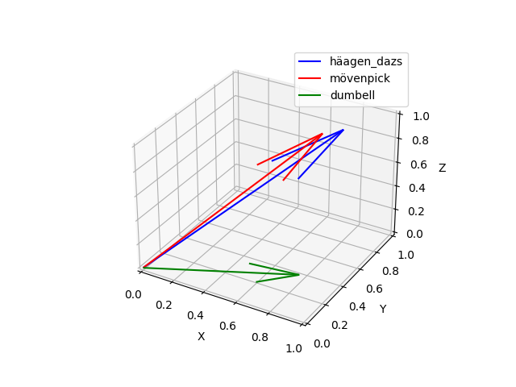

### Word Embeddings
Is a way to represent words as vectors(numbers). Take text and turn it into a
vector of numbers. So the vector is a representation of the words.

### Background
Early methods of embeddings used one-hot encoding which are sparse vectors.
This method is not very efficient because the vectors are very large and
computationally expensive. Also, the vectors are not very meaningful because
they are not related to each other (it does not capture the relationship
between words).

This was followed by frequency-based embeddings like TF-IDF. This method is
better than one-hot encoding because it is not sparse but cannot capture
complex relationships between words.

Around 2013, neural network-based embeddings were developed. These embeddings
are dense vectors and can capture complex relationships between words. The
first method was count-based embeddings like Latent Semantic Analysis (LSA).

Word2Vec was developed by Google in 2013 and this method is better than
frequency-based embeddings because it can capture complex relationships between
words.

GloVe (Global Vectors for Word Representation) is another prediction-based
embedding method.

### Contextualized Word Embeddings
These are embeddings that are based on the context of the word, the is the
words surrounding the embedded word. And words closer to each other in meaning
relationship will be closer to each other in the vector space.

For example, this [context-embedding.py](../embeddings/python/src/context-embedding.py)
example creates three vectors that simulate this concept.
```console
(zeroh) $ python src/context-embeddings.py 
cosine_similarity(häagen_daz, mövenpick)=0.9990601415630397
cosine_similarity(häagen_daz, dumbell)=0.7601102270023931
cosine_similarity(mövenpick, dumbell)=0.7418513489636707
```

And the plot for this example looks like this:




Elmo (Embeddings from Language Models) was developed by Allen Institute for
Artificial Intelligence in 2018. This method is better than Word2Vec and GloVe
because it can capture the context of the word. Word2Vec and GloVe can only
capture the meaning of the word. Elmo can capture the meaning of the word and
the context of the word. Context in this case means the surrounding words. So
the same word can have different meanings depending on the context. For example,
the word "bank" can mean a financial institution or the side of a river depending
on the context (surrounding words).

In 2018, BERT (Bidirectional Encoder Representations from Transformers) was
developed by Google. 

### Word2Vec
Was developed by Google in 2013. It is a shallow neural network that takes a
word as input and tries to predict the surrounding words.

The output of the network is the word embedding. There are two ways to train the
network, `skip gram` and `continuous bag of words` (CBOW).

Skip gram is where the input is the word and the output is the surrounding
words:
```
           input
              ↓
          _ text _
          ↑      ↑
        ouput   output
```

CBOW is where the input is the surrounding words and the output is the in the
middle.
```
       input   input
         ↓      ↓
       Some  _  here
             ↑ 
           ouput
```
